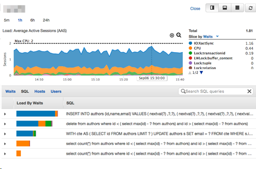

# Monitoring features

This topic provides reference information about monitoring capabilities in Microsoft SQL Server and Amazon Aurora PostgreSQL. You can use various tools and services to monitor and maintain the performance of your database systems.

| Feature compatibility            | AWS SCT / AWS DMS automation level | AWS SCT action code index | Key differences                                                                                                                                                                                                                                                                  |
| -------------------------------- | ---------------------------------- | ------------------------- | -------------------------------------------------------------------------------------------------------------------------------------------------------------------------------------------------------------------------------------------------------------------------------- |
| Three star feature compatibility | N/A                                | N/A                       | Use Amazon CloudWatch service. For more information, see [Monitoring metrics in an Amazon RDS instance](../../../AmazonRDS/latest/UserGuide/CHAP_Monitoring.md "../../../AmazonRDS/latest/UserGuide/CHAP_Monitoring.md") in the _Amazon Relational Database Service User Guide_. |

## SQL Server Usage

Monitoring server performance and behavior is a critical aspect of maintaining service quality and includes ad-hoc data collection, ongoing data collection, root cause analysis, preventative actions, and reactive actions. SQL Server provides an array of interfaces to monitor and collect server data.

SQL Server 2017 introduces several new dynamic management views:

- `sys.dm_db_log_stats` exposes summary level attributes and information on transaction log files, helpful for monitoring transaction log health.
- `sys.dm_tran_version_store_space_usage` tracks version store usage for each database, useful for proactively planning `tempdb` sizing based on the version store usage for each database.
- `sys.dm_db_log_info` exposes VLF information to monitor, alert, and avert potential transaction log issues.
- `sys.dm_db_stats_histogram` is a new dynamic management view for examining statistics.
- `sys.dm_os_host_info` provides operating system information for both Windows and Linux.

SQL Server 2019 adds new configuration parameter, `LIGHTWEIGHT_QUERY_PROFILING`. It turns on or turns off the lightweight query profiling infrastructure. The lightweight query profiling infrastructure (LWP) provides query performance data more efficiently than standard profiling mechanisms and is enabled by default. For more information, see [Query Profiling Infrastructure](https://docs.microsoft.com/en-us/sql/relational-databases/performance/query-profiling-infrastructure?view=sql-server-ver15 "https://docs.microsoft.com/en-us/sql/relational-databases/performance/query-profiling-infrastructure?view=sql-server-ver15") in the _SQL Server documentation_.

### Windows Operating System Level Tools

You can use the Windows Scheduler to trigger run of script files such as CMD, PowerShell, and so on to collect, store, and process performance data.

System Monitor is a graphical tool for measuring and recording performance of SQL Server and other Windows-related metrics using the Windows Management Interface (WMI) performance objects.

###### Note

Performance objects can also be accessed directly from T-SQL using the SQL Server Operating System Related DMVs. For a full list of the DMVs, see [SQL Server Operating System Related Dynamic Management Views (Transact-SQL)](https://docs.microsoft.com/en-us/sql/relational-databases/system-dynamic-management-views/sql-server-operating-system-related-dynamic-management-views-transact-sql?view=sql-server-ver15 "https://docs.microsoft.com/en-us/sql/relational-databases/system-dynamic-management-views/sql-server-operating-system-related-dynamic-management-views-transact-sql?view=sql-server-ver15") in the _SQL Server documentation_.

Performance counters exist for real-time measurements such as CPU Utilization and for aggregated history such as average active transactions. For a full list of the object hierarchy, see: [Use SQL Server Objects](https://docs.microsoft.com/en-us/sql/relational-databases/performance-monitor/use-sql-server-objects?view=sql-server-ver15 "https://docs.microsoft.com/en-us/sql/relational-databases/performance-monitor/use-sql-server-objects?view=sql-server-ver15") in the _SQL Server documentation_.

### SQL Server Extended Events

SQL Server’s latest tracing framework provides very lightweight and robust event collection and storage. SQL Server Management Studio features the New Session Wizard and New Session graphic user interfaces for managing and analyzing captured data. SQL Server Extended Events consists of the following items:

- SQL Server Extended Events Package is a logical container for Extended Events objects.
- SQL Server Extended Events Targets are consumers of events. Targets include Event File, which writes data to the file Ring Buffer for retention in memory, or for processing aggregates such as Event Counters and Histograms.
- SQL Server Extended Events Engine is a collection of services and tools that comprise the framework.
- SQL Server Extended Events Sessions are logical containers mapped many-to-many with packages, events, and filters.

The following example creates a session that logs lock escalations and lock timeouts to a file.

```
CREATE EVENT SESSION Locking_Demo
ON SERVER
    ADD EVENT sqlserver.lock_escalation,
    ADD EVENT sqlserver.lock_timeout
    ADD TARGET package0.etw_classic_sync_target
        (SET default_etw_session_logfile_path = N'C:\ExtendedEvents\Locking\Demo_20180502.etl')
    WITH (MAX_MEMORY=8MB, MAX_EVENT_SIZE=8MB);
GO
```

### SQL Server Tracing Framework and the SQL Server Profiler Tool

The SQL Server trace framework is the predecessor to the Extended Events framework and remains popular among database administrators. The lighter and more flexible Extended Events Framework is recommended for development of new monitoring functionality. For more information, see [SQL Server Profiler](https://docs.microsoft.com/en-us/sql/tools/sql-server-profiler/sql-server-profiler?view=sql-server-ver15 "https://docs.microsoft.com/en-us/sql/tools/sql-server-profiler/sql-server-profiler?view=sql-server-ver15") in the _SQL Server documentation_.

### SQL Server Management Studio

SQL Server Management Studio (SSMS) provides several monitoring extensions:

- **SQL Server Activity Monitor** is an in-process, real-time, basic high-level information graphical tool.
- **Query Graphical Show Plan** provides easy exploration of estimated and actual query run plans.
- **Query Live Statistics** displays query run progress in real time.
- **Replication Monitor** presents a publisher-focused view or distributor-focused view of all replication activity. For more information, see [Overview of the Replication Monitor Interface](https://docs.microsoft.com/en-us/sql/relational-databases/replication/monitor/overview-of-the-replication-monitor-interface?view=sql-server-ver15 "https://docs.microsoft.com/en-us/sql/relational-databases/replication/monitor/overview-of-the-replication-monitor-interface?view=sql-server-ver15") in the _SQL Server documentation_.
- **Log Shipping Monitor** displays the status of any log shipping activity whose status is available from the server instance to which you are connected. For more information, see [View the Log Shipping Report (SQL Server Management Studio)](https://docs.microsoft.com/en-us/sql/database-engine/log-shipping/view-the-log-shipping-report-sql-server-management-studio?view=sql-server-ver15 "https://docs.microsoft.com/en-us/sql/database-engine/log-shipping/view-the-log-shipping-report-sql-server-management-studio?view=sql-server-ver15") in the _SQL Server documentation_.
- **Standard Performance Reports** is set of reports that show the most important performance metrics such as change history, memory usage, activity, transactions, HA, and more.

### T-SQL

From the T-SQL interface, SQL Server provides many system stored procedures, system views, and functions for monitoring data.

System stored procedures such as `sp_who` and `sp_lock` provide real-time information. The `sp_monitor` procedure provides aggregated data.

Built in functions such as `@@CONNECTIONS`, `@@IO_BUSY`, `@@TOTAL_ERRORS`, and others provide high level server information.

A rich set of System Dynamic Management functions and views are provided for monitoring almost every aspect of the server. These functions reside in the sys schema and are prefixed with `dm_string`. For more information, see [System Dynamic Management Views](https://docs.microsoft.com/en-us/sql/relational-databases/system-dynamic-management-views/system-dynamic-management-views?view=sql-server-ver15 "https://docs.microsoft.com/en-us/sql/relational-databases/system-dynamic-management-views/system-dynamic-management-views?view=sql-server-ver15") in the _SQL Server documentation_.

### Trace Flags

You can set trace flags to log events. For example, set trace flag 1204 to log deadlock information. For more information, see [DBCC TRACEON - Trace Flags (Transact-SQL)](https://docs.microsoft.com/en-us/sql/t-sql/database-console-commands/dbcc-traceon-trace-flags-transact-sql?view=sql-server-ver15 "https://docs.microsoft.com/en-us/sql/t-sql/database-console-commands/dbcc-traceon-trace-flags-transact-sql?view=sql-server-ver15") in the _SQL Server documentation_.

### SQL Server Query Store

Query Store is a database-level framework supporting automatic collection of queries, run plans, and run time statistics. This data is stored in system tables. You can use this data to diagnose performance issues, understand patterns, and understand trends. It can also be set to automatically revert plans when a performance regression is detected.

For more information, see [Monitoring performance by using the Query Store](https://docs.microsoft.com/en-us/sql/relational-databases/performance/monitoring-performance-by-using-the-query-store?view=sql-server-ver15 "https://docs.microsoft.com/en-us/sql/relational-databases/performance/monitoring-performance-by-using-the-query-store?view=sql-server-ver15") in the _SQL Server documentation_.

## PostgreSQL Usage

Amazon Relational Database Service (Amazon RDS) provides a rich monitoring infrastructure for Amazon Aurora PostgreSQL-Compatible Edition (Aurora PostgreSQL) clusters and instances with the Amazon CloudWatch service. For more information, see [Monitoring metrics in an Amazon RDS instance](../../../AmazonRDS/latest/UserGuide/CHAP_Monitoring.md "../../../AmazonRDS/latest/UserGuide/CHAP_Monitoring.md") and [Monitoring OS metrics with Enhanced Monitoring](../../../AmazonRDS/latest/UserGuide/USER_Monitoring.md "../../../AmazonRDS/latest/UserGuide/USER_Monitoring.md") in the _Amazon Relational Database Service User Guide_.

You can also use the AWS Performance Insights tool to monitor PostgreSQL.

PostgreSQL can also be monitored by querying system catalog table and views.

Starting with PostgreSQL 12, you can monitor progress of `CREATE INDEX`, `REINDEX`, `CLUSTER`, and `VACUUM FULL` operations by querying system views `pg_stat_progress_create_index` and `pg_stat_progress_cluster`.

Starting with PostgreSQL 13, you can monitor progress of `ANALYZE` operations by querying system view `pg_stat_progress_analyze`. Also, you can monitor shared memory usage with system view `pg_shmem_allocations`.

### Example

The following walkthrough demonstrates how to access the Amazon Aurora Performance Insights Console.

1. In the AWS console, choose **RDS**, and then choose **Performance insights**.
2. The web page displays a dashboard containing current and past database performance metrics. You can choose the period of the displayed performance data (5 minutes, 1 hour, 6 hours, or 24 hours) as well as different criteria to filter and slice the information such as waits, SQL, hosts, users, and so on.



### Turning on Performance Insights

Performance insights are turned on by default for Amazon Aurora clusters. If you have more than one database in your Amazon Aurora cluster, performance data for all databases is aggregated. Database performance data is retained for 24 hours.

For more information, see [Monitoring DB load with Performance Insights on Amazon RDS](../../../AmazonRDS/latest/UserGuide/USER_PerfInsights.md "../../../AmazonRDS/latest/UserGuide/USER_PerfInsights.md") in the _Amazon Relational Database Service User Guide_.
