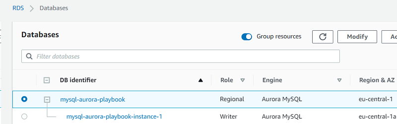

# Viewing server logs

This topic provides reference information about logging capabilities in SQL Server and Amazon Aurora PostgreSQL. You can use these logging features to monitor database activities, troubleshoot issues, and maintain the health of your database systems. The topic explains how to access and interpret logs in both environments, highlighting key differences and similarities.

| Feature compatibility            | AWS SCT / AWS DMS automation level | AWS SCT action code index | Key differences                                                                          |
| -------------------------------- | ---------------------------------- | ------------------------- | ---------------------------------------------------------------------------------------- |
| Three star feature compatibility | N/A                                | N/A                       | View logs from the Amazon RDS console, the Amazon RDS API, the AWS CLI, or the AWS SDKs. |

## SQL Server Usage

SQL Server logs system and user generated events to the _SQL Server Error Log_ and to the _Windows Application Log_. It logs recovery messages, kernel messages, security events, maintenance events, and other general server level error and informational messages. The Windows Application Log contains events from all windows applications including SQL Server and SQL Server agent.

SQL Server Management Studio Log Viewer unifies all logs into a single consolidated view. You can also view the logs with any text editor.

Administrators typically use the SQL Server Error Log to confirm successful completion of processes, such as backup or batches, and to investigate the cause of run time errors. These logs can help detect current risks or potential future problem areas.

To view the log for SQL Server, SQL Server Agent, Database Mail, and Windows applications, open the SQL Server Management Studio Object Explorer pane, navigate to **Management**, **SQL Server Logs**, and choose the current log.

The following table identifies some common error codes database administrators typically look for in the error logs:

| Error code | Error message                 |
| ---------- | ----------------------------- |
| 1105       | Couldn’t allocate space.      |
| 3041       | Backup failed.                |
| 9002       | Transaction log full.         |
| 14151      | Replication agent failed.     |
| 17053      | Operating system error.       |
| 18452      | Login failed.                 |
| 9003       | Possible database corruption. |

### Examples

The following screenshot shows the typical log file viewer content:

For more information, see [Monitoring the Error Logs](https://docs.microsoft.com/en-us/sql/tools/configuration-manager/monitoring-the-error-logs?view=sql-server-ver15 "https://docs.microsoft.com/en-us/sql/tools/configuration-manager/monitoring-the-error-logs?view=sql-server-ver15") in the _SQL Server documentation_.

## PostgreSQL Usage

Amazon Aurora PostgreSQL-Compatible Edition (Aurora PostgreSQL) provides administrators with access to the PostgreSQL error log.

The PostgreSQL error log is generated by default. To generate the slow query and general logs, set the corresponding parameters in the database parameter group. For more information, see [Server Options in SQL Server and Parameter Groups in Amazon Aurora](chap-sql-server-aurora-pg.configuration.md "chap-sql-server-aurora-pg.configuration.md").

You can view Aurora PostgreSQL logs directly from the Amazon RDS console, the Amazon RDS API, the AWS CLI, or the AWS SDKs. You can also direct the logs to a database table in the main database and use SQL queries to view the data. To download a binary log, use the AWS Console.

The following table includes the parameters, which control how and where PostgreSQL places log and errors files.

| Parameter                    | Description                                                                                                                                                                                   |
| ---------------------------- | --------------------------------------------------------------------------------------------------------------------------------------------------------------------------------------------- |
| `log_filename`               | Sets the file name pattern for log files. You can modify this parameter in an Aurora Database Parameter Group.                                                                                |
| `log_rotation_age`           | (min) Automatic log file rotation will occur after N minutes. You can modify this parameter in an Aurora Database Parameter Group.                                                            |
| `log_rotation_size`          | (kB) Automatic log file rotation will occur after N kilobytes. You can modify this parameter in an Aurora Database Parameter Group.                                                           |
| `log_min_messages`           | Sets the message levels that are logged such as `DEBUG`, `ERROR`, `INFO`, and so on. You can modify this parameter in an Aurora Database Parameter Group.                                     |
| `log_min_error_statement`    | Causes all statements generating errors at or above this level to be logged such as `DEBUG`, `ERROR`, `INFO`, and so on. You can modify this parameter in an Aurora Database Parameter Group. |
| `log_min_duration_statement` | Sets the minimum run time above which statements will be logged (ms). You can modify this parameter in an Aurora Database Parameter Group.                                                    |

### Examples

The following walkthrough demonstrates how to view the Aurora PostgreSQL error logs in the Amazon RDS console.

1. In the AWS console, choose **RDS**, and then choose **Databases**.
2. Choose the instance for which you want to view the error log.

 3. Scroll down to the logs section and choose the log name. The log viewer displays the log content.

For more information, see [PostgreSQL database log files](../../../AmazonRDS/latest/UserGuide/USER_LogAccess.Concepts.md "../../../AmazonRDS/latest/UserGuide/USER_LogAccess.Concepts.md") in the _Amazon Relational Database Service User Guide_.
