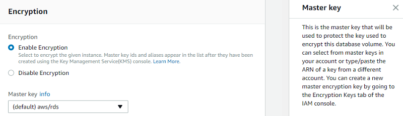
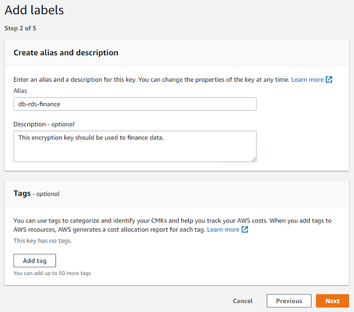
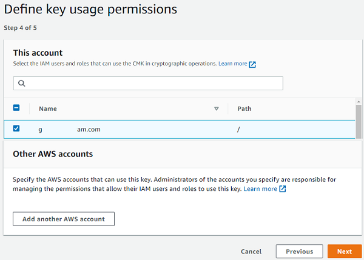
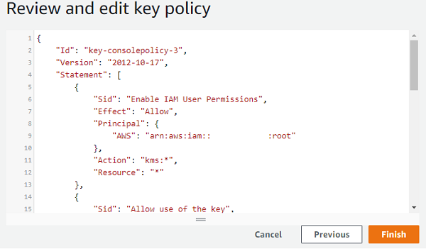
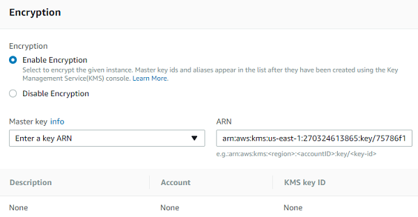

# Transparent data encryption Aurora PostgreSQL

This topic provides reference information about data encryption capabilities in Microsoft SQL Server and Amazon Aurora PostgreSQL. You can understand how Transparent Data Encryption (TDE) works in SQL Server to protect data at rest, and how Aurora PostgreSQL offers similar functionality through Amazon RDS encryption. The topic explains the encryption mechanisms, key management, and limitations associated with these features.

| Feature compatibility           | AWS SCT / AWS DMS automation level | AWS SCT action code index | Key differences                                 |
| ------------------------------- | ---------------------------------- | ------------------------- | ----------------------------------------------- |
| Four star feature compatibility | N/A                                | N/A                       | Storage level encryption managed by Amazon RDS. |

## SQL Server Usage

Transparent data encryption (TDE) is an SQL Server feature designed to protect data at rest in the event an attacker obtains the physical media containing database files.

TDE doesn’t require application changes and is completely transparent to users. The storage engine encrypts and decrypts data on-the-fly. Data isn’t encrypted while in memory or on the network. You can turn TDE on or off individually for each database.

TDE encryption uses a Database Encryption Key (DEK) stored in the database boot record, making it available during database recovery. The DEK is a symmetric key signed with a server certificate from the master system database.

In many instances, security compliance laws require TDE for data at rest.

### Examples

The following example demonstrates how to enable TDE for a database:

Create a master key and certificate.

```
USE master;
CREATE MASTER KEY ENCRYPTION BY PASSWORD = 'MyPassword';
CREATE CERTIFICATE TDECert WITH SUBJECT = 'TDE Certificate';
```

Create a database encryption key.

```
USE MyDatabase;
CREATE DATABASE ENCRYPTION KEY
WITH ALGORITHM = AES_128
ENCRYPTION BY SERVER CERTIFICATE TDECert;
```

Enable TDE.

```
ALTER DATABASE MyDatabase SET ENCRYPTION ON;
```

For more information, see [Transparent data encryption (TDE)](https://docs.microsoft.com/en-us/sql/relational-databases/security/encryption/transparent-data-encryption?view=sql-server-ver15 "https://docs.microsoft.com/en-us/sql/relational-databases/security/encryption/transparent-data-encryption?view=sql-server-ver15") in the _SQL Server documentation_.

## PostgreSQL Usage

Amazon Aurora PostgreSQL-Compatible Edition (Aurora PostgreSQL) provides the ability to encrypt data at rest (data stored in persistent storage) for new database instances. When data encryption is enabled, Amazon Relational Database Service (RDS) automatically encrypts the database server storage, automated backups, read replicas, and snapshots using the AES-256 encryption algorithm.

You can manage the keys used for Amazon Relational Database Service (Amazon RDS) encrypted instances from the Identity and Access Management (IAM) console using the AWS Key Management Service (AWS KMS). If you require full control of a key, you must manage it yourself. You can’t delete, revoke, or rotate default keys provisioned by AWS KMS.

The following limitations exist for Amazon RDS encrypted instances:

- You can only enable encryption for an Amazon RDS database instance when you create it, not afterward. It is possible to encrypt an existing database by creating a snapshot of the database instance and then creating an encrypted copy of the snapshot. You can restore the database from the encrypted snapshot. For more information, see [Copying a snapshot](../../../AmazonRDS/latest/UserGuide/USER_CopySnapshot.md "../../../AmazonRDS/latest/UserGuide/USER_CopySnapshot.md") in the _Amazon Relational Database Service User Guide_.
- Encrypted database instances can’t be modified to disable encryption.
- Encrypted Read Replicas must be encrypted with the same key as the source database instance.
- An unencrypted backup or snapshot can’t be restored to an encrypted database instance.
- KMS encryption keys are specific to the region where they are created. Copying an encrypted snapshot from one region to another requires the KMS key identifier of the destination region.

###### Note

Disabling the key for an encrypted database instance prevents reading from, or writing to, that instance. When Amazon RDS encounters a database instance encrypted by a key to which Amazon RDS doesn’t have access, it puts the database instance into a terminal state. In this state, the database instance is no longer available and the current state of the database can’t be recovered. To restore the database instance, you must re-enable access to the encryption key for Amazon RDS and then restore the database instance from a backup.

### Examples

The following walkthrough demonstrates how to enable TDE.

**Enable encryption**

In the database settings, enable encryption and choose a master key. You can choose the default key provided for the account or define a specific key based on an IAM KMS ARN from your account or a different account.



**Create an encryption key**

To create your own key, browse to the Key Management Service (KMS), choose **Customer managed keys**, and create a new key.

Choose the key type and the key material origin, and then choose **Next**.

Create alias and description, and then choose **Next**.



For **Define Key Administrative Permissions**, leave the default values and choose **Next**.

Make sure that you assigned the key to the relevant users who will need to interact with Amazon Aurora.



Review and edit the key policy, and then choose **Finish**.



Now, you can set the master encryption key by using the ARN of the key that you have created or picking it from the list.



Proceed to the finish and launch the instance.

For more information, see [Specifying Amazon S3 encryption](../../../AmazonS3/latest/userguide/specifying-s3-encryption.md "../../../AmazonS3/latest/userguide/specifying-s3-encryption.md") in the _Amazon Simple Storage Service User Guide_ and [s3](../../../cli/latest/reference/s3.md "../../../cli/latest/reference/s3.md") in the _Command Line Interface Command Reference_.
