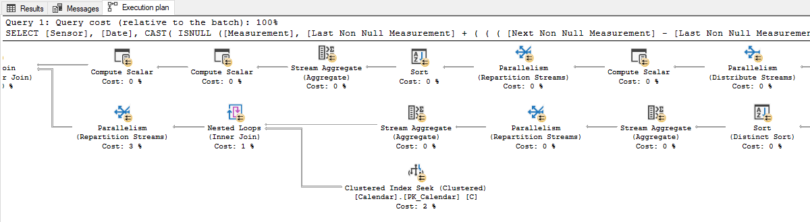

# Tuning run plans

This topic provides reference information about query execution plans in both Microsoft SQL Server and PostgreSQL, focusing on their importance for performance optimization. You can understand how these database management systems generate and utilize execution plans to analyze and improve query performance. The topic compares the features and syntax differences between SQL Server and PostgreSQL, highlighting SQL Server’s graphical representation of execution plans and automatic tuning capabilities.

| Feature compatibility          | AWS SCT / AWS DMS automation level | AWS SCT action code index | Key differences                                                                        |
| ------------------------------ | ---------------------------------- | ------------------------- | -------------------------------------------------------------------------------------- |
| Two star feature compatibility | N/A                                | N/A                       | Syntax differences. Completely different optimizer with different operators and rules. |

## SQL Server Usage

Run plans provide users detailed information about the data access and processing methods chosen by the SQL Server Query Optimizer. They also provide estimated or actual costs of each operator and sub-tree. Run plans provide critical data for troubleshooting query performance issues.

SQL Server creates run plans for most queries and returns them to client applications as plain text or XML documents. SQL Server produces an run plan when a query runs, but it can also generate estimated plans without running a query.

SQL Server Management Studio provides a graphical view of the underlying XML plan document using icons and arrows instead of textual information. This graphical view is extremely helpful when investigating the performance aspects of a query.

To request an estimated run plan, use the `SET SHOWPLAN_XML`, `SHOWPLAN_ALL`, or `SHOWPLAN_TEXT` statements.

SQL Server 2017 introduces automatic tuning, which notifies users whenever a potential performance issue is detected and lets them apply corrective actions, or lets the Database Engine automatically fix performance problems.

Automatic tuning SQL Server enables users to identify and fix performance issues caused by query run plan choice regressions. For more information, see [Automatic tuning](https://docs.microsoft.com/en-us/sql/relational-databases/automatic-tuning/automatic-tuning?view=sql-server-ver15 "https://docs.microsoft.com/en-us/sql/relational-databases/automatic-tuning/automatic-tuning?view=sql-server-ver15") in the _SQL Server documentation_.

### Examples

Show the estimated run plan for a query.

```
SET SHOWPLAN_XML ON;
SELECT *
FROM MyTable
WHERE SomeColumn = 3;
SET SHOWPLAN_XML OFF;
```

Actual run plans return after run of the query or batch of queries completes. Actual run plans include run-time statistics about resource usage and warnings. To request the actual run plan, use the `SET STATISTICS XML` statement to return the XML document object. Alternatively, use the `STATISTICS PROFILE` statement, which returns an additional result set containing the query run plan.

Show the actual run plan for a query.

```
SET STATISTICS XML ON;
SELECT *
FROM MyTable
WHERE SomeColumn = 3;
SET STATISTICS XML OFF;
```

The following example shows a partial graphical run plan from SQL Server Management Studio.



For more information, see [Display and Save Execution Plans](https://docs.microsoft.com/en-us/sql/relational-databases/performance/display-and-save-execution-plans?view=sql-server-ver15 "https://docs.microsoft.com/en-us/sql/relational-databases/performance/display-and-save-execution-plans?view=sql-server-ver15") in the _SQL Server documentation_.

## PostgreSQL Usage

When using the `EXPLAIN` command, PostgreSQL will generate the estimated run plan for actions, such as `SELECT`, `INSERT`, `UPDATE`, and `DELETE`. `EXPLAIN` builds a structured tree of plan nodes representing the different actions taken (the sign `→` represents a root line in the PostgreSQL run plan). In addition, the EXPLAIN statement will provide statistical information regarding each action, such as cost, rows, time and loops.

When using the `EXPLAIN` command as part of a SQL statement, the statement will not run, and the run plan will be an estimation. By using the `EXPLAIN ANALYZE` command, the statement will run in addition to displaying the run plan.

### PostgreSQL EXPLAIN Synopsis

```
EXPLAIN [ ( option value[, ...] ) ] statement
EXPLAIN [ ANALYZE ] [ VERBOSE ] statement

where option and values can be one of:
  ANALYZE [ boolean ]
  VERBOSE [ boolean ]
  COSTS [ boolean ]
  BUFFERS [ boolean ]
  TIMING [ boolean ]
  SUMMARY [ boolean ] (since PostgreSQL 10)
  FORMAT { TEXT | XML | JSON | YAML }
```

By default, planning and run time are displayed when using EXPLAIN ANALYZE, but not in other cases. A new option `SUMMARY` gives explicit control of this information. Use `SUMMARY` to include planning and run time metrics in your output.

PostgreSQL provides configurations options that will cancel SQL statements running longer than provided time limit. To use this option, you can set the `statement_timeout` instance-level parameter. If the value is specified without units, it is taken as milliseconds. A value of zero (the default) disables the timeout.

Third-party connection pooler solutions like `Pgbouncer` and `PgPool` build on that and allow more flexibility in controlling how long connection to DB can run, be in idle state, and so on.

### Aurora PostgreSQL Query Plan Management

The Amazon Aurora PostgreSQL-Compatible Edition (Aurora PostgreSQL) Query Plan Management (QPM) feature solves the problem of plan instability by allowing database users to maintain stable, yet optimal, performance for a set of managed SQL statements. QPM primarily serves two main objectives:

- **Plan stability**. QPM prevents plan regression and improves plan stability when any of the preceding changes occur in the system.
- **Plan adaptability**. QPM automatically detects new minimum-cost plans and controls when new plans may be used and adapts to the changes.

The quality and consistency of query optimization have a major impact on the performance and stability of any relational database management system (RDBMS). Query optimizers create a query run plan for a SQL statement at a specific point in time. As conditions change, the optimizer might pick a different plan that makes performance better or worse. In some cases, a number of changes can all cause the query optimizer to choose a different plan and lead to performance regression. These changes include changes in statistics, constraints, environment settings, query parameter bindings, and software upgrades. Regression is a major concern for high-performance applications.

With query plan management, you can control run plans for a set of statements that you want to manage. You can do the following:

- Improve plan stability by forcing the optimizer to choose from a small number of known, good plans.
- Optimize plans centrally and then distribute the best plans globally.
- Identify indexes that aren’t used and assess the impact of creating or dropping an index.
- Automatically detect a new minimum-cost plan discovered by the optimizer.
- Try new optimizer features with less risk, because you can choose to approve only the plan changes that improve performance.

### Examples

Display the run plan of a SQL statement using the `EXPLAIN` command.

```
EXPLAIN
SELECT EMPLOYEE_ID, LAST_NAME, FIRST_NAME FROM EMPLOYEES
WHERE LAST_NAME='King' AND FIRST_NAME='Steven';

Index Scan using idx_emp_name on employees (cost=0.14..8.16 rows=1 width=18)
Index Cond: (((last_name)::text = 'King'::text) AND ((first_name)::text = 'Steven'::text))
(2 rows)
```

Run the same statement with the `ANALYZE` keyword.

```
EXPLAIN ANALYZE
SELECT EMPLOYEE_ID, LAST_NAME, FIRST_NAME FROM EMPLOYEES
WHERE LAST_NAME='King' AND FIRST_NAME='Steven';


Seq Scan on employees (cost=0.00..3.60 rows=1 width=18) (actual time=0.012..0.024 rows=1 loops=1)
Filter: (((last_name)::text = 'King'::text) AND ((first_name)::text = 'Steven'::text))
Rows Removed by Filter: 106
Planning time: 0.073 ms
Execution time: 0.037 ms
(5 rows)
```

By adding the ANALYZE keyword and running the statement, we get additional information in addition to the run plan.

View a PostgreSQL run plan showing a `FULL TABLE SCAN`.

```
EXPLAIN ANALYZE
SELECT EMPLOYEE_ID, LAST_NAME, FIRST_NAME FROM EMPLOYEES
WHERE SALARY > 10000;

Seq Scan on employees (cost=0.00..3.34 rows=15 width=18) (actual time=0.012..0.036 rows=15 loops=1)
Filter: (salary > '10000'::numeric)
Rows Removed by Filter: 92
Planning time: 0.069 ms
Execution time: 0.052 ms
(5 rows)
```

PostgreSQL can perform several scan types for processing and retrieving data from tables including sequential scans, index scans, and bitmap index scans. The sequential scan is PostgreSQL equivalent for SQL Server full table scan.

For more information, see [EXPLAIN](https://www.postgresql.org/docs/13/sql-explain.html "https://www.postgresql.org/docs/13/sql-explain.html") in the _PostgreSQL documentation_.
