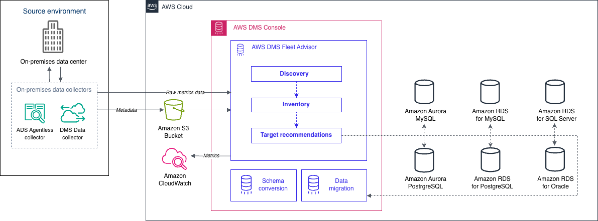

# Discovering and evaluating databases for migration

with AWS DMS Fleet Advisor

###### Important

End of support notice: On May 20, 2026, AWS will end support for AWS Database Migration Service Fleet
Advisor. After May 20, 2026, you will no longer be able to access the AWS DMS Fleet
Advisor console or AWS DMS Fleet Advisor resources. For more information, see [AWS DMS Fleet
Advisor end of support](dms_fleet.md "dms_fleet.md").

You can use DMS Fleet Advisor to collect metadata and performance metrics from multiple
database environments. These collected metrics provide insight into your data
infrastructure. [DMS Fleet Advisor](https://aws.amazon.com/dms/fleet-advisor/ "https://aws.amazon.com/dms/fleet-advisor/")
collects metadata and metrics from your on-premises database and analytic servers from
one or more central locations without the need to install it on every computer.
Currently, DMS Fleet Advisor supports discovery and metrics collection for Microsoft SQL Server,
MySQL, Oracle, and PostgreSQL database servers.

Based on data discovered from the network, you can build an inventory to define the
list of database servers for further data collection. After AWS DMS collects information
about your servers, databases, and schemas, you can analyze the feasibility of your
intended database migrations.

For databases in your inventory that you plan to migrate to the AWS Cloud, DMS Fleet Advisor
generates right-sized target recommendations. To generate target recommendations,
DMS Fleet Advisor considers the metrics from your data collector and preferred settings. After
DMS Fleet Advisor generates recommendations, you can view detailed information for each target
database configuration. Your organization's database engineers and administrators can
use DMS Fleet Advisor Target Recommendations to plan the migration of their on-premises databases
to AWS. You can explore different available migration options and export these
recommendations into the AWS Pricing Calculator to further optimize the cost.

For the list of supported source databases, see [Sources for DMS Fleet Advisor](CHAP_Introduction.md#CHAP_Introduction.Sources.FleetAdvisor "CHAP_Introduction.md#CHAP_Introduction.Sources.FleetAdvisor").

For the list of databases that DMS Fleet Advisor uses to generate target recommendations, see
[Targets for DMS Fleet Advisor](CHAP_Introduction.md#CHAP_Introduction.Targets.FleetAdvisor "CHAP_Introduction.md#CHAP_Introduction.Targets.FleetAdvisor"). DMS Fleet Advisor generates
like to like recommedations, for example, from source Oracle to target Oracle database.
DMS Fleet Advisor also generates heterogenous recommendations, such as migration from source
Oracle or Microsoft SQL Server to target RDS for PostgreSQL or Aurora PostgreSQL database.

The following diagram illustrates the AWS DMS Fleet Advisor Target Recommendations
process.

Use the following topics to better understand how to use AWS DMS Fleet Advisor.

## Supported AWS Regions

You can use DMS Fleet Advisor in the following AWS Regions.

| Region Name               | Region         |
| ------------------------- | -------------- |
| US East (N. Virginia)     | us-east-1      |
| US East (Ohio)            | us-east-2      |
| US West (N. California)   | us-west-1      |
| US West (Oregon)          | us-west-2      |
| Canada (Central)          | ca-central-1   |
| Canada West (Calgary)     | ca-west-1      |
| Asia Pacific (Hong Kong)  | ap-east-1      |
| Asia Pacific (Tokyo)      | ap-northeast-1 |
| Asia Pacific (Seoul)      | ap-northeast-2 |
| Asia Pacific (Osaka)      | ap-northeast-3 |
| Asia Pacific (Mumbai)     | ap-south-1     |
| Asia Pacific (Singapore)  | ap-southeast-1 |
| Asia Pacific (Sydney)     | ap-southeast-2 |
| Asia Pacific (Jakarta)    | ap-southeast-3 |
| Asia Pacific (Melbourne)  | ap-southeast-4 |
| Asia Pacific (Hyderabad)  | ap-south-2     |
| Europe (Frankfurt)        | eu-central-1   |
| Europe (Zurich)           | eu-central-2   |
| Europe (Stockholm)        | eu-north-1     |
| Europe (Spain)            | eu-south-2     |
| Europe (Ireland)          | eu-west-1      |
| Europe (London)           | eu-west-2      |
| Europe (Paris)            | eu-west-3      |
| Europe (Milan)            | eu-south-1     |
| Israel (Tel Aviv)         | il-central-1   |
| South America (São Paulo) | sa-east-1      |
| Middle East (Bahrain)     | me-south-1     |
| Middle East (UAE)         | me-central-1   |
| Africa (Cape Town)        | af-south-1     |
