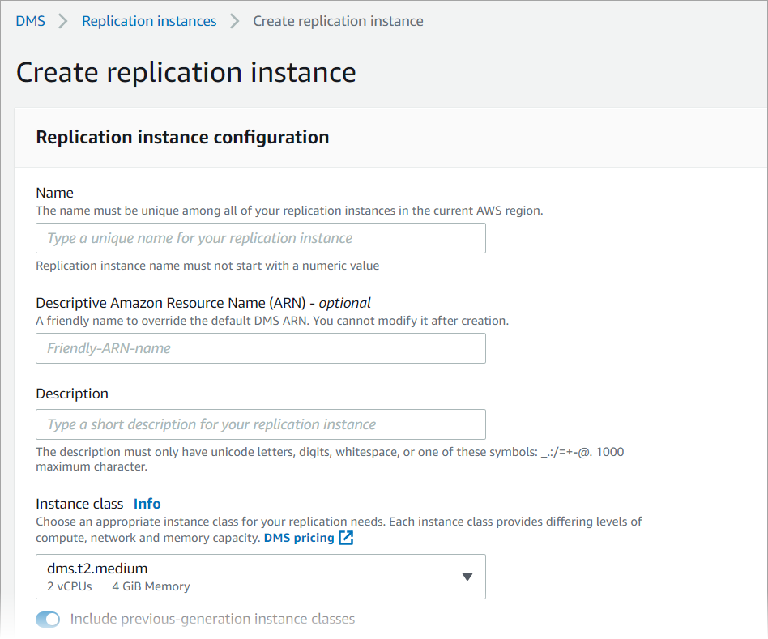
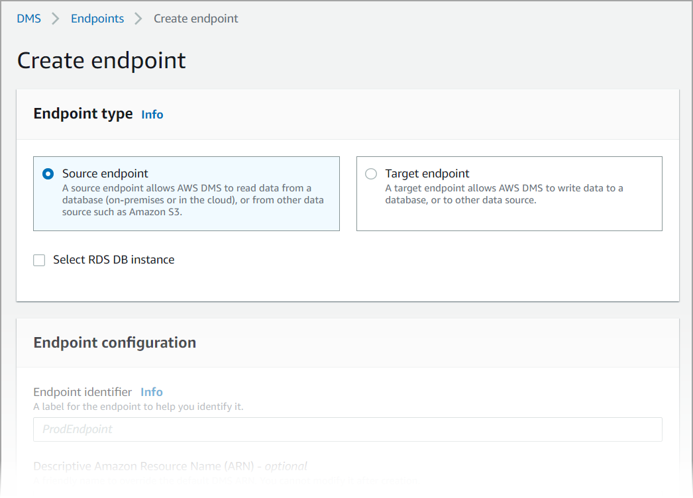
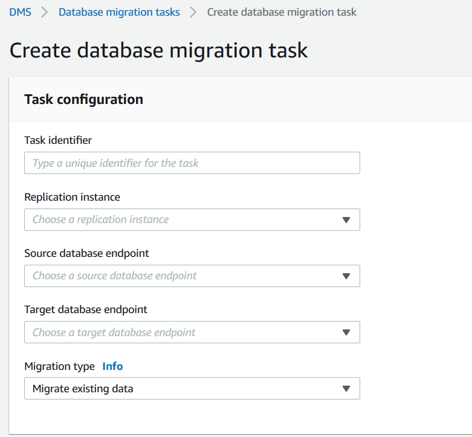

# Set up replication for AWS Database Migration Service

In this topic, you set up replication between the source and target databases.

## Step 1: Create a replication instance

using the AWS DMS console

To start work with AWS DMS, create a replication instance.

A _replication instance_ performs the actual data
migration between source and target endpoints. Your instance needs enough storage and
processing power to perform the tasks that migrate data from your source database to
your target database. How large this replication instance should be depends on the
amount of data to migrate and the tasks your instance needs to do. For more information
about replication instances, see [Working with an AWS DMS replication
instance](CHAP_ReplicationInstance.md "CHAP_ReplicationInstance.md").



###### To create a replication instance using the console

1. Sign in to the AWS Management Console and open the AWS DMS console at [https://console.aws.amazon.com/dms/v2/](https://console.aws.amazon.com/dms/v2/ "https://console.aws.amazon.com/dms/v2/").
2. On the navigation pane, choose **Replication instances**, and
   then choose **Create replication instance**.
3. On the **Create replication instance** page, specify your
   replication instance configuration:
   1. For **Name**, enter `DMS-instance`.
   2. For **Description**, enter a short description for your replication
      instance (optional).
   3. For **Instance class**, leave **dms.t3.medium** chosen.

   The instance needs enough storage, networking, and processing power
   for your migration. For more information about how to choose an instance
   class, see [Choosing the right AWS DMS
   replication instance for your migration](CHAP_ReplicationInstance.md "CHAP_ReplicationInstance.md"). 4. For **Engine version**, accept the default. 5. For **Multi AZ**, choose **Dev or test workload (Single-AZ)**. 6. For **Allocated storage (GiB)**, accept the default of 50 GiB.

   In AWS DMS, storage is mostly used by log files and cached transactions.
   For cache transactions, storage is used only when the cached
   transactions need to be written to disk. As a result, AWS DMS doesn't use
   a significant amount of storage. 7. For **Network type** choose **IPv4**. 8. For **VPC**, choose **DMSVPC**. 9. For **Replication subnet group**, leave the replication subnet group
   currently chosen. 10. Clear **Publicly accessible**.

4. Choose the **Advanced security and network configuration**
   tab to set values for network and encryption settings if you need them:
   1. For **Availability zone**, choose **us-west-2a**.
   2. For **VPC security group(s)**, choose the **Default**
      security group if it isn't already chosen.
   3. For **AWS KMS key**, leave **(Default) aws/dms** chosen.

5. Leave the settings on the **Maintenance** tab as they are.
   The default is a 30-minute window selected at random from an 8-hour block of
   time for each AWS Region, occurring on a random day of the week.
6. Choose **Create**.

AWS DMS creates a replication instance to perform your migration.

## Step 2: Specify source and target endpoints

While your replication instance is being created, you can specify the source and
target data store endpoints for the Amazon RDS databases you created previously. You create each endpoint separately.



###### To specify a source endpoint and database endpoint using the AWS DMS

console

1. On the console, choose **Endpoints** from the navigation pane
   and then choose **Create Endpoint**.
2. On the **Create endpoint** page, choose the
   **Source** endpoint type. Select the **Select RDS
   DB instance** box, and choose the **dms-mariadb**
   instance.
3. In the **Endpoint configuration** section, enter `dms-mysql-source`
   for **Endpoint identifier**.
4. For **Source engine**, leave **MySQL** chosen.
5. For **Access to endpoint database**, choose **Provide access information manually**.
   Verify that the **Port**, **Secure Socket Layer (SSL) mode**, **User name**,
   and **Password** are correct.
6. Choose the **Test endpoint connection (optional)** tab. For
   **VPC**, choose **DMSVPC**.
7. For **Replication instance**, leave **dms-instance** chosen.
8. Choose **Run test**.

After you choose **Run test**, AWS DMS creates the endpoint
with the details that you provided and connects to it. If the connection fails,
edit the endpoint definition and test the connection again. You can also delete
the endpoint manually. 9. After you have a successful test, choose **Create
endpoint**. 10. Specify a target database endpoint using the AWS DMS console. To do this, repeat
the steps preceding, with the following settings:

    * **Endpoint type**: **Target endpoint**
    * **RDS Instance**: **dms-postgresql**
    * **Endpoint identifier**: `dms-postgresql-target`
    * **Target engine**: Leave `PostgreSQL` chosen.

When you're finished providing all information for your endpoints, AWS DMS creates
your source and target endpoints for use during database migration.

## Step 3: Create a task and migrate data

In this step, you create a task to migrate data between the databases you created.



###### To create a migration task and start your database migration

1. In the console navigation pane, choose **Database migration
   tasks**, and then choose **Create task**. The
   **Create database migration task** page opens.
2. In the **Task configuration** section, specify the following
   task options:
   - **Task identifier**: Enter
     `dms-task`.
   - **Replication instance**:
     Choose your replication instance (**dms-instance-vpc-`<vpc id>`**).
   - **Source database endpoint**:
     Choose **dms-mysql-source**.
   - **Target database endpoint**:
     Choose **dms-postgresql-target**.
   - **Migration type**: Choose **Migrate existing data and
     replicate on-going changes**.

3. Choose the **Task settings** tab. Set the following settings:
   - **Target table preparation mode**: **Do nothing**
   - **Stop task after full load completes**: **Don't stop**

4. Choose the **Table mappings** tab, and expand **Selection rules**. Choose
   **Add new selection rule**. Set the following settings:
   - **Schema**: **Enter a schema**
   - **Schema name**: `dms_sample`

5. Choose the **Migration task startup configuration** tab, and
   then choose **Automatically on create**.
6. Choose **Create task**.

AWS DMS then creates the migration task and starts it. The initial database replication
takes about 10 minutes. Make sure to do the next step in the tutorial before AWS DMS
finishes migrating the data.

## Step 4: Test replication

In this section, you insert data into the source database during and after initial replication, and query the target
database for the inserted data.

###### To test replication

1. Make sure that your database migration task shows a status of **Running** but
   your initial database replication, started in the previous step, isn't
   complete.
2. Connect to your Amazon EC2 client, and start the MySQL client
   with the following command. Provide your MySQL database endpoint.

```
mysql -h dms-mysql.`abcdefg12345`.us-west-2.rds.amazonaws.com -P 3306 -u admin -pchangeit dms_sample
```

3. Run the following command to insert a record into the source database.

```
MySQL [dms_sample]> insert person (full_name, last_name, first_name) VALUES ('Test User1', 'User1', 'Test');
Query OK, 1 row affected (0.00 sec)
```

4. Exit the MySQL client.

```
MySQL [dms_sample]> exit
Bye
```

5. Before replication completes, query the target database for the new record.

From the Amazon EC2 instance, connect to the target database using the following
command, providing your target database endpoint.

```
psql \
   --host=dms-postgresql.`abcdefg12345`.us-west-2.rds.amazonaws.com \
   --port=5432 \
   --username=postgres \
   --password \
   --dbname=dms_sample
```

Provide the password (`changeit`) when prompted. 6. Before replication completes, query the target database for the new record.

```
dms_sample=> select * from dms_sample.person where first_name = 'Test';
 id | full_name | last_name | first_name
----+-----------+-----------+------------
(0 rows)
```

7.  While your migration task is running, you can monitor the progress of your database migration
    as it happens:

        * In the DMS console navigation pane, choose **Database migration
         tasks**.
        * Choose **dms-task**.
        * Choose **Table statistics**.

    For more information about monitoring, see [Monitoring AWS DMS tasks](CHAP_Monitoring.md "CHAP_Monitoring.md").

8.  After replication completes, query the target database again for the new record. AWS DMS migrates the new record after
    initial replication completes.

```
dms_sample=> select * from dms_sample.person where first_name = 'Test';
   id    | full_name  | last_name | first_name
---------+------------+-----------+------------
 7077784 | Test User1 | User1     | Test
(1 row)

```

9. Exit the psql client.

```
dms_sample=> quit
```

10. Repeat step 1 to connect to the source database again.
11. Insert another record into the `person` table.

```
MySQL [dms_sample]> insert person (full_name, last_name, first_name) VALUES ('Test User2', 'User2', 'Test');
Query OK, 1 row affected (0.00 sec)
```

12. Repeat steps 3 and 4 to disconnect from the source database and connect to the target database.
13. Query the target database for the replicated data again.

```
dms_sample=> select * from dms_sample.person where first_name = 'Test';
   id    | full_name  | last_name | first_name
---------+------------+-----------+------------
 7077784 | Test User1 | User1     | Test
 7077785 | Test User2 | User2     | Test
(2 rows)
```

## Step 5: Clean up AWS DMS resources

After you complete the getting started tutorial, you can delete the resources you
created. You can use the AWS console to remove them. Make sure to delete the migration
tasks before deleting the replication instance and endpoints.

###### To delete a migration task using the console

1. On the AWS DMS console navigation pane, choose **Database migration
   tasks**.
2. Choose **dms-task**.
3. Choose **Actions**, **Delete**.

###### To delete a replication instance using the console

1. On the AWS DMS console navigation pane, choose **Replication
   instances**.
2. Choose **DMS-instance**.
3. Choose **Actions**, **Delete**.

AWS DMS deletes the replication instance and removes it from the **Replication instances** page.

###### To remove endpoints using the console

1. On the AWS DMS console navigation pane, choose
   **Endpoints**.
2. Choose **dms-mysql-source**.
3. Choose **Actions**, **Delete**.

After you delete your AWS DMS resources, make sure also to delete the following
resources. For help with deleting resources in other services, see each service's
documentation.

- Your RDS databases.
- Your RDS database parameter groups.
- Your RDS subnet groups.
- Any Amazon CloudWatch logs that were created along with your databases and replication instance.
- Security groups that were created for your Amazon VPC and Amazon EC2 client. Make sure to remove the
  inbound rule from **Default** for the
  **launch-wizard-1** security groups, which is necessary for
  you to be able delete them.
- Your Amazon EC2 client.
- Your Amazon VPC.
- Your Amazon EC2 key pair for your Amazon EC2 client.
