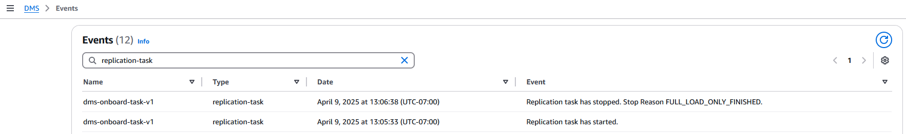

# Viewing AWS DMS events

You can retrieve the following event information for your AWS DMS resources:

- Resource name
- Resource type
- Date and time of the event
- Message summary of the event
  You can access events in the Events tab of the AWS Management Console, which shows
  events from the past 7 days. You can also retrieve events by using the `describe-events` AWS CLI command, or the `DescribeEvents` DMS API operation. If you use the AWS CLI or
  the DMS API to view events, you can retrieve events for up to the past 14 days.

###### Note

If you need to store events for longer periods of time, you can send AWS DMS events
to EventBridge and send the event details to another service for storing. For more
information, see [Using Amazon EventBridge event rules for
AWS DMS](CHAP_EventBridge.md#CHAP_EventBridge.Rule "CHAP_EventBridge.md#CHAP_EventBridge.Rule").

For descriptions of the AWS DMS events, see [AWS DMS event categories and event messages](CHAP_EventBridge.md#EventBridge.Messages "CHAP_EventBridge.md#EventBridge.Messages").

To view all AWS DMS events for the past 7 days in the DMS Console:

1. Sign in to the AWS Management Console and open the DMS console at
   https://console.aws.amazon.com/dms/v2
2. From the navigation page, select **Events**.
3. Enter a search term to filter your results.

The following example shows a list of events filtered by the
characters `replication-task`.


To view all events generated in the last hour, run `describe-events` AWS DMS CLI command with no
parameters.

```
aws dms describe-events
```

The following sample output shows that a replication task has been
modified:

```
{
    "Events": [
        {
            "SourceIdentifier": "dms-task",
            "SourceType": "replication-task",
            "Message": "Replication task has modified.",
            "EventCategories": [
                "configuration change"
            ],
            "Date": "2025-04-09T12:48:22.231000-07:00"
        }
    ]
}
```

To view all AWS DMS events for the past 14 days (20160 minutes), run the
`describe-events` AWS CLI command
and set the `--duration` parameter to
`20160`.

```
aws dms describe-events --duration 20160
```

The following example shows the events in the specified time range for the
replication instance `dms-replication-instance`.

```
aws dms describe-events \
    --source-identifier dms-replication-instance \
    --source-type replication-instance \
    --start-time 2025-04-10T22:00Z \
    --end-time 2025-04-12T23:59Z
```

The following sample output shows the status of a replication instance:

```
{
    "Events": [
        {
            "SourceIdentifier": "dms-replication-instance",
            "SourceType": "replication-instance",
            "Message": "Replication application shutdown",
            "EventCategories": [],
            "Date": "2025-04-12T03:11:43.270000-07:00"
        },
        {
            "SourceIdentifier": "dms-replication-instance",
            "SourceType": "replication-instance",
            "Message": "Replication application restarted",
            "EventCategories": [],
            "Date": "2025-04-12T03:19:58.214000-07:00"
        }
    ]
}
```

You can view all AWS DMS instance events for the past 14 days by running the
`DescribeEvents` DMS API operation and
setting the `--duration` parameter to
`20160`.
