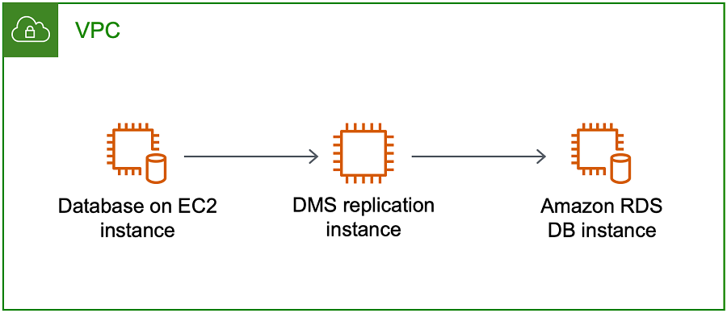
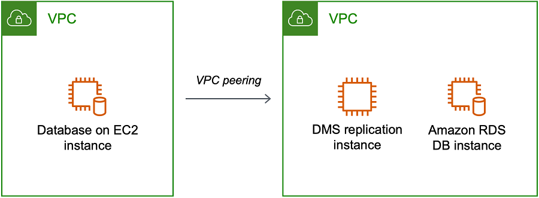
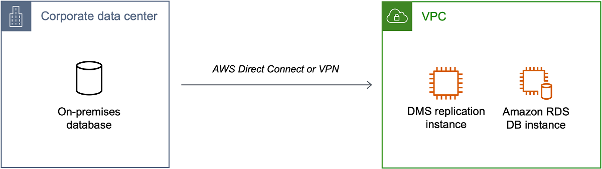
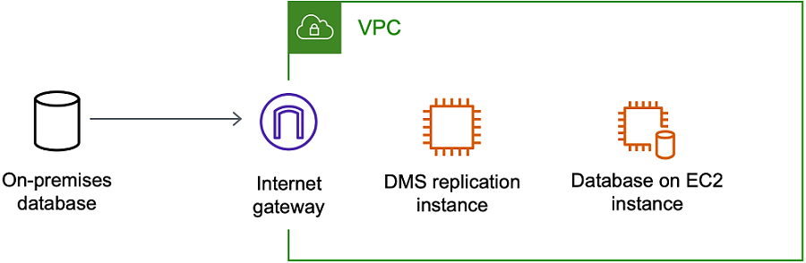
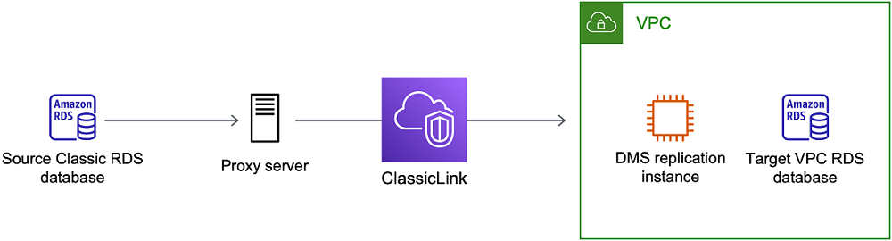
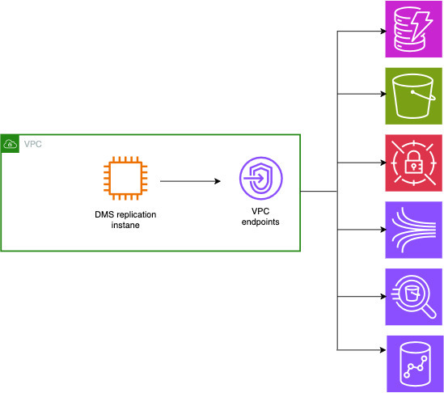

# Setting up a network for a replication

instance

AWS DMS always creates the replication instance in a VPC based on Amazon VPC. You specify the
VPC where your replication instance is located. You can use
your default VPC for your account and AWS Region, or you can create a new VPC.

Make sure that the elastic network interface allocated for your replication instance's
VPC is associated with a security group. Also, make sure this security group's rules let
all traffic on all ports leave (egress) the VPC. This approach allows communication from
the replication instance to your source and target database endpoints, if correct ingress
rules are enabled on the endpoints. We recommend that you use the default settings for
the endpoints, which allows egress on all ports to all addresses.

The source and target endpoints access the replication instance that is inside the VPC
either by connecting to the VPC or by being inside the VPC. The database endpoints must
include network access control lists (ACLs) and security group rules (if applicable)
that allow incoming access from the replication instance. How you set this up depends on the network
configuration that you use. You can use the replication instance VPC security group,
the replication instance's private or public IP address, or the NAT gateway's public IP
address. These connections form a network that you use for data migration.

###### Note

Since an IP address can change as a result of changes to underlying
infrastructure, we recommend you use a VPC CIDR range, or route your replication
instance outbound traffic through a NAT GW associated Elastic IP. For more
information about creating a VPC, including a CIDR block, see [Work with
VPCs and subnets](../../../vpc/latest/userguide/working-with-vpcs.md "../../../vpc/latest/userguide/working-with-vpcs.md") in the _Amazon Virtual Private Cloud User Guide_. For
more information about Elastic IP addresses, see [Elastic IP
addresses](../../../AWSEC2/latest/WindowsGuide/elastic-ip-addresses-eip.md "../../../AWSEC2/latest/WindowsGuide/elastic-ip-addresses-eip.md") in the _Amazon Elastic Compute Cloud User Guide_.

## Network configurations for

database migration

You can use several different network configurations with AWS Database Migration Service. The following
are common configurations for a network used for database migration.

###### Topics

- [Configuration with all database migration
  components in one VPC](#CHAP_ReplicationInstance.VPC.Configurations.ScenarioAllVPC "#CHAP_ReplicationInstance.VPC.Configurations.ScenarioAllVPC")
- [Configuration with
  multiple VPCs](#CHAP_ReplicationInstance.VPC.Configurations.ScenarioVPCPeer "#CHAP_ReplicationInstance.VPC.Configurations.ScenarioVPCPeer")
- [Configuration with
  shared VPCs](#CHAP_ReplicationInstance.VPC.Configurations.ScenarioVPCShared "#CHAP_ReplicationInstance.VPC.Configurations.ScenarioVPCShared")
- [Configuration for a network to a VPC using AWS Direct Connect or a VPN](#CHAP_ReplicationInstance.VPC.Configurations.ScenarioDirect "#CHAP_ReplicationInstance.VPC.Configurations.ScenarioDirect")
- [Configuration for a network to a VPC using the internet](#CHAP_ReplicationInstance.VPC.Configurations.ScenarioInternet "#CHAP_ReplicationInstance.VPC.Configurations.ScenarioInternet")
- [Configuration with an RDS DB instance not in a VPC to a DB instance in a
  VPC using ClassicLink](#CHAP_ReplicationInstance.VPC.Configurations.ClassicLink "#CHAP_ReplicationInstance.VPC.Configurations.ClassicLink")
- [Configuration for a network connecting to AWS services](#CHAP_ReplicationInstance.VPC.Configurations.networkconnecting "#CHAP_ReplicationInstance.VPC.Configurations.networkconnecting")
- [Configuration for a network connecting to AWS services using VPC
  endpoints](#CHAP_ReplicationInstance.VPC.Configurations.vpcendpoints "#CHAP_ReplicationInstance.VPC.Configurations.vpcendpoints")
- [Configuration for a network connecting to AWS services using the
  internet](#CHAP_ReplicationInstance.VPC.Configuration.networkconnectingusinginternet "#CHAP_ReplicationInstance.VPC.Configuration.networkconnectingusinginternet")

When practical, we recommend that you create a DMS replication instance in the
same Region as your target endpoint, and in the same VPC or subnet as your target
endpoint.

###

Configuration with all database migration
components in one VPC

The simplest network for database migration is for the source endpoint, the
replication instance, and the target endpoint to all be in the same VPC. This
configuration is a good one if your source and target endpoints are on an Amazon RDS
DB instance or an Amazon EC2 instance.

The following illustration shows a configuration where a database on an Amazon EC2 instance
connects to the replication instance and data is migrated to an
Amazon RDS DB instance.



The VPC security group used in this configuration must allow ingress on the
database port from the replication instance. You can do this in a couple of ways.
You can ensure that the security group used by the replication instance has ingress
to the endpoints. Or you can allow the VPC CIDR range, NAT GW Elastic IP, or private
IP address of the replication instance if you are using one. But we do not recommend
you use the private IP address of the replication instance, because it can break your
replication if the replication IP address changes.

### Configuration with

multiple VPCs

If your source endpoint and target endpoints are in different VPCs, you can
create your replication instance in one of the VPCs. You can then link the two
VPCs by using VPC peering.

A VPC peering connection is a networking connection between two VPCs that
enables routing using each VPC's private IP addresses as if they were in the
same network. You can create a VPC peering connection between your own VPCs,
with a VPC in another AWS account, or with a VPC in a different AWS Region.
For more information about VPC peering, see
[VPC peering](../../../vpc/latest/userguide/vpc-peering.md "../../../vpc/latest/userguide/vpc-peering.md") in
the _Amazon VPC User Guide_.

The following illustration shows an example configuration using VPC peering.
Here, the source database on an Amazon EC2 instance in a VPC connects by VPC peering
to a VPC. This VPC contains the replication instance and the target database on
an Amazon RDS DB instance.



To implement VPC peering, follow the instructions in [Work with VPC peering connections](../../../vpc/latest/peering/working-with-vpc-peering.md "../../../vpc/latest/peering/working-with-vpc-peering.md") located in the
_Amazon Virtual Private Cloud, VPC Peering_ documentation. Be sure the route
table of one VPC contains the CIDR block of the other. For example, if VPC A is
using destination 10.0.0.0/16 and VPC B is using destination172.31.0.0, the
route table of VPC A should contain 172.31.0.0, and route table of VPC B must
contain 10.0.0.0/16. For more detailed information, see [Update your route tables for VPC peering connection](../../../vpc/latest/peering/vpc-peering-routing.md "../../../vpc/latest/peering/vpc-peering-routing.md") in the
_Amazon Virtual Private Cloud, VPC Peering_ documentation.

The VPC security groups used in this configuration must allow ingress on the
database port from the replication instance, or it should allow ingress on the
CIDR block for the VPC being peered.

### Configuration with

shared VPCs

AWS DMS treats subnets that are shared to a participating customer account in an organization just like
regular subnets in the same account. Below is a description of how AWS DMS handles VPCs, subnets, and
how you can use shared VPCs.

You can configure your network configuration to operate in custom subnets or VPCs by creating
`ReplicationSubnetGroup` objects. When you create a `ReplicationSubnetGroup`,
you can choose to specify subnets from a particular VPC in your account. The list of subnets you specify
must include at least two subnets that are in separate availability zones, and all subnets must be in the same VPC.
When creating a `ReplicationSubnetGroup`, customers only specify subnets. AWS DMS will determine the
VPC on your behalf, as each subnet is linked to exactly one VPC.

When you create an AWS DMS `ReplicationInstance` or a AWS DMS `ReplicationConfig`, you
can choose to specify a `ReplicationSubnetGroup` and/or a VPC Security Group in which the `ReplicationInstance`
or Serverless Replication operates. If not specified, AWS DMS chooses the customer default
`ReplicationSubnetGroup` (which AWS DMS creates on your behalf if not specified for all subnets in the default VPC)
and the default VPC Security Group.

You can choose to run your migrations in an availability zone that you specify, or in any of the
availability zones in your `ReplicationSubnetGroup`. When AWS DMS attempts to create a
Replication Instance or start a Serverless Replication, it translates the availability zones
of your subnets into availability zones in the core service account, to ensure that we
launch instances in the correct Availability Zone even if Availability Zone mappings aren’t identical
between the two accounts.

If you use a shared VPC, you will need to ensure you create `ReplicationSubnetGroup` objects
that map to the subnets you wish to use from a shared VPC. When you create a `ReplicationInstance`
or a `ReplicationConfig`, you must specify a `ReplicationSubnetGroup` for the shared VPC,
and specify a VPC security group that you created for your shared VPC with your Create request.

Note the following about using a shared VPC:

- The VPC owner can't share a resource with a participant, but the participant
  can create a service resource in the owner's subnet.
- The VPC owner can't access a resource (such as a replication instance)
  that the participant creates, because all resources are account-specific. However, as long as
  you create the replication
  instance in the shared VPC, it can access the resources in the VPC regardless of the owning account, as long
  as the replication endpoint or task had the correct permissions.
- Since resources are account-specific, other participants can't access resources owned by other
  accounts. There are no permissions that you can give other accounts to let them access resources created in
  the shared VPC with your account.

###

Configuration for a network to a VPC using AWS Direct Connect or a VPN

Remote networks can connect to a VPC using several options such as AWS Direct
Connect or a software or hardware VPN connection. These options are often used
to integrate existing on-site services, such as monitoring, authentication,
security, data, or other systems, by extending an internal network into the AWS
cloud. By using this type of network extension, you can seamlessly connect to
AWS-hosted resources such as a VPC.

The following illustration shows a configuration where the source endpoint is
an on-premises database in a corporate data center. It is connected by using AWS Direct Connect
or a VPN to a VPC that contains the replication instance and a
target database on an Amazon RDS DB instance.



In this configuration, the VPC security group must include a routing rule that sends traffic
destined for a VPC CIDR range or specific IP address to a host. This host must be able to bridge
traffic from the VPC into the on-premises VPN. In this case, the NAT host includes its own security
group settings. These settings must allow traffic from the replication instance's VPC CIDR range,
or private IP address, or security group into the NAT instance. But we do not recommend you
use the private IP address of the replication instance, because it can break your replication if
the replication IP address changes.

###

Configuration for a network to a VPC using the internet

If you don't use a VPN or AWS Direct Connect to connect to AWS resources, you can
use the internet to migrate your database. In this case, you can migrate to
either an Amazon EC2 instance or an Amazon RDS DB instance. This configuration involves a
public replication instance in a VPC with an internet gateway that contains the
target endpoint and the replication instance.



To add an internet gateway to your VPC, see [Attaching an internet gateway](../../../vpc/latest/userguide/VPC_Internet_Gateway.md#Add_IGW_Attach_Gateway "../../../vpc/latest/userguide/VPC_Internet_Gateway.md#Add_IGW_Attach_Gateway") in the _Amazon VPC User
Guide_.

The VPC route table must include routing rules that send traffic not destined
for the VPC by default to the internet gateway. In this configuration, the
connection to the endpoint appears to come from the public IP address of the
replication instance, not the private IP address. For more information, see
[VPC Route Tables](../../../vpc/latest/userguide/VPC_Route_Tables.md "../../../vpc/latest/userguide/VPC_Route_Tables.md") in
the _Amazon VPC User Guide_.

### Configuration with an RDS DB instance not in a VPC to a DB instance in a

VPC using ClassicLink

|                                                                                                                                                                                                                                                                                                                                                                                                                                                                                                                                                      |
| ---------------------------------------------------------------------------------------------------------------------------------------------------------------------------------------------------------------------------------------------------------------------------------------------------------------------------------------------------------------------------------------------------------------------------------------------------------------------------------------------------------------------------------------------------- | ------------------------------------------------------------------------------------------------------------------------------------------------------------------------------------------------------------------------------------------------------------------------------------------------------------------------------------------------------------------------------------------------------------------------------------------------------------------------------------------------------------------------------------------------------------------------------------------------------------------------------------------------------------------------------------------------------------------------------------------------------------------------------------------------------------------------------------------------------------------------------------------------------------------------------------------------------------------------------------------------------------------------------------------------------------------------------------------------------------------------------------------------------------------------------------------------------------------------------------------------------------------------------------------------------------------------------------------------------------------------------------------------------------------------------------------------------------------------------------------------------------------------------------------------------------------------------------------------------------------------------------------------------------------------------------------------------------------------------------------------------------------------------------------------------------------------------------------------------------------------------------------------------------------------------------------------------------------------------------------------------------------------------------------------------------------------------------------------------------------------------------------------------------------------------------------------------------------------------------------------------------------------------------------------------------------------------------------------------------------------------------------------------------------------------------------------------------------------------------------------------------------------------------------------------------------------------------------------------------------------------------------------------------------------------------------------------------------------------------------------------------------------------------------------------------------------------------------------------------------------------------------------------------------------------------------------------------------------------------------------------------------------------------------------------------------------------------------------------------------------------------------------------------------------------------------------------------------------------------------------------------------------------------------------------------------------------------------------------------------------------------------------------------------------------------------------------------------------------------------------------------------------------------------------------------------------------------------------------------------------------------------------------------------------------------------------------------------------------------------------------------------------------------------------------------------------------------------------------------------------------------------------------------------------------------------------------------------------------------------------------------------------------------------------------------------------------------------------------------------------------------------------------------------------------------------------------------------------------------------------------------------------------------------------------------------------------------------------------------------------------------------------------------------------------------------------------------------------------------------------------------------------------------------------------------------------------------------------------------------------------------------------------------------------------------------------------------------------------------------------------------------------------------------------------------------------------------------------------------------------------------------------------------------------------------------------------------------------------------------------------------------------------------------------------------------------------------------------------------------------------------------------------------------------------------------------------------------------------------------------------------------------------------------------------------------------------------------------------------------------------------------------------------------------------------------------------------------------------------------------------------------------------------------------------------------------------------------------------------------------------------------------------------------------------------------------------------------- | --------------------------------------------------------------------------------------------------------------------------------------------------------------------------------------------------------------------------------------------------------------------------------------------------------------------------------------------------------------------------------------------------------------------------------------------------------------------------------------------------------------------------------------------------------------------------------------------------------------------------------------------------------------------------------------------------------------------------------------------------------------------------------------------------------------------------------------------------------------------------------------------------------------------------------------------------------------------------------------------------------------------------------------------------------------------------------------------------------------------------------------------------------------------------------------------------------------------------------------------------------------------------------------------------------------------------------------------------------------------------------------------------------------------------------------------------------------------------------------------------------------------------------------------------------------------------------------------------------------------------------------------------------------------------------------------------------------------------------------------------------------------------------------------------------------------------------------------------------------------------------------------------------------------------------------------------------------------------------------------------------------------------------------------------------------------------------------------------------------------------------------------------------------------------------------------------------------------------------------------------------------------------------------------------------------------------------------------------------------------------------------------------------------------------------------------------------------------------------------------------------------------------------------------------------------------------------------------------------------------------------------------------------------------------------------------------------------------------------------------------------------------------------------------------------------------------------------------------------------------------------------------------------------------------------------------------------------------------------------------------------------------------------------------------------------------------------------------------------------------------------------------------------------------------------------------------------------------------------------------------------------------------------------------------------------------------------------------------------------------------------------------------------------------------------------------------------------------------------------------------------------------------------------------------------------------------------------------------------------------------------------------------------------------------------------------------------------------------------------------------------------------------------------------------------------------------------------------------------------------------------------------------------------------------------------------------------------------------------------------------------------------------------------------------------------------------------------------------------------------------------------------------------------------------------------------------------------------------------------------------------------------------------------------------------------------------------------------------------------------------------------------------------------------------------------------------------------------------------- |
| We are retiring EC2-Classic on August 15, 2022. We recommend that you migrate from EC2-Classic to a VPC. For more information, see [Migrate from EC2-Classic to a VPC](../../../AWSEC2/latest/UserGuide/vpc-migrate.md "../../../AWSEC2/latest/UserGuide/vpc-migrate.md") in the _Amazon EC2 User Guide_ and the blog [EC2-Classic Networking is Retiring – Here’s How to Prepare](https://aws.amazon.com/blogs/aws/ec2-classic-is-retiring-heres-how-to-prepare/ "https://aws.amazon.com/blogs/aws/ec2-classic-is-retiring-heres-how-to-prepare/"). | To connect an Amazon RDS DB instance not in a VPC to a DMS replication server and DB instance in a VPC, you can use ClassicLink with a proxy server. ClassicLink enables you to link an EC2-Classic DB instance to a VPC in your account, within the same AWS Region. After you've created the link, the source DB instance can communicate with the replication instance inside the VPC using their private IP addresses. Because the replication instance in the VPC can't directly access the source DB instance on the EC2-Classic platform using ClassicLink, you use a proxy server. The proxy server connects the source DB instance to the VPC containing the replication instance and target DB instance. The proxy server uses ClassicLink to connect to the VPC. Port forwarding on the proxy server allows communication between the source DB instance and the target DB instance in the VPC.  #### Using ClassicLink with AWS Database Migration Service You can connect an Amazon RDS DB instance that is not in a VPC to an AWS DMS replication server and DB instance that are in a VPC. To do so, you can use Amazon EC2 ClassicLink with a proxy server. The following procedure shows how to use ClassicLink for this purpose. This procedure connects an Amazon RDS source DB instance that is not in a VPC to a VPC containing an AWS DMS replication instance and a target DB instance. <br>• Create an AWS DMS replication instance in a VPC. (All replication instances are created in VPCs.) <br>• Associate a VPC security group to the replication instance and the target DB instance. When two instances share a VPC security group, they can communicate with each other by default. <br>• Set up a proxy server on an EC2 Classic instance. <br>• Create a connection using ClassicLink between the proxy server and the VPC. <br>• Create AWS DMS endpoints for the source and target databases. <br>• Create an AWS DMS task. ###### To use ClassicLink to migrate a database on a DB instance not in a VPC to a database on a DB instance in a VPC 1. Create an AWS DMS replication instance and assign a VPC security group: 1. Sign in to the AWS Management Console and open the AWS DMS console at [https://console.aws.amazon.com/dms/v2/](https://console.aws.amazon.com/dms/v2/ "https://console.aws.amazon.com/dms/v2/"). If you're signed in as an AWS Identity and Access Management (IAM) user, make sure that you have the appropriate permissions to access AWS DMS. For more information about the permissions required for database migration, see [IAM permissions needed to use AWS DMS](security-iam.md#CHAP_Security.IAMPermissions "security-iam.md#CHAP_Security.IAMPermissions"). 2. On the **Dashboard** page, choose **Replication Instance**. Follow the instructions at [Step 1: Create a replication instance using the AWS DMS console](CHAP_GettingStarted.md#CHAP_GettingStarted.Replication.ReplicationInstance "CHAP_GettingStarted.md#CHAP_GettingStarted.Replication.ReplicationInstance") to create a replication instance. 3. After you have created the AWS DMS replication instance, open the EC2 service console. C **Network Interfaces** from the navigation pane. 4. Choose the _DMSNetworkInterface_, and then choose **Change Security Groups** from the **Actions** menu. 5. Choose the security group you want to use for the replication instance and the target DB instance. 2. Associate the security group from the last step with the target DB instance: 1. Open the Amazon RDS service console. Choose **Instances** from the navigation pane. 2. Choose the target DB instance. For **Instance Actions**, choose **Modify**. 3. For the **Security Group** parameter, choose the security group you used in the previous step. 4. Choose **Continue**, and then **Modify DB Instance**. 3. Step 3: Set up a proxy server on an EC2 Classic instance using NGINX. Use an AMI of your choice to launch an EC2 Classic instance. The example below is based on the AMI Ubuntu Server 14.04 LTS (HVM). To set up a proxy server on an EC2 Classic instance 1. Connect to the EC2 Classic instance and install NGINX using the following commands: `Prompt> sudo apt-get update Prompt> sudo wget http://nginx.org/download/nginx-1.9.12.tar.gz Prompt> sudo tar -xvzf nginx-1.9.12.tar.gz Prompt> cd nginx-1.9.12 Prompt> sudo apt-get install build-essential Prompt> sudo apt-get install libpcre3 libpcre3-dev Prompt> sudo apt-get install zlib1g-dev Prompt> sudo ./configure --with-stream Prompt> sudo make Prompt> sudo make install` 2. Edit the NGINX daemon file, `/etc/init/nginx.conf`, using the following code: `# /etc/init/nginx.conf – Upstart file description "nginx http daemon" author "email" start on (filesystem and net-device-up IFACE=lo) stop on runlevel [!2345] env DAEMON=/usr/local/nginx/sbin/nginx env PID=/usr/local/nginx/logs/nginx.pid expect fork respawn respawn limit 10 5 pre-start script $DAEMON -t if [ $? -ne 0 ] then exit $? fi end script exec $DAEMON` 3. Create an NGINX configuration file at `/usr/local/nginx/conf/nginx.conf`. In the configuration file, add the following: ``# /usr/local/nginx/conf/nginx.conf - NGINX configuration file worker_processes  1; events { worker_connections  1024; } stream { server { listen `DB instance port number`; proxy_pass `DB instance identifier`:`DB instance port number`; } }`` 4. From the command line, start NGINX using the following commands: ``` Prompt> sudo initctl reload-configuration Prompt> sudo initctl list | grep nginx Prompt> sudo initctl start nginx ``` 4. Create a ClassicLink connection between the proxy server and the target VPC that contains the target DB instance and the replication instance: 1. Open the EC2 console and choose the EC2 Classic instance that is running the proxy server. 2. For **Actions**, choose **ClassicLink**, then choose **Link to VPC**. 3. Choose the security group that you used earlier in this procedure. 4. Choose **Link to VPC**. 5. Step 5: Create AWS DMS endpoints using the procedure at [Step 2: Specify source and target endpoints](CHAP_GettingStarted.md#CHAP_GettingStarted.Replication.Endpoints "CHAP_GettingStarted.md#CHAP_GettingStarted.Replication.Endpoints"). Make sure to use the internal EC2 DNS hostname of the proxy as the server name when specifying the source endpoint. 6. Create an AWS DMS task using the procedure in [Step 3: Create a task and migrate data](CHAP_GettingStarted.md#CHAP_GettingStarted.Replication.Tasks "CHAP_GettingStarted.md#CHAP_GettingStarted.Replication.Tasks"). ### Configuration for a network connecting to AWS services To connect with AWS services, use either an internet connection or Virtual Private Cloud (VPC) endpoints. This applies when: Your source or target endpoints use AWS services like: <br>• AWS Secrets Manager <br>• Amazon Simple Storage Service Your target endpoint is an AWS service such as: <br>• Amazon S3 <br>• Amazon Kinesis <br>• Amazon DynamoDB <br>• Amazon Redshift <br>• Amazon OpenSearch Service <br>• Amazon Athena ### Configuration for a network connecting to AWS services using VPC endpoints VPC endpoints provide secure connections between your AWS resources, connecting VPC resources to AWS services without requiring internet access. Your applications in private subnets can access AWS services while staying within the AWS network, improving security and reducing latency. Please refer to the image below:  For more information, see [Configuring VPC endpoints as AWS DMS source and target endpoints](CHAP_VPC_Endpoints.md "CHAP_VPC_Endpoints.md") and [Configuring AWS DMS secrets manager VPC Endpoint](CHAP_Advanced.Endpoints.md "CHAP_Advanced.Endpoints.md"). ### Configuration for a network connecting to AWS services using the internet A replication instance needs internet access to connect with AWS resources during data migration. For more information regarding private and public subnets within a VPC, see [Example: VPC with servers in private subnets and NAT](../../../vpc/latest/userguide/vpc-example-private-subnets-nat.md "../../../vpc/latest/userguide/vpc-example-private-subnets-nat.md") in the _Amazon Virtual Private Cloud User Guide_. You must ensure to test your network configuration for connectivity with any required service. ## Creating a replication subnet group As part of the network to use for database migration, you need to specify which subnets in your virtual private cloud (VPC) that you plan to use. This VPC must be based on the Amazon VPC service. A _subnet_ is a range of IP addresses in your VPC in a given Availability Zone. These subnets can be distributed among the Availability Zones for the AWS Region where your VPC is located. When you create a replication instance or an instance profile in the AWS DMS console, you can use the subnet that you choose. You create a replication subnet group to define which subnets to use. You must specify subnets in at least two Availability Zones. ###### To create a replication subnet group 1. Sign in to the AWS Management Console and open the AWS DMS console at [https://console.aws.amazon.com/dms/v2/](https://console.aws.amazon.com/dms/v2/ "https://console.aws.amazon.com/dms/v2/"). If you're signed in as an IAM user, make sure that you have the appropriate permissions to access AWS DMS. For more information about the permissions required for database migration, see [IAM permissions needed to use AWS DMS](security-iam.md#CHAP_Security.IAMPermissions "security-iam.md#CHAP_Security.IAMPermissions"). 2. In the navigation pane, choose **Subnet groups**. 3. Choose **Create subnet group**. 4. On the **Create replication subnet group** page, specify your replication subnet group information. The following table describes the settings. |
| Option                                                                                                                                                                                                                                                                                                                                                                                                                                                                                                                                               | Action                                                                                                                                                                                                                                                                                                                                                                                                                                                                                                                                                                                                                                                                                                                                                                                                                                                                                                                                                                                                                                                                                                                                                                                                                                                                                                                                                                                                                                                                                                                                                                                                                                                                                                                                                                                                                                                                                                                                                                                                                                                                                                                                                                                                                                                                                                                                                                                                                                                                                                                                                                                                                                                                                                                                                                                                                                                                                                                                                                                                                                                                                                                                                                                                                                                                                                                                                                                                                                                                                                                                                                                                                                                                                                                                                                                                                                                                                                                                                                                                                                                                                                                                                                                                                                                                                                                                                                                                                                                                                                                                                                                                                                                                                                                                                                                                                                                                                                                                                                                                                                                                                                                                                                                                                                                                                                                                                                                                                                                                                                                                                                                                                                                                                                              |
| ---                                                                                                                                                                                                                                                                                                                                                                                                                                                                                                                                                  | ---                                                                                                                                                                                                                                                                                                                                                                                                                                                                                                                                                                                                                                                                                                                                                                                                                                                                                                                                                                                                                                                                                                                                                                                                                                                                                                                                                                                                                                                                                                                                                                                                                                                                                                                                                                                                                                                                                                                                                                                                                                                                                                                                                                                                                                                                                                                                                                                                                                                                                                                                                                                                                                                                                                                                                                                                                                                                                                                                                                                                                                                                                                                                                                                                                                                                                                                                                                                                                                                                                                                                                                                                                                                                                                                                                                                                                                                                                                                                                                                                                                                                                                                                                                                                                                                                                                                                                                                                                                                                                                                                                                                                                                                                                                                                                                                                                                                                                                                                                                                                                                                                                                                                                                                                                                                                                                                                                                                                                                                                                                                                                                                                                                                                                                                 |
| **Name**                                                                                                                                                                                                                                                                                                                                                                                                                                                                                                                                             | Enter a name for the replication subnet group that contains from 8 to 16 printable ASCII characters (excluding /,", and @). The name should be unique for your account for the AWS Region that you selected. You can choose to add some intelligence to the name such as including the AWS Region and task you are performing, for example `DMS-default-VPC`.                                                                                                                                                                                                                                                                                                                                                                                                                                                                                                                                                                                                                                                                                                                                                                                                                                                                                                                                                                                                                                                                                                                                                                                                                                                                                                                                                                                                                                                                                                                                                                                                                                                                                                                                                                                                                                                                                                                                                                                                                                                                                                                                                                                                                                                                                                                                                                                                                                                                                                                                                                                                                                                                                                                                                                                                                                                                                                                                                                                                                                                                                                                                                                                                                                                                                                                                                                                                                                                                                                                                                                                                                                                                                                                                                                                                                                                                                                                                                                                                                                                                                                                                                                                                                                                                                                                                                                                                                                                                                                                                                                                                                                                                                                                                                                                                                                                                                                                                                                                                                                                                                                                                                                                                                                                                                                                                                       |
| **Description**                                                                                                                                                                                                                                                                                                                                                                                                                                                                                                                                      | Enter a brief description of the replication subnet group.                                                                                                                                                                                                                                                                                                                                                                                                                                                                                                                                                                                                                                                                                                                                                                                                                                                                                                                                                                                                                                                                                                                                                                                                                                                                                                                                                                                                                                                                                                                                                                                                                                                                                                                                                                                                                                                                                                                                                                                                                                                                                                                                                                                                                                                                                                                                                                                                                                                                                                                                                                                                                                                                                                                                                                                                                                                                                                                                                                                                                                                                                                                                                                                                                                                                                                                                                                                                                                                                                                                                                                                                                                                                                                                                                                                                                                                                                                                                                                                                                                                                                                                                                                                                                                                                                                                                                                                                                                                                                                                                                                                                                                                                                                                                                                                                                                                                                                                                                                                                                                                                                                                                                                                                                                                                                                                                                                                                                                                                                                                                                                                                                                                          |
| **VPC**                                                                                                                                                                                                                                                                                                                                                                                                                                                                                                                                              | Choose the VPC that you want to use for database migration. Keep in mind that the VPC must have at least one subnet in at least two Availability Zones.                                                                                                                                                                                                                                                                                                                                                                                                                                                                                                                                                                                                                                                                                                                                                                                                                                                                                                                                                                                                                                                                                                                                                                                                                                                                                                                                                                                                                                                                                                                                                                                                                                                                                                                                                                                                                                                                                                                                                                                                                                                                                                                                                                                                                                                                                                                                                                                                                                                                                                                                                                                                                                                                                                                                                                                                                                                                                                                                                                                                                                                                                                                                                                                                                                                                                                                                                                                                                                                                                                                                                                                                                                                                                                                                                                                                                                                                                                                                                                                                                                                                                                                                                                                                                                                                                                                                                                                                                                                                                                                                                                                                                                                                                                                                                                                                                                                                                                                                                                                                                                                                                                                                                                                                                                                                                                                                                                                                                                                                                                                                                             |
| **Add subnets**                                                                                                                                                                                                                                                                                                                                                                                                                                                                                                                                      | Choose the subnets you want to include in the replication subnet group. You must choose subnets in at least two Availability Zones.                                                                                                                                                                                                                                                                                                                                                                                                                                                                                                                                                                                                                                                                                                                                                                                                                                                                                                                                                                                                                                                                                                                                                                                                                                                                                                                                                                                                                                                                                                                                                                                                                                                                                                                                                                                                                                                                                                                                                                                                                                                                                                                                                                                                                                                                                                                                                                                                                                                                                                                                                                                                                                                                                                                                                                                                                                                                                                                                                                                                                                                                                                                                                                                                                                                                                                                                                                                                                                                                                                                                                                                                                                                                                                                                                                                                                                                                                                                                                                                                                                                                                                                                                                                                                                                                                                                                                                                                                                                                                                                                                                                                                                                                                                                                                                                                                                                                                                                                                                                                                                                                                                                                                                                                                                                                                                                                                                                                                                                                                                                                                                                 | 5. Choose **Create subnet group**. ## Resolving domain endpoints using DNS Usually, an AWS DMS replication instance uses the Domain Name System (DNS) resolver in an Amazon EC2 instance to resolve domain endpoints. If you require DNS resolution, you can use the Amazon Route 53 Resolver. For more information about using Route 53 DNS Resolver, see [Getting started with Route 53 Resolver](../../../Route53/latest/DeveloperGuide/resolver-getting-started.md "../../../Route53/latest/DeveloperGuide/resolver-getting-started.md"). For information about how to use your own on-premises name server to resolve certain endpoints using the Amazon Route 53 Resolver, see [Using your own on-premises name server](CHAP_BestPractices.md#CHAP_BestPractices.Rte53DNSResolver "CHAP_BestPractices.md#CHAP_BestPractices.Rte53DNSResolver").                                                                                                                                                                                                                                                                                                                                                                                                                                                                                                                                                                                                                                                                                                                                                                                                                                                                                                                                                                                                                                                                                                                                                                                                                                                                                                                                                                                                                                                                                                                                                                                                                                                                                                                                                                                                                                                                                                                                                                                                                                                                                                                                                                                                                                                                                                                                                                                                                                                                                                                                                                                                                                                                                                                                                                                                                                                                                                                                                                                                                                                                                                                                                                                                                                                                                                                                                                                                                                                                                                                                                                                                                             |
