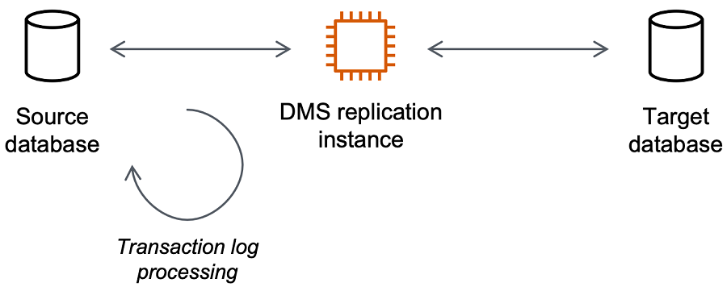

# Working with an AWS DMS replication

instance

When you create an AWS DMS replication instance, AWS DMS creates it on an Amazon EC2 instance in a
virtual private cloud (VPC) based on the Amazon VPC service. You use this replication instance to
perform your database migration. By using a replication instance, you can get high
availability and failover support with a Multi-AZ deployment when you choose the
**Multi-AZ** option.

In a Multi-AZ deployment, AWS DMS automatically provisions and maintains a synchronous
standby replica of the replication instance in a different Availability Zone. The primary
replication instance is synchronously replicated across Availability Zones to a standby
replica. This approach provides data redundancy, eliminates I/O freezes, and minimizes
latency spikes.

AWS DMS uses a replication instance to connect to your source data store, read the source
data, and format the data for consumption by the target data store. A replication instance
also loads the data into the target data store. Most of this processing happens in memory.
However, large transactions might require some buffering on disk. Cached transactions and
log files are also written to disk.

You can create an AWS DMS replication instance in the following AWS Regions.

| Region Name                | Region         | Endpoint                                                              | Protocol       |
| -------------------------- | -------------- | --------------------------------------------------------------------- | -------------- |
| US East (Ohio)             | us-east-2      | dms.us-east-2.amazonaws.com dms-fips.us-east-2.amazonaws.com       | HTTPS HTTPS |
| US East (N. Virginia)      | us-east-1      | dms.us-east-1.amazonaws.com dms-fips.us-east-1.amazonaws.com       | HTTPS HTTPS |
| US West (N. California)    | us-west-1      | dms.us-west-1.amazonaws.com dms-fips.us-west-1.amazonaws.com       | HTTPS HTTPS |
| US West (Oregon)           | us-west-2      | dms.us-west-2.amazonaws.com dms-fips.us-west-2.amazonaws.com       | HTTPS HTTPS |
| Africa (Cape Town)         | af-south-1     | dms.af-south-1.amazonaws.com                                          | HTTPS          |
| Asia Pacific (Hong Kong)   | ap-east-1      | dms.ap-east-1.amazonaws.com                                           | HTTPS          |
| Asia Pacific (Hyderabad)   | ap-south-2     | dms.ap-south-2.amazonaws.com                                          | HTTPS          |
| Asia Pacific (Jakarta)     | ap-southeast-3 | dms.ap-southeast-3.amazonaws.com                                      | HTTPS          |
| Asia Pacific (Malaysia)    | ap-southeast-5 | dms.ap-southeast-5.amazonaws.com                                      | HTTPS          |
| Asia Pacific (Melbourne)   | ap-southeast-4 | dms.ap-southeast-4.amazonaws.com                                      | HTTPS          |
| Asia Pacific (Mumbai)      | ap-south-1     | dms.ap-south-1.amazonaws.com                                          | HTTPS          |
| Asia Pacific (New Zealand) | ap-southeast-6 | dms.ap-southeast-6.amazonaws.com                                      | HTTPS          |
| Asia Pacific (Osaka)       | ap-northeast-3 | dms.ap-northeast-3.amazonaws.com                                      | HTTPS          |
| Asia Pacific (Seoul)       | ap-northeast-2 | dms.ap-northeast-2.amazonaws.com                                      | HTTPS          |
| Asia Pacific (Singapore)   | ap-southeast-1 | dms.ap-southeast-1.amazonaws.com                                      | HTTPS          |
| Asia Pacific (Sydney)      | ap-southeast-2 | dms.ap-southeast-2.amazonaws.com                                      | HTTPS          |
| Asia Pacific (Taipei)      | ap-east-2      | dms.ap-east-2.amazonaws.com                                           | HTTPS          |
| Asia Pacific (Thailand)    | ap-southeast-7 | dms.ap-southeast-7.amazonaws.com                                      | HTTPS          |
| Asia Pacific (Tokyo)       | ap-northeast-1 | dms.ap-northeast-1.amazonaws.com                                      | HTTPS          |
| Canada (Central)           | ca-central-1   | dms.ca-central-1.amazonaws.com dms-fips.ca-central-1.amazonaws.com | HTTPS HTTPS |
| Canada West (Calgary)      | ca-west-1      | dms.ca-west-1.amazonaws.com dms-fips.ca-west-1.amazonaws.com       | HTTPS HTTPS |
| Europe (Frankfurt)         | eu-central-1   | dms.eu-central-1.amazonaws.com                                        | HTTPS          |
| Europe (Ireland)           | eu-west-1      | dms.eu-west-1.amazonaws.com                                           | HTTPS          |
| Europe (London)            | eu-west-2      | dms.eu-west-2.amazonaws.com                                           | HTTPS          |
| Europe (Milan)             | eu-south-1     | dms.eu-south-1.amazonaws.com                                          | HTTPS          |
| Europe (Paris)             | eu-west-3      | dms.eu-west-3.amazonaws.com                                           | HTTPS          |
| Europe (Spain)             | eu-south-2     | dms.eu-south-2.amazonaws.com                                          | HTTPS          |
| Europe (Stockholm)         | eu-north-1     | dms.eu-north-1.amazonaws.com                                          | HTTPS          |
| Europe (Zurich)            | eu-central-2   | dms.eu-central-2.amazonaws.com                                        | HTTPS          |
| Israel (Tel Aviv)          | il-central-1   | dms.il-central-1.amazonaws.com                                        | HTTPS          |
| Mexico (Central)           | mx-central-1   | dms.mx-central-1.amazonaws.com                                        | HTTPS          |
| Middle East (Bahrain)      | me-south-1     | dms.me-south-1.amazonaws.com                                          | HTTPS          |
| Middle East (UAE)          | me-central-1   | dms.me-central-1.amazonaws.com                                        | HTTPS          |
| South America (São Paulo)  | sa-east-1      | dms.sa-east-1.amazonaws.com                                           | HTTPS          |
| AWS GovCloud (US-East)     | us-gov-east-1  | dms.us-gov-east-1.amazonaws.com                                       | HTTPS          |
| AWS GovCloud (US-West)     | us-gov-west-1  | dms.us-gov-west-1.amazonaws.com                                       | HTTPS          |

AWS DMS supports a special AWS Region called AWS GovCloud (US) that is designed to allow US
government agencies and customers to move sensitive workloads into the cloud. AWS GovCloud (US)
addresses the US government's specific regulatory and compliance requirements. For more
information about AWS GovCloud (US), see [What is AWS
GovCloud (US)?](../../../govcloud-us/latest/UserGuide/whatis.md "../../../govcloud-us/latest/UserGuide/whatis.md")

Following, you can find out more details about replication instances.

###### Topics

- [Choosing the right AWS DMS
  replication instance for your migration](CHAP_ReplicationInstance.md "CHAP_ReplicationInstance.md")
- [Selecting the best size for a
  replication instance](CHAP_BestPractices.md "CHAP_BestPractices.md")
- [Working with replication
  engine versions](CHAP_ReplicationInstance.md "CHAP_ReplicationInstance.md")
- [Public and private replication
  instances](CHAP_ReplicationInstance.md "CHAP_ReplicationInstance.md")
- [IP addressing and network types](CHAP_ReplicationInstance.md "CHAP_ReplicationInstance.md")
- [Setting up a network for a replication
  instance](CHAP_ReplicationInstance.md "CHAP_ReplicationInstance.md")
- [Setting an encryption key for a
  replication instance](CHAP_ReplicationInstance.md "CHAP_ReplicationInstance.md")
- [Creating a replication instance](CHAP_ReplicationInstance.md "CHAP_ReplicationInstance.md")
- [Modifying a replication instance](CHAP_ReplicationInstance.md "CHAP_ReplicationInstance.md")
- [Rebooting a replication instance](CHAP_ReplicationInstance.md "CHAP_ReplicationInstance.md")
- [Deleting a replication instance](CHAP_ReplicationInstance.md "CHAP_ReplicationInstance.md")
- [Working with the AWS DMS
  maintenance window](CHAP_ReplicationInstance.md "CHAP_ReplicationInstance.md")
