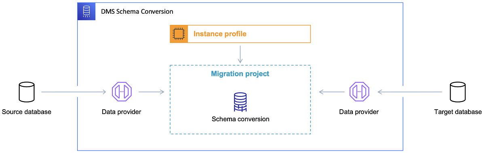

# Converting database schemas using DMS Schema Conversion

###### Note

DMS Schema Conversion with generative AI feature is now available. For more information, see [Viewing your database migration assessment
report for DMS Schema Conversion](assessment-reports-view.md "assessment-reports-view.md") and
[Converting database schemas in
DMS Schema Conversion: step-by-step guide](schema-conversion-convert.md "schema-conversion-convert.md").

DMS Schema Conversion in AWS Database Migration Service (AWS DMS) makes database migrations between different types of
databases more predictable. Use DMS Schema Conversion to assess the complexity of your migration for your
source data provider, and to convert database schemas and code objects. You can then apply
the converted code to your target database.

DMS Schema Conversion automatically converts your source database schemas and most of the database code
objects to a format compatible with the target database. This conversion includes tables,
views, stored procedures, functions, data types, synonyms, and so on. Any objects that
DMS Schema Conversion can't convert automatically are clearly marked. To complete the migration, you can
convert these objects manually.

At a high level, [DMS Schema Conversion](https://aws.amazon.com/dms/schema-conversion-tool/ "https://aws.amazon.com/dms/schema-conversion-tool/") operates with the following three components: instance profiles, data
providers, and migration projects. An _instance profile_ specifies
network and security settings. A _data provider_ stores database
connection credentials. A _migration project_ contains data providers, an
instance profile, and migration rules. AWS DMS uses data providers and an instance profile to
design a process that converts database schemas and code objects.

For the list of supported source databases, see [Sources for DMS Schema Conversion](CHAP_Introduction.md#CHAP_Introduction.Sources.SchemaConversion "CHAP_Introduction.md#CHAP_Introduction.Sources.SchemaConversion").

For the list of supported target databases, see [Targets for DMS Schema Conversion](CHAP_Introduction.md#CHAP_Introduction.Targets.SchemaConversion "CHAP_Introduction.md#CHAP_Introduction.Targets.SchemaConversion").

The following diagram illustrates the DMS Schema Conversion process.

Use the following topics to better understand how to use DMS Schema Conversion.

###### Topics

- [Supported AWS Regions](#schema-conversion-supported-regions "#schema-conversion-supported-regions")
- [Schema conversion features](#schema-conversion-features "#schema-conversion-features")
- [Schema conversion limitations](#schema-conversion-limitations "#schema-conversion-limitations")
- [Getting started with DMS Schema Conversion](getting-started.md "getting-started.md")
- [Setting up a network for DMS Schema Conversion](instance-profiles-network.md "instance-profiles-network.md")
- [Creating source data providers in DMS Schema Conversion](data-providers-source.md "data-providers-source.md")
- [Creating and setting target data providers in DMS Schema Conversion](data-providers-target.md "data-providers-target.md")
- [Virtual data provider](virtual-data-provider.md "virtual-data-provider.md")
- [Managing migration projects in DMS Schema Conversion](sc-migration-projects.md "sc-migration-projects.md")
- [Creating database migration assessment reports with
  DMS Schema Conversion](assessment-reports.md "assessment-reports.md")
- [Using DMS Schema Conversion](schema-conversion.md "schema-conversion.md")
- [Using extension packs in DMS Schema Conversion](extension-pack.md "extension-pack.md")
- [AWS IAM actions to API mapping for
  DMS Schema Conversion and Common Studio Framework (CSF)](schema-conversion-iam.md "schema-conversion-iam.md")

## Supported AWS Regions

You can create a DMS Schema Conversion migration project in the following AWS Regions. In other
Regions, you can use the AWS Schema Conversion Tool. For more information about AWS SCT, see the
[AWS Schema Conversion Tool User Guide](../../../SchemaConversionTool/latest/userguide.md "../../../SchemaConversionTool/latest/userguide.md").

| Region Name               | Region         |
| ------------------------- | -------------- |
| Africa (Cape Town)        | af-south-1     |
| Asia Pacific (Hong Kong)  | ap-east-1      |
| Asia Pacific (Mumbai)     | ap-south-1     |
| Asia Pacific (Hyderabad)  | ap-south-2     |
| Asia Pacific (Tokyo)      | ap-northeast-1 |
| Asia Pacific (Seoul)      | ap-northeast-2 |
| Asia Pacific (Singapore)  | ap-southeast-1 |
| Asia Pacific (Sydney)     | ap-southeast-2 |
| Asia Pacific (Jakarta)    | ap-southeast-3 |
| Asia Pacific (Melbourne)  | ap-southeast-4 |
| Canada (Central)          | ca-central-1   |
| Canada West (Calgary)     | ca-west-1      |
| Europe (Frankfurt)        | eu-central-1   |
| Europe (Zurich)           | eu-central-2   |
| Europe (Stockholm)        | eu-north-1     |
| Europe (Milan)            | eu-south-1     |
| Europe (Spain)            | eu-south-2     |
| Europe (Ireland)          | eu-west-1      |
| Europe (Paris)            | eu-west-3      |
| Israel (Tel Aviv)         | il-central-1   |
| Middle East (UAE)         | me-central-1   |
| South America (São Paulo) | sa-east-1      |
| US East (N. Virginia)     | us-east-1      |
| US East (Ohio)            | us-east-2      |
| US West (N. California)   | us-west-1      |
| US West (Oregon)          | us-west-2      |

## Schema conversion features

DMS Schema Conversion provides the following features:

- DMS Schema Conversion automatically manages the AWS Cloud resources that are required for
  your database migration project. These resources include instance profiles, data
  providers, and AWS Secrets Manager secrets. They also include AWS Identity and Access Management (IAM) roles,
  Amazon S3 buckets, and migration projects.
- You can use DMS Schema Conversion to connect to your source database, read the metadata,
  and create database migration assessment reports. You can then save the report
  to an Amazon S3 bucket. With these reports, you get a summary of your schema
  conversion tasks and the details for items that DMS Schema Conversion can't automatically
  convert to your target database. Database migration assessment reports help
  evaluate how much of your migration project DMS Schema Conversion can automate. These reports
  also help to estimate the amount of manual effort that is required to complete
  the conversion. For more information, see [Creating database migration assessment reports with
  DMS Schema Conversion](assessment-reports.md "assessment-reports.md").
- After you connect to your source and target data providers, DMS Schema Conversion can
  convert your existing source database schemas to the target database engine. You
  can choose any schema item from your source database to convert. After you
  convert your database code in DMS Schema Conversion, you can review your source code and the
  converted code. You can save the converted SQL code to an Amazon S3 bucket.
- Before you convert your source database schemas, you can set up transformation
  rules. You can use transformation rules to change the data type of columns, move
  objects from one schema to another, and change the names of objects. You can
  apply transformation rules to databases, schemas, tables, and columns. For more
  information, see [Setting up
  transformation rules](schema-conversion-transformation-rules.md "schema-conversion-transformation-rules.md").
- You can change conversion settings to improve the performance of the converted
  code. These settings are specific for each conversion pair and depend on the
  features of the source database that you use in your code. For more information,
  see [Specifying schema conversion
  settings](schema-conversion-settings.md "schema-conversion-settings.md").
- In some cases, DMS Schema Conversion can't convert source database features to equivalent
  Amazon RDS features. For these cases, DMS Schema Conversion creates an extension pack in your
  target database to emulate the features that weren't converted. For more
  information, see [Using extension packs](extension-pack.md "extension-pack.md").
- You can apply the converted code and the extension pack schema to your target
  database. For more information, see [Applying your converted
  code](schema-conversion-save-apply.md#schema-conversion-apply "schema-conversion-save-apply.md#schema-conversion-apply").
- DMS Schema Conversion supports all of the features in the latest AWS SCT release. For more
  information, see [The
  latest release notes for AWS SCT](../../../SchemaConversionTool/latest/userguide/CHAP_ReleaseNotes.md "../../../SchemaConversionTool/latest/userguide/CHAP_ReleaseNotes.md") .
- You can edit converted SQL code before DMS migrates it to the target database.
  For more information, see [Editing and saving your
  converted SQL code](schema-conversion-convert.md#schema-conversion-convert-editsql "schema-conversion-convert.md#schema-conversion-convert-editsql") .

## Schema conversion limitations

DMS Schema Conversion is a web-version of the AWS Schema Conversion Tool (AWS SCT). DMS Schema Conversion supports fewer
database platforms and provides more limited functionality compared to the AWS SCT
desktop application. To convert data warehouse schemas, big data frameworks, application
SQL code, and ETL processes, use AWS SCT. For more information about AWS SCT, see the
[AWS Schema Conversion Tool User Guide](../../../SchemaConversionTool/latest/userguide.md "../../../SchemaConversionTool/latest/userguide.md").

The following limitations apply when you use DMS Schema Conversion for database schema
conversion:

- You can't save a migration project and use it in an offline mode.
- You can't edit SQL code for the source in a migration project for DMS Schema Conversion. To
  edit the SQL code of your source database, use your regular SQL editor. Choose
  **Refresh from database** to add the updated code in your
  migration project.
- Migration rules in DMS Schema Conversion don't support changing column collation. You can't
  use migration rules to move objects to a new schema.
- You can't apply filters to your source and target database trees to display
  only those database objects that meet the filter clause.
- DMS Schema Conversion extension pack doesn't include AWS Lambda functions that emulate email
  sending, job scheduling, and other features in your converted code.
- DMS Schema Conversion doesn't use customer-managed KMS keys for access to any customer
  AWS resources. For example, DMS Schema Conversion doesn't support using a customer-managed
  KMS key to access customer data in Amazon S3.
