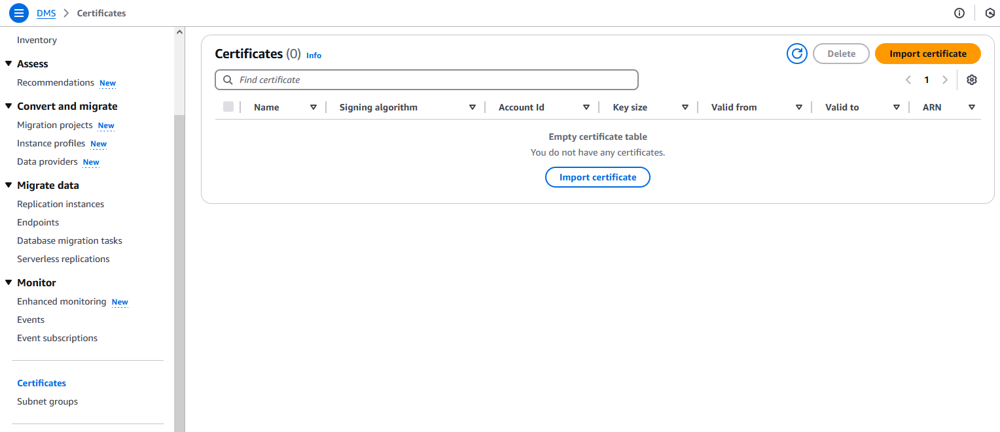
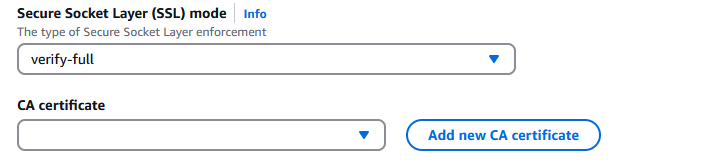

# Using SSL with AWS Database Migration Service

You can encrypt connections for source and target endpoints by using Secure Sockets
Layer (SSL). To do so, you can use the AWS DMS Management Console or AWS DMS API
to assign a certificate to an endpoint. You can also use the AWS DMS console to
manage your certificates.

Not all databases use SSL in the same way. Amazon Aurora MySQL-Compatible Edition uses the server name,
the endpoint of the primary instance in the cluster, as the endpoint for SSL. An Amazon Redshift
endpoint already uses an SSL connection and does not require an SSL connection
set up by AWS DMS. An Oracle endpoint requires additional steps; for more information, see
[SSL support for an Oracle
endpoint](CHAP_Source.md#CHAP_Security.SSL.Oracle "CHAP_Source.md#CHAP_Security.SSL.Oracle").

###### Topics

- [Limitations on using SSL with
  AWS DMS](#CHAP_Security.SSL.Limitations "#CHAP_Security.SSL.Limitations")
- [Managing certificates](#CHAP_Security.SSL.ManagingCerts "#CHAP_Security.SSL.ManagingCerts")
- [Enabling SSL for a MySQL-compatible,
  PostgreSQL, or SQL Server endpoint](#CHAP_Security.SSL.Procedure "#CHAP_Security.SSL.Procedure")
  To establish a secure connection, you provide the root certificate or the chain of
  intermediate CA certificates leading to the root (as a certificate bundle) that was used
  to sign the server's SSL certificate at the endpoint. Certificates are accepted as PEM
  formatted X509 files, only. When you import a certificate, you receive an Amazon
  Resource Name (ARN) that you can use to specify that certificate for an endpoint. If you
  use Amazon RDS, you can download the root CA and certificate bundle provided in the
  `rds-combined-ca-bundle.pem` file hosted by Amazon RDS. For more
  information about downloading this file, see [Using
  SSL/TLS to encrypt a connection to a DB instance](../../../AmazonRDS/latest/UserGuide/UsingWithRDS.md "../../../AmazonRDS/latest/UserGuide/UsingWithRDS.md") in the
  _Amazon RDS User Guide_.

You can choose from several SSL modes to use for your SSL certificate verification.

- **none** – The connection is not encrypted. This
  option is not secure, but requires less overhead.
- **require** – The connection is encrypted using SSL
  (TLS) but no CA verification is made. This option is more secure, and requires
  more overhead.
- **verify-ca** – The connection is encrypted. This
  option is more secure, and requires more overhead. This option verifies the
  server certificate.
- **verify-full** – The connection is encrypted. This
  option is more secure, and requires more overhead. This option verifies the
  server certificate and verifies that the server hostname matches the hostname
  attribute for the certificate.
  Not all SSL modes work with all database endpoints. The following table shows which
  SSL modes are supported for each database engine.

| DB engine                         | **none** | **require**     | **verify-ca**   | **verify-full** |
| --------------------------------- | -------- | --------------- | --------------- | --------------- |
| MySQL/MariaDB/Amazon Aurora MySQL | Default  | Not supported   | Supported       | Supported       |
| Microsoft SQL Server              | Default  | Supported       | Not Supported   | Supported       |
| PostgreSQL                        | Default  | Supported       | Supported       | Supported       |
| Amazon Redshift                   | Default  | SSL not enabled | SSL not enabled | SSL not enabled |
| Oracle                            | Default  | Not supported   | Supported       | Not Supported   |
| SAP ASE                           | Default  | SSL not enabled | SSL not enabled | Supported       |
| MongoDB                           | Default  | Supported       | Not Supported   | Supported       |
| Db2 LUW                           | Default  | Not Supported   | Supported       | Not Supported   |
| Db2 for z/OS                      | Default  | Not Supported   | Supported       | Not Supported   |

###### Note

The SSL Mode option on the DMS console or API doesn’t apply to some data streaming
and NoSQL services like Kinesis, and DynamoDB. They are secure by default, so DMS
shows the SSL mode setting is equal to none (**SSL
Mode=None**). You don’t need to provide any additional configuration
for your endpoint to make use of SSL. For example, when using Kinesis as a target
endpoint, it is secure by default. All API calls to Kinesis use SSL, so there is no
need for an additional SSL option in the DMS endpoint. You can securely put data and
retrieve data through SSL endpoints using the HTTPS protocol, which DMS uses by
default when connecting to a Kinesis Data Stream.

## Limitations on using SSL with

AWS DMS

Following are limitations on using SSL with AWS DMS:

- SSL connections to Amazon Redshift target endpoints are not supported. AWS DMS uses an
  Amazon S3 bucket to transfer data to the Amazon Redshift database. This transmission is
  encrypted by Amazon Redshift by default.
- SQL timeouts can occur when performing change data capture (CDC) tasks
  with SSL-enabled Oracle endpoints. If you have an issue where CDC counters
  don't reflect the expected numbers, set the
  `MinimumTransactionSize` parameter from the
  `ChangeProcessingTuning` section of the task settings to a
  lower value. You can start with a value as low as 100. For more information
  about the `MinimumTransactionSize` parameter, see [Change processing tuning settings](CHAP_Tasks.CustomizingTasks.TaskSettings.md "CHAP_Tasks.CustomizingTasks.TaskSettings.md").
- You can import certificates only in the .pem and .sso (Oracle wallet)
  formats.
- In some cases, your server SSL certificate might be signed by an
  intermediate certificate authority (CA). If so, make sure that the entire
  certificate chain leading from the intermediate CA up to the root CA is
  imported as a single .pem file.
- If you are using self-signed certificates on your server, choose
  **require** as your SSL mode. The
  **require** SSL mode implicitly trusts the
  server's SSL certificate and doesn't try to validate that the
  certificate was signed by a CA.
- AWS DMS does not support TLS version 1.3 for MySQL and MariaDb
  endpoints.

## Managing certificates

You can use the DMS console to view and manage your SSL certificates. You can also
import your certificates using the DMS console.

## Enabling SSL for a MySQL-compatible,

PostgreSQL, or SQL Server endpoint

You can add an SSL connection to a newly created endpoint or to an existing
endpoint.

###### To create an AWS DMS endpoint with SSL

1. Sign in to the AWS Management Console and open the AWS DMS console at [https://console.aws.amazon.com/dms/v2/](https://console.aws.amazon.com/dms/v2/ "https://console.aws.amazon.com/dms/v2/").

If you're signed in as an AWS Identity and Access Management (IAM) user, make sure that you
have the appropriate permissions to access AWS DMS. For more information about
the permissions required for database migration, see [IAM permissions needed to use
AWS DMS](security-iam.md#CHAP_Security.IAMPermissions "security-iam.md#CHAP_Security.IAMPermissions"). 2. In the navigation pane, choose **Certificates**. 3. Choose **Import Certificate**. 4. Upload the certificate you want to use for encrypting the connection to an
endpoint.

###### Note

You can also upload a certificate using the AWS DMS console when
you create or modify an endpoint by selecting **Add new CA
certificate** on the **Create database
endpoint** page.

For Aurora Serverless as target, get the certificate mentioned in
[Using TLS/SSL with Aurora Serverless](../../../AmazonRDS/latest/AuroraUserGuide/aurora-serverless.md#aurora-serverless.tls "../../../AmazonRDS/latest/AuroraUserGuide/aurora-serverless.md#aurora-serverless.tls"). 5. Create an endpoint as described in [Step 2: Specify source and target endpoints](CHAP_GettingStarted.md#CHAP_GettingStarted.Replication.Endpoints "CHAP_GettingStarted.md#CHAP_GettingStarted.Replication.Endpoints")

###### To modify an existing AWS DMS endpoint to use SSL

1. Sign in to the AWS Management Console and open the AWS DMS console at [https://console.aws.amazon.com/dms/v2/](https://console.aws.amazon.com/dms/v2/ "https://console.aws.amazon.com/dms/v2/").

If you're signed in as an IAM user, make sure that you have the
appropriate permissions to access AWS DMS. For more information about the
permissions required for database migration, see [IAM permissions needed to use
AWS DMS](security-iam.md#CHAP_Security.IAMPermissions "security-iam.md#CHAP_Security.IAMPermissions"). 2. In the navigation pane, choose **Certificates**. 3. Choose **Import Certificate**. 4. Upload the certificate you want to use for encrypting the connection to an
endpoint.

###### Note

You can also upload a certificate using the AWS DMS console when
you create or modify an endpoint by selecting **Add new CA
certificate** on the **Create database
endpoint** page. 5. In the navigation pane, choose **Endpoints**, select the
endpoint you want to modify, and choose **Modify**. 6. Choose a value for **SSL mode**.

If you choose **verify-ca** or
**verify-full** mode, specify the certificate that you
want to use for **CA certificate**, as shown following.

 7. Choose **Modify**. 8. When the endpoint has been modified, choose the endpoint and choose
**Test connection** to determine if the SSL connection
is working.

After you create your source and target endpoints, create a task that uses these
endpoints. For more information about creating a task, see [Step 3: Create a task and migrate data](CHAP_GettingStarted.md#CHAP_GettingStarted.Replication.Tasks "CHAP_GettingStarted.md#CHAP_GettingStarted.Replication.Tasks").
