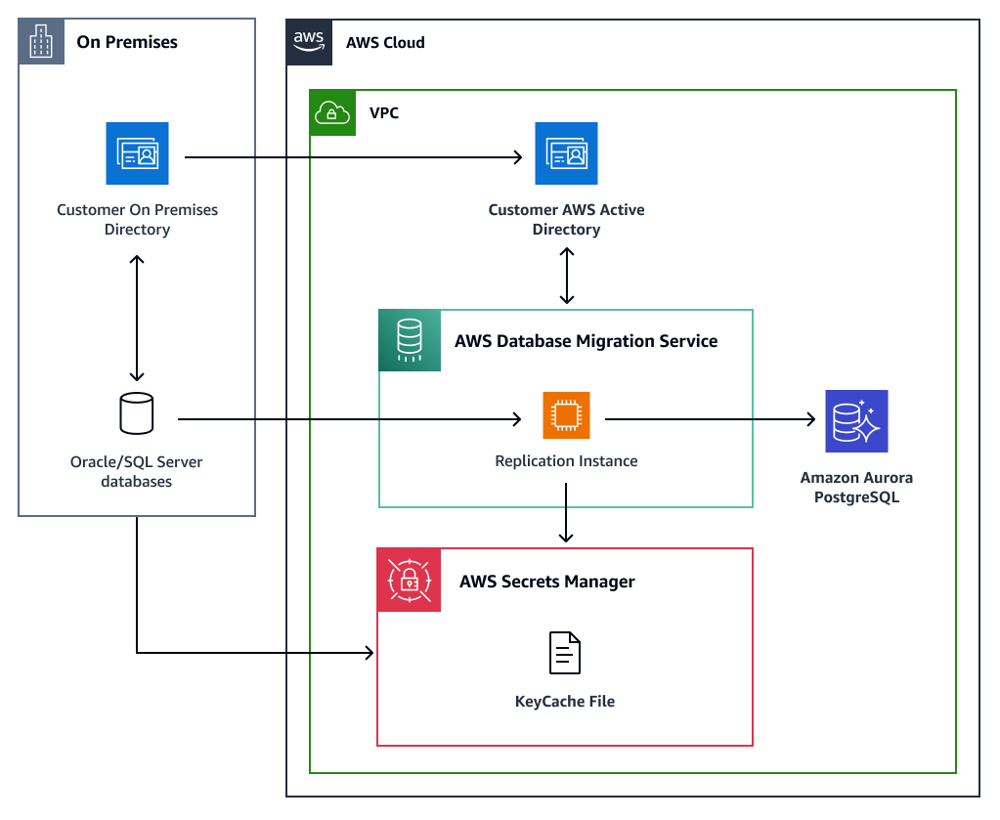

# Using Kerberos Authentication with AWS Database Migration Service

Starting with DMS v3.5.3, you can configure your Oracle or SQL Server source endpoint to connect to your
database instance using Kerberos authentication. DMS supports Directory Service for Microsoft Active Directory and
Kerberos authentication. For more information about AWS-managed access to Microsoft Active Directory Services, see
[What is Directory Service?](../../../directoryservice/latest/admin-guide/what_is.md "../../../directoryservice/latest/admin-guide/what_is.md").

## AWS DMS Kerberos Authentication Architecture Overview

The following diagram provides a high level overview of the AWS DMS Kerberos authentication workflow.



## Limitations on using Kerberos authentication

with AWS DMS

The following limitations apply when using Kerberos authentication with AWS DMS:

- DMS replication instances support one Kerberos `krb5.conf` file and one keycache file.
- You must update the Kerberos keycache file in Secrets Manager at least 30 minutes prior to
  the ticket expiring.
- A Kerberos-enabled DMS endpoint only works with a Kerberos-enabled DMS replication instance.

## Prerequisites

To start, you must complete the following prerequisites from an existing Active Directory or Kerberos-authenticated host:

- Establish an Active Directory trust relationship with your on-premise AD. For more information,
  see [Tutorial: Create a trust relationship between your AWS Managed Microsoft AD and your self-managed Active Directory domain](../../../directoryservice/latest/admin-guide/ms_ad_tutorial_setup_trust.md "../../../directoryservice/latest/admin-guide/ms_ad_tutorial_setup_trust.md").
- Prepare a simplified version of the Kerberos `krb5.conf` configuration file. Include information about the realm, the location of the domain admin servers, and mappings of hostnames onto a Kerberos realm. You need to verify that the `krb5.conf` content is formatted with the correct mixed casing for the realms and domain realm names. For example:

```
[libdefaults]
 dns_lookup_realm = true
 dns_lookup_kdc = true
 forwardable = true
 default_realm = MYDOMAIN.ORG
[realms]
MYDOMAIN.ORG = {
kdc = mydomain.org
admin_server = mydomain.org
}
[domain_realm]
.mydomain.org = MYDOMAIN.ORG
mydomain.org = MYDOMAIN.ORG
```

- Prepare a Kerberos keycache file. The file contains a temporary Kerberos credential of the client
  principal information. The file does not store the client's password. Your DMS task uses this cache ticket
  information to get additional credentials without a password. Run the following steps on an existing Active
  Directory or Kerberos-authenticated host to generate a keycache file.
  - Create a Kerberos keytab file. You can generate a keytab file using the
    **kutil** or **ktpass** utility.

  For more information about the Microsoft **ktpass** utility, see
  [ktpass](https://learn.microsoft.com/en-us/windows-server/administration/windows-commands/ktpass "https://learn.microsoft.com/en-us/windows-server/administration/windows-commands/ktpass")
  in the _Windows Server documentation_.

  For more information about the MIT **kutil** utility, see
  [kutil](https://web.mit.edu/kerberos/krb5-1.12/doc/admin/admin_commands/ktutil.html "https://web.mit.edu/kerberos/krb5-1.12/doc/admin/admin_commands/ktutil.html")
  in the _MIT Kerberos Documentation_.
  - Create a Kerberos keycache file from keytab file using the **kinit** utility. For more information about the **kinit** utility, see [kinit](https://web.mit.edu/kerberos/krb5-1.12/doc/user/user_commands/kinit.html "https://web.mit.edu/kerberos/krb5-1.12/doc/user/user_commands/kinit.html")
    in the _MIT Kerberos Documentation_.

- Store the Kerberos keycache file in Secrets Manager using the `SecretBinary` parameter. When you upload the
  keycache file to Secrets Manager, DMS retrieves it, and then updates the local cache file about
  every 30 minutes. When the local keycache file exceeds the predefined expiration timestamp, DMS
  gracefully stops the task. To avoid authentication failures during an ongoing replication task,
  update the keycache file in Secrets Manager at least 30 minutes before the ticket expiration. For more information,
  see
  [createsecret](../../../secretsmanager/latest/apireference/API_CreateSecret.md "../../../secretsmanager/latest/apireference/API_CreateSecret.md")
  in the _Secrets Manager API Reference_. The following AWS CLI sample shows how to store the keycache file
  in binary format in Secrets Manager:

```
aws secretsmanager create-secret —name keycache —secret-binary fileb:`//keycachefile`

```

- Grant an IAM role the `GetSecretValue` and `DescribeSecret` permissions to get
  the keycache file from Secrets Manager. Ensure that the IAM role includes the `dms-vpc-role` trust policy. For
  more information about the `dms-vpc-role` trust policy, see
  [Creating the IAM roles to use with AWS DMS](security-iam.md#CHAP_Security.APIRole "security-iam.md#CHAP_Security.APIRole").

The following example shows an IAM role policy with the Secrets Manager `GetSecretValue` and
`DescribeSecret` permissions. The `<keycache_secretsmanager_arn>`
value is the Keycache Secrets Manager ARN you created in the previous step.

JSON

```
`{
 "Version":"2012-10-17",
 "Statement": [
 {
 "Effect": "Allow",
 "Action": [
 "secretsmanager:GetSecretValue",
 "secretsmanager:DescribeSecret"
 ],
 "Resource": "*"
 }
 ]
}`

```

## Enabling Kerberos support on an AWS DMS

replication instance

Kerberos realms are identical to domains in Windows. In order to resolve a principle realm, Kerberos relies
on a Domain Name Service (DNS). When you set the `dns-name-servers` parameter, your replication instance
will use your predefined custom set of DNS servers to resolve the Kerberos domain realms. Another alternative
option to resolve Kerberos realm queries is to configure Amazon Route 53 on the replication instance
virtual private cloud (VPC). For more information, see [Route 53](../../../route53.md "../../../route53.md").

### Enabling Kerberos support on a DMS

replication instance using the AWS Management Console

To enable Kerberos support using the console, enter the following information in the
**Kerberos authentication** section of the **Create Replication Instance**
or **Modify Replication Instance** page:

- The content from your `krb5.conf` file
- The ARN of the Secrets Manager secret that contains the keycache file
- The ARN of the IAM role that has access to the secret manager ARN and permissions to
  retrieve the keycache file

### Enabling Kerberos support on a DMS

replication instance using the AWS CLI

The following AWS CLI sample call creates a private DMS replication instance with Kerberos support.
The replication instance uses a custom DNS to resolve the Kerberos realm. For more information,
see [create-replication-instance](../../../cli/latest/reference/dms/create-replication-instance.md "../../../cli/latest/reference/dms/create-replication-instance.md").

```
aws dms create-replication-instance
--replication-instance-identifier my-replication-instance
--replication-instance-class dms.t2.micro
--allocated-storage 50
--vpc-security-group-ids sg-12345678
--engine-version 3.5.4
--no-auto-minor-version-upgrade
--kerberos-authentication-settings'{"KeyCacheSecretId":<secret-id>,"KeyCacheSecretIamArn":<secret-iam-role-arn>,"Krb5FileContents":<krb5.conf file contents>}'
--dns-name-servers `<custom dns server>`
--no-publicly-accessible
```

## Enabling Kerberos support on a source endpoint

Before enabling Kerberos authentication on a DMS Oracle or SQL server source endpoint, make sure
you can authenticate to the source database using the Kerberos protocol from a client machine.
You can use the AWS DMS Diagnostic AMI to launch an Amazon EC2 instance on the same VPC as the replication
instance, and then test the kerberos authentication. For more information about the AMI, see
[Working with the AWS DMS diagnostic support AMI](CHAP_SupportAmi.md "CHAP_SupportAmi.md").

### Using the AWS DMS console

Under **Access to endpoint database**, choose **Kerberos authentication**.

### Using the AWS CLI

Specify the endpoint setting parameter and set `AuthenticationMethod` option as kerberos. For example:

**Oracle**

```
aws dms create-endpoint
--endpoint-identifier my-endpoint
--endpoint-type source
--engine-name oracle
--username dmsuser@MYDOMAIN.ORG
--server-name `mydatabaseserver`
--port 1521
--database-name `mydatabase`
--oracle-settings "{\"AuthenticationMethod\": \"kerberos\"}"
```

**SQL Server**

```
aws dms create-endpoint
--endpoint-identifier my-endpoint
--endpoint-type source
--engine-name sqlserver
--username dmsuser@MYDOMAIN.ORG
--server-name `mydatabaseserver`
--port 1433
--database-name `mydatabase`
--microsoft-sql-server-settings "{\"AuthenticationMethod\": \"kerberos\"}"
```

## Testing a source

endpoint

You must test the Kerberos-enabled endpoint against a Kerberos-enabled replication instance.
When you don't properly confiugure the replication instance or source endpoint for Kerberos
authentication, the endpoint `test-connection` action will fail, and might return Kerberos-related
errors. For more information, see
[test-connection](https://awscli.amazonaws.com/v2/documentation/api/latest/reference/dms/test-connection.html "https://awscli.amazonaws.com/v2/documentation/api/latest/reference/dms/test-connection.html").
