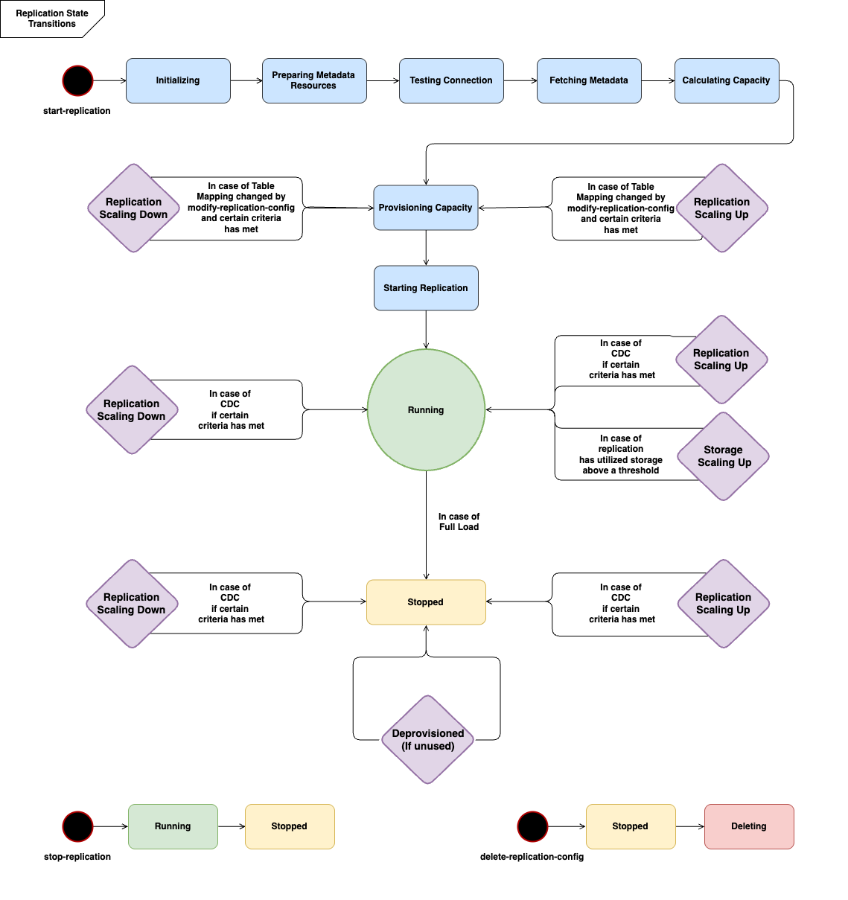

# AWS DMS Serverless components

To manage the resources needed to perform a replication, AWS DMS Serverless has granular states
that reveal different internal actions taken by the service. When you start the replication,
AWS DMS Serverless calculates the capacity load, provisions the calculated capacity, and starts the data
replication according to the following replication states.

The following diagram shows the state transitions for an AWS DMS Serverless replication.



- The first state after you start the replication is **Initializing**.
  In this state, all the required parameters are initialized.
- The states immediately following include **Preparing Metadata Resources**, **Testing Connection**, and
  **Fetching Metadata**. In these states, AWS DMS Serverless connects to your
  source database to obtain the information needed to predict the capacity needed.
  - When the replication state
    is **Testing Connection**, AWS DMS Serverless verifies that the connection to your
    source and target databases are set up successfully.
  - The replication state following **Testing Connection** is
    **Fetching Metadata**. Here, AWS DMS retrieves the information needed to calculate
    capacity.
  - Once AWS DMS retrieves the necessary information, the next state is **Calculating Capacity**. Here, the system calculates the size of underlying
    resources required to perform the replication.

- The state transition following **Calculating Capacity**
  is **Provisioning Capacity**. While the replication is in this state,
  AWS DMS Serverless initializes the underlying compute resources.
- The replication state after all resources are
  successfully provisioned is **Replication Starting**. In this state, AWS DMS Serverless
  begins the replication of data. The phases of a replication include the following:
  - **Full load:** In this phase, DMS replicates the source
    data store as it was when the replication started.
  - **CDC (initial):** In this phase, DMS replicates the changes
    to the source data store that occurred during the Full Load phase. DMS only runs this phase if the
    `StopTaskCachedChangesNotApplied` task setting is `false`.
  - **CDC (ongoing):** After the initial CDC phase, DMS replicates
    changes on the source database as they occur. DMS only continues to run replication after the initial CDC phase if the
    `StopTaskCachedChangesApplied` task setting is `false`.

- The final state is
  **Running**. In the **Running** state, the replication of data is ongoing.
- A replication that you stop enters the **Stopped** state. A
  replication can go into a stopped state for full-load only replication tasks
  that are successfully completed. These circumstances need to be accounted for
  resuming or restarting replications in the stopped or failed state:
  - You cannot restart a replication that has not started in 48 hours as AWS DMS deprovisions the
    resources.

###### This topic contains the following sections.

- [Supported Endpoints](#CHAP_Serverless.SupportedVersions "#CHAP_Serverless.SupportedVersions")
- [Creating a serverless replication](#CHAP_Serverless.create "#CHAP_Serverless.create")
- [Modifying AWS DMS serverless replications](#CHAP_Serverless.modify "#CHAP_Serverless.modify")
- [Compute Config](#CHAP_Serverless.computeconfig "#CHAP_Serverless.computeconfig")
- [Understanding autoscaling in AWS DMS serverless](#CHAP_Serverless.autoscaling "#CHAP_Serverless.autoscaling")
- [Monitoring AWS DMS serverless replications](#CHAP_Serverless.monitoring "#CHAP_Serverless.monitoring")
- [Enhanced Throughput for Full-Load
  Oracle to Amazon Redshift and Amazon S3 Migrations](#CHAP_Serverless.Throughput "#CHAP_Serverless.Throughput")
- [Understanding Storage
  Autoscaling in AWS DMS Serverless](#CHAP.Serverless.storage.autoscaling "#CHAP.Serverless.storage.autoscaling")
  For AWS DMS Serverless, the left-hand navigation panel of the AWS DMS console has a new option,
  **Serverless replications**. For **Serverless
  Replications**, you specify _Replications_
  instead of replication instance types or tasks to define a replication. In addition, you
  specify the maximum and minimum DMS capacity units (DCUs) that you want DMS to provision
  for the replication. A DCU is 2GB of RAM. AWS DMS bills your account for each DCU that your
  replication is currently using. For
  information about AWS DMS pricing, see [AWS Database Migration Service pricing](https://aws.amazon.com/dms/pricing/ "https://aws.amazon.com/dms/pricing/").

AWS DMS then automatically provisions replication resources based on your table mappings
and the predicted size of your workload. This capacity unit is a value in the range of the
minimum and maximum capacity unit values that you specify.

## Supported Endpoints

With AWS DMS Serverless, you do not need to choose and manage engine versions, as the service handles that setting.
AWS DMS Serverless supports the following sources:

- MongoDB
- Amazon DocumentDB (with MongoDB compatibility)
- Microsoft SQL Server
- PostgreSQL-compatible databases
- MySQL-compatible databases
- MariaDB
- Oracle
- Amazon S3
- IBM Db2

AWS DMS Serverless supports the following targets:

- Microsoft SQL Server
- PostgreSQL
- MySQL-compatible databases
- Oracle
- Amazon S3
- Amazon Redshift
- Amazon DynamoDB
- Amazon Kinesis Data Streams
- Amazon Managed Streaming for Apache Kafka
- Amazon OpenSearch Service
- Amazon DocumentDB (with MongoDB compatibility)
- Amazon Neptune

As part of AWS DMS Serverless, you have access to console commands that allow you to
create, configure, start, and manage AWS DMS serverless replications. To run these commands
using the **Serverless replications** section of the console, you need to do one of the following:

- Set up a new AWS Identity and Access Management (IAM) policy and IAM role to attach that policy to.
- Use an AWS CloudFormation template to provide the access that you need.
  AWS DMS Serverless requires a service linked role (SLR) to exist in your account. AWS DMS manages the creation and usage of this role.
  For more information about making sure that you have the necessary SLR, see [Service-linked role for AWS DMS](slr-services-sl.md "slr-services-sl.md").

## Creating a serverless replication

To create a serverless replication between two existing AWS DMS endpoints, do the following.
For information about creating AWS DMS endpoints, see [Creating source and target endpoints](CHAP_Endpoints.md "CHAP_Endpoints.md").

###### Creating a serverless replication

1. Sign in to the AWS Management Console and open the AWS DMS console at [https://console.aws.amazon.com/dms/v2/](https://console.aws.amazon.com/dms/v2/ "https://console.aws.amazon.com/dms/v2/").
2. On the navigation pane, choose **Serverless replications**, and
   then choose **Create replication**.
3. On the **Create replication** page, specify your
   serverless replication configuration:

| Option                                                   | Action                                                                                                                                                                                                                                                                                                                                                        |
| -------------------------------------------------------- | ------------------------------------------------------------------------------------------------------------------------------------------------------------------------------------------------------------------------------------------------------------------------------------------------------------------------------------------------------------- |
| **Name**                                                 | Enter a name to identify the replication, such as<br>`DMS-replication`.                                                                                                                                                                                                                                                                                       |
| **Descriptive Amazon Resource Name (ARN)<br>• Optional** | You can use this optional parameter to provide a description of the replication.                                                                                                                                                                                                                                                                              |
| **Source database endpoint**                             | Choose existing endpoints in your account. Note that AWS DMS Serverless only supports a subset of the endpoint<br>types that AWS DMS standard supports.                                                                                                                                                                                                       |
| **Target database endpoint**                             | Choose existing endpoints in your account. Note that AWS DMS Serverless only supports a subset of the endpoint<br>types that AWS DMS standard supports.                                                                                                                                                                                                       |
| **Replication type**                                     | Choose a replication type based on your requirements:<br>• **Full load**: AWS DMS migrates<br>existing data only.<br>• **Full load and change data capture (CDC)**: AWS DMS migrates<br>existing data and changes that occur during replication.<br>• **Change data capture (CDC)**: AWS DMS only migrates<br>changes that occur after you start replication. |

In the **Settings** section, set the settings that your replication requires.

In the **Table mappings** section, set up table mapping to define
rules to select and filter data that you are replicating. Before you specify your mapping,
make sure that you review the documentation section on data type mapping for your source
and your target database. For information about data type mapping for your source and target
databases, see the data types section for your source and target endpoint types in the
[Working with AWS DMS endpoints](CHAP_Endpoints.md "CHAP_Endpoints.md") topic.

In the **Compute settings** section, set the following settings. For information
about Compute Config settings, see [Compute Config](#CHAP_Serverless.computeconfig "#CHAP_Serverless.computeconfig").

| Option                                               | Action                                                                                                                                                                                                                                             |
| ---------------------------------------------------- | -------------------------------------------------------------------------------------------------------------------------------------------------------------------------------------------------------------------------------------------------- |
| **VPC**                                              | Choose an existing VPC.                                                                                                                                                                                                                            |
| **Subnet group**                                     | Choose an existing subnet group.                                                                                                                                                                                                                   |
| **VPC security group(s)**                            | Choose \*_default_<br>• if it isn't already chosen.                                                                                                                                                                                                |
| **AWS KMS key**                                      | Choose an appropriate KMS key. For information about KMS keys, see<br>[Creating keys](../../../kms/latest/developerguide/create-keys.md "../../../kms/latest/developerguide/create-keys.md")<br>in the _AWS Key Management Service API Reference_. |
| **Deployment**                                       | Leave as is.                                                                                                                                                                                                                                       |
| **Availability Zone**                                | Leave as is.                                                                                                                                                                                                                                       |
| **Minimum DMS capacity units (DCU)<br>• (Optional)** | Leave blank<br>to use the default value of 1 DCU.                                                                                                                                                                                                  |
| **Maximum DMS capacity units (DCU)**                 | Choose **16 DCU**.                                                                                                                                                                                                                                 |

Leave the **Maintenance** settings as they are. 4. Choose **Create replication**.

AWS DMS creates a serverless replication to perform your migration.

## Modifying AWS DMS serverless replications

To modify your replication configuration, use the `modify-replication-config` action.
You can only modify an AWS DMS replication configuration that is in the `CREATED`, `STOPPED`,
or `FAILED` states. For information about the `modify-replication-config` action, see
[ModifyReplicationConfig](../APIReference/API_ModifyReplicationConfig.md "../APIReference/API_ModifyReplicationConfig.md")
in the _AWS Database Migration Service API Reference_.

###### To modify a serverless replication configuration by using the AWS Management Console

1. Sign in to the AWS Management Console and open the AWS DMS console at
   [https://console.aws.amazon.com/dms/v2/](https://console.aws.amazon.com/dms/v2/ "https://console.aws.amazon.com/dms/v2/").
2. In the navigation pane, choose **Serverless replications**.
3. Choose
   the replication you want to modify. The following table describes the
   modifications you can make based on the current state of the replication.

| Setting                      | Description                                                                                                                                                                                                                                                                                                                                                                                                         | Allowed States                                                                                                                                                                                                                                                                                                                                                                                                                                                                                                                           |
| ---------------------------- | ------------------------------------------------------------------------------------------------------------------------------------------------------------------------------------------------------------------------------------------------------------------------------------------------------------------------------------------------------------------------------------------------------------------- | ---------------------------------------------------------------------------------------------------------------------------------------------------------------------------------------------------------------------------------------------------------------------------------------------------------------------------------------------------------------------------------------------------------------------------------------------------------------------------------------------------------------------------------------- |
| **Name**                     | You can change the name of the replication. Enter<br>a name for the replication that contains from 8 to<br>16 printable ASCII characters (excluding /,", and @).<br>The name should be unique for your account for the AWS<br>Region you selected. You can choose to add some details<br>to the name, such as including the AWS Region and task you<br>are performing, for example:<br>`west2-mysql2mysql-config1`. | `ReplicationState` is `CREATED`, `STOPPED`, or `FAILED`.                                                                                                                                                                                                                                                                                                                                                                                                                                                                                 |
| **Source database endpoint** | Choose a new existing source endpoint as the source for the replication.                                                                                                                                                                                                                                                                                                                                            | `ReplicationState` is `CREATED`, or `FAILED` when `ProvisionState` is `null`.                                                                                                                                                                                                                                                                                                                                                                                                                                                            |
| **Target database endpoint** | Choose a new existing target endpoint as the target for the replication.                                                                                                                                                                                                                                                                                                                                            | `ReplicationState` is `CREATED`, or `FAILED` when `ProvisionState` is `null`.                                                                                                                                                                                                                                                                                                                                                                                                                                                            |
| **Replication type**         | You can modify the type of a serverless replication.                                                                                                                                                                                                                                                                                                                                                                | `ReplicationState` is `CREATED`, or `FAILED` when `ProvisionState` is `null`.                                                                                                                                                                                                                                                                                                                                                                                                                                                            |
| **Replication Settings**     | You can modify the replication settings, including the target table preparation mode,<br>whether to include LOB columns in replication,<br>maximum LOB size, validation, and logging. For more information, see<br>[Task settings](CHAP_Tasks.CustomizingTasks.md "CHAP_Tasks.CustomizingTasks.md").                                                                                                                | `ReplicationState` is `CREATED`, `STOPPED`, or `FAILED`.                                                                                                                                                                                                                                                                                                                                                                                                                                                                                 |
| **Table mappings**           | You can modify the table mapping settings for a serverless replication, including<br>the selection rules and the transformation rules. For more information, see<br>[Table mapping](CHAP_Tasks.CustomizingTasks.md "CHAP_Tasks.CustomizingTasks.md").                                                                                                                                                               | `ReplicationState` is `CREATED`, `STOPPED`, or `FAILED`.                                                                                                                                                                                                                                                                                                                                                                                                                                                                                 |
| **Compute config**           | You can modify the compute configuration settings for a serverless replication, including<br>the networking settings, scaling settings, and maintenance settings. For information<br>about Compute Config settings, see [Compute Config](#CHAP_Serverless.computeconfig "#CHAP_Serverless.computeconfig").                                                                                                          | • You can modify the following scaling, maintenance, and network settings<br>when the `ReplicationState` is<br>`CREATED`, `STOPPED`, or `FAILED`:<br>+ `MinCapacityUnits`<br>+ `MaxCapacityUnits`<br>+ `MultiAZ`<br>+ `PreferredMaintenanceWindow`<br>+ `VpcSecurityGroupIds`<br>• You can modify the following networking and security settings when the `ReplicationState`<br>is `CREATED`, or `FAILED` when `ProvisionState` is `null`:<br>+ `AvailabilityZone`<br>+ `DnsNameServers`<br>+ `KmsKeyId`<br>+ `ReplicationSubnetGroupId` |

###### Note

You cannot modify endpoints associated to a DMS task when the task status is
starting or running.

## Compute Config

You configure your replication provisioning using the Compute Config parameter or console section.
The fields in the Compute Config object include the following:

| Option                         | Description                                                                                                                                                                                                                                                                                                                                                                                                                                                                                                                                                                            |
| ------------------------------ | -------------------------------------------------------------------------------------------------------------------------------------------------------------------------------------------------------------------------------------------------------------------------------------------------------------------------------------------------------------------------------------------------------------------------------------------------------------------------------------------------------------------------------------------------------------------------------------- |
| **MinCapacityUnits**           | This is the minimum number of DMS Capacity Units (DCU) that AWS DMS will provision.<br>This is also the minimum DCU that autoscaling could scale down to.                                                                                                                                                                                                                                                                                                                                                                                                                              |
| **MaxCapacityUnits**           | This is the the maximum DMS Capacity Units (DCU) that AWS DMS<br>can provision, depending on your replication's capacity prediction.<br>This is also the maximum DCU that autoscaling could scale up to.                                                                                                                                                                                                                                                                                                                                                                               |
| **KmsKeyId**                   | The encryption key to use to encrypt replication storage and connection information.<br>If you choose **(Default) aws/dms**, AWS DMS uses the default<br>KMS key associated with your account and AWS Region. A description and<br>your account number are shown, along with the key's ARN. For more information about using the<br>encryption key, see [Setting an encryption key and<br>specifying AWS KMS permissions](CHAP_Security.md#CHAP_Security.EncryptionKey "CHAP_Security.md#CHAP_Security.EncryptionKey"). For this tutorial,<br>leave \*_(Default) aws/dms_<br>• chosen. |
| **ReplicationSubnetGroupId**   | The replication subnet group in your selected VPC<br>where you want the replication to be created. If your source<br>database is in a VPC, choose the subnet group that contains the<br>source database as the location for your replication. For more<br>information about replication subnet groups, see<br>[Creating a replication subnet group](CHAP_ReplicationInstance.md#CHAP_ReplicationInstance.VPC.Subnets "CHAP_ReplicationInstance.md#CHAP_ReplicationInstance.VPC.Subnets").                                                                                              |
| **VpcSecurityGroupIds**        | The replication instance is created in a VPC. If your source database is<br>in a VPC, choose the VPC security group that provides access to the DB<br>instance where the database is located.                                                                                                                                                                                                                                                                                                                                                                                          |
| **PreferredMaintenanceWindow** | This parameter defines a weekly time range during which system maintenance can occur, in Universal Coordinated Time (UTC).<br>The default is a 30-minute window selected at random from an 8-hour block of time per AWS Region,<br>occurring on a random day of the week.                                                                                                                                                                                                                                                                                                              |
| **MultiAZ**                    | Setting this optional parameter creates a standby replica of your replication in another<br>Availability Zone for failover support. If you intend to use change data capture (CDC)<br>or ongoing replication, we recommend that you turn on this option.                                                                                                                                                                                                                                                                                                                               |

## Understanding autoscaling in AWS DMS serverless

After you provision a replication and it is in the `RUNNING` state, the AWS DMS service manages
the capacity of the underlying resources to adapt to changing workloads. This management scales
replication resources based on the following replication settings:

- `MinCapacityUnits`
- `MaxCapacityUnits`

Replications scale up after a period of exceeding an upper utilization threshold,
and down when capacity utilization is below a minimum capacity
utilization threshold for a longer period.

###### Note

Serverless replications can't autoscale down while a full load is in progress.

### Tuning autoscaling in AWS DMS serverless

To tune your replication autoscaling parameters, we recommend that you set `MaxCapacityUnits`
to the maximum value, and let AWS DMS manage provisioning of resources. It is recommended that you choose the
largest DCU maximum capacity setting to allow the greatest benefit from auto-scaling, to accommodate spikes
in transaction volume. The pricing calculator shows the maximum monthly cost if your replication continuously uses
the maximum DCU. The maximum DCU does not represent the actual cost, as you only pay for the capacity used.

If your replication is not using its resources at full capacity, AWS DMS will gradually deprovision resources to save
you costs. However, since provisioning and deprovisioning resources takes time, we recommend that you set your
`MinCapacityUnits` setting to a value that can handle any sudden spikes you expect in your replication workload.
This will keep your replication from being under-provisioned while AWS DMS provisions resources for the higher workload level.

If you under-provision your replication with a maximum capacity setting that
is too low for data requirements, or a minimum capacity that is too low to
handle sudden spikes in your replication workload, you might see your
`CapacityUtilization` metric consistently at its maximum value.
This can cause your replication to fail. If your replication fails due to
under-provisioned resources, AWS DMS creates an out-of-memory event in your
replication logs. When an out-of-memory condition occurs due to a sudden spike
in replication workload or tuned configuration, the system has built-in
auto-scaling capabilities to handle the situation and resume processing.
However, this automatic recovery mechanism is not immediate and may take some
time to become effective. For faster recovery, you can take manual action by
modifying the task configuration, specifically by increasing the
`MinCapacityUnits` value and then resuming the task. This manual
intervention provides a quicker resolution to the out-of-memory error compared
to waiting for the automatic auto-scaling process.

## Monitoring AWS DMS serverless replications

AWS provides several tools for monitoring your AWS DMS serverless replications, and responding to potential incidents:

- [AWS DMS serverless replication metrics](#CHAP_Serverless.monitoring.metrics "#CHAP_Serverless.monitoring.metrics")
- [AWS DMS serverless replication logs](#CHAP_Serverless.monitoring.logs "#CHAP_Serverless.monitoring.logs")

### AWS DMS serverless replication metrics

Serverless replication monitoring includes Amazon CloudWatch metrics for the
following statistics. These statistics are grouped by each serverless replication.

| Metric                            | Units        | Description                                                                                                                                                                                                                                                                                                                                                                                                                                                                                                                                                                                                                                                                                                                                                                                                                                                                                                                                                                            |
| --------------------------------- | ------------ | -------------------------------------------------------------------------------------------------------------------------------------------------------------------------------------------------------------------------------------------------------------------------------------------------------------------------------------------------------------------------------------------------------------------------------------------------------------------------------------------------------------------------------------------------------------------------------------------------------------------------------------------------------------------------------------------------------------------------------------------------------------------------------------------------------------------------------------------------------------------------------------------------------------------------------------------------------------------------------------- |
| CapacityUtilization               | Percent      | The percentage of memory used by the serverless replication                                                                                                                                                                                                                                                                                                                                                                                                                                                                                                                                                                                                                                                                                                                                                                                                                                                                                                                            |
| CDCIncomingChanges                | Percent      | The total number of change events at a point-in-time that are waiting to<br>be applied to the target. Note that this is not the same as a measure of the<br>transaction change rate of the source endpoint. A large number for this metric<br>usually indicates AWS DMS is unable to apply captured changes in a timely manner,<br>thus causing high target latency.                                                                                                                                                                                                                                                                                                                                                                                                                                                                                                                                                                                                                   |
| CDCLatencySource                  | Seconds      | The gap, in seconds, between the last event captured from the<br>source endpoint and current system time stamp of the AWS DMS<br>instance. CDCLatencySource represents the latency between source<br>and replication instance. High CDCLatencySource means the<br>process of capturing changes from source is delayed. To identify<br>latency in an ongoing replication, you can view this metric<br>together with CDCLatencyTarget. If both CDCLatencySource and<br>CDCLatencyTarget are high, investigate CDCLatencySource<br>first.<br>CDCLatencySource can be 0 when there is no replication lag<br>between the source and the replication. CDCLatencySource<br>can also become zero when the replication attempts to read<br>the next event in the source's transaction log and there are no new<br>events compared to the last time it read from the source. When this<br>happens, the replication resets the CDCLatencySource to 0.                                             |
| CDCLatencyTarget                  | Seconds      | The gap, in seconds, between the first event timestamp waiting<br>to commit on the target and the current timestamp of the AWS DMS<br>instance. Target latency is the difference between the replication<br>instance server time and the oldest unconfirmed event id forwarded<br>to a target component. In other words, target latency is the timestamp<br>difference between the replication instance and the oldest event applied<br>but unconfirmed by TRG endpoint (99%). When CDCLatencyTarget is high,<br>it indicates the process of applying change events to the target<br>is delayed. To identify latency in an ongoing replication, you<br>can view this metric together with CDCLatencySource. If<br>CDCLatencyTarget is high but CDCLatencySource isn’t high,<br>investigate if:<br>• No primary keys or indexes are in the target<br>• Resource bottlenecks occur in the target or<br>replication instance<br>• Network issues reside between replication and<br>target |
| CDCThroughputBandwidthTarget      | KB/ second   | Outgoing data transmitted for the target in KB per second.<br>CDCThroughputBandwidth records outgoing data transmitted on<br>sampling points. If no network traffic is found, the value<br>is zero. Because CDC does not issue long-running transactions,<br>network traffic may not be recorded.                                                                                                                                                                                                                                                                                                                                                                                                                                                                                                                                                                                                                                                                                      |
| CDCThroughputRowsSource           | Rows/ second | Incoming changes from the source in rows per<br>second.                                                                                                                                                                                                                                                                                                                                                                                                                                                                                                                                                                                                                                                                                                                                                                                                                                                                                                                                |
| CDCThroughputRowsTarget           | Rows/ second | Outgoing changes for the target in rows per<br>second.                                                                                                                                                                                                                                                                                                                                                                                                                                                                                                                                                                                                                                                                                                                                                                                                                                                                                                                                 |
| FullLoadThroughputBandwidthTarget | KB/ second   | Outgoing data transmitted from a full load for the target in<br>KB per second.                                                                                                                                                                                                                                                                                                                                                                                                                                                                                                                                                                                                                                                                                                                                                                                                                                                                                                         |
| FullLoadThroughputRowsTarget      | Rows/ second | Outgoing changes from a full load for the target in rows per<br>second.                                                                                                                                                                                                                                                                                                                                                                                                                                                                                                                                                                                                                                                                                                                                                                                                                                                                                                                |

### AWS DMS serverless replication logs

You can use Amazon CloudWatch to log replication information during an AWS DMS migration process. You
enable logging when you select replication settings.

Serverless replications upload status logs to your CloudWatch account to provide increased visibility
into the progress of the replication, and to assist with troubleshooting.

AWS DMS uploads serverless-linked logs to a dedicated log group with the prefix
`dms-serverless-replication-`<your replication config resource ID>``. 
 Within this log group, there is a log stream called 
 `dms-serverless-replication-orchestrator-`<your replication config resource ID>``.
This log stream reports the replication state of your replication, and an associated message providing further details
on the work it is doing in this stage. For examples of log entries, see
[Serverless replication log examples](#CHAP_Serverless.monitoring.logs.examples "#CHAP_Serverless.monitoring.logs.examples") following.

###### Note

AWS DMS does not create either the log group or stream until you run the replication. AWS DMS does
not create the log group or stream if you only create the
replication.

To view logs of a replication that ran, follow these steps:

1. Open the AWS DMS console, and choose **Serverless replications** from the navigation pane.
   The **Serverless replications**
   dialog appears.
2. Go to the **Configuration** section and choose **View serverless logs**
   in the General column. The CloudWatch log group opens.

If your replication fails, AWS DMS creates a log entry with a replication state of `failed`,
and a message describing the reason for the failure. You should check your CloudWatch logs as the first step in troubleshooting
a failed replication.

###### Note

As with AWS DMS Standard, you have the option to enable more granular logging on the progress of
the data migration itself; that is, the logs emitted by the underlying
replication task. You can enable these logs in your replication settings by
setting `EnableLogging` in the `Logging` field to
`true` , as in the following JSON example:

```
{
  "Logging": {
    "EnableLogging": true
  }
}
```

If you enable these logs, they only begin appearing during the `running` stage of your serverless
replication. They will appear under the same log group as the previous log stream, but will
be under the new log stream `dms-serverless-serv-res-id-`{unique identifier}``.
See the following section for information about how to interpret serverless replication logs.

#### Serverless replication log examples

This section includes examples of log entries for serverless replications.

##### Example: Replication start

When you run a serverless replication, AWS DMS creates a log entry similar to the following:

```
{'replication_state':'initializing', 'message': 'Initializing the replication workflow.'}
```

##### Example: Replication failure

If one of the endpoints of the replication is not configured correctly, AWS DMS creates a log entry similar to the following:

```
{'replication_state':'failed', 'message': 'Test connection failed for endpoint X.', 'failure_message': 'X'}
```

If you see this message in your log after a failure, make sure that the specified endpoint is healthy and configured correctly.

## Enhanced Throughput for Full-Load

Oracle to Amazon Redshift and Amazon S3 Migrations

AWS DMS provides significantly improved throughput performance for full-load
migrations from Oracle to Amazon Redshift and Amazon S3. DMS automatically enables this feature for
tables without the custom `parallel-load` option in its table mappings.
For tables with customized parallel-load options, DMS serverless distributes the
table load based on the given table mapping configurations. To use enhanced
throughput, do the following:

- Provide selection rules that don't reference partitions or boundaries. For
  example, if the table settings in the table mappings contains
  `parallel-load`, DMS Serverless won't use the enhanced
  throughput feature. For more information, see [Selection rules and actions](CHAP_Tasks.CustomizingTasks.TableMapping.SelectionTransformation.md "CHAP_Tasks.CustomizingTasks.TableMapping.SelectionTransformation.md").
- Set `MaxFileSize` and `WriteBufferSize` to 64 MB.
  For more information, see [Endpoint settings
  when using Amazon Redshift as a target for AWS DMS](CHAP_Target.md#CHAP_Target.Redshift.ConnectionAttrib "CHAP_Target.md#CHAP_Target.Redshift.ConnectionAttrib").
- We recommend setting `CompressCsvFiles` to `true`
  for a data store with sparse data, and `false` for a data store
  with dense data.
- Set the following task settings to `0`:
  - `ParallelLoadThreads`
  - `ParallelLoadQueuesPerThread`
  - `ParallelApplyThreads`
  - `ParallelApplyQueuesPerThread`
  - `ParallelLoadBufferSize`

- Set `MaxFullLoadSubTasks` to `49` to support
  parallel data migration.
- Set `LOB mode` to `inline`. For more information,
  see [Setting LOB support for source databases in
  an AWS DMS task](CHAP_Tasks.md "CHAP_Tasks.md").

AWS DMS does not provide enhanced throughput performance for the following
replications:

- Replications with tables using parallel-load. For more information, see
  [Using parallel load for selected tables, views, and collections](CHAP_Tasks.CustomizingTasks.TableMapping.SelectionTransformation.md#CHAP_Tasks.CustomizingTasks.TableMapping.SelectionTransformation.Tablesettings.ParallelLoad "CHAP_Tasks.CustomizingTasks.TableMapping.SelectionTransformation.md#CHAP_Tasks.CustomizingTasks.TableMapping.SelectionTransformation.Tablesettings.ParallelLoad").
- Replications with data transformation rules.
- Replications with filter rules.
- Replications with the transformation rule.

## Understanding Storage

Autoscaling in AWS DMS Serverless

When you start a replication process, AWS DMS Serverless allocates 100GB of initial
storage for the replication. Storage is primarily consumed by log files and cached
transactions. For caches transactions, storage is used only when the cached
transactions need to be written to disk. Therefore, AWS DMS Serverless does not use a
significant amount of storage. Some exceptions include the following:

- Very large tables that incur a significant transaction load. Loading a
  large table can take some time, so cached transactions are more likely to be
  written to disk during a large table load.
- Tasks that are configured to pause before loading cached transactions. In
  this case, all transactions are cached until the full load completes for all
  tables. With this configuration, a fair amount storage might be consumed by
  the cached transactions.
- Tasks configured with tables being loaded into Amazon Redshift. This configuration is
  not an issue when Amazon Aurora is the target.

Hence, AWS DMS Serverless monitors the storage utilisation every 15 minutes. Once
the allocated storage is utilised by 90 percent, AWS DMS Serverless scales up the
replication with additional storage. In case the 100 percent storage of the
replication is utilised and replication tasks fail before or during the scalling
process, DMS Serverless resumes the tasks once the scaling is completed
successfully.

###### Note

- Full-load operations restart from the beginning for any incomplete
  tables when you resume a previously stopped task.
- There is no impact on the DMS task performance during storage scaling
  event.
- There is no cooling period between two storage auto scaling
  events.
