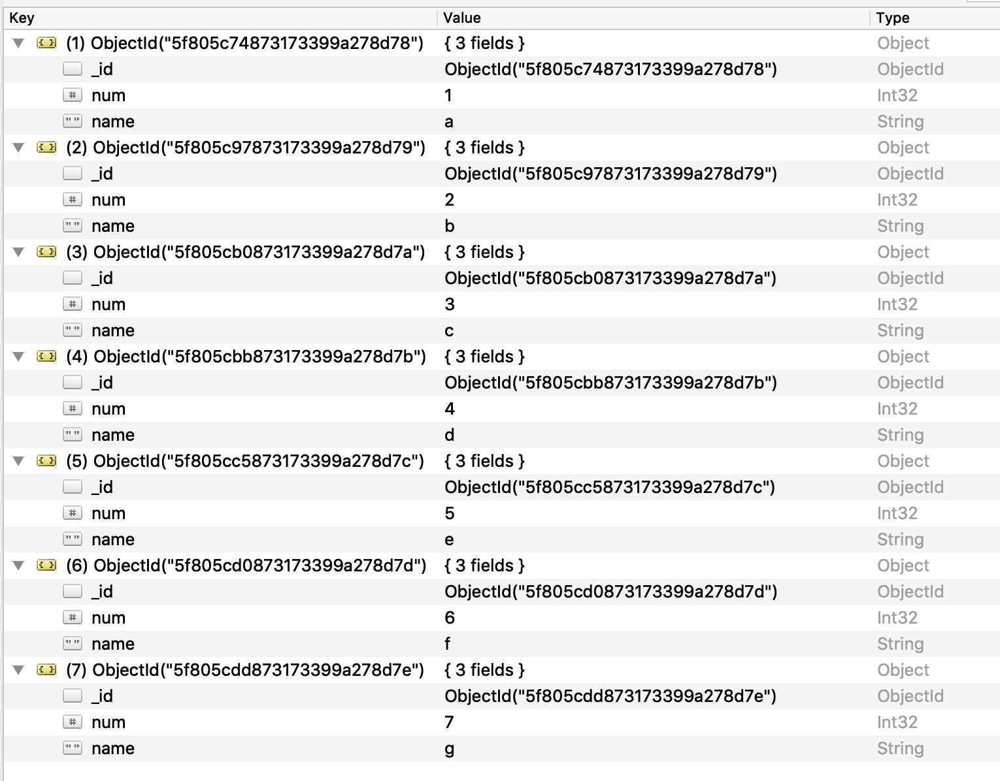

# Using MongoDB as a source for AWS DMS

For information about versions of MongoDB that AWS DMS supports as a source, see
[Sources for AWS DMS](CHAP_Introduction.md "CHAP_Introduction.md").

Note the following about MongoDB version support:

- Versions of AWS DMS 3.4.5 and later support MongoDB versions 4.2 and 4.4.
- Versions of AWS DMS 3.4.5 and later
  and versions of MongoDB 4.2 and later support distributed transactions. For more information on MongoDB
  distributed transactions, see [Transactions](https://docs.mongodb.com/manual/core/transactions/ "https://docs.mongodb.com/manual/core/transactions/") in the [MongoDB documentation](https://www.mongodb.com/docs/ "https://www.mongodb.com/docs/").
- Versions of AWS DMS 3.5.0 and later don't support versions of MongoDB prior to 3.6.
- Versions of AWS DMS 3.5.1 and later support MongoDB version 5.0.
- Versions of AWS DMS 3.5.2 and later support MongoDB version 6.0.
- Versions of AWS DMS 3.5.4 and later support MongoDB version 7.0.
  If you are new to MongoDB, be aware of the following important MongoDB database
  concepts:

- A record in MongoDB is a _document_, which is
  a data structure composed of field and value pairs. The value of a field can
  include other documents, arrays, and arrays of documents. A document is roughly
  equivalent to a row in a relational database table.
- A _collection_ in MongoDB is a group of documents, and is
  roughly equivalent to a relational database table.
- A _database_ in MongoDB is a set of collections, and is
  roughly equivalent to a schema in a relational database.
- Internally, a MongoDB document is stored as a binary JSON (BSON) file in a
  compressed format that includes a type for each field in the document. Each
  document has a unique ID.
  AWS DMS supports two migration modes when using MongoDB as a source, _Document mode_ or _Table
  mode_. You specify which migration mode to use when you create the MongoDB
  endpoint or by setting the **Metadata mode** parameter from the AWS DMS
  console. Optionally, you can create a second column named `_id` that acts as
  the primary key by selecting the check mark button for **\_id as a separate
  column** in the endpoint configuration panel.

Your choice of migration mode affects the resulting format of the target data, as
explained following.

**Document mode**

In document mode, the MongoDB document is migrated as is, meaning that the
document data is consolidated into a single column named `_doc`
in a target table. Document mode is the default setting when you use MongoDB
as a source endpoint.

For example, consider the following documents in a MongoDB collection
called myCollection.

```
> db.myCollection.find()
{ "_id" : ObjectId("5a94815f40bd44d1b02bdfe0"), "a" : 1, "b" : 2, "c" : 3 }
{ "_id" : ObjectId("5a94815f40bd44d1b02bdfe1"), "a" : 4, "b" : 5, "c" : 6 }
```

After migrating the data to a relational database table using document
mode, the data is structured as follows. The data fields in the MongoDB
document are consolidated into the `_doc` column.

|                          |                                 |
| ------------------------ | ------------------------------- |
| oid_id                   | \_doc                           |
| 5a94815f40bd44d1b02bdfe0 | `{ "a" : 1, "b" : 2, "c" : 3 }` |
| 5a94815f40bd44d1b02bdfe1 | `{ "a" : 4, "b" : 5, "c" : 6 }` |

You can optionally set the extra connection attribute
`extractDocID` to _true_ to
create a second column named `"_id"` that acts as the primary
key. If you are going to use CDC, set this parameter to _true_.

In document mode, AWS DMS manages the creation and renaming of collections
like this:

- If you add a new collection to the source database, AWS DMS creates
  a new target table for the collection and replicates any documents.
- If you rename an existing collection on the source database, AWS DMS
  doesn't rename the target table.

If the target endpoint is Amazon DocumentDB, run the migration in **Document
mode**.

**Table mode**

In table mode, AWS DMS transforms each top-level field in a MongoDB document
into a column in the target table. If a field is nested, AWS DMS flattens the
nested values into a single column. AWS DMS then adds a key field and data
types to the target table's column set.

For each MongoDB document, AWS DMS adds each key and type to the target
table's column set. For example, using table mode, AWS DMS migrates the
previous example into the following table.

|                          |     |     |     |
| ------------------------ | --- | --- | --- |
| oid_id                   | a   | b   | c   |
| 5a94815f40bd44d1b02bdfe0 | 1   | 2   | 3   |
| 5a94815f40bd44d1b02bdfe1 | 4   | 5   | 6   |

Nested values are flattened into a column containing dot-separated key
names. The column is named the concatenation of the flattened field names
separated by periods. For example, AWS DMS migrates a JSON document with a
field of nested values such as `{"a" : {"b" : {"c": 1}}}` into a
column named `a.b.c.`

To create the target columns, AWS DMS scans a specified number of MongoDB
documents and creates a set of all the fields and their types. AWS DMS then
uses this set to create the columns of the target table. If you create or
modify your MongoDB source endpoint using the console, you can specify the
number of documents to scan. The default value is 1000 documents. If you use
the AWS CLI, you can use the extra connection attribute
`docsToInvestigate`.

In table mode, AWS DMS manages documents and collections like this:

- When you add a document to an existing collection, the document is
  replicated. If there are fields that don't exist in the target,
  those fields aren't replicated.
- When you update a document, the updated document is replicated. If
  there are fields that don't exist in the target, those fields
  aren't replicated.
- Deleting a document is fully supported.
- Adding a new collection doesn't result in a new table on the
  target when done during a CDC task.
- In the Change Data Capture(CDC) phase, AWS DMS doesn't support renaming a collection.

###### Topics

- [Permissions needed when using
  MongoDB as a source for AWS DMS](#CHAP_Source.MongoDB.PrerequisitesCDC "#CHAP_Source.MongoDB.PrerequisitesCDC")
- [Configuring a
  MongoDB replica set for CDC](#CHAP_Source.MongoDB.PrerequisitesCDC.ReplicaSet "#CHAP_Source.MongoDB.PrerequisitesCDC.ReplicaSet")
- [Security requirements when using
  MongoDB as a source for AWS DMS](#CHAP_Source.MongoDB.Security "#CHAP_Source.MongoDB.Security")
- [Segmenting MongoDB collections
  and migrating in parallel](#CHAP_Source.MongoDB.ParallelLoad "#CHAP_Source.MongoDB.ParallelLoad")
- [Migrating multiple databases
  when using MongoDB as a source for AWS DMS](#CHAP_Source.MongoDB.Multidatabase "#CHAP_Source.MongoDB.Multidatabase")
- [Limitations when using MongoDB as
  a source for AWS DMS](#CHAP_Source.MongoDB.Limitations "#CHAP_Source.MongoDB.Limitations")
- [Endpoint configuration settings
  when using MongoDB as a source for AWS DMS](#CHAP_Source.MongoDB.Configuration "#CHAP_Source.MongoDB.Configuration")
- [Source data types for
  MongoDB](#CHAP_Source.MongoDB.DataTypes "#CHAP_Source.MongoDB.DataTypes")

## Permissions needed when using

MongoDB as a source for AWS DMS

For an AWS DMS migration with a MongoDB source, you can create either a user account
with root privileges, or a user with permissions only on the database to migrate.

The following code creates a user to be the root account.

```
use admin
db.createUser(
  {
    user: "root",
    pwd: "`password`",
    roles: [ { role: "root", db: "admin" } ]
  }
)
```

For a MongoDB 3.x source, the following code creates a user with minimal
privileges on the database to be migrated.

```
use `database_to_migrate`
db.createUser(
{
    user: "`dms-user`",
    pwd: "`password`",
    roles: [ { role: "read", db: "local" }, "read"]
})
```

For a MongoDB 4.x source, the following code creates a user with minimal
privileges.

```
{ resource: { db: "", collection: "" }, actions: [ "find", "changeStream" ] }
```

For example, create the following role in the "admin" database.

```
use admin
db.createRole(
{
role: "changestreamrole",
privileges: [
{ resource: { db: "", collection: "" }, actions: [ "find","changeStream" ] }
],
roles: []
}
)
```

And once the role is created, create a user in the database to be migrated.

```
> use test
> db.createUser(
{
user: "dms-user12345",
pwd: "password",
roles: [ { role: "changestreamrole", db: "admin" }, "read"]
})
```

## Configuring a

MongoDB replica set for CDC

To use ongoing replication or CDC with MongoDB, AWS DMS requires access to the
MongoDB operations log (oplog). To create the oplog, you need to deploy a replica
set if one doesn't exist. For more information, see [the MongoDB
documentation](https://docs.mongodb.com/manual/tutorial/deploy-replica-set/ "https://docs.mongodb.com/manual/tutorial/deploy-replica-set/").

You can use CDC with either the primary or secondary node of a MongoDB replica set
as the source endpoint.

###### To convert a standalone instance to a replica set

1. Using the command line, connect to `mongo`.

```
mongo localhost
```

2. Stop the `mongod` service.

```
service mongod stop
```

3. Restart `mongod` using the following command:

```
mongod --replSet "rs0" --auth -port `port_number`
```

4. Test the connection to the replica set using the following
   commands:

```
mongo -u root -p `password` --host rs0/localhost:`port_number`
  --authenticationDatabase "admin"
```

If you plan to perform a document mode migration, select option `_id as a
 separate column` when you create the MongoDB endpoint. Selecting this
option creates a second column named `_id` that acts as the primary key.
This second column is required by AWS DMS to support data manipulation language (DML)
operations.

###### Note

AWS DMS uses the operations log (oplog) to capture changes during ongoing replication.
If MongoDB flushes out the records from the oplog before AWS DMS reads them, your tasks fail.
We recommend sizing the oplog to retain changes for at least 24 hours.

## Security requirements when using

MongoDB as a source for AWS DMS

AWS DMS supports two authentication methods for MongoDB. The two authentication
methods are used to encrypt the password, so they are only used when the
`authType` parameter is set to _PASSWORD_.

The MongoDB authentication methods are as follows:

- **MONGODB-CR** – For backward compatibility
- **SCRAM-SHA-1** – The default when using MongoDB
  version 3.x and 4.0

If an authentication method isn't specified, AWS DMS uses the default
method for the version of the MongoDB source.

## Segmenting MongoDB collections

and migrating in parallel

To improve performance of a migration task, MongoDB source endpoints support two
options for parallel full load in table mapping.

In other words, you can migrate a collection in parallel by using either
autosegmentation or range segmentation with table mapping for a parallel full load
in JSON settings. With autosegmentation, you can specify the criteria for AWS DMS to
automatically segment your source for migration in each thread. With range
segmentation, you can tell AWS DMS the specific range of each segment for DMS to
migrate in each thread. For more information on these settings, see [Table and collection settings rules and operations](CHAP_Tasks.CustomizingTasks.TableMapping.SelectionTransformation.md "CHAP_Tasks.CustomizingTasks.TableMapping.SelectionTransformation.md").

### Migrating a

MongoDB database in parallel using autosegmentation ranges

You can migrate your documents in parallel by specifying the criteria for
AWS DMS to automatically partition (segment) your data for each thread. In
particular, you specify the number of documents to migrate per thread. Using
this approach, AWS DMS attempts to optimize segment boundaries for maximum
performance per thread.

You can specify the segmentation criteria using the table-settings options
following in table mapping.

| Table-settings option              | Description                                                                                                                                                                                                                                                                                                                                                                                                          |
| ---------------------------------- | -------------------------------------------------------------------------------------------------------------------------------------------------------------------------------------------------------------------------------------------------------------------------------------------------------------------------------------------------------------------------------------------------------------------- |
| `"type"`                           | (Required) Set to `"partitions-auto"` for<br>MongoDB as a source.                                                                                                                                                                                                                                                                                                                                                    |
| `"number-of-partitions"`           | (Optional) Total number of partitions (segments) used for<br>migration. The default is 16.                                                                                                                                                                                                                                                                                                                           |
| `"collection-count-from-metadata"` | (Optional) If this option is set to `true`,<br>AWS DMS uses an estimated collection count for determining the<br>number of partitions. If this option is set to<br>`false`, AWS DMS uses the actual collection<br>count. The default is `true`.                                                                                                                                                                      |
| `"max-records-skip-per-page"`      | (Optional) The number of records to skip at once when<br>determining the boundaries for each partition. AWS DMS uses a<br>paginated skip approach to determine the minimum boundary<br>for a partition. The default is 10,000.<br>Setting a relatively large value can result in cursor<br>timeouts and task failures. Setting a relatively low value<br>results in more operations per page and a slower full load. |
| `"batch-size"`                     | (Optional) Limits the number of documents returned in one<br>batch. Each batch requires a round trip to the server. If<br>the batch size is zero (0), the cursor uses the<br>server-defined maximum batch size. The default is 0.                                                                                                                                                                                    |

The example following shows a table mapping for autosegmentation.

```
{
    "rules": [
        {
            "rule-type": "selection",
            "rule-id": "1",
            "rule-name": "1",
            "object-locator": {
                "schema-name": "admin",
                "table-name": "departments"
            },
            "rule-action": "include",
            "filters": []
        },
        {
            "rule-type": "table-settings",
            "rule-id": "2",
            "rule-name": "2",
            "object-locator": {
                "schema-name": "admin",
                "table-name": "departments"
            },
            "parallel-load": {
                "type": "partitions-auto",
                "number-of-partitions": 5,
                "collection-count-from-metadata": "true",
                "max-records-skip-per-page": 1000000,
                "batch-size": 50000
            }
        }
    ]
}
```

Autosegmentation has the limitation following. The migration for each segment
fetches the collection count and the minimum `_id` for the collection
separately. It then uses a paginated skip to calculate the minimum boundary for
that segment.

Therefore, ensure that the minimum `_id` value for each collection
remains constant until all the segment boundaries in the collection are
calculated. If you change the minimum `_id` value for a collection
during its segment boundary calculation, it can cause data loss or duplicate row
errors.

### Migrating a MongoDB

database in parallel using range segmentation

You can migrate your documents in parallel by specifying the ranges for each
segment in a thread. Using this approach, you tell AWS DMS the specific documents
to migrate in each thread according to your choice of document ranges per
thread.

The image following shows a MongoDB collection that has seven items, and
`_id` as the primary key.



To split the collection into three specific segments for AWS DMS to migrate in
parallel, you can add table mapping rules to your migration task. This approach
is shown in the following JSON example.

```
{ // Task table mappings:
  "rules": [
    {
      "rule-type": "selection",
      "rule-id": "1",
      "rule-name": "1",
      "object-locator": {
        "schema-name": "testdatabase",
        "table-name": "testtable"
      },
      "rule-action": "include"
    }, // "selection" :"rule-type"
    {
      "rule-type": "table-settings",
      "rule-id": "2",
      "rule-name": "2",
      "object-locator": {
        "schema-name": "testdatabase",
        "table-name": "testtable"
      },
      "parallel-load": {
        "type": "ranges",
        "columns": [
           "_id",
           "num"
        ],
        "boundaries": [
          // First segment selects documents with _id less-than-or-equal-to 5f805c97873173399a278d79
          // and num less-than-or-equal-to 2.
          [
             "5f805c97873173399a278d79",
             "2"
          ],
          // Second segment selects documents with _id > 5f805c97873173399a278d79 and
          // _id less-than-or-equal-to 5f805cc5873173399a278d7c and
          // num > 2 and num less-than-or-equal-to 5.
          [
             "5f805cc5873173399a278d7c",
             "5"
          ]
          // Third segment is implied and selects documents with _id > 5f805cc5873173399a278d7c.
        ] // :"boundaries"
      } // :"parallel-load"
    } // "table-settings" :"rule-type"
  ] // :"rules"
} // :Task table mappings

```

That table mapping definition splits the source collection into three segments
and migrates in parallel. The following are the segmentation boundaries.

```

Data with _id less-than-or-equal-to "5f805c97873173399a278d79" and num less-than-or-equal-to 2 (2 records)
Data with _id > "5f805c97873173399a278d79" and num > 2 and _id  less-than-or-equal-to "5f805cc5873173399a278d7c" and num less-than-or-equal-to 5 (3 records)
Data with _id > "5f805cc5873173399a278d7c" and num > 5 (2 records)

```

After the migration task is complete, you can verify from the task logs that
the tables loaded in parallel, as shown in the following example. You can also
verify the MongoDB `find` clause used to unload each segment from the
source table.

```

[TASK_MANAGER    ] I:  Start loading segment #1 of 3 of table 'testdatabase'.'testtable' (Id = 1) by subtask 1. Start load timestamp 0005B191D638FE86  (replicationtask_util.c:752)

[SOURCE_UNLOAD   ] I:  Range Segmentation filter for Segment #0 is initialized.   (mongodb_unload.c:157)

[SOURCE_UNLOAD   ] I:  Range Segmentation filter for Segment #0 is: { "_id" : { "$lte" : { "$oid" : "5f805c97873173399a278d79" } }, "num" : { "$lte" : { "$numberInt" : "2" } } }  (mongodb_unload.c:328)

[SOURCE_UNLOAD   ] I: Unload finished for segment #1 of segmented table 'testdatabase'.'testtable' (Id = 1). 2 rows sent.

[TASK_MANAGER    ] I: Start loading segment #1 of 3 of table 'testdatabase'.'testtable' (Id = 1) by subtask 1. Start load timestamp 0005B191D638FE86 (replicationtask_util.c:752)

[SOURCE_UNLOAD   ] I: Range Segmentation filter for Segment #0 is initialized. (mongodb_unload.c:157)

[SOURCE_UNLOAD   ] I: Range Segmentation filter for Segment #0 is: { "_id" : { "$lte" : { "$oid" : "5f805c97873173399a278d79" } }, "num" : { "$lte" : { "$numberInt" : "2" } } } (mongodb_unload.c:328)

[SOURCE_UNLOAD   ] I: Unload finished for segment #1 of segmented table 'testdatabase'.'testtable' (Id = 1). 2 rows sent.

[TARGET_LOAD     ] I: Load finished for segment #1 of segmented table 'testdatabase'.'testtable' (Id = 1). 1 rows received. 0 rows skipped. Volume transfered 480.

[TASK_MANAGER    ] I: Load finished for segment #1 of table 'testdatabase'.'testtable' (Id = 1) by subtask 1. 2 records transferred.

```

Currently, AWS DMS supports the following MongoDB data types as a segment key
column:

- Double
- String
- ObjectId
- 32 bit integer
- 64 bit integer

## Migrating multiple databases

when using MongoDB as a source for AWS DMS

AWS DMS versions 3.4.5 and higher support migrating multiple databases in a single
task for all supported MongoDB versions. If you want to migrate multiple databases,
take these steps:

1. When you create the MongoDB source endpoint, do one of the
   following:
   - On the DMS console's **Create
     endpoint** page, make sure that **Database name** is empty under **Endpoint configuration**.
   - Using the AWS CLI `CreateEndpoint` command, assign an
     empty string value to the `DatabaseName` parameter in
     `MongoDBSettings`.

2. For each database that you want to migrate from a MongoDB source, specify
   the database name as a schema name in the table mapping for the task. You
   can do this using either the guided input in the console or directly in
   JSON. For more information on the guided input, see [Specifying table
   selection and transformations rules from the console](CHAP_Tasks.CustomizingTasks.TableMapping.md "CHAP_Tasks.CustomizingTasks.TableMapping.md"). For
   more information on the JSON, see [Selection rules and actions](CHAP_Tasks.CustomizingTasks.TableMapping.SelectionTransformation.md "CHAP_Tasks.CustomizingTasks.TableMapping.SelectionTransformation.md").

For example, you might specify the JSON following to migrate three MongoDB
databases.

###### Example Migrate all tables in a schema

The JSON following migrates all tables from the `Customers`,
`Orders`, and `Suppliers` databases in your source
endpoint to your target endpoint.

```
{
    "rules": [
        {
            "rule-type": "selection",
            "rule-id": "1",
            "rule-name": "1",
            "object-locator": {
                "schema-name": "Customers",
                "table-name": "%"
            },
            "rule-action": "include",
            "filters": []
        },
        {
            "rule-type": "selection",
            "rule-id": "2",
            "rule-name": "2",
            "object-locator": {
                "schema-name": "Orders",
                "table-name": "%"
            },
            "rule-action": "include",
            "filters": []
        },
        {
            "rule-type": "selection",
            "rule-id": "3",
            "rule-name": "3",
            "object-locator": {
                "schema-name": "Inventory",
                "table-name": "%"
            },
            "rule-action": "include",
            "filters": []
        }
    ]
}
```

## Limitations when using MongoDB as

a source for AWS DMS

The following are limitations when using MongoDB as a source for AWS DMS:

- In table mode, the documents in a collection must be consistent in the data type
  that they use for the value in the same field. For example, if a document in a collection
  includes `'{ a:{ b:*value* ... }'`, all documents in the
  collection that reference the `*value*` of the `a.b`
  field must use the same data type for `*value*`, wherever it
  appears in the collection.
- When the `_id` option is set as a separate column, the ID
  string can't exceed 200 characters.
- Object ID and array type keys are converted to columns that are prefixed
  with `oid` and `array` in table mode.

Internally, these columns are referenced with the prefixed names. If you
use transformation rules in AWS DMS that reference these columns, make sure to
specify the prefixed column. For example, you specify
`${oid__id}` and not `${_id}`, or
`${array__addresses}` and not `${_addresses}`.

- Collection names and key names can't include the dollar symbol ($).
- AWS DMS doesn't support collections containing the same field with different case (upper, lower)
  in table mode with a RDBMS target. For example, AWS DMS does not support having two collections
  named `Field1` and `field1`.
- Table mode and document mode have the limitations described
  preceding.
- Migrating in parallel using autosegmentation has the limitations described
  preceding.
- Source filters aren't supported for MongoDB.
- AWS DMS doesn't support documents where the nesting level is greater than 97.
- AWS DMS requires UTF-8 encoded source data when migrating to non-DocumentDB targets. For sources
  with non-UTF-8 characters, convert them to UTF-8 before migration or migrate to Amazon DocumentDB instead.
- AWS DMS doesn't support the following features of MongoDB version 5.0:
  - Live resharding
  - Client-Side Field Level Encryption (CSFLE)
  - Timeseries collection migration

  ###### Note

  A timeseries collection migrated in the full-load phase will be converted to a normal
  collection in Amazon DocumentDB, because DocumentDB doesn't support timeseries collections.

## Endpoint configuration settings

when using MongoDB as a source for AWS DMS

When you set up your MongoDB source endpoint, you can specify multiple endpoint
configuration settings using the AWS DMS console.

The following table describes the configuration settings available when using
MongoDB databases as an AWS DMS source.

| Setting (attribute)                                      | Valid values                                     | Default value and description                                                                                                                                                                                                                                                                                                     |
| -------------------------------------------------------- | ------------------------------------------------ | --------------------------------------------------------------------------------------------------------------------------------------------------------------------------------------------------------------------------------------------------------------------------------------------------------------------------------- |
| **Authentication mode**                                  | `"none"`<br>`"password"`                         | The value `"password"` prompts for a user name and<br>password. When `"none"` is specified, user name and<br>password parameters aren't used.                                                                                                                                                                                     |
| **Authentication source**                                | A valid MongoDB database name.                   | The name of the MongoDB database that you want to use to validate<br>your credentials for authentication. The default value is<br>`"admin"`.                                                                                                                                                                                      |
| **Authentication mechanism**                             | `"default"`<br>`"mongodb_cr"`<br>`"scram_sha_1"` | The authentication mechanism. The value `"default"` is<br>`"scram_sha_1"`. This setting isn't used when<br>`authType` is set to `"no"`.                                                                                                                                                                                           |
| **Metadata mode**                                        | Document and table                               | Chooses document mode or table mode.                                                                                                                                                                                                                                                                                              |
| **Number of documents to scan**<br>(`docsToInvestigate`) | A positive integer greater than `0`.             | Use this option in table mode only to define the target table<br>definition.                                                                                                                                                                                                                                                      |
| **\_id as a separate column**                            | Check mark in box                                | Optional check mark box that creates a second column named<br>`_id` that acts as the primary key.                                                                                                                                                                                                                                 |
| `socketTimeoutMS`                                        | NUMBER<br>Extra Connection Attribute (ECA) only. | This setting is in units of milliseconds and configures the<br>connection timeout for MongoDB clients. If the value is less than or<br>equal to zero, then the MongoDB client default is used.                                                                                                                                    |
| `UseUpdateLookUp`                                        | boolean<br>`true`<br>`false`                     | When true, during CDC update events, AWS DMS copies over the entire<br>updated document to the target. When set to false, AWS DMS uses the<br>MongoDB update command to only update modified fields in the<br>document on the target.                                                                                             |
| `ReplicateShardCollections`                              | boolean<br>`true`<br>`false`                     | When true, AWS DMS replicates data to shard collections. AWS DMS only<br>uses this setting if the target endpoint is a DocumentDB elastic<br>cluster.<br>When this setting is true, note the following:<br>• You must set `TargetTablePrepMode` to<br>`nothing`.<br>• AWS DMS automatically sets `useUpdateLookup` to<br>`false`. |
| `useTransactionVerification`                             | `true`<br>`false`                                | When `false`, disables the verification between the<br>change stream and oplogs.<br>NoteYou can miss operations if discrepancies between change<br>streams and oplog entries occur, as the default DMS behavior is<br>to fail the task in such scenarios. Default:<br>`true`.                                                     |
| `useOplog`                                               | `true`<br>`false`                                | When `true`, enables DMS task to read directly from<br>'oplog' rather than using the change stream. Default:<br>`false`.                                                                                                                                                                                                          |

If you choose **Document** as **Metadata mode**,
different options are available.

If the target endpoint is DocumentDB, make sure to run the migration in
**Document mode** Also, modify your source endpoint and select the
option **\_id as separate column**. This is a mandatory prerequisite if
your source MongoDB workload involves transactions.

## Source data types for

MongoDB

Data migration that uses MongoDB as a source for AWS DMS supports most MongoDB data
types. In the following table, you can find the MongoDB source data types that are
supported when using AWS DMS and the default mapping from AWS DMS data types. For more
information about MongoDB data types, see [BSON types](https://docs.mongodb.com/manual/reference/bson-types "https://docs.mongodb.com/manual/reference/bson-types")
in the MongoDB documentation.

For information on how to view the data type that is mapped in the target, see the
section for the target endpoint that you are using.

For additional information about AWS DMS data types, see [Data types for AWS Database Migration Service](CHAP_Reference.md "CHAP_Reference.md").

| MongoDB data types | AWS DMS data types |
| ------------------ | ------------------ |
| Boolean            | Bool               |
| Binary             | BLOB               |
| Date               | Date               |
| Timestamp          | Date               |
| Int                | INT4               |
| Long               | INT8               |
| Double             | REAL8              |
| String (UTF-8)     | CLOB               |
| Array              | CLOB               |
| OID                | String             |
| REGEX              | CLOB               |
| CODE               | CLOB               |
