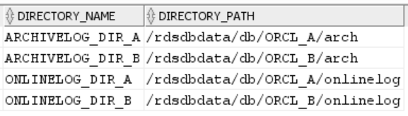

# Using an Oracle database as a source for

AWS DMS

You can migrate data from one or many Oracle databases using AWS DMS. With an Oracle
database as a source, you can migrate data to any of the targets supported by AWS DMS.

AWS DMS supports the following Oracle database editions:

- Oracle Enterprise Edition
- Oracle Standard Edition
- Oracle Express Edition
- Oracle Personal Edition
  For information about versions of Oracle databases that AWS DMS supports as a source, see
  [Sources for AWS DMS](CHAP_Introduction.md "CHAP_Introduction.md").

You can use Secure Sockets Layer (SSL) to encrypt connections between your Oracle
endpoint and your replication instance. For more information on using SSL with an Oracle
endpoint, see [SSL support for an Oracle
endpoint](#CHAP_Security.SSL.Oracle "#CHAP_Security.SSL.Oracle").

AWS DMS supports the use of Oracle transparent data encryption (TDE) to encrypt data
at rest in the source database. For more information on using Oracle TDE with an Oracle
source endpoint, see [Supported encryption methods for
using Oracle as a source for AWS DMS](#CHAP_Source.Oracle.Encryption "#CHAP_Source.Oracle.Encryption").

AWS supports the use of TLS version 1.2 and later with Oracle endpoints (and all other endpoint types), and recommends
using TLS version 1.3 or later.

Follow these steps to configure an Oracle database as an AWS DMS source endpoint:

1. Create an Oracle user with the appropriate permissions for AWS DMS to access
   your Oracle source database.
2. Create an Oracle source endpoint that conforms with your chosen Oracle
   database configuration. To create a full-load-only task, no further
   configuration is needed.
3. To create a task that handles change data capture (a CDC-only or full-load and
   CDC task), choose Oracle LogMiner or AWS DMS Binary Reader to capture data
   changes. Choosing LogMiner or Binary Reader determines some of the later
   permissions and configuration options. For a comparison of LogMiner and Binary
   Reader, see the following section.

###### Note

For more information on full-load tasks, CDC-only tasks, and full-load and CDC
tasks, see [Creating a task](CHAP_Tasks.md "CHAP_Tasks.md")

For additional details on working with Oracle source databases and AWS DMS, see the
following sections.

###### Topics

- [Using Oracle LogMiner or AWS DMS Binary
  Reader for CDC](#CHAP_Source.Oracle.CDC "#CHAP_Source.Oracle.CDC")
- [Workflows for configuring a
  self-managed or AWS-managed Oracle source database for AWS DMSConfiguring an Oracle source
  database](#CHAP_Source.Oracle.Workflows "#CHAP_Source.Oracle.Workflows")
- [Working with a self-managed Oracle
  database as a source for AWS DMS](#CHAP_Source.Oracle.Self-Managed "#CHAP_Source.Oracle.Self-Managed")
- [Working with an AWS-managed
  Oracle database as a source for AWS DMS](#CHAP_Source.Oracle.Amazon-Managed "#CHAP_Source.Oracle.Amazon-Managed")
- [Limitations on using Oracle as a
  source for AWS DMS](#CHAP_Source.Oracle.Limitations "#CHAP_Source.Oracle.Limitations")
- [SSL support for an Oracle
  endpoint](#CHAP_Security.SSL.Oracle "#CHAP_Security.SSL.Oracle")
- [Supported encryption methods for
  using Oracle as a source for AWS DMS](#CHAP_Source.Oracle.Encryption "#CHAP_Source.Oracle.Encryption")
- [Supported compression methods for
  using Oracle as a source for AWS DMS](#CHAP_Source.Oracle.Compression "#CHAP_Source.Oracle.Compression")
- [Replicating nested tables using
  Oracle as a source for AWS DMS](#CHAP_Source.Oracle.NestedTables "#CHAP_Source.Oracle.NestedTables")
- [Storing REDO on Oracle ASM
  when using Oracle as a source for AWS DMS](#CHAP_Source.Oracle.REDOonASM "#CHAP_Source.Oracle.REDOonASM")
- [Endpoint settings
  when using Oracle as a source for AWS DMS](#CHAP_Source.Oracle.ConnectionAttrib "#CHAP_Source.Oracle.ConnectionAttrib")
- [Source data types for Oracle](#CHAP_Source.Oracle.DataTypes "#CHAP_Source.Oracle.DataTypes")

## Using Oracle LogMiner or AWS DMS Binary

Reader for CDC

In AWS DMS, there are two methods for reading the redo logs when doing change data
capture (CDC) for Oracle as a source: Oracle LogMiner and AWS DMS Binary Reader.
LogMiner is an Oracle API to read the online redo logs and archived redo log files.
Binary Reader is an AWS DMS method that reads and parses the raw redo log files
directly. These methods have the following features.

| Feature                                                           | LogMiner                                                                                                                       | Binary Reader                                                                                                         |
| ----------------------------------------------------------------- | ------------------------------------------------------------------------------------------------------------------------------ | --------------------------------------------------------------------------------------------------------------------- |
| Easy to configure                                                 | Yes                                                                                                                            | No                                                                                                                    |
| Lower impact on source system I/O and CPU                         | No                                                                                                                             | Yes                                                                                                                   |
| Better CDC performance                                            | No                                                                                                                             | Yes                                                                                                                   |
| Supports Oracle table clusters                                    | Yes                                                                                                                            | No                                                                                                                    |
| Supports all types of Oracle Hybrid Columnar Compression<br>(HCC) | Yes                                                                                                                            | Partially<br>Binary Reader does not support QUERY LOW for tasks with CDC.<br>All other HCC types are fully supported. |
| LOB column support in Oracle 12c only                             | No (LOB Support is not available with LogMiner in Oracle 12c.)                                                                 | Yes                                                                                                                   |
| Supports `UPDATE` statements that affect only LOB<br>columns      | No                                                                                                                             | Yes                                                                                                                   |
| Supports Oracle transparent data encryption (TDE)                 | Partially<br>When using Oracle LogMiner, AWS DMS does not support TDE<br>encryption on column level for Amazon RDS for Oracle. | Partially<br>Binary Reader supports TDE only for self-managed Oracle<br>databases.                                    |
| Supports all Oracle compression methods                           | Yes                                                                                                                            | No                                                                                                                    |
| Supports XA transactions                                          | No                                                                                                                             | Yes                                                                                                                   |
| RAC                                                               | Yes<br>Not recommended, due to performance reasons, and some internal DMS limitations.                                         | Yes<br>Highly recommended                                                                                             |

###### Note

By default, AWS DMS uses Oracle LogMiner for (CDC).

AWS DMS supports transparent data encryption (TDE) methods when working with an
Oracle source database. If the TDE credentials you specify are incorrect, the AWS DMS
migration task does not fail, which can impact ongoing replication of encrypted
tables. For more information about specifying TDE credentials, see [Supported encryption methods for
using Oracle as a source for AWS DMS](#CHAP_Source.Oracle.Encryption "#CHAP_Source.Oracle.Encryption").

The main advantages of using LogMiner with AWS DMS include the following:

- LogMiner supports most Oracle options, such as encryption options and
  compression options. Binary Reader does not support all Oracle options,
  particularly compression and most options for encryption.
- LogMiner offers a simpler configuration, especially compared to Binary
  Reader direct-access setup or when the redo logs are managed using Oracle
  Automatic Storage Management (ASM).
- LogMiner supports table clusters for use by AWS DMS. Binary Reader does
  not.

The main advantages of using Binary Reader with AWS DMS include the
following:

- For migrations with a high volume of changes, LogMiner might have some I/O
  or CPU impact on the computer hosting the Oracle source database. Binary
  Reader has less chance of having I/O or CPU impact because logs are mined directly
  rather than making multiple database queries.
- For migrations with a high volume of changes, CDC performance is usually
  much better when using Binary Reader compared with using Oracle
  LogMiner.
- Binary Reader supports CDC for LOBs in Oracle version 12c. LogMiner does
  not.

In general, use Oracle LogMiner for migrating your Oracle database unless you have
one of the following situations:

- You need to run several migration tasks on the source Oracle
  database.
- The volume of changes or the redo log volume on the source Oracle database
  is high, or you have changes and are also using Oracle ASM.

###### Note

If you change between using Oracle LogMiner and AWS DMS Binary Reader, make sure
to restart the CDC task.

### Configuration for CDC on

an Oracle source database

For an Oracle source endpoint to connect to the database for a change data
capture (CDC) task, you might need to specify extra connection attributes. This
can be true for either a full-load and CDC task or for a CDC-only task. The
extra connection attributes that you specify depend on the method you use to
access the redo logs: Oracle LogMiner or AWS DMS Binary Reader.

You specify extra connection attributes when you create a source endpoint. If
you have multiple connection attribute settings, separate them from each other
by semicolons with no additional white space (for example,
`oneSetting;thenAnother`).

AWS DMS uses LogMiner by default. You don't have to specify additional
extra connection attributes to use it.

To use Binary Reader to access the redo logs, add the following extra
connection attributes.

```
useLogMinerReader=N;useBfile=Y;

```

Use the following format for the extra connection attributes to access a
server that uses ASM with Binary Reader.

```
useLogMinerReader=N;useBfile=Y;asm_user=`asm_username`;asm_server=`RAC_server_ip_address`:`port_number`/+ASM;

```

Set the source endpoint `Password` request parameter to both the
Oracle user password and the ASM password, separated by a comma as
follows.

```
`oracle_user_password`,`asm_user_password`

```

Where the Oracle source uses ASM, you can work with high-performance options
in Binary Reader for transaction processing at scale. These options include
extra connection attributes to specify the number of parallel threads
(`parallelASMReadThreads`) and the number of read-ahead buffers
(`readAheadBlocks`). Setting these attributes together can
significantly improve the performance of the CDC task. The following settings
provide good results for most ASM configurations.

```
useLogMinerReader=N;useBfile=Y;asm_user=asm_username;asm_server=RAC_server_ip_address:port_number/+ASM;
    parallelASMReadThreads=6;readAheadBlocks=150000;
```

For more information on values that extra connection attributes support, see
[Endpoint settings
when using Oracle as a source for AWS DMS](#CHAP_Source.Oracle.ConnectionAttrib "#CHAP_Source.Oracle.ConnectionAttrib").

In addition, the performance of a CDC task with an Oracle source that uses ASM
depends on other settings that you choose. These settings include your AWS DMS
extra connection attributes and the SQL settings to configure the Oracle source.
For more information on extra connection attributes for an Oracle source using
ASM, see [Endpoint settings
when using Oracle as a source for AWS DMS](#CHAP_Source.Oracle.ConnectionAttrib "#CHAP_Source.Oracle.ConnectionAttrib")

You also need to choose an appropriate CDC start point. Typically when you do
this, you want to identify the point of transaction processing that captures the
earliest open transaction to begin CDC from. Otherwise, the CDC task can miss
earlier open transactions. For an Oracle source database, you can choose a CDC
native start point based on the Oracle system change number (SCN) to identify
this earliest open transaction. For more information, see [Performing replication starting from a
CDC start point](CHAP_Task.md#CHAP_Task.CDC.StartPoint "CHAP_Task.md#CHAP_Task.CDC.StartPoint").

For more information on configuring CDC for a self-managed Oracle database as
a source, see [Account
privileges required when using Oracle LogMiner to access the redo
logs](#CHAP_Source.Oracle.Self-Managed.LogMinerPrivileges "#CHAP_Source.Oracle.Self-Managed.LogMinerPrivileges"), [Account
privileges required when using AWS DMS Binary Reader to access the redo
logs](#CHAP_Source.Oracle.Self-Managed.BinaryReaderPrivileges "#CHAP_Source.Oracle.Self-Managed.BinaryReaderPrivileges"),
and [Additional
account privileges required when using Binary Reader with Oracle ASM](#CHAP_Source.Oracle.Self-Managed.ASMBinaryPrivileges "#CHAP_Source.Oracle.Self-Managed.ASMBinaryPrivileges").

For more information on configuring CDC for an AWS-managed Oracle database
as a source, see [Configuring a CDC task
to use Binary Reader with an RDS for Oracle source for AWS DMS](#CHAP_Source.Oracle.Amazon-Managed.CDC "#CHAP_Source.Oracle.Amazon-Managed.CDC") and [Using an Amazon RDS
Oracle Standby (read replica) as a source with Binary Reader for CDC in
AWS DMS](#CHAP_Source.Oracle.Amazon-Managed.StandBy "#CHAP_Source.Oracle.Amazon-Managed.StandBy").

## Workflows for configuring a

self-managed or AWS-managed Oracle source database for AWS DMS

## Configuring an Oracle source

database

To configure a self-managed source database instance, use the following workflow steps
, depending on how you perform CDC.

| For this workflow step                                                                                       | If you perform CDC using LogMiner, do this                                                                                                                                                             | If you perform CDC using Binary Reader, do this                                                                                                                                                                      |
| ------------------------------------------------------------------------------------------------------------ | ------------------------------------------------------------------------------------------------------------------------------------------------------------------------------------------------------ | -------------------------------------------------------------------------------------------------------------------------------------------------------------------------------------------------------------------- |
| Grant Oracle account privileges.                                                                             | See [User account<br>privileges required on a self-managed Oracle source for AWS DMS](#CHAP_Source.Oracle.Self-Managed.Privileges "#CHAP_Source.Oracle.Self-Managed.Privileges").                      | See [User account<br>privileges required on a self-managed Oracle source for AWS DMS](#CHAP_Source.Oracle.Self-Managed.Privileges "#CHAP_Source.Oracle.Self-Managed.Privileges").                                    |
| Prepare the source database for replication using CDC.                                                       | See [Preparing an<br>Oracle self-managed source database for CDC using AWS DMS](#CHAP_Source.Oracle.Self-Managed.Configuration "#CHAP_Source.Oracle.Self-Managed.Configuration").                      | See [Preparing an<br>Oracle self-managed source database for CDC using AWS DMS](#CHAP_Source.Oracle.Self-Managed.Configuration "#CHAP_Source.Oracle.Self-Managed.Configuration").                                    |
| Grant additional Oracle user privileges required for CDC.                                                    | See [Account<br>privileges required when using Oracle LogMiner to access the redo<br>logs](#CHAP_Source.Oracle.Self-Managed.LogMinerPrivileges "#CHAP_Source.Oracle.Self-Managed.LogMinerPrivileges"). | See [Account<br>privileges required when using AWS DMS Binary Reader to access the redo<br>logs](#CHAP_Source.Oracle.Self-Managed.BinaryReaderPrivileges "#CHAP_Source.Oracle.Self-Managed.BinaryReaderPrivileges"). |
| For an Oracle instance with ASM, grant additional user account<br>privileges required to access ASM for CDC. | No additional action. AWS DMS supports Oracle ASM without<br>additional account privileges.                                                                                                            | See [Additional<br>account privileges required when using Binary Reader with Oracle ASM](#CHAP_Source.Oracle.Self-Managed.ASMBinaryPrivileges "#CHAP_Source.Oracle.Self-Managed.ASMBinaryPrivileges").               |
| If you haven't already done so, configure the task to use<br>LogMiner or Binary Reader for CDC.              | See [Using Oracle LogMiner or AWS DMS Binary<br>Reader for CDC](#CHAP_Source.Oracle.CDC "#CHAP_Source.Oracle.CDC").                                                                                    | See [Using Oracle LogMiner or AWS DMS Binary<br>Reader for CDC](#CHAP_Source.Oracle.CDC "#CHAP_Source.Oracle.CDC").                                                                                                  |
| Configure Oracle Standby as a source for CDC.                                                                | AWS DMS does not support Oracle Standby as a source.                                                                                                                                                   | See [Using a<br>self-managed Oracle Standby as a source with Binary Reader for CDC in<br>AWS DMS](#CHAP_Source.Oracle.Self-Managed.BinaryStandby "#CHAP_Source.Oracle.Self-Managed.BinaryStandby").                  |

Use the following workflow steps to configure an AWS-managed Oracle source
database instance.

| For this workflow step                                                                          | If you perform CDC using LogMiner, do this                                                                                                                                                                  | If you perform CDC using Binary Reader, do this                                                                                                                                                                                 |
| ----------------------------------------------------------------------------------------------- | ----------------------------------------------------------------------------------------------------------------------------------------------------------------------------------------------------------- | ------------------------------------------------------------------------------------------------------------------------------------------------------------------------------------------------------------------------------- |
| Grant Oracle account privileges.                                                                | For more information, see [User account<br>privileges required on an AWS-managed Oracle source for AWS DMS](#CHAP_Source.Oracle.Amazon-Managed.Privileges "#CHAP_Source.Oracle.Amazon-Managed.Privileges"). | For more information, see [User account<br>privileges required on an AWS-managed Oracle source for AWS DMS](#CHAP_Source.Oracle.Amazon-Managed.Privileges "#CHAP_Source.Oracle.Amazon-Managed.Privileges").                     |
| Prepare the source database for replication using CDC.                                          | For more information, see [Configuring<br>an AWS-managed Oracle source for AWS DMS](#CHAP_Source.Oracle.Amazon-Managed.Configuration "#CHAP_Source.Oracle.Amazon-Managed.Configuration").                   | For more information, see [Configuring<br>an AWS-managed Oracle source for AWS DMS](#CHAP_Source.Oracle.Amazon-Managed.Configuration "#CHAP_Source.Oracle.Amazon-Managed.Configuration").                                       |
| Grant additional Oracle user privileges required for CDC.                                       | No additional account privileges are required.                                                                                                                                                              | For more information, see [Configuring a CDC task<br>to use Binary Reader with an RDS for Oracle source for AWS DMS](#CHAP_Source.Oracle.Amazon-Managed.CDC "#CHAP_Source.Oracle.Amazon-Managed.CDC").                          |
| If you haven't already done so, configure the task to use<br>LogMiner or Binary Reader for CDC. | For more information, see [Using Oracle LogMiner or AWS DMS Binary<br>Reader for CDC](#CHAP_Source.Oracle.CDC "#CHAP_Source.Oracle.CDC").                                                                   | For more information, see [Using Oracle LogMiner or AWS DMS Binary<br>Reader for CDC](#CHAP_Source.Oracle.CDC "#CHAP_Source.Oracle.CDC").                                                                                       |
| Configure Oracle Standby as a source for CDC.                                                   | AWS DMS does not support Oracle Standby as a source.                                                                                                                                                        | For more information, see [Using an Amazon RDS<br>Oracle Standby (read replica) as a source with Binary Reader for CDC in<br>AWS DMS](#CHAP_Source.Oracle.Amazon-Managed.StandBy "#CHAP_Source.Oracle.Amazon-Managed.StandBy"). |

## Working with a self-managed Oracle

database as a source for AWS DMS

A _self-managed database_ is a database that you
configure and control, either a local on-premises database instance or a database on
Amazon EC2. Following, you can find out about the privileges and configurations you need
when using a self-managed Oracle database with AWS DMS.

### User account

privileges required on a self-managed Oracle source for AWS DMS

To use an Oracle database as a source in AWS DMS, grant the following privileges
to the Oracle user specified in the Oracle endpoint connection settings.

###### Note

When granting privileges, use the actual name of objects, not the synonym
for each object. For example, use `V_$OBJECT` including the
underscore, not `V$OBJECT` without the underscore.

```
GRANT CREATE SESSION TO `dms_user`;
GRANT SELECT ANY TRANSACTION TO `dms_user`;
GRANT SELECT ON V_$ARCHIVED_LOG TO `dms_user`;
GRANT SELECT ON V_$LOG TO `dms_user`;
GRANT SELECT ON V_$LOGFILE TO `dms_user`;
GRANT SELECT ON V_$LOGMNR_LOGS TO `dms_user`;
GRANT SELECT ON V_$LOGMNR_CONTENTS TO `dms_user`;
GRANT SELECT ON V_$DATABASE TO `dms_user`;
GRANT SELECT ON V_$THREAD TO `dms_user`;
GRANT SELECT ON V_$PARAMETER TO `dms_user`;
GRANT SELECT ON V_$NLS_PARAMETERS TO `dms_user`;
GRANT SELECT ON V_$TIMEZONE_NAMES TO `dms_user`;
GRANT SELECT ON V_$TRANSACTION TO `dms_user`;
GRANT SELECT ON V_$CONTAINERS TO `dms_user`;
GRANT SELECT ON ALL_INDEXES TO `dms_user`;
GRANT SELECT ON ALL_OBJECTS TO `dms_user`;
GRANT SELECT ON ALL_TABLES TO `dms_user`;
GRANT SELECT ON ALL_USERS TO `dms_user`;
GRANT SELECT ON ALL_CATALOG TO `dms_user`;
GRANT SELECT ON ALL_CONSTRAINTS TO `dms_user`;
GRANT SELECT ON ALL_CONS_COLUMNS TO `dms_user`;
GRANT SELECT ON ALL_TAB_COLS TO `dms_user`;
GRANT SELECT ON ALL_IND_COLUMNS TO `dms_user`;
GRANT SELECT ON ALL_ENCRYPTED_COLUMNS TO `dms_user`;
GRANT SELECT ON ALL_LOG_GROUPS TO `dms_user`;
GRANT SELECT ON ALL_TAB_PARTITIONS TO `dms_user`;
GRANT SELECT ON SYS.DBA_REGISTRY TO `dms_user`;
GRANT SELECT ON SYS.OBJ$ TO `dms_user`;
GRANT SELECT ON DBA_TABLESPACES TO `dms_user`;
GRANT SELECT ON DBA_OBJECTS TO `dms_user`; -– Required if the Oracle version is earlier than 11.2.0.3.
GRANT SELECT ON SYS.ENC$ TO `dms_user`; -– Required if transparent data encryption (TDE) is enabled. For more information on using Oracle TDE with AWS DMS, see Supported encryption methods for
                    using Oracle as a source for AWS DMS.
GRANT SELECT ON GV_$TRANSACTION TO `dms_user`; -– Required if the source database is Oracle RAC in AWS DMS versions 3.4.6 and higher.
GRANT SELECT ON V_$DATAGUARD_STATS TO `dms_user`; -- Required if the source database is Oracle Data Guard and Oracle Standby is used in the latest release of DMS version 3.4.6, version 3.4.7, and higher.
GRANT SELECT ON V_$DATABASE_INCARNATION TO `dms_user`;

```

Grant the additional following privilege for each replicated table when you
are using a specific table list.

```
GRANT SELECT on `any-replicated-table` to `dms_user`;
```

Grant the additional following privilege to use validation feature.

```
GRANT EXECUTE ON SYS.DBMS_CRYPTO TO `dms_user`;
```

Grant the additional following privilege if you use binary reader instead of LogMiner.

```
GRANT SELECT ON SYS.DBA_DIRECTORIES TO `dms_user`;
```

Grant the additional following privilege to expose views.

```
GRANT SELECT on ALL_VIEWS to `dms_user`;
```

To expose views, you must also add the `exposeViews=true` extra
connection attribute to your source endpoint.

Grant the additional following privilege when using serverless replications.

```
GRANT SELECT on dba_segments to `dms_user`;
GRANT SELECT on v_$tablespace to `dms_user`;
GRANT SELECT on dba_tab_subpartitions to `dms_user`;
GRANT SELECT on dba_extents to `dms_user`;
```

For information about serverless replications, see [Working with AWS DMS Serverless](CHAP_Serverless.md "CHAP_Serverless.md").

Grant the additional following privileges when using Oracle-specific premigration assessments.

```
GRANT SELECT on gv_$parameter  to `dms_user`;
GRANT SELECT on v_$instance to `dms_user`;
GRANT SELECT on v_$version to `dms_user`;
GRANT SELECT on gv_$ASM_DISKGROUP to `dms_user`;
GRANT SELECT on gv_$database to `dms_user`;
GRANT SELECT on dba_db_links to `dms_user`;
GRANT SELECT on gv_$log_History to `dms_user`;
GRANT SELECT on gv_$log to `dms_user`;
GRANT SELECT ON DBA_TYPES TO `dms_user`;
GRANT SELECT ON DBA_USERS to dms_user;
GRANT SELECT ON DBA_DIRECTORIES to dms_user;
GRANT EXECUTE ON SYS.DBMS_XMLGEN TO dms_user;
```

For information about Oracle-specific premigration assessments, see [Oracle assessments](CHAP_Tasks.AssessmentReport.md "CHAP_Tasks.AssessmentReport.md").

#### Prerequisites for handling open transactions for Oracle Standby

When using AWS DMS versions 3.4.6 and higher, perform the following steps to handle open transactions for Oracle Standby.

1. Create a database link named, `AWSDMS_DBLINK` on the primary database.
   `DMS_USER` will use the database link to connect to the
   primary database. Note that the database link is executed from the
   standby instance to query the open transactions running on the primary
   database. See the following example.

```
CREATE PUBLIC DATABASE LINK AWSDMS_DBLINK
   CONNECT TO `DMS_USER` IDENTIFIED BY `DMS_USER_PASSWORD`
   USING '(DESCRIPTION=
            (ADDRESS=(PROTOCOL=TCP)(HOST=`PRIMARY_HOST_NAME_OR_IP`)(PORT=`PORT`))
            (CONNECT_DATA=(SERVICE_NAME=`SID`))
          )';
```

2. Verify the connection to the database link using `DMS_USER` is established, as shown in the following example.

```
select 1 from dual@AWSDMS_DBLINK
```

### Preparing an

Oracle self-managed source database for CDC using AWS DMS

Prepare your self-managed Oracle database as a source to run a CDC task by
doing the following:

- [Verifying that AWS DMS supports the source database version](#CHAP_Source.Oracle.Self-Managed.Configuration.DbVersion "#CHAP_Source.Oracle.Self-Managed.Configuration.DbVersion").
- [Making sure that ARCHIVELOG mode is on](#CHAP_Source.Oracle.Self-Managed.Configuration.ArchiveLogMode "#CHAP_Source.Oracle.Self-Managed.Configuration.ArchiveLogMode").
- [Setting up supplemental logging](#CHAP_Source.Oracle.Self-Managed.Configuration.SupplementalLogging "#CHAP_Source.Oracle.Self-Managed.Configuration.SupplementalLogging").

#### Verifying that AWS DMS supports the source database version

Run a query like the following to verify that the current version of the
Oracle source database is supported by AWS DMS.

```
SELECT name, value, description FROM v$parameter WHERE name = 'compatible';
```

Here, `name`, `value`, and `description`
are columns somewhere in the database that are being queried based on the value
of `name`. If this query runs without error, AWS DMS supports the
current version of the database and you can continue with the migration. If the
query raises an error, AWS DMS does not support the current version of the
database. To proceed with migration, first convert the Oracle database to an
version supported by AWS DMS.

#### Making sure that ARCHIVELOG mode is on

You can run Oracle in two different modes: the `ARCHIVELOG`
mode and the `NOARCHIVELOG` mode. To run a CDC task, run the
database in `ARCHIVELOG` mode. To know if the database is in
`ARCHIVELOG` mode, execute the following query.

```
SQL> SELECT log_mode FROM v$database;
```

If `NOARCHIVELOG` mode is returned, set the database to `ARCHIVELOG`
per Oracle instructions.

#### Setting up supplemental logging

To capture ongoing changes, AWS DMS requires that you enable minimal
supplemental logging on your Oracle source database. In addition, you need
to enable supplemental logging on each replicated table in the
database.

By default, AWS DMS adds `PRIMARY KEY` supplemental logging on
all replicated tables. To allow AWS DMS to add `PRIMARY KEY`
supplemental logging, grant the following privilege for each replicated
table.

```
ALTER on `any-replicated-table`;
```

You can disable the default `PRIMARY KEY` supplemental logging
added by AWS DMS using the extra connection attribute
`addSupplementalLogging`. For more information, see [Endpoint settings
when using Oracle as a source for AWS DMS](#CHAP_Source.Oracle.ConnectionAttrib "#CHAP_Source.Oracle.ConnectionAttrib").

Make sure to turn on supplemental logging if your replication task updates
a table using a `WHERE` clause that does not reference a primary key
column.

###### To manually set up supplemental logging

1. Run the following query to verify if supplemental logging is
   already enabled for the database.

```
SELECT supplemental_log_data_min FROM v$database;
```

If the result returned is `YES` or
`IMPLICIT`, supplemental logging is enabled for the
database.

If not, enable supplemental logging for the database by running
the following command.

```
ALTER DATABASE ADD SUPPLEMENTAL LOG DATA;
```

2. Make sure that the required supplemental logging is added for each
   replicated table.

Consider the following:

    * If `ALL COLUMNS` supplemental logging is added
     to the table, you don't need to add more
     logging.
    * If a primary key exists, add supplemental logging for the
     primary key. You can do this either by using the format to
     add supplemental logging on the primary key itself, or by
     adding supplemental logging on the primary key
     columns on the database.


    ```
    ALTER TABLE Tablename ADD SUPPLEMENTAL LOG DATA (PRIMARY KEY) COLUMNS;
    ALTER DATABASE ADD SUPPLEMENTAL LOG DATA (PRIMARY KEY) COLUMNS;
    ```
    * If no primary key exists and the table has a single unique
     index, add all of the unique index's columns to the
     supplemental log.


    ```
    ALTER TABLE `TableName` ADD SUPPLEMENTAL LOG GROUP `LogGroupName` (`UniqueIndexColumn1`**[**, `UniqueIndexColumn2`**]** ...) ALWAYS;
    ```

    Using `SUPPLEMENTAL LOG DATA (UNIQUE INDEX)
     COLUMNS` does not add the unique index columns to the
     log.
    * If no primary key exists and the table has multiple unique
     indexes, AWS DMS selects the first unique index in an
     alphabetically ordered ascending list. You need to add
     supplemental logging on the selected index’s columns as in
     the previous item.


    Using `SUPPLEMENTAL LOG DATA (UNIQUE INDEX)
     COLUMNS` does not add the unique index columns to the
     log.
    * If no primary key exists and there is no unique index, add
     supplemental logging on all columns.


    ```
    ALTER TABLE `TableName` ADD SUPPLEMENTAL LOG DATA (ALL) COLUMNS;
    ```

    In some cases, the target table primary key or unique
     index is different than the source table primary key or
     unique index. In such cases, add supplemental logging
     manually on the source table columns that make up the target
     table primary key or unique index.


    Also, if you change the target table primary key, add
     supplemental logging on the target unique index's columns
     instead of the columns of the source primary key or unique
     index.

If a filter or transformation is defined for a table, you might need to
enable additional logging.

Consider the following:

- If `ALL COLUMNS` supplemental logging is added to the
  table, you don't need to add more logging.
- If the table has a unique index or a primary key, add supplemental
  logging on each column that is involved in a filter or
  transformation. However, do so only if those columns are different
  from the primary key or unique index columns.
- If a transformation includes only one column, don't add this
  column to a supplemental logging group. For example, for a
  transformation `A+B`, add supplemental logging on both
  columns `A` and `B`. However, for a
  transformation `substring(A,10)` don't add
  supplemental logging on column `A`.
- To set up supplemental logging on primary key or unique index
  columns and other columns that are filtered or transformed, you can
  set up `USER_LOG_GROUP` supplemental logging. Add this
  logging on both the primary key or unique index columns and any
  other specific columns that are filtered or transformed.

For example, to replicate a table named `TEST.LOGGING`
with primary key `ID` and a filter by the column
`NAME`, you can run a command similar to the
following to create the log group supplemental logging.

```
ALTER TABLE TEST.LOGGING ADD SUPPLEMENTAL LOG GROUP TEST_LOG_GROUP (ID, NAME) ALWAYS;
```

### Account

privileges required when using Oracle LogMiner to access the redo
logs

To access the redo logs using the Oracle LogMiner, grant the following privileges
to the Oracle user specified in the Oracle endpoint connection
settings.

```
GRANT EXECUTE on DBMS_LOGMNR to dms_user;
GRANT SELECT on V_$LOGMNR_LOGS to dms_user;
GRANT SELECT on V_$LOGMNR_CONTENTS to dms_user;
GRANT LOGMINING to dms_user; -– Required only if the Oracle version is 12c or higher.
```

### Account

privileges required when using AWS DMS Binary Reader to access the redo
logs

To access the redo logs using the AWS DMS Binary Reader, grant the following privileges
to the Oracle user specified in the Oracle endpoint connection
settings.

```
GRANT SELECT on v_$transportable_platform to dms_user;   -– Grant this privilege if the redo logs are stored in Oracle Automatic Storage Management (ASM) and AWS DMS accesses them from ASM.
GRANT CREATE ANY DIRECTORY to dms_user;                  -– Grant this privilege to allow AWS DMS to use Oracle BFILE read file access in certain cases. This access is required when the replication instance does not have file-level access to the redo logs and the redo logs are on non-ASM storage.
GRANT EXECUTE on DBMS_FILE_TRANSFER to dms_user;         -– Grant this privilege to copy the redo log files to a temporary folder using the CopyToTempFolder method.
GRANT EXECUTE on DBMS_FILE_GROUP to dms_user;
```

Binary Reader works with Oracle file features that include Oracle directories.
Each Oracle directory object includes the name of the folder containing the redo log
files to process. These Oracle directories are not represented at the file system
level. Instead, they are logical directories that are created at the Oracle database
level. You can view them in the Oracle `ALL_DIRECTORIES` view.

If you want AWS DMS to create these Oracle directories, grant the `CREATE
 ANY DIRECTORY` privilege specified preceding. AWS DMS creates the
directory names with the `DMS_` prefix. If you don't
grant the `CREATE ANY DIRECTORY` privilege, create the corresponding
directories manually. In some cases when you create the Oracle directories
manually, the Oracle user specified in the Oracle source endpoint isn't the
user that created these directories. In these cases, also grant the `READ
 on DIRECTORY` privilege.

###### Note

AWS DMS CDC does not support Active Dataguard Standby that is not configured
to use automatic redo transport service.

In some cases, you might use Oracle Managed Files (OMF) for storing the logs.
Or your source endpoint is in ADG and thus you can't grant the CREATE ANY DIRECTORY
privilege. In these cases, manually create the directories with all the possible log
locations before starting the AWS DMS replication task. If AWS DMS does not find a
precreated directory that it expects, the task stops. Also, AWS DMS does not delete
the entries it has created in the `ALL_DIRECTORIES` view, so manually
delete them.

### Additional

account privileges required when using Binary Reader with Oracle ASM

To access the redo logs in Automatic Storage Management (ASM) using Binary
Reader, grant the following privileges to the Oracle user specified in the
Oracle endpoint connection settings.

```
SELECT ON v_$transportable_platform
SYSASM -– To access the ASM account with Oracle 11g Release 2 (version 11.2.0.2) and higher, grant the Oracle endpoint user the SYSASM privilege. For older supported Oracle versions, it's typically sufficient to grant the Oracle endpoint user the SYSDBA privilege.
```

You can validate ASM account access by opening a command prompt and invoking
one of the following statements, depending on your Oracle version as specified
preceding.

If you need the `SYSDBA` privilege, use the following.

```
sqlplus `asmuser`/`asmpassword`@+`asmserver` as sysdba

```

If you need the `SYSASM` privilege, use the following.

```
sqlplus `asmuser`/`asmpassword`@+`asmserver` as sysasm

```

### Using a

self-managed Oracle Standby as a source with Binary Reader for CDC in
AWS DMS

To configure an Oracle Standby instance as a source when using Binary Reader
for CDC, start with the following prerequisites:

- AWS DMS currently supports only Oracle Active Data Guard Standby.
- Make sure that the Oracle Data Guard configuration uses:
  - Redo transport services for automated transfers of redo
    data.
  - Apply services to automatically apply redo to the standby
    database.

To confirm those requirements are met, execute the following query.

```
SQL> select open_mode, database_role from v$database;
```

From the output of that query, confirm that the standby database is opened in
READ ONLY mode and redo is being applied automatically. For example:

```
OPEN_MODE             DATABASE_ROLE
--------------------  ----------------
READ ONLY WITH APPLY  PHYSICAL STANDBY

```

###### To configure an Oracle Standby instance as a source when using Binary

Reader for CDC

1. Grant additional privileges required to access standby log
   files.

```
GRANT SELECT ON v_$standby_log TO `dms_user`;
```

2. Create a source endpoint for the Oracle Standby by using the AWS Management Console
   or AWS CLI. When creating the endpoint, specify the following extra connection
   attributes.

```
useLogminerReader=N;useBfile=Y;
```

###### Note

In AWS DMS, you can use extra connection attributes to specify if you want
to migrate from the archive logs instead of the redo logs. For more
information, see [Endpoint settings
when using Oracle as a source for AWS DMS](#CHAP_Source.Oracle.ConnectionAttrib "#CHAP_Source.Oracle.ConnectionAttrib"). 3. Configure archived log destination.

DMS binary reader for Oracle source without ASM uses Oracle Directories to
access archived redo logs. If your database is configured to use Fast Recovery
Area (FRA) as an archive log destination, the location of archive redo files
isn't constant. Each day that archived redo logs are generated results in
a new directory being created in the FRA, using the directory name format
YYYY_MM_DD. For example:

```
`DB_RECOVERY_FILE_DEST`/`SID`/archivelog/`YYYY_MM_DD`
```

When DMS needs access to archived redo files in the newly created FRA directory
and the primary read-write database is being used as a source, DMS creates a new or
replaces an existing Oracle directory, as follows.

```
CREATE OR REPLACE DIRECTORY `dmsrep_taskid` AS ‘`DB_RECOVERY_FILE_DEST`/`SID`/`archivelog/YYYY_MM_DD`’;
```

When the standby database is being used as a source, DMS is unable to create
or replace the Oracle directory because the database is in read-only mode. But, you
can choose to perform one of these additional steps:

    1. Modify `log_archive_dest_id_1` to use an actual path instead
     of FRA in such a configuration that Oracle won't create daily subdirectories:


    ```
    ALTER SYSTEM SET log_archive_dest_1=’LOCATION=`full directory path`’
    ```

    Then, create an Oracle directory object to be used by DMS:


    ```
    CREATE OR REPLACE DIRECTORY dms_archived_logs AS ‘`full directory path`’;
    ```
    2. Create an additional archive log destination and an Oracle directory
     object pointing to that destination. For example:


    ```
    ALTER SYSTEM SET log_archive_dest_3=’LOCATION=`full directory path`’;
    CREATE DIRECTORY dms_archived_log AS ‘`full directory path`’;

    ```

    Then add an extra connection attribute to the task source endpoint:


    ```
    archivedLogDestId=3
    ```
    3. Manually pre-create Oracle directory objects to be used by DMS.


    ```
    CREATE DIRECTORY `dms_archived_log_20210301` AS ‘`DB_RECOVERY_FILE_DEST/SID/archivelog/2021_03_01`’;
    CREATE DIRECTORY `dms_archived_log_20210302` AS ‘`DB_RECOVERY_FILE_DEST>/SID>/archivelog/2021_03_02`’;
    ...

    ```
    4. Create an Oracle scheduler job that runs daily and creates the required directory.

4. Configure online log destination.

Create Oracle directory that points to OS directory with standby redo
logs:

```
CREATE OR REPLACE DIRECTORY STANDBY_REDO_DIR AS '<full directory path>';
GRANT READ ON DIRECTORY STANDBY_REDO_DIR TO <dms_user>;
```

### Using a user-managed

database on Oracle Cloud Infrastructure (OCI) as a source for CDC in
AWS DMS

A user-managed database is a database that you configure and control, such as
an Oracle database created on a virtual machine (VM), bare metal, or Exadata server.
Or, databases that you configure and control that run on dedicated infrastructure,
like Oracle Cloud Infrastructure (OCI). The following information describes the
privileges and configurations you need when using an Oracle user-managed database on
OCI as a source for change data capture (CDC) in AWS DMS.

###### To configure an OCI hosted user-managed Oracle database as a source for

change data capture

1. Grant required user account privileges for a user-managed Oracle source database on OCI.
   For more information, see
   [Account privileges for a self-managed Oracle source endpoint](#CHAP_Source.Oracle.Self-Managed.Privileges "#CHAP_Source.Oracle.Self-Managed.Privileges").
2. Grant account privileges required when using Binary Reader to access the redo logs.
   For more information, see
   [Account privileges required when using Binary Reader](#CHAP_Source.Oracle.Self-Managed.BinaryReaderPrivileges "#CHAP_Source.Oracle.Self-Managed.BinaryReaderPrivileges").
3. Add account privileges that are required when using Binary Reader with Oracle Automatic Storage Management (ASM).
   For more information, see
   [Additional
   account privileges required when using Binary Reader with Oracle ASM](#CHAP_Source.Oracle.Self-Managed.ASMBinaryPrivileges "#CHAP_Source.Oracle.Self-Managed.ASMBinaryPrivileges").
4. Set-up supplemental logging. For more information, see
   [Setting up supplemental logging](#CHAP_Source.Oracle.Self-Managed.Configuration.SupplementalLogging "#CHAP_Source.Oracle.Self-Managed.Configuration.SupplementalLogging").
5. Set-up TDE encryption. For more information, see [Encryption methods when using an
   Oracle database as a source endpoint](#CHAP_Source.Oracle.Encryption "#CHAP_Source.Oracle.Encryption").

The following limitations apply when replicating data from an Oracle source database on Oracle Cloud Infrastructure (OCI).

###### Limitations

- DMS does not support using Oracle LogMiner to access the redo
  logs.
- DMS does not support Autonomous DB.

## Working with an AWS-managed

Oracle database as a source for AWS DMS

An AWS-managed database is a database that is on an Amazon service such as Amazon RDS,
Amazon Aurora, or Amazon S3. Following, you can find the privileges and configurations that
you need to set up when using an AWS-managed Oracle database with AWS DMS.

### User account

privileges required on an AWS-managed Oracle source for AWS DMS

Grant the following privileges to the Oracle user account specified in the
Oracle source endpoint definition.

###### Important

For all parameter values such as
`dms_user` and
`any-replicated-table`, Oracle
assumes the value is all uppercase unless you specify the value with a
case-sensitive identifier. For example, suppose that you create a
`dms_user` value without using
quotation marks, as in `CREATE USER
 `myuser``or`CREATE USER MYUSER`.
 In this case, Oracle identifies and stores the value as all uppercase
 (`MYUSER`). If you use quotation marks, as in `CREATE USER
"MyUser"`or`CREATE USER 'MyUser'`, Oracle identifies and
 stores the case-sensitive value that you specify (`MyUser`).

```
GRANT CREATE SESSION to `dms_user`;
GRANT SELECT ANY TRANSACTION to `dms_user`;
GRANT SELECT on DBA_TABLESPACES to `dms_user`;
GRANT SELECT ON `any-replicated-table` to `dms_user`;
GRANT EXECUTE on rdsadmin.rdsadmin_util to `dms_user`;
 -- For Oracle 12c or higher:
GRANT LOGMINING to dms_user; – Required only if the Oracle version is 12c or higher.
```

In addition, grant `SELECT` and `EXECUTE` permissions on
`SYS` objects using the Amazon RDS procedure
`rdsadmin.rdsadmin_util.grant_sys_object` as shown. For more
information, see [Granting SELECT or EXECUTE privileges to SYS
objects](../../../AmazonRDS/latest/UserGuide/Appendix.Oracle.md#Appendix.Oracle.CommonDBATasks.TransferPrivileges "../../../AmazonRDS/latest/UserGuide/Appendix.Oracle.md#Appendix.Oracle.CommonDBATasks.TransferPrivileges").

```
exec rdsadmin.rdsadmin_util.grant_sys_object('ALL_VIEWS', '`dms_user`', 'SELECT');
exec rdsadmin.rdsadmin_util.grant_sys_object('ALL_TAB_PARTITIONS', '`dms_user`', 'SELECT');
exec rdsadmin.rdsadmin_util.grant_sys_object('ALL_INDEXES', '`dms_user`', 'SELECT');
exec rdsadmin.rdsadmin_util.grant_sys_object('ALL_OBJECTS', '`dms_user`', 'SELECT');
exec rdsadmin.rdsadmin_util.grant_sys_object('ALL_TABLES', '`dms_user`', 'SELECT');
exec rdsadmin.rdsadmin_util.grant_sys_object('ALL_USERS', '`dms_user`', 'SELECT');
exec rdsadmin.rdsadmin_util.grant_sys_object('ALL_CATALOG', '`dms_user`', 'SELECT');
exec rdsadmin.rdsadmin_util.grant_sys_object('ALL_CONSTRAINTS', '`dms_user`', 'SELECT');
exec rdsadmin.rdsadmin_util.grant_sys_object('ALL_CONS_COLUMNS', '`dms_user`', 'SELECT');
exec rdsadmin.rdsadmin_util.grant_sys_object('ALL_TAB_COLS', '`dms_user`', 'SELECT');
exec rdsadmin.rdsadmin_util.grant_sys_object('ALL_IND_COLUMNS', '`dms_user`', 'SELECT');
exec rdsadmin.rdsadmin_util.grant_sys_object('ALL_LOG_GROUPS', '`dms_user`', 'SELECT');
exec rdsadmin.rdsadmin_util.grant_sys_object('V_$ARCHIVED_LOG', '`dms_user`', 'SELECT');
exec rdsadmin.rdsadmin_util.grant_sys_object('V_$LOG', '`dms_user`', 'SELECT');
exec rdsadmin.rdsadmin_util.grant_sys_object('V_$LOGFILE', '`dms_user`', 'SELECT');
exec rdsadmin.rdsadmin_util.grant_sys_object('V_$DATABASE', '`dms_user`', 'SELECT');
exec rdsadmin.rdsadmin_util.grant_sys_object('V_$THREAD', '`dms_user`', 'SELECT');
exec rdsadmin.rdsadmin_util.grant_sys_object('V_$PARAMETER', '`dms_user`', 'SELECT');
exec rdsadmin.rdsadmin_util.grant_sys_object('V_$NLS_PARAMETERS', '`dms_user`', 'SELECT');
exec rdsadmin.rdsadmin_util.grant_sys_object('V_$TIMEZONE_NAMES', '`dms_user`', 'SELECT');
exec rdsadmin.rdsadmin_util.grant_sys_object('V_$TRANSACTION', '`dms_user`', 'SELECT');
exec rdsadmin.rdsadmin_util.grant_sys_object('V_$CONTAINERS', '`dms_user`', 'SELECT');
exec rdsadmin.rdsadmin_util.grant_sys_object('DBA_REGISTRY', '`dms_user`', 'SELECT');
exec rdsadmin.rdsadmin_util.grant_sys_object('OBJ$', '`dms_user`', 'SELECT');
exec rdsadmin.rdsadmin_util.grant_sys_object('ALL_ENCRYPTED_COLUMNS', '`dms_user`', 'SELECT');
exec rdsadmin.rdsadmin_util.grant_sys_object('V_$LOGMNR_LOGS', '`dms_user`', 'SELECT');
exec rdsadmin.rdsadmin_util.grant_sys_object('V_$LOGMNR_CONTENTS','`dms_user`','SELECT');
exec rdsadmin.rdsadmin_util.grant_sys_object('DBMS_LOGMNR', '`dms_user`', 'EXECUTE');

-- (as of Oracle versions 12.1 and higher)
exec rdsadmin.rdsadmin_util.grant_sys_object('REGISTRY$SQLPATCH', '`dms_user`', 'SELECT');

-- (for Amazon RDS Active Dataguard Standby (ADG))
exec rdsadmin.rdsadmin_util.grant_sys_object('V_$STANDBY_LOG', '`dms_user`', 'SELECT');

-- (for transparent data encryption (TDE))

exec rdsadmin.rdsadmin_util.grant_sys_object('ENC$', '`dms_user`', 'SELECT');

-- (for validation with LOB columns)
exec rdsadmin.rdsadmin_util.grant_sys_object('DBMS_CRYPTO', '`dms_user`', 'EXECUTE');

-- (for binary reader)
exec rdsadmin.rdsadmin_util.grant_sys_object('DBA_DIRECTORIES','`dms_user`','SELECT');

-- Required when the source database is Oracle Data guard, and Oracle Standby is used in the latest release of DMS version 3.4.6, version 3.4.7, and higher.

exec rdsadmin.rdsadmin_util.grant_sys_object('V_$DATAGUARD_STATS', '`dms_user`', 'SELECT');
```

For more information on using Amazon RDS Active Dataguard Standby (ADG) with AWS DMS
see [Using an Amazon RDS
Oracle Standby (read replica) as a source with Binary Reader for CDC in
AWS DMS](#CHAP_Source.Oracle.Amazon-Managed.StandBy "#CHAP_Source.Oracle.Amazon-Managed.StandBy").

For more information on using Oracle TDE with AWS DMS, see [Supported encryption methods for
using Oracle as a source for AWS DMS](#CHAP_Source.Oracle.Encryption "#CHAP_Source.Oracle.Encryption").

#### Prerequisites for handling open transactions for Oracle Standby

When using AWS DMS versions 3.4.6 and higher, perform the following steps to handle open transactions for Oracle Standby.

1. Create a database link named, `AWSDMS_DBLINK` on the primary database.
   `DMS_USER` will use the database link to connect to the
   primary database. Note that the database link is executed from the
   standby instance to query the open transactions running on the primary
   database. See the following example.

```
CREATE PUBLIC DATABASE LINK AWSDMS_DBLINK
   CONNECT TO `DMS_USER` IDENTIFIED BY `DMS_USER_PASSWORD`
   USING '(DESCRIPTION=
            (ADDRESS=(PROTOCOL=TCP)(HOST=`PRIMARY_HOST_NAME_OR_IP`)(PORT=`PORT`))
            (CONNECT_DATA=(SERVICE_NAME=`SID`))
          )';
```

2. Verify the connection to the database link using `DMS_USER` is established, as shown in the following example.

```
select 1 from dual@AWSDMS_DBLINK
```

### Configuring

an AWS-managed Oracle source for AWS DMS

Before using an AWS-managed Oracle database as a source for AWS DMS, perform the following
tasks for the Oracle database:

- Enable automatic backups. For more information about enabling automatic backups, see
  [Enabling automated backups](../../../AmazonRDS/latest/UserGuide/USER_WorkingWithAutomatedBackups.md#USER_WorkingWithAutomatedBackups.Enabling "../../../AmazonRDS/latest/UserGuide/USER_WorkingWithAutomatedBackups.md#USER_WorkingWithAutomatedBackups.Enabling")
  in the _Amazon RDS User Guide_.
- Set up supplemental logging.
- Set up archiving. Archiving the redo logs for your Amazon RDS for Oracle DB
  instance allows AWS DMS to retrieve the log information using Oracle
  LogMiner or Binary Reader.

###### To set up archiving

1. Run the `rdsadmin.rdsadmin_util.set_configuration` command
   to set up archiving.

For example, to retain the archived redo logs for 24 hours, run the following
command.

```
exec rdsadmin.rdsadmin_util.set_configuration('archivelog retention hours',24);
commit;
```

###### Note

The commit is required for a change to take effect. 2. Make sure that your storage has enough space for the archived redo
logs during the specified retention period. For example, if your
retention period is 24 hours, calculate the total size of your
accumulated archived redo logs over a typical hour of transaction
processing and multiply that total by 24. Compare this calculated
24-hour total with your available storage space and decide if you have
enough storage space to handle a full 24 hours transaction
processing.

###### To set up supplemental logging

1. Run the following command to enable supplemental logging at the
   database level.

```
exec rdsadmin.rdsadmin_util.alter_supplemental_logging('ADD');
```

2. Run the following command to enable primary key supplemental
   logging.

```
exec rdsadmin.rdsadmin_util.alter_supplemental_logging('ADD','PRIMARY KEY');
```

3. (Optional) Enable key-level supplemental logging at the table
   level.

Your source database incurs a small bit of overhead when key-level
supplemental logging is enabled. Therefore, if you are migrating only a
subset of your tables, you might want to enable key-level supplemental
logging at the table level. To enable key-level supplemental logging at
the table level, run the following command.

```
alter table table_name add supplemental log data (PRIMARY KEY) columns;
```

### Configuring a CDC task

to use Binary Reader with an RDS for Oracle source for AWS DMS

You can configure AWS DMS to access the source Amazon RDS for Oracle instance redo
logs using Binary Reader for CDC.

###### Note

To use Oracle LogMiner, the minimum required user account privileges are
sufficient. For more information, see [User account
privileges required on an AWS-managed Oracle source for AWS DMS](#CHAP_Source.Oracle.Amazon-Managed.Privileges "#CHAP_Source.Oracle.Amazon-Managed.Privileges").

To use AWS DMS Binary Reader, specify additional settings and extra connection
attributes for the Oracle source endpoint, depending on your AWS DMS
version.

Binary Reader support is available in the following versions of Amazon RDS for
Oracle:

- Oracle 11.2 – Versions 11.2.0.4V11 and higher
- Oracle 12.1 – Versions 12.1.0.2.V7 and higher
- Oracle 12.2 – All versions
- Oracle 18.0 – All versions
- Oracle 19.0 – All versions

###### To configure CDC using Binary Reader

1. Log in to your Amazon RDS for Oracle source database as the master user and
   run the following stored procedures to create the server-level
   directories.

```
exec rdsadmin.rdsadmin_master_util.create_archivelog_dir;
exec rdsadmin.rdsadmin_master_util.create_onlinelog_dir;
```

2. Grant the following privileges to the Oracle user account that is used
   to access the Oracle source endpoint.

```
GRANT READ ON DIRECTORY ONLINELOG_DIR TO `dms_user`;
GRANT READ ON DIRECTORY ARCHIVELOG_DIR TO `dms_user`;
```

3. Set the following extra connection attributes on the Amazon RDS Oracle
   source endpoint:
   - For RDS Oracle versions 11.2 and 12.1, set the
     following.

   ```
   useLogminerReader=N;useBfile=Y;accessAlternateDirectly=false;useAlternateFolderForOnline=true;
   oraclePathPrefix=/rdsdbdata/db/{$DATABASE_NAME}_A/;usePathPrefix=/rdsdbdata/log/;replacePathPrefix=true;
   ```

   - For RDS Oracle versions 12.2, 18.0, and 19.0, set the
     following.

   ```
   useLogminerReader=N;useBfile=Y;
   ```

###### Note

Make sure there's no white space following the semicolon separator (;) for
multiple attribute settings, for example
`oneSetting;thenAnother`.

For more information configuring a CDC task, see [Configuration for CDC on
an Oracle source database](#CHAP_Source.Oracle.CDC.Configuration "#CHAP_Source.Oracle.CDC.Configuration").

### Using an Amazon RDS

Oracle Standby (read replica) as a source with Binary Reader for CDC in
AWS DMS

Verify the following prerequisites for using Amazon RDS for Oracle Standby as a
source when using Binary Reader for CDC in AWS DMS:

- Use the Oracle master user to set up Binary Reader.
- Make sure that AWS DMS currently supports using only Oracle Active Data
  Guard Standby.

After you do so, use the following procedure to use RDS for Oracle Standby as
a source when using Binary Reader for CDC.

###### To configure an RDS for Oracle Standby as a source when using Binary

Reader for CDC

1. Sign in to RDS for Oracle primary instance as the master user.
2. Run the following stored procedures as documented in the
   Amazon RDS User Guide to create the server level directories.

```
exec rdsadmin.rdsadmin_master_util.create_archivelog_dir;
exec rdsadmin.rdsadmin_master_util.create_onlinelog_dir;
```

3. Identify the directories created in step 2.

```
SELECT directory_name, directory_path FROM all_directories
WHERE directory_name LIKE ( 'ARCHIVELOG_DIR_%' )
        OR directory_name LIKE ( 'ONLINELOG_DIR_%' )

```

For example, the preceding code displays a list of directories like
the following.

 4. Grant the `Read` privilege on the preceding directories to
the Oracle user account that is used to access the Oracle
Standby.

```
GRANT READ ON DIRECTORY ARCHIVELOG_DIR_A TO `dms_user`;
GRANT READ ON DIRECTORY ARCHIVELOG_DIR_B TO `dms_user`;
GRANT READ ON DIRECTORY ONLINELOG_DIR_A TO `dms_user`;
GRANT READ ON DIRECTORY ONLINELOG_DIR_B TO `dms_user`;

```

5. Perform an archive log switch on the primary instance. Doing this
   makes sure that the changes to `ALL_DIRECTORIES` are also
   ported to the Oracle Standby.
6. Run an `ALL_DIRECTORIES` query on the Oracle Standby to
   confirm that the changes were applied.
7. Create a source endpoint for the Oracle Standby by using the AWS DMS
   Management Console or AWS Command Line Interface (AWS CLI). While creating the endpoint,
   specify the following extra connection attributes.

```
useLogminerReader=N;useBfile=Y;archivedLogDestId=1;additionalArchivedLogDestId=2
```

8. After creating the endpoint, use **Test endpoint
   connection** on the **Create endpoint**
   page of the console or the AWS CLI `test-connection` command
   to verify that connectivity is established.

## Limitations on using Oracle as a

source for AWS DMS

The following limitations apply when using an Oracle database as a source for
AWS DMS:

- AWS DMS supports Oracle Extended data types in AWS DMS version 3.5.0 and higher.
- AWS DMS does not support long object names (over 30 bytes).
- AWS DMS does not support function-based indexes.
- If you manage supplemental logging and carry out transformations on any of
  the columns, make sure that supplemental logging is activated for all fields
  and columns. For more information on setting up supplemental logging, see
  the following topics:
  - For a self-managed Oracle source database, see [Setting up supplemental logging](#CHAP_Source.Oracle.Self-Managed.Configuration.SupplementalLogging "#CHAP_Source.Oracle.Self-Managed.Configuration.SupplementalLogging").
  - For an AWS-managed Oracle source database, see [Configuring
    an AWS-managed Oracle source for AWS DMS](#CHAP_Source.Oracle.Amazon-Managed.Configuration "#CHAP_Source.Oracle.Amazon-Managed.Configuration").

- AWS DMS does not support the multi-tenant container root database
  (CDB$ROOT). It does support a PDB using the Binary Reader.
- AWS DMS does not support deferred constraints.
- In AWS DMS version 3.5.1 and higher, secure LOBs are supported only by performing a LOB lookup.
- AWS DMS supports the `rename table *table-name* to
*new-table-name*` syntax for all supported
  Oracle versions 11 and higher. This syntax isn't supported for any
  Oracle version 10 source databases.
- AWS DMS does not replicate results of the DDL statement `ALTER TABLE
 ADD `column`
`data_type`DEFAULT
`default_value`. Instead of replicating
 `default_value``to the target, it
 sets the new column to`NULL`.
- When using AWS DMS version 3.4.7 or higher, to replicate changes that result from
  partition or subpartition operations, do the following before starting a DMS task.

      + Manually create the partitioned table structure (DDL);
      + Make sure the DDL is the same on both Oracle source and Oracle target;
      + Set the extra connection attribute `enableHomogenousPartitionOps=true`.

  For more information about `enableHomogenousPartitionOps`, see
  [Endpoint settings
  when using Oracle as a source for AWS DMS](#CHAP_Source.Oracle.ConnectionAttrib "#CHAP_Source.Oracle.ConnectionAttrib"). Also, note that on
  FULL+CDC tasks, DMS does not replicate data changes captured as part of the
  cached changes. In that use case, recreate the table structure on the Oracle
  target and reload the tables in question.

Prior to AWS DMS version 3.4.7:

DMS does not replicate data changes that result from partition or
subpartition operations (`ADD`, `DROP`,
`EXCHANGE`, and `TRUNCATE`). Such updates might cause
the following errors during replication:

    + For `ADD` operations, updates and deletes on the added
     data might raise a "0 rows affected" warning.
    + For `DROP` and `TRUNCATE` operations, new
     inserts might raise "duplicates" errors.
    + `EXCHANGE` operations might raise both a "0 rows
     affected" warning and "duplicates" errors.

To replicate changes that result from partition or subpartition
operations, reload the tables in question. After adding a new empty
partition, operations on the newly added partition are replicated to the
target as normal.

- AWS DMS versions prior to 3.4 don't support data changes on the target that result from running
  the `CREATE TABLE AS` statement on the source. However, the new
  table is created on the target.
- AWS DMS does not capture changes made by the Oracle
  `DBMS_REDEFINITION` package, for example the table
  metadata and the `OBJECT_ID` field.
- When Limited-size LOB mode is enabled, empty BLOB/CLOB columns on the
  Oracle source are replicated as NULL values. When Full LOB mode is enabled, they
  are replicated as an empty string (' ').
- When capturing changes with Oracle 11 LogMiner, an update on a CLOB column
  with a string length greater than 1982 is lost, and the target is not
  updated.
- During change data capture (CDC), AWS DMS does not support batch updates to
  numeric columns defined as a primary key.
- AWS DMS does not support certain `UPDATE` commands. The following
  example is an unsupported `UPDATE` command.

```
UPDATE TEST_TABLE SET KEY=KEY+1;
```

Here, `TEST_TABLE` is the table name and `KEY` is a
numeric column defined as a primary key.

- AWS DMS does not support full LOB mode for loading LONG and LONG RAW
  columns. Instead, you can use limited LOB mode for migrating these datatypes to
  an Oracle target. In limited LOB mode, AWS DMS truncates any data to 64 KB that
  you set to LONG or LONG RAW columns longer than 64 KB.
- AWS DMS does not support full LOB mode for loading XMLTYPE columns. Instead,
  you can use limited LOB mode for migrating XMLTYPE columns to an Oracle target.
  In limited LOB mode, DMS truncates any data larger than the user defined
  'Maximum LOB size' variable. The maximum recommended value for 'Maximum LOB
  size' is 100MB.
- AWS DMS does not replicate tables whose names contain apostrophes.
- AWS DMS supports CDC from materialized views. But DMS does not support CDC
  from any other views.
- AWS DMS does not support CDC for index-organized tables with an overflow
  segment.
- AWS DMS does not support the `Drop Partition` operation for
  tables partitioned by reference with `enableHomogenousPartitionOps`
  set to `true`.
- When you use Oracle LogMiner to access the redo logs, AWS DMS has the
  following limitations:
  - For Oracle 12 only, AWS DMS does not replicate any changes to LOB
    columns.
  - AWS DMS does not support XA transactions in replication while using
    Oracle LogMiner.
  - Oracle LogMiner does not support connections to a pluggable
    database (PDB). To connect to a PDB, access the redo logs using Binary
    Reader.
  - SHRINK SPACE operations aren’t supported.

- When you use Binary Reader, AWS DMS has these limitations:
  - It does not support table clusters.
  - It supports only table-level `SHRINK SPACE` operations.
    This level includes the full table, partitions, and
    sub-partitions.
  - It does not support changes to index-organized tables with key
    compression.
  - It does not support implementing online redo logs on raw
    devices.
  - Binary Reader supports TDE only for self-managed Oracle databases
    since RDS for Oracle does not support wallet password retrieval for TDE
    encryption keys.

- AWS DMS does not support connections to an Amazon RDS Oracle source using an
  Oracle Automatic Storage Management (ASM) proxy.
- AWS DMS does not support virtual columns.
- AWS DMS does not support the `ROWID` data type or materialized
  views based on a ROWID column.

AWS DMS has partial support for Oracle Materialized Views. For full-loads, DMS can do a
full-load copy of an Oracle Materialized View. DMS copies the Materialized View as a base
table to the target system and ignores any ROWID columns in the Materialized View. For
ongoing replication (CDC), DMS tries to replicate changes to the Materialized View data
but the results might not be ideal. Specifically, if the Materialized View is completely
refreshed, DMS replicates individual deletes for all the rows, followed by individual inserts
for all the rows. That is a very resource intensive exercise and might perform poorly for
materialized views with large numbers of rows. For ongoing replication where the materialized
views do a fast refresh, DMS tries to process and replicate the fast refresh data changes.
In either case, DMS skips any ROWID columns in the materialized view.

- AWS DMS does not load or capture global temporary tables.
- For S3 targets using replication, enable supplemental logging on every
  column so source row updates can capture every column value. An example
  follows: `alter table yourtablename add supplemental log data (all)
columns;`.
- An update for a row with a composite unique key that contains `null`
  can't be replicated at the target.
- AWS DMS does not support use of multiple Oracle TDE encryption keys on the
  same source endpoint. Each endpoint can have only one attribute for TDE
  encryption Key Name "`securityDbEncryptionName`", and one TDE
  password for this key.
- When replicating from Amazon RDS for Oracle, TDE is supported only with encrypted tablespace and using
  Oracle LogMiner.
- AWS DMS does not support multiple table rename operations in quick succession.
- When using Oracle 19.0 as source, AWS DMS does not support the following
  features:
  - Data-guard DML redirect
  - Partitioned hybrid tables
  - Schema-only Oracle accounts

- AWS DMS does not support migration of tables or views of type
  `BIN$` or `DR$`.
- Beginning with Oracle 18.x, AWS DMS does not support change data capture
  (CDC) from Oracle Express Edition (Oracle Database XE).
- When migrating data from a CHAR column, DMS truncates any trailing spaces.
- AWS DMS does not support replication from application containers.
- AWS DMS does not support performing Oracle Flashback Database and restore
  points, as these operations affect the consistency of Oracle Redo Log
  files.
- Prior to AWS DMS version 3.5.3, Direct-load `INSERT` procedure
  with the parallel execution option is not supported in the following
  cases:
  - Uncompressed tables with more than 255 columns
  - Row size exceeds 8K
  - Exadata HCC tables
  - Database running on Big Endian platform

- A source table with neither primary nor unique key requires ALL COLUMN supplemental logging to be enabled.
  It creates more redo log activities and may increase DMS CDC latency.
- AWS DMS does not migrate data from invisible columns in your source
  database. To include these columns in your migration scope, use the `ALTER
TABLE` statement to make these columns visible.
- For all Oracle versions, AWS DMS does not replicate the result of
  `UPDATE` operations on `XMLTYPE` and LOB
  columns.
- AWS DMS does not support replication from tables with temporal validity
  constraints.
- If the Oracle source becomes unavailable during a full load task, AWS DMS might
  mark the task as completed after multiple reconnection attempts, even though the
  data migration remains incomplete. In this scenario, the target tables contain
  only the records migrated before the connection loss, potentially creating data
  inconsistencies between the source and target systems. To ensure data
  completeness, you must either restart the full load task entirely or reload the
  specific tables affected by the connection interruption.

## SSL support for an Oracle

endpoint

AWS DMS Oracle endpoints support SSL V3 for the `none` and
`verify-ca` SSL modes. To use SSL with an Oracle endpoint, upload the
Oracle wallet for the endpoint instead of .pem certificate files.

###### Topics

- [Using an existing
  certificate for Oracle SSL](#CHAP_Security.SSL.Oracle.Existing "#CHAP_Security.SSL.Oracle.Existing")
- [Using a self-signed
  certificate for Oracle SSL](#CHAP_Security.SSL.Oracle.SelfSigned "#CHAP_Security.SSL.Oracle.SelfSigned")

### Using an existing

certificate for Oracle SSL

To use an existing Oracle client installation to create the Oracle wallet file
from the CA certificate file, do the following steps.

###### To use an existing oracle client installation for Oracle SSL with

AWS DMS

1. Set the `ORACLE_HOME` system variable to the location of
   your `dbhome_1` directory by running the following
   command.

```

prompt>export ORACLE_HOME=/home/user/app/user/product/12.1.0/dbhome_1

```

2. Append `$ORACLE_HOME/lib` to the
   `LD_LIBRARY_PATH` system variable.

```

prompt>export LD_LIBRARY_PATH=$LD_LIBRARY_PATH:$ORACLE_HOME/lib

```

3. Create a directory for the Oracle wallet at
   `$ORACLE_HOME/ssl_wallet`.

```

prompt>mkdir $ORACLE_HOME/ssl_wallet

```

4. Put the CA certificate `.pem` file in the
   `ssl_wallet` directory. If you use Amazon RDS, you can
   download the `rds-ca-2015-root.pem` root CA
   certificate file hosted by Amazon RDS. For more information about downloading
   this file, see [Using SSL/TLS to encrypt a connection to a DB
   instance](../../../AmazonRDS/latest/UserGuide/UsingWithRDS.md "../../../AmazonRDS/latest/UserGuide/UsingWithRDS.md") in the
   _Amazon RDS User Guide_.
5. If your CA certificate contains more than one PEM file (like Amazon RDS
   global or regional bundle), you must split it into separate files and add
   them into the Oracle wallet using following bash script. This script
   requires two parameter inputs: the path to the CA certificate and the path
   to the folder of the previously created Oracle wallet.

```

#!/usr/bin/env bash

certnum=$(grep -c BEGIN <(cat $1))

cnt=0
temp_cert=""
while read line
do
if [ -n "$temp_cert" -a "$line" == "-----BEGIN CERTIFICATE-----" ]
then
cnt=$(expr $cnt + 1)
printf "\rImporting certificate # $cnt of $certnum"
orapki wallet add -wallet "$2" -trusted_cert -cert <(echo -n "${temp_cert}") -auto_login_only 1>/dev/null 2>/dev/null
temp_cert=""
fi
temp_cert+="$line"$'\n'
done < <(cat $1)

cnt=$(expr $cnt + 1)
printf "\rImporting certificate # $cnt of $certnum"
orapki wallet add -wallet "$2" -trusted_cert -cert <(echo -n "${temp_cert}") -auto_login_only 1>/dev/null 2>/dev/null
echo ""
```

When you have completed the steps previous, you can import the wallet file
with the `ImportCertificate` API call by specifying the
certificate-wallet parameter. You can then use the imported wallet certificate
when you select `verify-ca` as the SSL mode when creating or
modifying your Oracle endpoint.

###### Note

Oracle wallets are binary files. AWS DMS accepts these files as-is.

### Using a self-signed

certificate for Oracle SSL

To use a self-signed certificate for Oracle SSL, do the steps following,
assuming an Oracle wallet password of `oracle123`.

###### To use a self-signed certificate for Oracle SSL with AWS DMS

1. Create a directory you will use to work with the self-signed
   certificate.

```
mkdir -p /u01/app/oracle/self_signed_cert
```

2. Change into the directory you created in the previous step.

```
cd /u01/app/oracle/self_signed_cert
```

3. Create a root key.

```
openssl genrsa -out self-rootCA.key 2048
```

4. Self-sign a root certificate using the root key you created in the
   previous step.

```
openssl req -x509 -new -nodes -key self-rootCA.key
        -sha256 -days 3650 -out self-rootCA.pem
```

Use input parameters like the following.

    * `Country Name (2 letter code) [XX]`, for example:
     `AU`
    * `State or Province Name (full name) []`, for
     example: `NSW`
    * `Locality Name (e.g., city) [Default City]`, for
     example: `Sydney`
    * `Organization Name (e.g., company) [Default Company
     Ltd]`, for example:
     `AmazonWebService`
    * `Organizational Unit Name (e.g., section) []`, for
     example: `DBeng`
    * `Common Name (e.g., your name or your server's hostname)
     []`, for example: `aws`
    * `Email Address []`, for example:
     abcd.efgh@amazonwebservice.com

5. Create an Oracle wallet directory for the Oracle database.

```
mkdir -p /u01/app/oracle/wallet
```

6. Create a new Oracle wallet.

```
orapki wallet create -wallet "/u01/app/oracle/wallet" -pwd oracle123 -auto_login_local
```

7. Add the root certificate to the Oracle wallet.

```
orapki wallet add -wallet "/u01/app/oracle/wallet" -pwd oracle123 -trusted_cert
-cert /u01/app/oracle/self_signed_cert/self-rootCA.pem
```

8. List the contents of the Oracle wallet. The list should include the
   root certificate.

```
orapki wallet display -wallet /u01/app/oracle/wallet -pwd oracle123
```

For example, this might display similar to the following.

```
Requested Certificates:
User Certificates:
Trusted Certificates:
Subject:        CN=aws,OU=DBeng,O= AmazonWebService,L=Sydney,ST=NSW,C=AU
```

9. Generate the Certificate Signing Request (CSR) using the ORAPKI
   utility.

```
orapki wallet add -wallet "/u01/app/oracle/wallet" -pwd oracle123
-dn "CN=aws" -keysize 2048 -sign_alg sha256
```

10. Run the following command.

```
openssl pkcs12 -in /u01/app/oracle/wallet/ewallet.p12 -nodes -out /u01/app/oracle/wallet/nonoracle_wallet.pem

```

This has output like the following.

```
Enter Import Password:
MAC verified OK
Warning unsupported bag type: secretBag

```

11. Put 'dms' as the common name.

```
openssl req -new -key /u01/app/oracle/wallet/nonoracle_wallet.pem -out certdms.csr

```

Use input parameters like the following.

    * `Country Name (2 letter code) [XX]`, for example:
     `AU`
    * `State or Province Name (full name) []`, for
     example: `NSW`
    * `Locality Name (e.g., city) [Default City]`, for
     example: `Sydney`
    * `Organization Name (e.g., company) [Default Company
     Ltd]`, for example:
     `AmazonWebService`
    * `Organizational Unit Name (e.g., section) []`, for
     example: `aws`
    * `Common Name (e.g., your name or your server's hostname)
     []`, for example: `aws`
    * `Email Address []`, for example:
     abcd.efgh@amazonwebservice.com

Make sure this is not same as step 4. You can do this, for example, by
changing Organizational Unit Name to a different name as shown.

Enter the additional attributes following to be sent with your
certificate request.

    * `A challenge password []`, for example:
     `oracle123`
    * `An optional company name []`, for example:
     `aws`

12. Get the certificate signature.

```
openssl req -noout -text -in certdms.csr | grep -i signature
```

The signature key for this post is
`sha256WithRSAEncryption` . 13. Run the command following to generate the certificate
(`.crt`) file.

```
openssl x509 -req -in certdms.csr -CA self-rootCA.pem -CAkey self-rootCA.key
-CAcreateserial -out certdms.crt -days 365 -sha256
```

This displays output like the following.

```
Signature ok
subject=/C=AU/ST=NSW/L=Sydney/O=awsweb/OU=DBeng/CN=aws
Getting CA Private Key
```

14. Add the certificate to the wallet.

```
orapki wallet add -wallet /u01/app/oracle/wallet -pwd oracle123 -user_cert -cert certdms.crt
```

15. View the wallet. It should have two entries. See the code
    following.

```
orapki wallet display -wallet /u01/app/oracle/wallet -pwd oracle123
```

16. Configure the `sqlnet.ora` file
    (`$ORACLE_HOME/network/admin/sqlnet.ora`).

```
WALLET_LOCATION =
   (SOURCE =
     (METHOD = FILE)
     (METHOD_DATA =
       (DIRECTORY = /u01/app/oracle/wallet/)
     )
   )

SQLNET.AUTHENTICATION_SERVICES = (NONE)
SSL_VERSION = 1.0
SSL_CLIENT_AUTHENTICATION = FALSE
SSL_CIPHER_SUITES = (SSL_RSA_WITH_AES_256_CBC_SHA)

```

17. Stop the Oracle listener.

```
lsnrctl stop
```

18. Add entries for SSL in the `listener.ora` file
    (`$ORACLE_HOME/network/admin/listener.ora`).

```
SSL_CLIENT_AUTHENTICATION = FALSE
WALLET_LOCATION =
  (SOURCE =
    (METHOD = FILE)
    (METHOD_DATA =
      (DIRECTORY = /u01/app/oracle/wallet/)
    )
  )

SID_LIST_LISTENER =
 (SID_LIST =
  (SID_DESC =
   (GLOBAL_DBNAME = `SID`)
   (ORACLE_HOME = `ORACLE_HOME`)
   (SID_NAME = `SID`)
  )
 )

LISTENER =
  (DESCRIPTION_LIST =
    (DESCRIPTION =
      (ADDRESS = (PROTOCOL = TCP)(HOST = localhost.localdomain)(PORT = 1521))
      (ADDRESS = (PROTOCOL = TCPS)(HOST = localhost.localdomain)(PORT = 1522))
      (ADDRESS = (PROTOCOL = IPC)(KEY = EXTPROC1521))
    )
  )
```

19. Configure the `tnsnames.ora` file
    (`$ORACLE_HOME/network/admin/tnsnames.ora`).

```
<SID>=
(DESCRIPTION=
        (ADDRESS_LIST =
                (ADDRESS=(PROTOCOL = TCP)(HOST = localhost.localdomain)(PORT = 1521))
        )
        (CONNECT_DATA =
                (SERVER = DEDICATED)
                (SERVICE_NAME = <SID>)
        )
)

<SID>_ssl=
(DESCRIPTION=
        (ADDRESS_LIST =
                (ADDRESS=(PROTOCOL = TCPS)(HOST = localhost.localdomain)(PORT = 1522))
        )
        (CONNECT_DATA =
                (SERVER = DEDICATED)
                (SERVICE_NAME = <SID>)
        )
)
```

20. Restart the Oracle listener.

```
lsnrctl start
```

21. Show the Oracle listener status.

```
lsnrctl status
```

22. Test the SSL connection to the database from localhost using sqlplus
    and the SSL tnsnames entry.

```
sqlplus -L `ORACLE_USER`@`SID`_ssl
```

23. Verify that you successfully connected using SSL.

```
SELECT SYS_CONTEXT('USERENV', 'network_protocol') FROM DUAL;

SYS_CONTEXT('USERENV','NETWORK_PROTOCOL')
--------------------------------------------------------------------------------
tcps
```

24. Change directory to the directory with the self-signed
    certificate.

```
cd /u01/app/oracle/self_signed_cert
```

25. Create a new client Oracle wallet for AWS DMS to use.

```
orapki wallet create -wallet ./ -auto_login_only
```

26. Add the self-signed root certificate to the Oracle wallet.

```
orapki wallet add -wallet ./ -trusted_cert -cert self-rootCA.pem -auto_login_only
```

27. List the contents of the Oracle wallet for AWS DMS to use. The list
    should include the self-signed root certificate.

```
orapki wallet display -wallet ./
```

This has output like the following.

```
Trusted Certificates:
Subject:        CN=aws,OU=DBeng,O=AmazonWebService,L=Sydney,ST=NSW,C=AU
```

28. Upload the Oracle wallet that you just created to AWS DMS.

## Supported encryption methods for

using Oracle as a source for AWS DMS

In the following table, you can find the transparent data encryption (TDE) methods
that AWS DMS supports when working with an Oracle source database.

| Redo logs access method | TDE tablespace | TDE column |
| ----------------------- | -------------- | ---------- |
| Oracle LogMiner         | Yes            | Yes        |
| Binary Reader           | Yes            | Yes        |

AWS DMS supports Oracle TDE when using Binary Reader, on both the
column level and the tablespace level. To use TDE encryption with AWS DMS, first
identify the Oracle wallet location where the TDE encryption key and TDE password
are stored. Then identify the correct TDE encryption key and password for your
Oracle source endpoint.

###### To identify and specify encryption key and password for TDE

encryption

1. Run the following query to find the Oracle encryption wallet on the Oracle
   database host.

```
SQL> SELECT WRL_PARAMETER FROM V$ENCRYPTION_WALLET;

WRL_PARAMETER
--------------------------------------------------------------------------------
/u01/oracle/product/12.2.0/dbhome_1/data/wallet/
```

Here, `/u01/oracle/product/12.2.0/dbhome_1/data/wallet/` is the
wallet location. 2. Get the master key ID for either Non-CDB or CDB source as follows:

    1. For non-CDB source run the following query to retrieve Master
     encryption key ID:


    ```
    SQL>  select rownum, key_id, activation_time from v$encryption_keys;

    ROWNUM KEY_ID                                                 ACTIVATION_TIME
    ------ ------------------------------------------------------ ---------------
         1 AeKask0XZU+NvysflCYBEVwAAAAAAAAAAAAAAAAAAAAAAAAAAAAA   04-SEP-24 10.20.56.605200 PM +00:00
         2 AV7WU9uhoU8rv8daE/HNnSwAAAAAAAAAAAAAAAAAAAAAAAAAAAAA   10-AUG-21 07.52.03.966362 PM +00:00
         3 AckpoJ/f+k8xvzJ+gSuoVH4AAAAAAAAAAAAAAAAAAAAAAAAAAAAA   14-SEP-20 09.26.29.048870 PM +00:00
    ```

    Activation time is useful if you plan to start CDC from some point in
     the past. For example, using the above results, you can start CDC from
     some point between 10-AUG-21 07.52.03 PM and 14-SEP-20 09.26.29 PM using
     the Master Key ID in ROWNUM 2. When the task reaches the redo generated
     on or after 14-SEP-20 09.26.29 PM it fails, you must modify the source
     endpoint, provide the Master key ID in ROWNUM 3, and then resume the
     task.
    2. For CDB source DMS requires CDB$ROOT Master encryption key. Connect to
     CDB$ROOT and execute the following query:


    ```
    SQL> select rownum, key_id, activation_time from v$encryption_keys where con_id = 1;

    ROWNUM KEY_ID                                               ACTIVATION_TIME
    ------ ---------------------------------------------------- -----------------------------------
         1 Aa2E/Vwb5U+zv5hCncS5ErMAAAAAAAAAAAAAAAAAAAAAAAAAAAAA 29-AUG-24 12.51.19.699060 AM +00:00

    ```

3. From the command line, list the encryption wallet entries on the source
   Oracle database host.

```
$ mkstore -wrl /u01/oracle/product/12.2.0/dbhome_1/data/wallet/ -list
Oracle Secret Store entries:
ORACLE.SECURITY.DB.ENCRYPTION.AWGDC9glSk8Xv+3bVveiVSgAAAAAAAAAAAAAAAAAAAAAAAAAAAAA
ORACLE.SECURITY.DB.ENCRYPTION.AY1mRA8OXU9Qvzo3idU4OH4AAAAAAAAAAAAAAAAAAAAAAAAAAAAA
ORACLE.SECURITY.DB.ENCRYPTION.MASTERKEY
ORACLE.SECURITY.ID.ENCRYPTION.
ORACLE.SECURITY.KB.ENCRYPTION.
ORACLE.SECURITY.KM.ENCRYPTION.AY1mRA8OXU9Qvzo3idU4OH4AAAAAAAAAAAAAAAAAAAAAAAAAAAAA

```

Find the entry containing the master key ID that you found in step 2
(`AWGDC9glSk8Xv+3bVveiVSg`). This entry is the TDE encryption
key name. 4. View the details of the entry that you found in the previous step.

```
$ mkstore -wrl /u01/oracle/product/12.2.0/dbhome_1/data/wallet/ -viewEntry ORACLE.SECURITY.DB.ENCRYPTION.AWGDC9glSk8Xv+3bVveiVSgAAAAAAAAAAAAAAAAAAAAAAAAAAAAA
Oracle Secret Store Tool : Version 12.2.0.1.0
Copyright (c) 2004, 2016, Oracle and/or its affiliates. All rights reserved.
Enter wallet password:
ORACLE.SECURITY.DB.ENCRYPTION.AWGDC9glSk8Xv+3bVveiVSgAAAAAAAAAAAAAAAAAAAAAAAAAAAAA = AEMAASAASGYs0phWHfNt9J5mEMkkegGFiD4LLfQszDojgDzbfoYDEACv0x3pJC+UGD/PdtE2jLIcBQcAeHgJChQGLA==

```

Enter the wallet password to see the result.

Here, the value to the right of `'='` is the TDE
password. 5. Specify the TDE encryption key name for the Oracle source endpoint by
setting the `securityDbEncryptionName` extra connection
attribute.

```
securityDbEncryptionName=ORACLE.SECURITY.DB.ENCRYPTION.AWGDC9glSk8Xv+3bVveiVSgAAAAAAAAAAAAAAAAAAAAAAAAAAAAA
```

6. Provide the associated TDE password for this key on the console as part of
   the Oracle source's **Password** value. Use the following order
   to format the comma-separated password values, ended by the TDE
   password value.

```
`Oracle_db_password`,`ASM_Password`,AEMAASAASGYs0phWHfNt9J5mEMkkegGFiD4LLfQszDojgDzbfoYDEACv0x3pJC+UGD/PdtE2jLIcBQcAeHgJChQGLA==

```

Specify the password values in this order regardless of your Oracle
database configuration. For example, if you're using TDE but your
Oracle database isn't using ASM, specify password values in the following
comma-separated order.

```
`Oracle_db_password`,,AEMAASAASGYs0phWHfNt9J5mEMkkegGFiD4LLfQszDojgDzbfoYDEACv0x3pJC+UGD/PdtE2jLIcBQcAeHgJChQGLA==

```

If the TDE credentials you specify are incorrect, the AWS DMS migration task does
not fail. However, the task also does not read or apply ongoing replication changes to
the target database. After starting the task, monitor **Table
statistics** on the console migration task page to make sure changes are
replicated.

If a DBA changes the TDE credential values for the Oracle database while the task
is running, the task fails. The error message contains the new TDE encryption key
name. To specify new values and restart the task, use the preceding
procedure.

###### Important

You can’t manipulate a TDE wallet created in an Oracle Automatic Storage Management (ASM)
location because OS level commands like `cp`, `mv`, `orapki`,
and `mkstore` corrupt the wallet files stored in an ASM location. This restriction is
specific to TDE wallet files stored in an ASM location only, but not for TDE wallet files stored in a
local OS directory.

To manipulate a TDE wallet stored in ASM with OS level commands, create a local keystore and
merge the ASM keystore into the local keystore as follows:

1. Create a local keystore.

```
ADMINISTER KEY MANAGEMENT create keystore `file system wallet location` identified by `wallet password`;
```

2. Merge the ASM keystore into the local keystore.

```
ADMINISTER KEY MANAGEMENT merge keystore `ASM wallet location` identified by `wallet password` into existing keystore `file system wallet location` identified by `wallet password` with backup;
```

Then, to list the encryption wallet entries and TDE password, run steps 3 and 4 against the local keystore.

## Supported compression methods for

using Oracle as a source for AWS DMS

In the following table, you can find which compression methods AWS DMS supports when
working with an Oracle source database. As the table shows, compression support
depends both on your Oracle database version and whether DMS is configured to use
Oracle LogMiner to access the redo logs.

| Version                              | Basic | OLTP | HCC (from Oracle 11g R2 or newer)                       | Others                                                        |
| ------------------------------------ | ----- | ---- | ------------------------------------------------------- | ------------------------------------------------------------- |
| Oracle 10                            | No    | N/A  | N/A                                                     | No                                                            |
| Oracle 11 or newer – Oracle LogMiner | Yes   | Yes  | Yes                                                     | Yes – Any compression method supported by Oracle<br>LogMiner. |
| Oracle 11 or newer – Binary Reader   | Yes   | Yes  | Yes – For more information, see the following note<br>. | Yes                                                           |

###### Note

When the Oracle source endpoint is configured to use Binary Reader, the Query
Low level of the HCC compression method is supported for full-load tasks
only.

## Replicating nested tables using

Oracle as a source for AWS DMS

AWS DMS supports the replication of Oracle tables containing
columns that are nested tables or defined types. To enable this functionality, add
the following extra connection attribute setting to the Oracle source
endpoint.

```
allowSelectNestedTables=true;
```

AWS DMS creates the target tables from Oracle nested tables as regular parent and
child tables on the target without a unique constraint. To access the correct data
on the target, join the parent and child tables. To do this, first manually create a
nonunique index on the `NESTED_TABLE_ID` column in the target child
table. You can then use the `NESTED_TABLE_ID` column in the join
`ON` clause together with the parent column that corresponds to the
child table name. In addition, creating such an index improves performance when the
target child table data is updated or deleted by AWS DMS. For an example, see [Example join for
parent and child tables on the target](#CHAP_Source.Oracle.NestedTables.JoinExample "#CHAP_Source.Oracle.NestedTables.JoinExample").

We recommend that you configure the task to stop after a full load completes.
Then, create these nonunique indexes for all the replicated child tables on the
target and resume the task.

If a captured nested table is added to an existing parent table (captured or not
captured), AWS DMS handles it correctly. However, the nonunique index for the
corresponding target table isn't created. In this case, if the target child
table becomes extremely large, performance might be affected. In such a case, we
recommend that you stop the task, create the index, then resume the task.

After the nested tables are replicated to the target, have the DBA run a join on
the parent and corresponding child tables to flatten the data.

### Prerequisites

for replicating Oracle nested tables as a source

Ensure that you replicate parent tables for all the replicated nested tables.
Include both the parent tables (the tables containing the nested table column)
and the child (that is, nested) tables in the AWS DMS table mappings.

### Supported Oracle nested

table types as a source

AWS DMS supports the following Oracle nested table types as a source:

- Data type
- User defined object

### Limitations of

AWS DMS support for Oracle nested tables as a source

AWS DMS has the following limitations in its support of Oracle nested tables as
a source:

- AWS DMS supports only one level of table nesting.
- AWS DMS table mapping does not check that both the parent and child
  table or tables are selected for replication. That is, it's possible to
  select a parent table without a child or a child table without a
  parent.

### How AWS DMS

replicates Oracle nested tables as a source

AWS DMS replicates parent and nested tables to the target as follows:

- AWS DMS creates the parent table identical to the source. It then
  defines the nested column in the parent as `RAW(16)` and
  includes a reference to the parent's nested tables in its
  `NESTED_TABLE_ID` column.
- AWS DMS creates the child table identical to the nested source, but with
  an additional column named `NESTED_TABLE_ID`. This column has
  the same type and value as the corresponding parent nested column and
  has the same meaning.

### Example join for

parent and child tables on the target

To flatten the parent table, run a join between the parent and child tables,
as shown in the following example:

1. Create the `Type` table.

```
CREATE OR REPLACE TYPE NESTED_TEST_T AS TABLE OF VARCHAR(50);
```

2. Create the parent table with a column of type
   `NESTED_TEST_T` as defined preceding.

```
CREATE TABLE NESTED_PARENT_TEST (ID NUMBER(10,0) PRIMARY KEY, NAME NESTED_TEST_T) NESTED TABLE NAME STORE AS NAME_KEY;
```

3. Flatten the table `NESTED_PARENT_TEST` using a join with
   the `NAME_KEY` child table where
   `CHILD.NESTED_TABLE_ID` matches
   `PARENT.NAME`.

```
SELECT … FROM NESTED_PARENT_TEST PARENT, NAME_KEY CHILD WHERE CHILD.NESTED_
TABLE_ID = PARENT.NAME;

```

## Storing REDO on Oracle ASM

when using Oracle as a source for AWS DMS

For Oracle sources with high REDO generation, storing REDO on Oracle ASM can benefit performance,
especially in a RAC configuration since you can configure DMS to distribute ASM REDO reads across
all ASM nodes.

To utilize this configuration, use the `asmServer` connection attribute. For example,
the following connection string distributes DMS REDO reads across 3 ASM nodes:

```
asmServer=(DESCRIPTION=(CONNECT_TIMEOUT=8)(ENABLE=BROKEN)(LOAD_BALANCE=ON)(FAILOVER=ON)
(ADDRESS_LIST=
(ADDRESS=(PROTOCOL=tcp)(HOST=asm_node1_ip_address)(PORT=asm_node1_port_number))
(ADDRESS=(PROTOCOL=tcp)(HOST=asm_node2_ip_address)(PORT=asm_node2_port_number))
(ADDRESS=(PROTOCOL=tcp)(HOST=asm_node3_ip_address)(PORT=asm_node3_port_number)))
(CONNECT_DATA=(SERVICE_NAME=+ASM)))
```

When using NFS to store Oracle REDO, it’s important to make sure that applicable DNFS (direct NFS)
client patches are applied, specifically any patch addressing Oracle bug 25224242. For additional information,
review the following Oracle Publication regarding Direct NFS client related patches,
[Recommended Patches for Direct NFS Client](https://support.oracle.com/knowledge/Oracle Cloud/1495104_1.html "https://support.oracle.com/knowledge/Oracle Cloud/1495104_1.html").

Additionally, to improve NFS read performance, we recommended you increase the value of
`rsize` and `wsize` in `fstab` for the the NFS volume, as
shown in the following example.

```
`NAS_name_here`:/ora_DATA1_archive /u09/oradata/DATA1 nfs rw,bg,hard,nointr,tcp,nfsvers=3,_netdev,
timeo=600,rsize=262144,wsize=262144
```

Also, adjust the `tcp-max-xfer-size` value as follows:

```
vserver nfs modify -vserver `vserver` -tcp-max-xfer-size 262144
```

## Endpoint settings

when using Oracle as a source for AWS DMS

You can use endpoint settings to configure your Oracle source database similar to using
extra connection attributes. You specify the settings when you create the source
endpoint using the AWS DMS console, or by using the `create-endpoint` command in the
[AWS CLI](../../../cli/latest/reference/dms/index.md "../../../cli/latest/reference/dms/index.md"), with the
`--oracle-settings '{"`EndpointSetting"`:
 `"value"`, `...`}'` JSON syntax.

The following table shows the endpoint settings that you can use with
Oracle as a source.

| Name                                  | Description                                                                                                                                                                                                                                                                                                                                                                                                                                                                                                                                                                                                                                                                                                                                                                                                                                                                                                                                                                                                                                                                         |
| ------------------------------------- | ----------------------------------------------------------------------------------------------------------------------------------------------------------------------------------------------------------------------------------------------------------------------------------------------------------------------------------------------------------------------------------------------------------------------------------------------------------------------------------------------------------------------------------------------------------------------------------------------------------------------------------------------------------------------------------------------------------------------------------------------------------------------------------------------------------------------------------------------------------------------------------------------------------------------------------------------------------------------------------------------------------------------------------------------------------------------------------- |
| `AccessAlternateDirectly`             | Set this attribute to false in order to use the Binary Reader<br>to capture change data for an Amazon RDS for Oracle as the source.<br>This tells the DMS instance to not access redo logs through any<br>specified path prefix replacement using direct file access. For<br>more information, see [Configuring a CDC task<br>to use Binary Reader with an RDS for Oracle source for AWS DMS](#CHAP_Source.Oracle.Amazon-Managed.CDC "#CHAP_Source.Oracle.Amazon-Managed.CDC").<br>Default value: true<br>Valid values: true/false<br>Example: `--oracle-settings '{"AccessAlternateDirectly": false}'`                                                                                                                                                                                                                                                                                                                                                                                                                                                                             |
| `AdditionalArchivedLogDestId`         | Set this attribute with `ArchivedLogDestId` in a<br>primary-Standby setup. This attribute is useful in a switchover<br>when Oracle Data Guard database is used as a source. In this<br>case, AWS DMS needs to know which destination to get archive redo<br>logs from to read changes. This is because the previous primary<br>is now a Standby instance after switchover.<br>Although AWS DMS supports the use of the Oracle<br>`RESETLOGS` option to open the database, never<br>use `RESETLOGS` unless necessary. For additional<br>information about `RESETLOGS`, see [RMAN Data Repair Concepts](https://docs.oracle.com/en/database/oracle/oracle-database/19/bradv/rman-data-repair-concepts.html#GUID-1805CCF7-4AF2-482D-B65A-998192F89C2B "https://docs.oracle.com/en/database/oracle/oracle-database/19/bradv/rman-data-repair-concepts.html#GUID-1805CCF7-4AF2-482D-B65A-998192F89C2B") in the<br>_Oracle® Database Backup and<br>Recovery User's Guide_.<br>Valid values : Archive destination Ids<br>Example: `--oracle-settings '{"AdditionalArchivedLogDestId": 2}'` |
| `AddSupplementalLogging`              | Set this attribute to set up table-level supplemental logging<br>for the Oracle database. This attribute enables one of the following<br>on all tables selected for a migration task, depending on table metadata:<br>• PRIMARY KEY COLUMNS<br>supplemental logging<br>• UNIQUE KEY COLUMNS supplemental logging<br>• ALL COLUMNS supplemental logging<br>Default value: false<br>Valid values: true/false<br>Example: `--oracle-settings '{"AddSupplementalLogging": false}'`<br>NoteIf you use this option, you still need to enable<br>database-level supplemental logging as discussed previously.                                                                                                                                                                                                                                                                                                                                                                                                                                                                              |
| `AllowSelectNestedTables`             | Set this attribute to true to enable replication of Oracle<br>tables containing columns that are nested tables or defined<br>types. For more information, see [Replicating nested tables using<br>Oracle as a source for AWS DMS](#CHAP_Source.Oracle.NestedTables "#CHAP_Source.Oracle.NestedTables").<br>Default value: false<br>Valid values: true/false<br>Example: `--oracle-settings '{"AllowSelectNestedTables": true}'`                                                                                                                                                                                                                                                                                                                                                                                                                                                                                                                                                                                                                                                     |
| `ArchivedLogDestId`                   | Specifies the ID of the destination for the archived redo<br>logs. This value should be the same as a number in the dest_id<br>column of the v$archived_log view. If you work with an<br>additional redo log destination, we recommend that you use the<br>`AdditionalArchivedLogDestId` attribute to<br>specify the additional destination ID. Doing this improves<br>performance by ensuring that the correct logs are accessed from<br>the outset.<br>Default value: 1<br>Valid values: Number<br>Example: `--oracle-settings '{"ArchivedLogDestId": 1}'`                                                                                                                                                                                                                                                                                                                                                                                                                                                                                                                        |
| `ArchivedLogsOnly`                    | When this field is set to Y, AWS DMS only accesses the archived<br>redo logs. If the archived redo logs are stored on Oracle ASM<br>only, the AWS DMS user account needs to be granted ASM privileges.<br>Default value: N<br>Valid values: Y/N<br>Example: `--oracle-settings '{"ArchivedLogsOnly": Y}'`                                                                                                                                                                                                                                                                                                                                                                                                                                                                                                                                                                                                                                                                                                                                                                           |
| `asmUsePLSQLArray` (ECA Only)         | Use this extra connection attribute (ECA) when capturing<br>source changes with BinaryReader. This setting allows DMS to buffer<br>50 reads at ASM level per single read thread while controlling the<br>number of threads using the `parallelASMReadThreads`<br>attribute. When you set this attribute, AWS DMS binary reader uses an<br>anonymous PL/SQL block to capture redo data and send it back to the<br>replication instance as a large buffer. This reduces the number of<br>round trips to the source. This can significantly improve source<br>capture performance, but it does result in higher PGA memory<br>consumption on the ASM Instance. Stability issues might arise if the<br>memory target is not sufficient enough. You can use the following<br>formula to estimate the total ASM instance PGA memory usage by a<br>single DMS task: `number_of_redo_threads *<br>parallelASMReadThreads<br>• 7 MB`<br>Default value: false<br>Valid values: true/false<br>ECA Example: `asmUsePLSQLArray=true;`                                                            |
| `ConvertTimestampWithZoneToUTC`       | Set this attribute to `true` to convert the timestamp value of<br>'TIMESTAMP WITH TIME ZONE' and 'TIMESTAMP WITH LOCAL TIME ZONE' columns<br>to UTC. By default the value of this attribute is 'false' and the data will<br>be replicated using the source database timezone.<br>Default value: false<br>Valid values: true/false<br>Example: `--oracle-settings '{"ConvertTimestampWithZoneToUTC": true}'`                                                                                                                                                                                                                                                                                                                                                                                                                                                                                                                                                                                                                                                                         |
| `EnableHomogenousPartitionOps`        | Set this attribute to `true` to enable replication<br>of Oracle Partition and subPartition DDL Operations for Oracle<br>\*Homogenous<br>• migration.<br>Note that this feature and enhancement was introduced in AWS DMS version 3.4.7.<br>Default value: false<br>Valid values: true/false<br>Example: `--oracle-settings '{"EnableHomogenousPartitionOps": true}'`                                                                                                                                                                                                                                                                                                                                                                                                                                                                                                                                                                                                                                                                                                                |
| `EnableHomogenousTablespace`          | Set this attribute to enable homogenous tablespace replication<br>and create existing tables or indexes under the same tablespace<br>on the target.<br>Default value: false<br>Valid values: true/false<br>Example: `--oracle-settings '{"EnableHomogenousTablespace": true}'`                                                                                                                                                                                                                                                                                                                                                                                                                                                                                                                                                                                                                                                                                                                                                                                                      |
| `EscapeCharacter`                     | Set this attribute to an escape character. This escape character<br>allows you to make a single wildcard character behave as a normal character<br>in table mapping expressions. For more information, see [Wildcards in table mapping](CHAP_Tasks.CustomizingTasks.TableMapping.SelectionTransformation.md "CHAP_Tasks.CustomizingTasks.TableMapping.SelectionTransformation.md").<br>Default value: Null<br>Valid values: Any character other than a wildcard character<br>Example: `--oracle-settings '{"EscapeCharacter": "#"}'`<br>NoteYou can only use `escapeCharacter` for table names. It does not escape characters<br>from schema names or column names.                                                                                                                                                                                                                                                                                                                                                                                                                 |
| `ExposeViews`                         | Use this attribute to pull data once from a view; you can't use it for ongoing replication.<br>When you extract data from a view, the view is shown as a table on the target schema.<br>Default value: false<br>Valid values: true/false<br>Example: `--oracle-settings '{"ExposeViews": true}'`                                                                                                                                                                                                                                                                                                                                                                                                                                                                                                                                                                                                                                                                                                                                                                                    |
| `ExtraArchivedLogDestIds`             | Specifies the IDs of one more destinations for one or more archived redo logs.<br>These IDs are the values of the dest_id column in the v$archived_log view.<br>Use this setting with the ArchivedLogDestId extra connection attribute in a<br>primary-to-single setup or a primary-to-multiple-standby setup.<br>This setting is useful in a switchover when you use an Oracle Data Guard<br>database as a source. In this case, AWS DMS needs information about what destination<br>to get archive redo logs from to read changes. AWS DMS needs this because after the<br>switchover the previous primary is a standby instance.<br>Valid values: Archive destination Ids<br>Example: `--oracle-settings '{"ExtraArchivedLogDestIds": 1}'`                                                                                                                                                                                                                                                                                                                                       |
| `FailTasksOnLobTruncation`            | When set to `true`, this attribute causes a task to<br>fail if the actual size of an LOB column is greater than the<br>specified `LobMaxSize`.<br>If a task is set to limited LOB mode and this option is set to<br>`true`, the task fails instead of truncating the<br>LOB data.<br>Default value: false<br>Valid values: Boolean<br>Example: `--oracle-settings '{"FailTasksOnLobTruncation": true}'`                                                                                                                                                                                                                                                                                                                                                                                                                                                                                                                                                                                                                                                                             |
| `filterTransactionsOfUser` (ECA Only) | Use this extra connection attribute (ECA) to allows DMS to ignore transactions from<br>a specified user when replicating data from Oracle when using LogMiner. You can pass<br>comma separated user name values, but they must be in all CAPITAL letters.<br>ECA Example: `filterTransactionsOfUser=`USERNAME`;`                                                                                                                                                                                                                                                                                                                                                                                                                                                                                                                                                                                                                                                                                                                                                                    |
| `NumberDataTypeScale`                 | Specifies the number scale. You can select a scale up to 38,<br>or you can select -1 for FLOAT, or -2 for VARCHAR. By default,<br>the NUMBER data type is converted to precision 38, scale<br>10.<br>Default value: 10<br>Valid values: -2 to 38 (-2 for VARCHAR, -1 for FLOAT)<br>Example: `--oracle-settings '{"NumberDataTypeScale": 12}'`<br>NoteSelect a precision-scale combination, -1 (FLOAT) or -2<br>(VARCHAR). DMS supports any precision-scale combination<br>supported by Oracle. If precision is 39 or above, select -2<br>(VARCHAR). The NumberDataTypeScale setting for the Oracle<br>database is used for the NUMBER data type only (without the<br>explicit precision and scale definition). You must note that<br>loss of precision can happen when this setting is incorrectly<br>configured.                                                                                                                                                                                                                                                                   |
| `OpenTransactionWindow`               | Provides the timeframe in minutes to check for any open transactions for CDC only task.<br>NoteWhen you set `OpenTransactionWindow` to 1 or higher, DMS uses<br>`SCN_TO_TIMESTAMP` to convert SCN values to timestamp values. Because of Oracle Database<br>limitations, if you specify an SCN that is too old as the CDC start point, SCN_TO_TIMESTAMP will<br>fail with an `ORA-08181` error, and you can't start CDC-only tasks.<br>Default value: 0<br>Valid values: An integer from 0 to 240<br>Example: `openTransactionWindow=15;`                                                                                                                                                                                                                                                                                                                                                                                                                                                                                                                                           |
| `OraclePathPrefix`                    | Set this string attribute to the required value in order to use<br>the Binary Reader to capture change data for an Amazon RDS for Oracle as<br>the source. This value specifies the default Oracle root used to<br>access the redo logs. For more information, see [Configuring a CDC task<br>to use Binary Reader with an RDS for Oracle source for AWS DMS](#CHAP_Source.Oracle.Amazon-Managed.CDC "#CHAP_Source.Oracle.Amazon-Managed.CDC").Default value: none Valid value:<br>/rdsdbdata/db/ORCL_A/<br>Example: `--oracle-settings '{"OraclePathPrefix": "`/rdsdbdata/db/ORCL_A/`"}'`                                                                                                                                                                                                                                                                                                                                                                                                                                                                                          |
| `ParallelASMReadThreads`              | Set this attribute to change the number of threads that DMS<br>configures to perform change data capture (CDC) using Oracle<br>Automatic Storage Management (ASM). You can specify an integer<br>value between 2 (the default) and 8 (the maximum). Use this<br>attribute together with the `ReadAheadBlocks`<br>attribute. For more information, see [Configuring a CDC task<br>to use Binary Reader with an RDS for Oracle source for AWS DMS](#CHAP_Source.Oracle.Amazon-Managed.CDC "#CHAP_Source.Oracle.Amazon-Managed.CDC").<br>Default value: 2<br>Valid values: An integer from 2 to 8<br>Example: `--oracle-settings '{"ParallelASMReadThreads": 6;}'`                                                                                                                                                                                                                                                                                                                                                                                                                     |
| `ReadAheadBlocks`                     | Set this attribute to change the number of read-ahead blocks<br>that DMS configures to perform CDC using Oracle Automatic Storage<br>Management (ASM) and non-ASM NAS storage. You can specify an integer<br>value between 1000 (the default) and 2,000,000 (the maximum). Use<br>this attribute together with the `ParallelASMReadThreads`<br>attribute. For more information, see [Configuring a CDC task<br>to use Binary Reader with an RDS for Oracle source for AWS DMS](#CHAP_Source.Oracle.Amazon-Managed.CDC "#CHAP_Source.Oracle.Amazon-Managed.CDC").<br>Default value: 1000<br>Valid values: An integer from 1000 to 2,000,000<br>Example: `--oracle-settings '{"ReadAheadBlocks": 150000}'`                                                                                                                                                                                                                                                                                                                                                                            |
| `ReadTableSpaceName`                  | When set to `true`, this attribute supports<br>tablespace replication.<br>Default value: false<br>Valid values: Boolean<br>Example: `--oracle-settings '{"ReadTableSpaceName": true}'`                                                                                                                                                                                                                                                                                                                                                                                                                                                                                                                                                                                                                                                                                                                                                                                                                                                                                              |
| `ReplacePathPrefix`                   | Set this attribute to true in order to use the Binary Reader to<br>capture change data for an Amazon RDS for Oracle as the source. This<br>setting tells DMS instance to replace the default Oracle root with<br>the specified `UsePathPrefix` setting to access the redo<br>logs. For more information, see [Configuring a CDC task<br>to use Binary Reader with an RDS for Oracle source for AWS DMS](#CHAP_Source.Oracle.Amazon-Managed.CDC "#CHAP_Source.Oracle.Amazon-Managed.CDC").Default value: false Valid values:<br>true/false<br>Example: `--oracle-settings '{"ReplacePathPrefix": true}'`                                                                                                                                                                                                                                                                                                                                                                                                                                                                             |
| `RetryInterval`                       | Specifies the number of seconds that the system waits before<br>resending a query.<br>Default value: 5<br>Valid values: Numbers starting from 1<br>Example: `--oracle-settings '{"RetryInterval": 6}'`                                                                                                                                                                                                                                                                                                                                                                                                                                                                                                                                                                                                                                                                                                                                                                                                                                                                              |
| `SecurityDbEncryptionName`            | Specifies the name of a key used for the transparent data<br>encryption (TDE) of the columns and tablespace in the Oracle<br>source database. For more information on setting this attribute<br>and its associated password on the Oracle source endpoint, see<br>[Supported encryption methods for<br>using Oracle as a source for AWS DMS](#CHAP_Source.Oracle.Encryption "#CHAP_Source.Oracle.Encryption").<br>Default value: ""<br>Valid values: String<br>Example: `--oracle-settings '{"SecurityDbEncryptionName": "ORACLE.SECURITY.DB.ENCRYPTION.Adg8m2dhkU/0v/m5QUaaNJEAAAAAAAAAAAAAAAAAAAAAAAAAAAAA"}'`                                                                                                                                                                                                                                                                                                                                                                                                                                                                    |
| `SpatialSdo2GeoJsonFunctionName`      | For Oracle version 12.1 or earlier sources migrating to<br>PostgreSQL targets, use this attribute to convert SDO_GEOMETRY<br>to GEOJSON format.<br>By default, AWS DMS calls the `SDO2GEOJSON` custom<br>function which must be present and accessible to the AWS DMS user.<br>Or you can create your own custom function that mimics the<br>operation of `SDOGEOJSON` and set<br>`SpatialSdo2GeoJsonFunctionName` to call it<br>instead.<br>Default value: SDO2GEOJSON<br>Valid values: String<br>Example: `--oracle-settings '{"SpatialSdo2GeoJsonFunctionName": "myCustomSDO2GEOJSONFunction"}'`                                                                                                                                                                                                                                                                                                                                                                                                                                                                                 |
| `StandbyDelayTime`                    | Use this attribute to specify a time in minutes for the delay<br>in standby sync. If the source is an Active Data Guard standby<br>database, use this attribute to specify the time lag between<br>primary and standby databases.<br>In AWS DMS, you can create an Oracle CDC task that uses an<br>Active Data Guard standby instance as a source for replicating<br>ongoing changes. Doing this eliminates the need to connect to an<br>active database that might be in production.<br>Default value:0<br>Valid values: Number<br>Example: `--oracle-settings '{"StandbyDelayTime": 1}'`<br>\*_Note:_<br>• When using DMS 3.4.6,<br>3.4.7 and higher, use of this connection setting is optional. In the<br>latest version of DMS 3.4.6 and version 3.4.7, `dms_user`<br>should have `select` permission on<br>`V_$DATAGUARD_STATS`, allowing DMS to calculate<br>standby delay time.                                                                                                                                                                                             |
| `UseAlternateFolderForOnline`         | Set this attribute to true in order to use the Binary Reader to<br>capture change data for an Amazon RDS for Oracle as the source. This<br>tells the DMS instance to use any specified prefix replacement to<br>access all online redo logs. For more information, see [Configuring a CDC task<br>to use Binary Reader with an RDS for Oracle source for AWS DMS](#CHAP_Source.Oracle.Amazon-Managed.CDC "#CHAP_Source.Oracle.Amazon-Managed.CDC").Default value: false Valid values:<br>true/false<br>Example: `--oracle-settings '{"UseAlternateFolderForOnline": true}'`                                                                                                                                                                                                                                                                                                                                                                                                                                                                                                         |
| `UseBfile`                            | Set this attribute to Y in order to capture change data using<br>the Binary Reader utility. Set `UseLogminerReader` to<br>N to set this attribute to Y. To use the Binary Reader with an<br>Amazon RDS for Oracle as the source, you set additional attributes.<br>For more information on this setting and using Oracle Automatic<br>Storage Management (ASM), see [Using Oracle LogMiner or AWS DMS Binary<br>Reader for CDC](#CHAP_Source.Oracle.CDC "#CHAP_Source.Oracle.CDC").<br>Note: When setting this value as an Extra Connection Attribute (ECA), valid values are 'Y' and 'N'. When<br>setting this value as an endpoint setting, valid values are `true` and `false`.<br>Default value: N<br>Valid values: Y/N (when setting this value as an ECA); true/false (when setting this value as as an endpoint setting).<br>Example: `--oracle-settings '{"UseBfile": Y}'`                                                                                                                                                                                                  |
| `UseLogminerReader`                   | Set this attribute to Y to capture change data using the<br>LogMiner utility (the default). Set this option to N if you want<br>AWS DMS to access the redo logs as a binary file. When you set<br>this option to N, also add the setting useBfile=Y. For more<br>information on this setting and using Oracle Automatic Storage<br>Management (ASM), see [Using Oracle LogMiner or AWS DMS Binary<br>Reader for CDC](#CHAP_Source.Oracle.CDC "#CHAP_Source.Oracle.CDC").<br>Note: When setting this value as an Extra Connection Attribute (ECA), valid values are 'Y' and 'N'. When<br>setting this value as an endpoint setting, valid values are `true` and `false`.<br>Default value: Y<br>Valid values: Y/N (when setting this value as an ECA); true/false (when setting this value as as an endpoint setting).<br>Example: `--oracle-settings '{"UseLogminerReader": Y}'`                                                                                                                                                                                                    |
| `UsePathPrefix`                       | Set this string attribute to the required value in order to use<br>the Binary Reader to capture change data for an Amazon RDS for Oracle as<br>the source. This value specifies the path prefix used to replace the<br>default Oracle root to access the redo logs. For more information,<br>see [Configuring a CDC task<br>to use Binary Reader with an RDS for Oracle source for AWS DMS](#CHAP_Source.Oracle.Amazon-Managed.CDC "#CHAP_Source.Oracle.Amazon-Managed.CDC").Default value: none Valid value:<br>/rdsdbdata/log/<br>Example: `--oracle-settings '{"UsePathPrefix": "`/rdsdbdata/log/`"}'`                                                                                                                                                                                                                                                                                                                                                                                                                                                                           |

## Source data types for Oracle

The Oracle endpoint for AWS DMS supports most Oracle data types. The following table
shows the Oracle source data types that are supported when using AWS DMS and the
default mapping to AWS DMS data types.

###### Note

With the exception of the LONG and LONG RAW data types, when replicating from
an Oracle source to an Oracle target (a _homogeneous
replication_), all of the source and target data types will be
identical. But the LONG data type will be mapped to CLOB and the LONG RAW data
type will be mapped to BLOB.

For information on how to view the data type that is mapped in the target, see the
section for the target endpoint you are using.

For additional information about AWS DMS data types, see [Data types for AWS Database Migration Service](CHAP_Reference.md "CHAP_Reference.md").

| Oracle data type               | AWS DMS data type                                                                                                                                                                                                                                                                                                                                                                                                                                                                                                                                                                                                                                                                                                                                      |
| ------------------------------ | ------------------------------------------------------------------------------------------------------------------------------------------------------------------------------------------------------------------------------------------------------------------------------------------------------------------------------------------------------------------------------------------------------------------------------------------------------------------------------------------------------------------------------------------------------------------------------------------------------------------------------------------------------------------------------------------------------------------------------------------------------ |
| BINARY_FLOAT                   | REAL4                                                                                                                                                                                                                                                                                                                                                                                                                                                                                                                                                                                                                                                                                                                                                  |
| BINARY_DOUBLE                  | REAL8                                                                                                                                                                                                                                                                                                                                                                                                                                                                                                                                                                                                                                                                                                                                                  |
| BINARY                         | BYTES                                                                                                                                                                                                                                                                                                                                                                                                                                                                                                                                                                                                                                                                                                                                                  |
| FLOAT (P)                      | If precision is less than or equal to 24, use REAL4.<br>If precision is greater than 24, use REAL8.                                                                                                                                                                                                                                                                                                                                                                                                                                                                                                                                                                                                                                                    |
| NUMBER (P,S)                   | When scale is greater than 0, use NUMERIC.<br>When scale is 0:<br>• And precision is less than or equal to 2, use<br>INT1.<br>• And precision is greater than 2 and less than or equal<br>to 4, use INT2.<br>• And precision is greater than 4 and less than or equal<br>to 9, use INT4.<br>• And precision is greater than 9, use NUMERIC.<br>• And precision is greater than or equal to scale, use NUMERIC.<br>When scale is less than 0, use REAL8.                                                                                                                                                                                                                                                                                                |
| DATE                           | DATETIME                                                                                                                                                                                                                                                                                                                                                                                                                                                                                                                                                                                                                                                                                                                                               |
| INTERVAL_YEAR TO MONTH         | STRING (with interval year_to_month indication)                                                                                                                                                                                                                                                                                                                                                                                                                                                                                                                                                                                                                                                                                                        |
| INTERVAL_DAY TO SECOND         | STRING (with interval day_to_second indication)                                                                                                                                                                                                                                                                                                                                                                                                                                                                                                                                                                                                                                                                                                        |
| TIMESTAMP                      | DATETIME                                                                                                                                                                                                                                                                                                                                                                                                                                                                                                                                                                                                                                                                                                                                               |
| TIMESTAMP WITH TIME ZONE       | STRING (with timestamp_with_timezone indication)                                                                                                                                                                                                                                                                                                                                                                                                                                                                                                                                                                                                                                                                                                       |
| TIMESTAMP WITH LOCAL TIME ZONE | STRING (with timestamp_with_local\_ timezone indication)                                                                                                                                                                                                                                                                                                                                                                                                                                                                                                                                                                                                                                                                                               |
| CHAR                           | STRING                                                                                                                                                                                                                                                                                                                                                                                                                                                                                                                                                                                                                                                                                                                                                 |
| VARCHAR2                       | • CLOB when the length is greater than 4,000 bytes<br>• STRING when the length is 4,000 bytes or less                                                                                                                                                                                                                                                                                                                                                                                                                                                                                                                                                                                                                                                  |
| NCHAR                          | WSTRING                                                                                                                                                                                                                                                                                                                                                                                                                                                                                                                                                                                                                                                                                                                                                |
| NVARCHAR2                      | • NCLOB when the length is greater than 4,000 bytes<br>• WSTRING when the length is 4,000 bytes or less                                                                                                                                                                                                                                                                                                                                                                                                                                                                                                                                                                                                                                                |
| RAW                            | BYTES                                                                                                                                                                                                                                                                                                                                                                                                                                                                                                                                                                                                                                                                                                                                                  |
| REAL                           | REAL8                                                                                                                                                                                                                                                                                                                                                                                                                                                                                                                                                                                                                                                                                                                                                  |
| BLOB                           | BLOB<br>To use this data type with AWS DMS, you must enable the use of<br>BLOB data types for a specific task. AWS DMS supports BLOB data<br>types only in tables that include a primary key.                                                                                                                                                                                                                                                                                                                                                                                                                                                                                                                                                          |
| CLOB                           | CLOB<br>To use this data type with AWS DMS, you must enable the use of<br>CLOB data types for a specific task. During CDC, AWS DMS supports<br>CLOB data types only in tables that include a primary<br>key.                                                                                                                                                                                                                                                                                                                                                                                                                                                                                                                                           |
| NCLOB                          | NCLOB<br>To use this data type with AWS DMS, you must enable the use of<br>NCLOB data types for a specific task. During CDC, AWS DMS supports<br>NCLOB data types only in tables that include a primary<br>key.                                                                                                                                                                                                                                                                                                                                                                                                                                                                                                                                        |
| LONG                           | CLOB<br>The LONG data type isn't supported in batch-optimized apply mode (TurboStream CDC mode).<br>To use this data type with AWS DMS, enable the use of LOBs for a specific task.<br>During CDC or full load, AWS DMS supports LOB data types only in tables that have a primary key.<br>Also, AWS DMS does not support full LOB mode for loading LONG<br>columns. Instead, you can use limited LOB mode for migrating LONG<br>columns to an Oracle target. In limited LOB mode, AWS DMS truncates<br>any data to 64 KB that you set to LONG columns longer than 64 KB.<br>For more information about LOB support in AWS DMS, see [Setting LOB support for source databases in<br>an AWS DMS task](CHAP_Tasks.md "CHAP_Tasks.md")                    |
| LONG RAW                       | BLOB<br>The LONG RAW data type isn't supported in batch-optimized apply mode (TurboStream CDC mode).<br>To use this data type with AWS DMS, enable the use of LOBs for a specific task.<br>During CDC or full load, AWS DMS supports LOB data types only in tables that have a primary key.<br>Also, AWS DMS does not support full LOB mode for loading LONG<br>RAW columns. Instead, you can use limited LOB mode for migrating<br>LONG RAW columns to an Oracle target. In limited LOB mode, AWS DMS<br>truncates any data to 64 KB that you set to LONG RAW columns longer<br>than 64 KB. For more information about LOB support in AWS DMS, see<br>[Setting LOB support for source databases in<br>an AWS DMS task](CHAP_Tasks.md "CHAP_Tasks.md") |
| XMLTYPE                        | CLOB                                                                                                                                                                                                                                                                                                                                                                                                                                                                                                                                                                                                                                                                                                                                                   |
| SDO_GEOMETRY                   | BLOB (when an Oracle to Oracle migration)CLOB<br>(when an Oracle to PostgreSQL migration)                                                                                                                                                                                                                                                                                                                                                                                                                                                                                                                                                                                                                                                              |

Oracle tables used as a source with columns of the following data types are not
supported and can't be replicated. Replicating columns with these data types result
in a null column.

- BFILE
- ROWID
- REF
- UROWID
- User-defined data types
- ANYDATA
- VARRAY

###### Note

Virtual columns are not supported.

### Migrating Oracle spatial

data types

_Spatial data_ identifies the geometry
information for an object or location in space. In an Oracle database, the
geometric description of a spatial object is stored in an object of type
SDO_GEOMETRY. Within this object, the geometric description is stored in a
single row in a single column of a user-defined table.

AWS DMS supports migrating the Oracle type SDO_GEOMETRY from an Oracle source to
either an Oracle or PostgreSQL target.

When you migrate Oracle spatial data types using AWS DMS, be aware of these
considerations:

- When migrating to an Oracle target, make sure to manually transfer
  USER_SDO_GEOM_METADATA entries that include type information.
- When migrating from an Oracle source endpoint to a PostgreSQL target
  endpoint, AWS DMS creates target columns. These columns have default
  geometry and geography type information with a 2D dimension and a
  spatial reference identifier (SRID) equal to zero (0). An example is
  `GEOMETRY, 2, 0`.
- For Oracle version 12.1 or earlier sources migrating to PostgreSQL
  targets, convert `SDO_GEOMETRY` objects to
  `GEOJSON` format by using the `SDO2GEOJSON`
  function, or the `spatialSdo2GeoJsonFunctionName` extra
  connection attribute. For more information, see [Endpoint settings
  when using Oracle as a source for AWS DMS](#CHAP_Source.Oracle.ConnectionAttrib "#CHAP_Source.Oracle.ConnectionAttrib").
- AWS DMS supports Oracle Spatial Column migrations for Full LOB mode
  only. AWS DMS does not support Limited LOB or Inline LOB modes. For more
  information about LOB mode, see [Setting LOB support for source databases in
  an AWS DMS task](CHAP_Tasks.md "CHAP_Tasks.md").
- Because AWS DMS only supports Full LOB mode for migrating Oracle Spatial Columns, the columns'
  table needs a primary key and a unique key. If the table does not have a
  primary key and a unique key, the table is skipped from migration.
