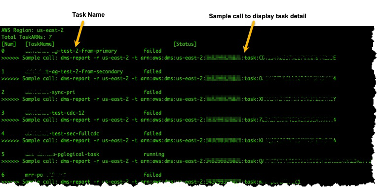
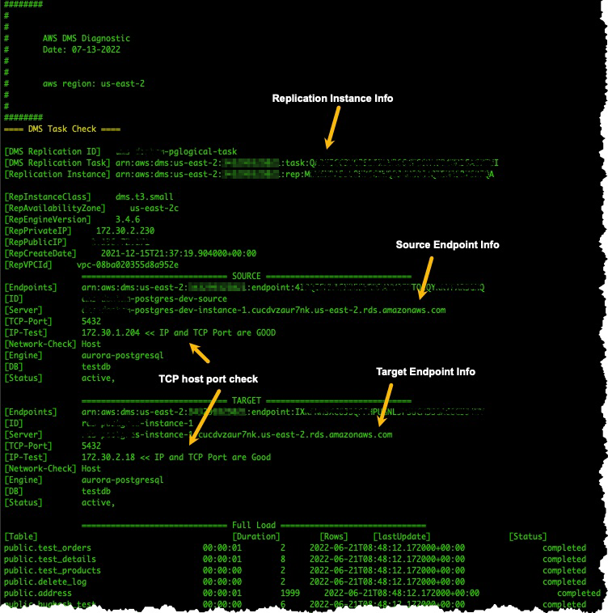
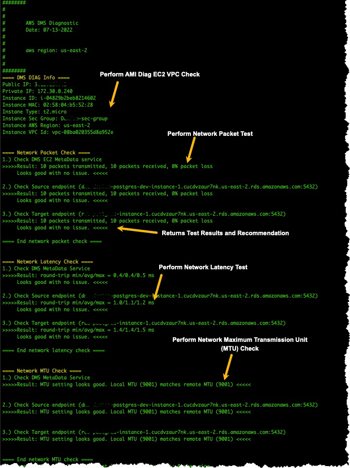

# Working with the AWS DMS diagnostic support AMI

If you encounter a network-related issue when working with AWS DMS, your support engineer might
need more information about your network configuration. We want to make sure that AWS Support
gets as much of the required information as possible in the shortest possible time. Therefore,
we developed a prebuilt Amazon EC2 AMI with diagnostic tools to test your AWS DMS networking
environment.

The diagnostic tests installed on the Amazon machine image (AMI) include the
following:

- Virtual Private Cloud (VPC)
- Network packet loss
- Network latency
- Maximum Transmission Unit (MTU) size

###### Topics

- [Launch a new AWS DMS diagnostic Amazon EC2 instance](#CHAP_SupportAmi_Launch "#CHAP_SupportAmi_Launch")
- [Create an IAM role](#CHAP_SupportAmi_Iam "#CHAP_SupportAmi_Iam")
- [Run Diagnostic Tests](#CHAP_SupportAmi_Run "#CHAP_SupportAmi_Run")
- [Next Steps](#CHAP_SupportAmi_NextSteps "#CHAP_SupportAmi_NextSteps")
- [AMI IDs by region](#CHAP_SupportAmi_AmiIDs "#CHAP_SupportAmi_AmiIDs")
- [AWS Systems Patch Manager](#CHAP_PatchManager "#CHAP_PatchManager")

###### Note

If you experience performance issues with your Oracle source, you can evaluate the read
performance of your Oracle redo or archive logs to find ways to improve performance. For more
information, see [Evaluating read
performance of Oracle redo or archive logs](CHAP_Troubleshooting.md#CHAP_Troubleshooting.Oracle.ReadPerformUtil "CHAP_Troubleshooting.md#CHAP_Troubleshooting.Oracle.ReadPerformUtil").

## Launch a new AWS DMS diagnostic Amazon EC2 instance

In this section, you launch a new Amazon EC2 instance. For information about how to launch an Amazon EC2 instance,
see [Get started with Amazon EC2 Linux instances](../../../AWSEC2/latest/UserGuide/EC2_GetStarted.md "../../../AWSEC2/latest/UserGuide/EC2_GetStarted.md") tutorial
in the [Amazon EC2 User Guide](../../../AWSEC2/latest/UserGuide.md "../../../AWSEC2/latest/UserGuide.md").

Launch an Amazon EC2 instance with the following settings:

- For **Application and OS Images (Amazon Machine Image)**, search for the **DMS-DIAG-AMI** AMI. If
  you are logged on to the console, you can search for the AMI with
  [this query](https://us-east-1.console.aws.amazon.com/ec2/home?region=us-east-1#Images:visibility=public-images;search=:dms-diag-ami;v=3; "https://us-east-1.console.aws.amazon.com/ec2/home?region=us-east-1#Images:visibility=public-images;search=:dms-diag-ami;v=3;")
  For the AMI ID of the AWS Diagnostic AMI in your region, see
  [AMI IDs by region](#CHAP_SupportAmi_AmiIDs "#CHAP_SupportAmi_AmiIDs")
  following.
- For **Instance type**, we recommend you choose **t2.micro**.
- For **Network Settings**, choose the same VPC that your replication instance uses.

After the instance is active, connect to the instance. For information about connecting to
an Amazon EC2 Linux instance, see [Connect to your Linux
instance](../../../AWSEC2/latest/UserGuide/AccessingInstances.md "../../../AWSEC2/latest/UserGuide/AccessingInstances.md").

## Create an IAM role

If you want to run the diagnostic tests on your replication instance using the minimum required permissions, create an IAM
role that uses the following permissions policy:

JSON

```
`{
 "Version":"2012-10-17",
 "Statement": [
 {
 "Sid": "VisualEditor0",
 "Effect": "Allow",
 "Action": [
 "dms:DescribeEndpoints",
 "dms:DescribeTableStatistics",
 "dms:DescribeReplicationInstances",
 "dms:DescribeReplicationTasks",
 "secretsmanager:GetSecretValue"
 ],
 "Resource": "*"
 }
 ]
}`

```

Attach the role to a new IAM user. For information about creating IAM roles, policies,
and users, see the following sections in the [IAM User Guide](../../../IAM/latest/UserGuide.md "../../../IAM/latest/UserGuide.md"):

- [Getting Started with IAM](../../../IAM/latest/UserGuide/getting-started.md "../../../IAM/latest/UserGuide/getting-started.md")
- [Creating IAM Roles](../../../IAM/latest/UserGuide/id_roles_create.md "../../../IAM/latest/UserGuide/id_roles_create.md")
- [Creating IAM Policies](../../../IAM/latest/UserGuide/access_policies_create.md "../../../IAM/latest/UserGuide/access_policies_create.md")

## Run Diagnostic Tests

After you have created an Amazon EC2 instance and connected to it, do the following to run
diagnostic tests on your replication instance.

1. Configure the AWS CLI:

```
$ aws configure
```

Provide the access credentials for the AWS user account you want to use to run the
diagnostic tests. Provide the Region for your VPC and replication instance. 2. Display the available AWS DMS tasks in your Region. Replace the sample Region with your
Region.

```
$ dms-report -r `us-east-1` -l
```

This command displays the status of your tasks.

 3. Display task endpoints and settings. Replace `<DMS-Task-ARN>`
with your task Amazon Resource Name (ARN).

```
$ dms-report -t `<DMS-Task-ARN>`
```

This command displays the endpoints and settings of your task.

 4. Run diagnostic tests. Replace `<DMS-Task-ARN>` with your task ARN.

```
$ dms-report -t `<DMS-Task-ARN>` -n y
```

This command displays diagnostic data about your replication instance's VPC, network
packet transmission, network latency, and network Maximum Transmission Unit (MTU)
size.



## Next Steps

The following sections describe troubleshooting information based on the results of the network diagnostic tests:

### VPC tests

This test verifies that the diagnostic Amazon EC2 instance is in the same VPC as the replication instance. If the diagnostic Amazon EC2 instance
is not in the same VPC as your replication instance, terminate it and create it again in the correct VPC. You can't change the VPC
of an Amazon EC2 instance after you create it.

### Network packet loss tests

This test sends 10 packets to the following endpoints and checks for packet loss:

- The AWS DMS Amazon EC2 metadata service on port 80
- The source endpoint
- The target endpoint

All packets should arrive successfully. If any packets are lost, consult with a network
engineer to determine the problem and find a solution.

### Network latency tests

This test sends 10 packets to the same endpoints as the previous test, and checks for packet latency. All
packets should have a latency of less than 100 milliseconds. If any packets have a latency greater
than 100 milliseconds, consult with a network engineer to determine the problem and find a solution.

### Maximum Transmission Unit (MTU) size tests

This test detects the MTU size by using the Traceroute tool on the same endpoints as the
previous test. All of the packets in the test should have the same MTU size. If any packets
have a different MTU size, consult with a system specialist to determine the problem and
find a solution.

## AMI IDs by region

To see a list of available DMS Diagnostic AMIs available in your AWS region, run the following AWS CLI sample.

```
aws ec2 describe-images --owners 343299325021 --filters "Name=name, Values=DMS-DIAG*" --query "sort_by(Images, &CreationDate)[-1].[Name, ImageId, CreationDate]" --output text

```

If the output shows no results, it means the DMS Diagnostic AMI is not available in your AWS region. The workaround is
to follow the below steps to copy the Diagnostic AMI from another region. For more information, see
[Copy an AMI](../../../AWSEC2/latest/UserGuide/CopyingAMIs.md "../../../AWSEC2/latest/UserGuide/CopyingAMIs.md").

- Launch an instance in the available region.
- Create the image. The image will be owned by you.
- Copy the AMI to your region, for example, Middle East (UAE) Region.
- Launch the instance in your local region.

## AWS Systems Patch Manager

AWS Systems Patch Manager automates patching for operating systems and applications on
your EC2 instances.

###### To configure the patch manager, perform the following steps:

1. Enable Systems Manager:
   1. Attach the `AmazonSSMManagedInstanceCore` IAM policy to your EC2
      instance role.
   2. Ensure SSM Agent is installed (default for Amazon Linux 2, Ubuntu 20.04+
      AMIs).

2. Create a patch baseline by defining rules for critical/security updates, including
   schedules for patch application.
3. Schedule updates for applying patches at a defined time by using maintenance windows
   in SSM.
4. Verify compliance by checking patching status and compliance reports in the Systems
   Manager.
