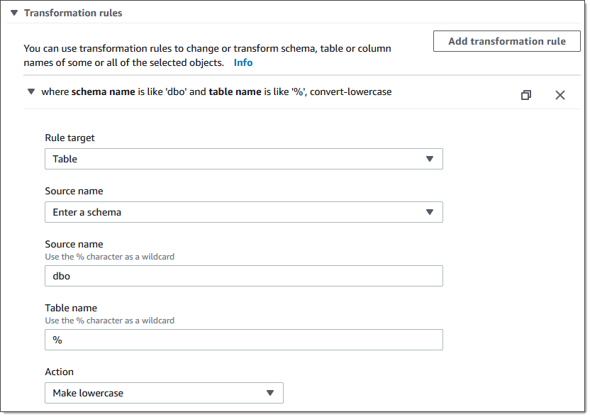

# Using Babelfish as a target for AWS Database Migration Service

You can migrate data from a Microsoft SQL Server source database to a Babelfish target
using AWS Database Migration Service.

Babelfish for Aurora PostgreSQL extends your Amazon Aurora PostgreSQL-Compatible Edition database with the
ability to accept database connections from Microsoft SQL Server clients. Doing this allows
applications originally built for SQL Server to work directly with Aurora PostgreSQL with few
code changes compared to a traditional migration, and without changing database drivers.

For information about versions
of Babelfish that AWS DMS supports as a target, see [Targets for AWS DMS](CHAP_Introduction.md "CHAP_Introduction.md"). Earlier versions of Babelfish on Aurora PostgreSQL
require an upgrade before using the Babelfish endpoint.

###### Note

The Aurora PostgreSQL target endpoint is the preferred way to migrate data to Babelfish.
For more information, see [Using Babelfish for Aurora PostgreSQL
as a target](CHAP_Target.md#CHAP_Target.PostgreSQL.Babelfish "CHAP_Target.md#CHAP_Target.PostgreSQL.Babelfish").

For information about using Babelfish as a database endpoint, see [Babelfish for
Aurora PostgreSQL](../../../AmazonRDS/latest/AuroraUserGuide/Aurora.md "../../../AmazonRDS/latest/AuroraUserGuide/Aurora.md") in the _Amazon Aurora User Guide for Aurora_

## Prerequisites to using

Babelfish as a target for AWS DMS

You must create your tables before migrating data to make sure that AWS DMS uses the correct data types and table metadata.
If you don't create your tables on the target before running migration, AWS DMS may create the tables with incorrect data types
and permissions. For example, AWS DMS creates a timestamp column as binary(8) instead, and doesn't provide the
expected timestamp/rowversion functionality.

###### To prepare and create your tables prior to migration

1. Run your create table DDL statements that include any unique constraints,
   primary keys, or default constraints.

Do not include foreign key constraints,
or any DDL statements for objects like views, stored procedures, functions,
or triggers. You can apply them after migrating your source database. 2. Identify any identity columns, computed columns, or columns containing rowversion or
timestamp data types for your tables. Then, create the necessary transformation rules to
handle known issues when running the migration task. For more information see, [Transformation rules and actions](CHAP_Tasks.CustomizingTasks.TableMapping.SelectionTransformation.md "CHAP_Tasks.CustomizingTasks.TableMapping.SelectionTransformation.md"). 3. Identify columns with data types that Babelfish doesn't support. Then,
change the affected columns in the target table to use supported data types, or
create a transformation rule that removes them during the migration task. For
more information see, [Transformation rules and actions](CHAP_Tasks.CustomizingTasks.TableMapping.SelectionTransformation.md "CHAP_Tasks.CustomizingTasks.TableMapping.SelectionTransformation.md").

The following table lists source data types not supported by Babelfish, and
the corresponding recommended target data type to use.

| Source data type | Recommended Babelfish data type |
| ---------------- | ------------------------------- |
| HEIRARCHYID      | NVARCHAR(250)                   |
| GEOMETRY         | VARCHAR(MAX)                    |
| GEOGRAPHY        | VARCHAR(MAX)                    |

###### To set Aurora capacity units (ACUs) level for your Aurora PostgreSQL Serverless V2

source database

You can improve performance of your AWS DMS migration task prior to running it by setting the minimum
ACU value.

- From the **Severless v2 capacity settings** window, set
  **Minimum ACUs** to `2`, or a
  reasonable level for your Aurora DB cluster.

For additional information about setting Aurora capacity units, see [Choosing the Aurora Serverless v2 capacity range for an Aurora
cluster](../../../AmazonRDS/latest/AuroraUserGuide/aurora-serverless-v2.md "../../../AmazonRDS/latest/AuroraUserGuide/aurora-serverless-v2.md") in the _Amazon Aurora User Guide_

After running your AWS DMS migration task, you can reset the minimum value of your
ACUs to a reasonable level for your Aurora PostgreSQL Serverless V2 source database.

## Security requirements when using

Babelfish as a target for AWS Database Migration Service

The following describes the security requirements for using AWS DMS with a Babelfish
target:

- The administrator user name (the Admin user) used to create the database.
- PSQL login and user with the sufficient SELECT, INSERT, UPDATE, DELETE, and REFERENCES permissions.

## User permissions for using Babelfish

as a target for AWS DMS

###### Important

For security purposes, the user account used for the data migration must be a
registered user in any Babelfish database that you use as a target.

Your Babelfish target endpoint requires minimum user permissions to run an AWS DMS
migration.

###### To create a login and a low-privileged Transact-SQL (T-SQL) user

1. Create a login and password to use when connecting to the server.

```
CREATE LOGIN **dms\_user** WITH PASSWORD = `'password'`;
GO
```

2. Create the virtual database for your Babelfish cluster.

```
CREATE DATABASE **my\_database**;
GO
```

3. Create the T-SQL user for your target database.

```
USE **my\_database**
GO
CREATE USER **dms\_user** FOR LOGIN **dms\_user**;
GO
```

4. For each table in your Babelfish database, GRANT permissions to the
   tables.

```
GRANT SELECT, DELETE, INSERT, REFERENCES, UPDATE ON [dbo].[Categories] TO **dms\_user**;

```

## Limitations on using Babelfish as a

target for AWS Database Migration Service

The following limitations apply when using a Babelfish database as a target for
AWS DMS:

- Only table preparation mode “**Do Nothing**“ is
  supported.
- The ROWVERSION data type requires a table mapping rule that removes the column
  name from the table during the migration task.
- The sql_variant data type isn't supported.
- Full LOB mode is supported. Using SQL Server as a source endpoint requires
  the SQL Server Endpoint Connection Attribute setting `ForceFullLob=True`
  to be set in order for LOBs to be migrated to the target endpoint.
- Replication task settings have the following limitations:

```
{
   "FullLoadSettings": {
      "TargetTablePrepMode": "DO_NOTHING",
      "CreatePkAfterFullLoad": false,
      }.

}

```

- TIME(7), DATETIME2(7), and DATETIMEOFFSET(7) data types in Babelfish limit the
  precision value for the seconds portion of the time to 6 digits. Consider using
  a precision value of 6 for your target table when using these data types. For
  Babelfish versions 2.2.0 and higher, when using TIME(7) and DATETIME2(7), the
  seventh digit of precision is always zero.
- In DO_NOTHING mode, DMS checks to see if the table already exists. If the
  table doesn't exist in the target schema, DMS creates the table based on
  the source table definition, and maps any user defined data types to their base
  data type.
- An AWS DMS migration task to a Babelfish target doesn't support tables that have columns using ROWVERSION or
  TIMESTAMP data types. You can use a table mapping rule that removes the column
  name from the table during the transfer process. In the following transformation
  rule example, a table named `Actor` in your source is transformed to
  remove all columns starting with the characters `col` from the
  `Actor` table in your target.

```
{
 	"rules": [{
		"rule-type": "selection",is
		"rule-id": "1",
		"rule-name": "1",
		"object-locator": {
			"schema-name": "test",
			"table-name": "%"
		},
		"rule-action": "include"
	}, {
		"rule-type": "transformation",
		"rule-id": "2",
		"rule-name": "2",
		"rule-action": "remove-column",
		"rule-target": "column",
		"object-locator": {
			"schema-name": "test",
			"table-name": "Actor",
			"column-name": "col%"
		}
	}]
 }
```

- For tables with identity or computed columns, where the target tables use
  mixed case names like Categories, you must create a transformation rule action
  that converts the table names to lowercase for your DMS task. The following
  example shows how to create the transformation rule action, **Make
  lowercase** using the AWS DMS console. For more information, see
  [Transformation rules and actions](CHAP_Tasks.CustomizingTasks.TableMapping.SelectionTransformation.md "CHAP_Tasks.CustomizingTasks.TableMapping.SelectionTransformation.md").



- Prior to Babelfish version 2.2.0, DMS limited the number of columns that you
  could replicate to a Babelfish target endpoint to twenty (20) columns. With
  Babelfish 2.2.0 the limit increased to 100 columns. But with Babelfish versions
  2.4.0 and higher, the number of columns that you can replicate increases again.
  You can run the following code sample against your SQL Server database to
  determine which tables are too long.

```
USE myDB;
GO
DECLARE @Babelfish_version_string_limit INT = 8000; -- Use 380 for Babelfish versions before 2.2.0
WITH bfendpoint
AS (
SELECT
	[TABLE_SCHEMA]
      ,[TABLE_NAME]
	  , COUNT( [COLUMN_NAME] ) AS NumberColumns
	  , ( SUM( LEN( [COLUMN_NAME] ) + 3)
		+ SUM( LEN( FORMAT(ORDINAL_POSITION, 'N0') ) + 3 )
	    + LEN( TABLE_SCHEMA ) + 3
		+ 12 -- INSERT INTO string
		+ 12)  AS InsertIntoCommandLength -- values string
      , CASE WHEN ( SUM( LEN( [COLUMN_NAME] ) + 3)
		+ SUM( LEN( FORMAT(ORDINAL_POSITION, 'N0') ) + 3 )
	    + LEN( TABLE_SCHEMA ) + 3
		+ 12 -- INSERT INTO string
		+ 12)  -- values string
			>= @Babelfish_version_string_limit
			THEN 1
			ELSE 0
		END AS IsTooLong
FROM [INFORMATION_SCHEMA].[COLUMNS]
GROUP BY [TABLE_SCHEMA], [TABLE_NAME]
)
SELECT *
FROM bfendpoint
WHERE IsTooLong = 1
ORDER BY TABLE_SCHEMA, InsertIntoCommandLength DESC, TABLE_NAME
;

```

## Target data types for

Babelfish

The following table shows the Babelfish target data types that are supported when
using AWS DMS and the default mapping from AWS DMS data types.

For additional information about AWS DMS data types, see [Data types for AWS Database Migration Service](CHAP_Reference.md "CHAP_Reference.md").

| AWS DMS data type | Babelfish data type                                                                                                                                                                                                                                                                                    |
| ----------------- | ------------------------------------------------------------------------------------------------------------------------------------------------------------------------------------------------------------------------------------------------------------------------------------------------------ |
| BOOLEAN           | TINYINT                                                                                                                                                                                                                                                                                                |
| BYTES             | VARBINARY(length)                                                                                                                                                                                                                                                                                      |
| DATE              | DATE                                                                                                                                                                                                                                                                                                   |
| TIME              | TIME                                                                                                                                                                                                                                                                                                   |
| INT1              | SMALLINT                                                                                                                                                                                                                                                                                               |
| INT2              | SMALLINT                                                                                                                                                                                                                                                                                               |
| INT4              | INT                                                                                                                                                                                                                                                                                                    |
| INT8              | BIGINT                                                                                                                                                                                                                                                                                                 |
| NUMERIC           | NUMERIC(p,s)                                                                                                                                                                                                                                                                                           |
| REAL4             | REAL                                                                                                                                                                                                                                                                                                   |
| REAL8             | FLOAT                                                                                                                                                                                                                                                                                                  |
| STRING            | If the column is a date or time column, then do the following:<br>• For SQL Server 2008 and higher, use DATETIME2.<br>• For earlier versions, if the scale is 3 or less use<br>DATETIME. In all other cases, use VARCHAR (37).<br>If the column is not a date or time column, use VARCHAR<br>(length). |
| UINT1             | TINYINT                                                                                                                                                                                                                                                                                                |
| UINT2             | SMALLINT                                                                                                                                                                                                                                                                                               |
| UINT4             | INT                                                                                                                                                                                                                                                                                                    |
| UINT8             | BIGINT                                                                                                                                                                                                                                                                                                 |
| WSTRING           | NVARCHAR(length)                                                                                                                                                                                                                                                                                       |
| BLOB              | VARBINARY(max)<br>To use this data type with DMS, you must enable the use of<br>BLOBs for a specific task. DMS supports BLOB data types only in<br>tables that include a primary key.                                                                                                                  |
| CLOB              | VARCHAR(max)<br>To use this data type with DMS, you must enable the use of<br>CLOBs for a specific task.                                                                                                                                                                                               |
| NCLOB             | NVARCHAR(max)<br>To use this data type with DMS, you must enable the use of<br>NCLOBs for a specific task. During CDC, DMS supports NCLOB data<br>types only in tables that include a primary key.                                                                                                     |
