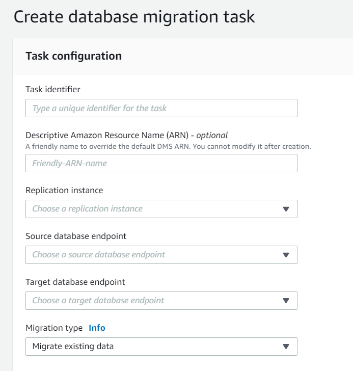

# Creating a task

To create an AWS DMS migration task, you do the following:

- Create a source endpoint, a target endpoint, and a replication instance before
  you create a migration task.
- Choose a migration method:
  - Migrating data to the target database
    – This process creates files or tables in the target database and
    automatically defines the metadata that is required at the target. It
    also populates the tables with data from the source. The data from the
    tables is loaded in parallel for improved efficiency. This process is
    the **Migrate existing data** option in the AWS Management Console and
    is called `Full Load` in the API.
  - Capturing changes during migration
    – This process captures changes to the source database that occur
    while the data is being migrated from the source to the target. When the
    migration of the originally requested data has completed, the change
    data capture (CDC) process then applies the captured changes to the
    target database. Changes are captured and applied as units of single
    committed transactions, and you can update several different target
    tables as a single source commit. This approach guarantees transactional
    integrity in the target database. This process is the **Migrate
    existing data and replicate ongoing changes** option in the
    console and is called `full-load-and-cdc` in the
    API.
  - Replicating only data changes on the source
    database – This process reads the recovery log file
    of the source database management system (DBMS) and groups together the
    entries for each transaction. In some cases, AWS DMS can't apply changes
    to the target within a reasonable time (for example, if the target
    isn't accessible). In these cases, AWS DMS buffers the changes on the
    replication server for as long as necessary. It doesn't reread the
    source DBMS logs, which can take a large amount of time. This process is
    the **Replicate data changes only** option in the AWS DMS
    console.

- Determine how the task should handle large binary objects (LOBs) on the
  source. For more information, see [Setting LOB support for source databases in
  an AWS DMS task](CHAP_Tasks.md "CHAP_Tasks.md").
- Specify migration task settings. These include setting up logging, specifying
  what data is written to the migration control table, how errors are handled, and
  other settings. For more information about task settings, see [Specifying task settings
  for AWS Database Migration Service tasks](CHAP_Tasks.CustomizingTasks.md "CHAP_Tasks.CustomizingTasks.md").
- Set up table mapping to define rules to select and filter data that you are
  migrating. For more information about table mapping, see [Using table mapping to
  specify task settings](CHAP_Tasks.CustomizingTasks.md "CHAP_Tasks.CustomizingTasks.md"). Before you
  specify your mapping, make sure that you review the documentation section on
  data type mapping for your source and your target database.
- Enable and run premigration task assessments before you run the task. For more
  information about premigration assessments, see [Enabling and working with premigration
  assessments for a task](CHAP_Tasks.md "CHAP_Tasks.md").
- Specify any required supplemental data for the task to migrate your data. For
  more information, see [Specifying supplemental data for task
  settings](CHAP_Tasks.md "CHAP_Tasks.md").
  You can choose to start a task as soon as you finish specifying information for that
  task on the **Create task** page. Alternatively, you can start the task
  from the Dashboard page later as well.

The following procedure assumes that you have already specified replication instance
information and endpoints. For more information about setting up endpoints, see [Creating source and target endpoints](CHAP_Endpoints.md "CHAP_Endpoints.md").

###### To create a migration task

1. Sign in to the AWS Management Console and open the AWS DMS console at [https://console.aws.amazon.com/dms/v2/](https://console.aws.amazon.com/dms/v2/ "https://console.aws.amazon.com/dms/v2/").

If you are signed in as an AWS Identity and Access Management (IAM) user, make sure that you have the
appropriate permissions to access AWS DMS. For more information about the permissions
required, see [IAM permissions needed to use
AWS DMS](security-iam.md#CHAP_Security.IAMPermissions "security-iam.md#CHAP_Security.IAMPermissions"). 2. On the navigation pane, choose **Database migration tasks**, and then choose
**Create task**. 3. On the **Create database migration task** page, in the **Task configuration**
section, specify the task options. The
following table describes the settings.

| For this option                                            | Do this                                                                                                                                                                                                                   |
| ---------------------------------------------------------- | ------------------------------------------------------------------------------------------------------------------------------------------------------------------------------------------------------------------------- |
| **Task identifier**                                        | Enter a name for the task.                                                                                                                                                                                                |
| **Descriptive Amazon Resource Name (ARN) • _optional_** | A friendly name to override the default AWS DMS ARN. You can't change this name after you create the task.                                                                                                             |
| **Replication instance**                                   | Shows the replication instance to be used.                                                                                                                                                                                |
| **Source database endpoint**                               | Shows the source endpoint to be used.                                                                                                                                                                                     |
| **Target database endpoint**                               | Shows the target endpoint to be used.                                                                                                                                                                                     |
| **Migration type**                                         | Choose the migration method you want to use. You can choose to have just the existing data migrated to the target database or have ongoing changes sent to the target database in addition to the migrated data. |

4. In the **Task Settings** section,
   specify values for editing your task, target table preparation mode, stop task,
   LOB settings, validation, and logging.

| For this option                            | Do this                                                                                                                                                                                                                                                                                                                                                                                                                                                                                                                                                                                                                                                                                                                                                                                                                                                                                                                                                                                                                                                                                                                                                                                                                                                                                                                                                                                                                                                                                                                                                                                                                                                                                                                                                                                                                                                                                                                                                                                                                                                                                                                                                                                                                                                                                                                                                                                                                                                                                                                                                                                                                                                                                                                                                                                                                                                                                                                                                                                                                                                                                                                                                                                                                                                                                                      |
| ------------------------------------------ | ------------------------------------------------------------------------------------------------------------------------------------------------------------------------------------------------------------------------------------------------------------------------------------------------------------------------------------------------------------------------------------------------------------------------------------------------------------------------------------------------------------------------------------------------------------------------------------------------------------------------------------------------------------------------------------------------------------------------------------------------------------------------------------------------------------------------------------------------------------------------------------------------------------------------------------------------------------------------------------------------------------------------------------------------------------------------------------------------------------------------------------------------------------------------------------------------------------------------------------------------------------------------------------------------------------------------------------------------------------------------------------------------------------------------------------------------------------------------------------------------------------------------------------------------------------------------------------------------------------------------------------------------------------------------------------------------------------------------------------------------------------------------------------------------------------------------------------------------------------------------------------------------------------------------------------------------------------------------------------------------------------------------------------------------------------------------------------------------------------------------------------------------------------------------------------------------------------------------------------------------------------------------------------------------------------------------------------------------------------------------------------------------------------------------------------------------------------------------------------------------------------------------------------------------------------------------------------------------------------------------------------------------------------------------------------------------------------------------------------------------------------------------------------------------------------------------------------------------------------------------------------------------------------------------------------------------------------------------------------------------------------------------------------------------------------------------------------------------------------------------------------------------------------------------------------------------------------------------------------------------------------------------------------------------------------ |
| **Editing mode**                           | Choose whether to use the Wizard or the JSON editor to specify your task settings. If you choose Wizard, the following options will be displayed.                                                                                                                                                                                                                                                                                                                                                                                                                                                                                                                                                                                                                                                                                                                                                                                                                                                                                                                                                                                                                                                                                                                                                                                                                                                                                                                                                                                                                                                                                                                                                                                                                                                                                                                                                                                                                                                                                                                                                                                                                                                                                                                                                                                                                                                                                                                                                                                                                                                                                                                                                                                                                                                                                                                                                                                                                                                                                                                                                                                                                                                                                                                                                      |
| **CDC start mode for source transactions** | This setting is only visible if you choose **Replicate data changes only\* • for **Migration type** in the preceding section. **Disable custom CDC start mode* • – If you choose this option, you can start your task either automatically by using the \*\*Automatically on create* • option following, or manually by using the console. \*_Enable custom CDC start mode_ • – If you choose this option, you can specify a custom UTC start time to start processing changes.                                                                                                                                                                                                                                                                                                                                                                                                                                                                                                                                                                                                                                                                                                                                                                                                                                                                                                                                                                                                                                                                                                                                                                                                                                                                                                                                                                                                                                                                                                                                                                                                                                                                                                                                                                                                                                                                                                                                                                                                                                                                                                                                                                                                                                                                                                                                                                                                                                                                                                                                                                                                                                                                                                                                                                                       |
| **Target table preparation mode**          | This setting is only visible if you choose **Migrate existing data\* • or **Migrate existing data and replicate ongoing changes* • for **Migration type** in the preceding section. \*\*Do nothing* • – In **Do nothing\* • mode, AWS DMS assumes that the target tables have been pre-created on the target. If the tables aren't empty, conflicts might occur during data migration and can result in a DMS task error. If the target table doesn't exist, DMS creates the table for you. Your table structure remains as is and any existing data is left in the table. **Do nothing* • mode is appropriate for CDC-only tasks when the target tables have been backfilled from the source and ongoing replication is applied to keep the source and target in sync. To pre-create tables, you can use the AWS Schema Conversion Tool (AWS SCT). For more information, see [Installing AWS SCT](../../../SchemaConversionTool/latest/userguide/CHAP_SchemaConversionTool.md "../../../SchemaConversionTool/latest/userguide/CHAP_SchemaConversionTool.md"). \*\*Drop tables on target* • – In **Drop tables on target\* • mode, AWS DMS drops the target tables and recreates them before starting the migration. This approach ensures that the target tables are empty when the migration starts. AWS DMS creates only the objects required to efficiently migrate the data: tables, primary keys, and in some cases, unique indexes. AWS DMS doesn't create secondary indexes, nonprimary key constraints, or column data defaults. If you are performing a full load plus CDC or CDC-only task, we recommend that you pause the migration at this point. Then, create secondary indexes that support filtering for update and delete statements. You might need to perform some configuration on the target database when you use **Drop tables on target* • mode. For example, for an Oracle target, AWS DMS can't create a schema (database user) for security reasons. In this case, you precreate the schema user so AWS DMS can create the tables when the migration starts. For most other target types, AWS DMS creates the schema and all associated tables with the proper configuration parameters. \*\*Truncate* • – In **Truncate\* • mode, AWS DMS truncates all target tables before the migration starts. If the target table doesn't exist, DMS creates the table for you. Your table structure remains as is but tables are truncated at the target. **Truncate* • mode is appropriate for full load or full load plus CDC migrations where the target schema has been precreated before the migration starts. To precreate tables, you can use AWS SCT. For more information, see [Installing AWS SCT](../../../SchemaConversionTool/latest/userguide/CHAP_SchemaConversionTool.md "../../../SchemaConversionTool/latest/userguide/CHAP_SchemaConversionTool.md"). NoteIf your target is MongoDB, \*\*Truncate* • mode doesn’t truncate tables at the target. Instead, it drops the collection and loses all the indices. Avoid \*_Truncate_ • mode when your target is MongoDB. |
| **Stop task after full load completes**    | This setting is only visible if you choose **Migrate existing data and replicate ongoing changes\* • for **Migration type** in the preceding section. **Don't stop* • – Don't stop the task but immediately apply cached changes and continue on. \*\*Stop before applying cached changes* • – Stop the task before the application of cached changes. Using this approach, you can add secondary indexes that might speed the application of changes. \*_Stop after applying cached changes_ • – Stop the task after cached changes have been applied. Using this approach, you can add foreign keys if you are using transactional apply.                                                                                                                                                                                                                                                                                                                                                                                                                                                                                                                                                                                                                                                                                                                                                                                                                                                                                                                                                                                                                                                                                                                                                                                                                                                                                                                                                                                                                                                                                                                                                                                                                                                                                                                                                                                                                                                                                                                                                                                                                                                                                                                                                                                                                                                                                                                                                                                                                                                                                                                                                                                                               |
| **Include LOB columns in replication**     | **Don't include LOB columns\* • – LOB columns are excluded from the migration. **Full LOB mode* • – Migrate complete LOBs regardless of size. AWS DMS migrates LOBs piecewise in chunks controlled by the \*\*LOB Chunk size* • parameter. This mode is slower than using Limited LOB mode. **Limited LOB mode\* • – Truncate LOBs to the value of the **Max LOB size\*\* parameter. This mode is faster than using Full LOB mode.                                                                                                                                                                                                                                                                                                                                                                                                                                                                                                                                                                                                                                                                                                                                                                                                                                                                                                                                                                                                                                                                                                                                                                                                                                                                                                                                                                                                                                                                                                                                                                                                                                                                                                                                                                                                                                                                                                                                                                                                                                                                                                                                                                                                                                                                                                                                                                                                                                                                                                                                                                                                                                                                                                                                                                                                                                 |
| **Maximum LOB size (kb)**                  | In **Limited LOB Mode**, LOB columns that exceed the setting of **Max LOB size\* • are truncated to the specified **Max LOB Size\*\* value.                                                                                                                                                                                                                                                                                                                                                                                                                                                                                                                                                                                                                                                                                                                                                                                                                                                                                                                                                                                                                                                                                                                                                                                                                                                                                                                                                                                                                                                                                                                                                                                                                                                                                                                                                                                                                                                                                                                                                                                                                                                                                                                                                                                                                                                                                                                                                                                                                                                                                                                                                                                                                                                                                                                                                                                                                                                                                                                                                                                                                                                                                                                                                      |
| **Enable validation**                      | Enables data validation, to verify that the data is migrated accurately from the source to the target. For more information, see [AWS DMS data validation](CHAP_Validating.md "CHAP_Validating.md").                                                                                                                                                                                                                                                                                                                                                                                                                                                                                                                                                                                                                                                                                                                                                                                                                                                                                                                                                                                                                                                                                                                                                                                                                                                                                                                                                                                                                                                                                                                                                                                                                                                                                                                                                                                                                                                                                                                                                                                                                                                                                                                                                                                                                                                                                                                                                                                                                                                                                                                                                                                                                                                                                                                                                                                                                                                                                                                                                                                                                                                                                                   |
| **Enable CloudWatch logs**                 | Enables logging by Amazon CloudWatch.                                                                                                                                                                                                                                                                                                                                                                                                                                                                                                                                                                                                                                                                                                                                                                                                                                                                                                                                                                                                                                                                                                                                                                                                                                                                                                                                                                                                                                                                                                                                                                                                                                                                                                                                                                                                                                                                                                                                                                                                                                                                                                                                                                                                                                                                                                                                                                                                                                                                                                                                                                                                                                                                                                                                                                                                                                                                                                                                                                                                                                                                                                                                                                                                                                                                        |

5. In the **Premigration assessment** section, choose whether to run
   a premigration assessment. A premigration assessment warns you of potential migration
   issues before starting your database migration task. For more information,
   see [Enabling and working with premigration assessments](CHAP_Tasks.md "CHAP_Tasks.md").
6. In the **Migration task startup configuration** section, specify
   whether to start the task automatically after creation.
7. In the **Tags** section, specify
   any tags you need to organize your task. You can use tags to manage your IAM roles and policies,
   and track your DMS costs. For more information, see [Tagging resources](CHAP_Tagging.md "CHAP_Tagging.md").
8. After you have finished with the task settings, choose **Create
   task**.
