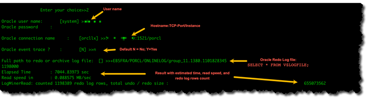

# Troubleshooting migration tasks in AWS Database Migration Service

Following, you can find topics about troubleshooting issues with AWS Database Migration Service (AWS DMS). These
topics can help you to resolve common issues using both AWS DMS and selected endpoint
databases.

If you have opened an AWS Support case, your support engineer might identify a potential
issue with one of your endpoint database configurations. Your engineer might also ask you to
run a support script to return diagnostic information about your database. For details about
downloading, running, and uploading the diagnostic information from this type of support
script, see [Working with diagnostic support scripts in AWS DMS](CHAP_SupportScripts.md "CHAP_SupportScripts.md").

For troubleshooting purposes, AWS DMS collects trace and dump files in the replication instance.
You can provide these files to AWS Support should an issue occur requiring troubleshooting.
By default, DMS purges trace and dump files that are older than thirty days. To opt out of trace
and dump file collection, open a case with AWS Support.

###### Topics

- [Migration tasks run slowly](#CHAP_Troubleshooting.General.SlowTask "#CHAP_Troubleshooting.General.SlowTask")
- [Task status bar doesn't move](#CHAP_Troubleshooting.General.StatusBar "#CHAP_Troubleshooting.General.StatusBar")
- [Task completes but nothing was migrated](#CHAP_Troubleshooting.General.NothingMigrated "#CHAP_Troubleshooting.General.NothingMigrated")
- [Foreign keys and secondary
  indexes are missing](#CHAP_Troubleshooting.General.MissingSecondaryObjs "#CHAP_Troubleshooting.General.MissingSecondaryObjs")
- [AWS DMS does not create CloudWatch logs](#CHAP_Troubleshooting.General.CWL "#CHAP_Troubleshooting.General.CWL")
- [Issues occur with connecting to Amazon
  RDS](#CHAP_Troubleshooting.General.RDSConnection "#CHAP_Troubleshooting.General.RDSConnection")
- [Networking issues occur](#CHAP_Troubleshooting.General.Network "#CHAP_Troubleshooting.General.Network")
- [CDC is stuck after full load](#CHAP_Troubleshooting.General.CDCStuck "#CHAP_Troubleshooting.General.CDCStuck")
- [Primary key violation errors occur when you
  restart a task](#CHAP_Troubleshooting.General.PKErrors "#CHAP_Troubleshooting.General.PKErrors")
- [Initial load of a schema fails](#CHAP_Troubleshooting.General.SchemaLoadFail "#CHAP_Troubleshooting.General.SchemaLoadFail")
- [Tasks fail with an unknown error](#CHAP_Troubleshooting.General.TasksFail "#CHAP_Troubleshooting.General.TasksFail")
- [Task restart loads tables from the
  beginning](#CHAP_Troubleshooting.General.RestartLoad "#CHAP_Troubleshooting.General.RestartLoad")
- [Number of tables per task causes
  issues](#CHAP_Troubleshooting.General.TableLimit "#CHAP_Troubleshooting.General.TableLimit")
- [Tasks fail when a primary key is created
  on a LOB column](#CHAP_Troubleshooting.General.PKLOBColumn "#CHAP_Troubleshooting.General.PKLOBColumn")
- [Duplicate records occur on a target
  table without a primary key](#CHAP_Troubleshooting.General.DuplicateRecords "#CHAP_Troubleshooting.General.DuplicateRecords")
- [Source endpoints fall in the reserved IP
  range](#CHAP_Troubleshooting.General.ReservedIP "#CHAP_Troubleshooting.General.ReservedIP")
- [Timestamps are garbled in Amazon Athena queries](#CHAP_Troubleshooting.General.GarbledTimestamps "#CHAP_Troubleshooting.General.GarbledTimestamps")
- [Troubleshooting issues with Oracle](#CHAP_Troubleshooting.Oracle "#CHAP_Troubleshooting.Oracle")
- [Troubleshooting issues with MySQL](#CHAP_Troubleshooting.MySQL "#CHAP_Troubleshooting.MySQL")
- [Troubleshooting issues with PostgreSQL](#CHAP_Troubleshooting.PostgreSQL "#CHAP_Troubleshooting.PostgreSQL")
- [Troubleshooting issues with Microsoft SQL
  Server](#CHAP_Troubleshooting.SQLServer "#CHAP_Troubleshooting.SQLServer")
- [Troubleshooting issues with Amazon Redshift](#CHAP_Troubleshooting.Redshift "#CHAP_Troubleshooting.Redshift")
- [Troubleshooting issues with Amazon Aurora MySQL](#CHAP_Troubleshooting.Aurora "#CHAP_Troubleshooting.Aurora")
- [Troubleshooting issues with SAP ASE](#CHAP_Troubleshooting.SAP "#CHAP_Troubleshooting.SAP")
- [Troubleshooting issues with IBM Db2](#CHAP_Troubleshooting.Db2 "#CHAP_Troubleshooting.Db2")
- [Table suspended a table with
  error "Failed to build 'where' statement"](#CHAP_Troubleshooting.table.suspended "#CHAP_Troubleshooting.table.suspended")
- [Troubleshooting latency issues in AWS Database Migration Service](CHAP_Troubleshooting_Latency.md "CHAP_Troubleshooting_Latency.md")
- [Working with diagnostic support scripts in AWS DMS](CHAP_SupportScripts.md "CHAP_SupportScripts.md")
- [Working with the AWS DMS diagnostic support AMI](CHAP_SupportAmi.md "CHAP_SupportAmi.md")

## Migration tasks run slowly

Several issues can cause a migration task to run slowly, or cause subsequent tasks
to run slower than the initial task.

The most common reason for a migration task running slowly is that there are
inadequate resources allocated to the AWS DMS replication instance. To make sure that
your instance has enough resources for the tasks you are running on it, check your
replication instance's use of CPU, memory, swap files, and IOPS. For example,
multiple tasks with Amazon Redshift as an endpoint are I/O intensive. You can increase IOPS for
your replication instance or split your tasks across multiple replication instances for
a more efficient migration.

For more information about determining the size of your replication instance, see
[Selecting the best size for a
replication instance](CHAP_BestPractices.md "CHAP_BestPractices.md").

You can increase the speed of an initial migration load by doing the following:

- If your target is an Amazon RDS DB instance, make sure that Multi-AZ isn't
  enabled for the target DB instance.
- Turn off any automatic backups or logging on the target database
  during the load, and turn back on those features after your migration is
  complete.
- If the feature is available on your target, use provisioned
  IOPS.
- If your migration data contains LOBs, make sure that the task is
  optimized for LOB migration. For more information on optimizing for LOBs, see
  [Target
  metadata task settings](CHAP_Tasks.CustomizingTasks.TaskSettings.md "CHAP_Tasks.CustomizingTasks.TaskSettings.md").

## Task status bar doesn't move

The task status bar gives an estimation of the task's progress. The quality
of this estimate depends on the quality of the source database's table statistics;
the better the table statistics, the more accurate the estimation.

For a task with only one table that has no estimated rows statistic, AWS DMS can't
provide any kind of percentage complete estimate. In this case, use the task state and
the indication of rows loaded to confirm that the task is running and making
progress.

## Task completes but nothing was migrated

Do the following if nothing was migrated after your task has completed.

- Check if the user that created the endpoint has read access to the table you intend to migrate.
- Check if the object you want to migrate is a table. If it is a view, update table mappings
  and specify the object-locator as “view” or “all”. For more information, see
  [Specifying table
  selection and transformations rules from the console](CHAP_Tasks.CustomizingTasks.TableMapping.md "CHAP_Tasks.CustomizingTasks.TableMapping.md").

## Foreign keys and secondary

indexes are missing

AWS DMS creates tables, primary keys, and in some cases unique indexes, but it
doesn't create any other objects that aren't required to efficiently migrate the
data from the source. For example, it doesn't create secondary indexes, non-primary
key constraints, or data defaults.

To migrate secondary objects from your database, use the database's native tools
if you are migrating to the same database engine as your source database. Use the
AWS Schema Conversion Tool (AWS SCT) if you are migrating to a different database engine than that
used by your source database to migrate secondary objects.

## AWS DMS does not create CloudWatch logs

If your replication task doesn't create CloudWatch logs, make sure that your account has the
`dms-cloudwatch-logs-role` role. If this role is not present, do the
following to create it:

1. Sign in to the AWS Management Console and open the IAM console at [https://console.aws.amazon.com/iam/](https://console.aws.amazon.com/iam/ "https://console.aws.amazon.com/iam/").
2. Choose the **Roles** tab. Choose **Create role**.
3. In the **Select type of trusted entity** section, choose
   **AWS service**.
4. In the **Choose a use case** section, choose **DMS**.
5. Choose **Next: Permissions**.
6. Enter `AmazonDMSCloudWatchLogsRole` in the search field, and check the box
   next to **AmazonDMSCloudWatchLogsRole**. This grants AWS DMS permissions to access CloudWatch.
7. Choose **Next: Tags**.
8. Choose **Next: Review**.
9. Enter `dms-cloudwatch-logs-role` for **Role name**. This
   name is case sensitive.
10. Choose **Create role**.

###### Note

If your account is part of AWS Organizations, verify that Service Control Policies
(SCPs) are not restricting your IAM role permissions. SCPs can override and limit
IAM role permissions even when they are properly configured.

## Issues occur with connecting to Amazon

RDS

There can be several reasons why you can't connect to an Amazon RDS DB instance
that you set as a source or target. Some items to check follow:

- Check that the user name and password combination is correct.
- Check that the endpoint value shown in the Amazon RDS console for the
  instance is the same as the endpoint identifier you used to create the
  AWS DMS endpoint.
- Check that the port value shown in the Amazon RDS console for the
  instance is the same as the port assigned to the AWS DMS
  endpoint.
- Check that the security group assigned to the Amazon RDS DB instance
  allows connections from the AWS DMS replication instance.
- If the AWS DMS replication instance and the Amazon RDS DB instance aren't in
  the same virtual private cloud (VPC), check that the DB instance is publicly
  accessible.

### Error

message: Incorrect thread connection string: Incorrect thread value 0

This error can often occur when you are testing the connection to an endpoint.
This error indicates that there is an error in the connection string. An example is
a space after the host IP address. Another is a bad character copied into the
connection string.

## Networking issues occur

The most common networking issue involves the VPC security group used by the AWS DMS
replication instance. By default, this security group has rules that allow egress to
0.0.0.0/0 on all ports. In many cases, you modify this security group or use your own
security group. If so, at a minimum, make sure to give egress to the source and target
endpoints on their respective database ports.

Other configuration-related issues can include the following:

- **Replication instance and both source and target endpoints
  in the same VPC** – The security group used by the endpoints
  must allow ingress on the database port from the replication instance. Make sure
  that the security group used by the replication instance has ingress to the
  endpoints. Or you can create a rule in the security group used by the endpoints
  that allows the private IP address of the replication instance access.
- **Source endpoint is outside the VPC used by the replication
  instance (using an internet gateway)** – The VPC security
  group must include routing rules that send traffic that isn't for the VPC
  to the internet gateway. In this configuration, the connection to the endpoint
  appears to come from the public IP address on the replication instance.
- **Source endpoint is outside the VPC used by the replication
  instance (using a NAT gateway)** – You can configure a
  network address translation (NAT) gateway using a single elastic IP address
  bound to a single elastic network interface. This NAT gateway receives a NAT
  identifier (nat-#####).

In some cases, the VPC includes a default route to that NAT gateway instead of
the internet gateway. In such cases, the replication instance instead appears to
contact the database endpoint using the public IP address of the NAT
gateway. Here, the ingress to the database endpoint outside the VPC needs to
allow ingress from the NAT address instead of the replication instance's
public IP address.

For information about using your own on-premises name server, see
[Using your own on-premises name server](CHAP_BestPractices.md#CHAP_BestPractices.Rte53DNSResolver "CHAP_BestPractices.md#CHAP_BestPractices.Rte53DNSResolver").

## CDC is stuck after full load

Slow or stuck replication changes can occur after a full load migration when several
AWS DMS settings conflict with each other.

For example, suppose that the **Target table preparation mode**
parameter is set to **Do nothing** or **Truncate**. In
this case, you have instructed AWS DMS to do no setup on the target tables, including
creating primary and unique indexes. If you haven't created primary or unique keys
on the target tables, AWS DMS does a full table scan for each update. This approach can
affect performance significantly.

## Primary key violation errors occur when you

restart a task

This error can occur when data remains in the target database from a previous
migration task. If the **Target table preparation mode** option is set
to **Do nothing**, AWS DMS doesn't do any preparation on the target
table, including cleaning up data inserted from a previous task.

To restart your task and avoid these errors, remove rows inserted into the target
tables from the previous running of the task.

## Initial load of a schema fails

In some cases, the initial load of your schemas might fail with an error of
`Operation:getSchemaListDetails:errType=, status=0, errMessage=,
 errDetails=`.

In such cases, the user account used by AWS DMS to connect to the source endpoint
doesn't have the necessary permissions.

## Tasks fail with an unknown error

The cause of unknown types of error can be varied. However, often we find that the
issue involves insufficient resources allocated to the AWS DMS replication instance.

To make sure that your replication instance has enough resources to perform the
migration, check your instance's use of CPU, memory, swap files, and IOPS. For more
information on monitoring, see [AWS Database Migration Service metrics](CHAP_Monitoring.md#CHAP_Monitoring.Metrics "CHAP_Monitoring.md#CHAP_Monitoring.Metrics").

## Task restart loads tables from the

beginning

AWS DMS restarts table loading from the beginning when it hasn't finished the
initial load of a table. When a task is restarted, AWS DMS reloads tables from the beginning when the
initial load didn't complete.

## Number of tables per task causes

issues

There is no set limit on the number of tables per replication task. However, we
recommend limiting the number of tables in a task to less than 60,000, as a rule of
thumb. Resource use can often be a bottleneck when a single task uses more than 60,000
tables.

## Tasks fail when a primary key is created

on a LOB column

In FULL LOB or LIMITED LOB mode, AWS DMS doesn't support replication of primary
keys that are LOB data types.

DMS initially migrates a row with a LOB column as null, then later updates the LOB
column. So, when the primary key is created on a LOB column, the initial insert fails
since the primary key can't be null. As a workaround, add another column as primary
key and remove the primary key from the LOB column.

## Duplicate records occur on a target

table without a primary key

Running a full load and CDC task can create duplicate records on target tables that
don't have a primary key or unique index. To avoid duplicating records on target
tables during full load and CDC tasks, make sure that target tables have a primary key
or unique index.

## Source endpoints fall in the reserved IP

range

If an AWS DMS source database uses an IP address within the reserved IP range
of 192.168.0.0/24, the source endpoint connection test fails. The following
steps provide a possible workaround:

1. Find one Amazon EC2 instance that isn't in the reserved range that
   can communicate to the source database at 192.168.0.0/24.
2. Install a socat proxy and run it. The following shows an example.

```
yum install socat

socat -d -d -lmlocal2 tcp4-listen:*database port*,bind=0.0.0.0,reuseaddr,fork tcp4:*source\_database\_ip\_address*:*database\_port*
&
```

Use the Amazon EC2 instance IP address and the database port given preceding for the AWS DMS
endpoint. Make sure that the endpoint has the security group that allows AWS DMS to
access the database port. Note that the proxy needs to be running for the duration
of your DMS task execution. Depending on the use case, you may need to automate the
proxy setup.

## Timestamps are garbled in Amazon Athena queries

If timestamps are garbled in Athena queries, use the AWS Management Console or the
[ModifyEndpoint](../APIReference/API_ModifyEndpoint.md "../APIReference/API_ModifyEndpoint.md") action to set the
`parquetTimestampInMillisecond` value for your Amazon S3 endpoint to `true`.
For more information, see [S3Settings](../APIReference/API_S3Settings.md "../APIReference/API_S3Settings.md").

## Troubleshooting issues with Oracle

Following, you can learn about troubleshooting issues specific to using AWS DMS with
Oracle databases.

###### Topics

- [Pulling data from views](#CHAP_Troubleshooting.Oracle.Views "#CHAP_Troubleshooting.Oracle.Views")
- [Migrating LOBs from Oracle 12c](#CHAP_Troubleshooting.Oracle.12cLOBs "#CHAP_Troubleshooting.Oracle.12cLOBs")
- [Switching between Oracle LogMiner
  and Binary Reader](#CHAP_Troubleshooting.Oracle.LogMinerBinaryReader "#CHAP_Troubleshooting.Oracle.LogMinerBinaryReader")
- [Error: Oracle CDC stopped 122301
  oracle CDC maximum retry counter exceeded.](#CHAP_Troubleshooting.Oracle.CDCStopped "#CHAP_Troubleshooting.Oracle.CDCStopped")
- [Automatically add supplemental
  logging to an Oracle source endpoint](#CHAP_Troubleshooting.Oracle.AutoSupplLogging "#CHAP_Troubleshooting.Oracle.AutoSupplLogging")
- [LOB changes aren't being captured](#CHAP_Troubleshooting.Oracle.LOBChanges "#CHAP_Troubleshooting.Oracle.LOBChanges")
- [Error: ORA-12899: Value too large for column
  column-name](#CHAP_Troubleshooting.Oracle.ORA12899 "#CHAP_Troubleshooting.Oracle.ORA12899")
- [NUMBER data type being misinterpreted](#CHAP_Troubleshooting.Oracle.Numbers "#CHAP_Troubleshooting.Oracle.Numbers")
- [Records missing during full load](#CHAP_Troubleshooting.Oracle.RecordsMissing "#CHAP_Troubleshooting.Oracle.RecordsMissing")
- [Table Error](#CHAP_Troubleshooting.Oracle.TableError "#CHAP_Troubleshooting.Oracle.TableError")
- [Error: Cannot retrieve Oracle archived Redo log destination ids](#CHAP_Troubleshooting.Oracle.RedoLogError "#CHAP_Troubleshooting.Oracle.RedoLogError")
- [Evaluating read performance of Oracle
  redo or archive logs](#CHAP_Troubleshooting.Oracle.ReadPerformUtil "#CHAP_Troubleshooting.Oracle.ReadPerformUtil")
- [Failed to get LOB data](#CHAP_Troubleshooting.Oracle.LOBdata "#CHAP_Troubleshooting.Oracle.LOBdata")

### Pulling data from views

You can pull data once from a view; you can't use it for ongoing replication.
To be able to extract data from views, you must add the following code to the
**Endpoint settings** section of the Oracle source endpoint page. When
you extract data from a view, the view is shown as a table on the target
schema.

```
"ExposeViews": true
```

### Migrating LOBs from Oracle 12c

AWS DMS can use two methods to capture changes to an Oracle database,
Binary Reader and Oracle LogMiner. By default, AWS DMS uses Oracle LogMiner to
capture changes. However, on Oracle 12c, Oracle LogMiner doesn't support LOB
columns. To capture changes to LOB columns on Oracle 12c, use Binary Reader.

### Switching between Oracle LogMiner

and Binary Reader

AWS DMS can use two methods to capture changes to a source Oracle database,
Binary Reader and Oracle LogMiner. Oracle LogMiner is the default. To switch to using
Binary Reader for capturing changes, do the following:

###### To use binary reader for capturing changes

1. Sign in to the AWS Management Console and open the AWS DMS console at
   [https://console.aws.amazon.com/dms/v2/](https://console.aws.amazon.com/dms/v2/ "https://console.aws.amazon.com/dms/v2/").
2. Choose **Endpoints**.
3. Choose the Oracle source endpoint that you want to use Binary Reader.
4. Choose **Modify**.
5. Choose **Advanced**, and then add the following code for **Extra
   connection attributes**.

```

useLogminerReader=N

```

6. Use an Oracle developer tool such as SQL-Plus to grant the following additional privilege to
   the AWS DMS user account used to connect to the Oracle endpoint.

```

SELECT ON V_$TRANSPORTABLE_PLATFORM

```

### Error: Oracle CDC stopped 122301

oracle CDC maximum retry counter exceeded.

This error occurs when the needed Oracle archive logs have been removed
from your server before AWS DMS was able to use them to capture changes.
Increase your log
retention policies on your database server. For an Amazon RDS
database, run the following procedure to
increase log retention. For example, the following code increases log
retention on an Amazon RDS DB instance to 24 hours.

```

exec rdsadmin.rdsadmin_util.set_configuration('archivelog retention hours',24);

```

### Automatically add supplemental

logging to an Oracle source endpoint

By default, AWS DMS has supplemental logging turned off. To automatically turn
on supplemental logging for a source Oracle endpoint, do the following:

###### To add supplemental logging to a source oracle endpoint

1. Sign in to the AWS Management Console and open the AWS DMS console at
   [https://console.aws.amazon.com/dms/v2/](https://console.aws.amazon.com/dms/v2/ "https://console.aws.amazon.com/dms/v2/").
2. Choose **Endpoints**.
3. Choose the Oracle source endpoint that you want to add supplemental logging to.
4. Choose **Modify**.
5. Choose **Advanced**, and then add the following code to the **Extra
   connection attributes** text box:

```

addSupplementalLogging=Y

```

6. Choose **Modify**.

### LOB changes aren't being captured

Currently, a table must have a primary key for AWS DMS to capture LOB changes.
If a table that contains LOBs doesn't have a primary key, there are several actions
you can take to capture LOB changes:

- Add a primary key to the table. This can be as simple as adding an ID column and populating it
  with a sequence using a trigger.
- Create a materialized view of the table that includes a system-generated ID as the primary key
  and migrate the materialized view rather than the table.
- Create a logical standby, add a primary key to the table, and migrate from the logical
  standby.

### Error: ORA-12899: Value too large for column

`column-name`

The error "ORA-12899: value too large for column
`column-name`" is often caused by a couple of
issues.

In one of these issues, there's a mismatch in the character sets used by the
source and target databases.

In another of these issues, national language support (NLS) settings differ
between the two databases. A common cause of this error is when the source database
NLS_LENGTH_SEMANTICS parameter is set to CHAR and the target database
NLS_LENGTH_SEMANTICS parameter is set to BYTE.

### NUMBER data type being misinterpreted

The Oracle NUMBER data type is converted into various AWS DMS data types, depending
on the precision and scale of NUMBER. These conversions are documented here [Source data types for Oracle](CHAP_Source.md#CHAP_Source.Oracle.DataTypes "CHAP_Source.md#CHAP_Source.Oracle.DataTypes"). The way the NUMBER type is
converted can also be affected by using endpoint settings for the source
Oracle endpoint. These endpoint settings are documented in [Endpoint settings
when using Oracle as a source for AWS DMS](CHAP_Source.md#CHAP_Source.Oracle.ConnectionAttrib "CHAP_Source.md#CHAP_Source.Oracle.ConnectionAttrib").

### Records missing during full load

When performing a full load, AWS DMS looks for open transactions at the database
level and waits for the transaction to be committed. For example, based on the
task setting `TransactionConsistencyTimeout=600`, AWS DMS waits for 10
minutes even if the open transaction is on a table not included in table mapping.
But if the open transaction is on a table included in table mapping, and the transaction
isn't committed in time, missing records in the target table result.

You can modify the `TransactionConsistencyTimeout` task setting and
increase wait time if you know that open transactions will take longer to commit.

Also, note the default value of the `FailOnTransactionConsistencyBreached` task
setting is `false`. This means AWS DMS continues to apply other transactions but
open transactions are missed. If you want the task to fail when open transactions aren't
closed in time, you can set `FailOnTransactionConsistencyBreached` to `true`.

### Table Error

`Table Error` appears in table statistics during replication if a `WHERE` clause
doesn't reference a primary key column, and supplemental logging isn't used for all columns.

To fix this issue, turn on supplemental logging for all columns of the referenced table. For more information,
see [Setting up supplemental logging](CHAP_Source.md#CHAP_Source.Oracle.Self-Managed.Configuration.SupplementalLogging "CHAP_Source.md#CHAP_Source.Oracle.Self-Managed.Configuration.SupplementalLogging").

### Error: Cannot retrieve Oracle archived Redo log destination ids

This error occurs when your Oracle source doesn't have any archive logs generated or V$ARCHIVED_LOG is empty.
You can resolve the error by switching logs manually.

For an Amazon RDS database, run the following procedure to switch log files. The `switch_logfile`
procedure doesn't have parameters.

```
exec rdsadmin.rdsadmin_util.switch_logfile;
```

For a self-managed Oracle source database, use the following command to force a log switch.

```
ALTER SYSTEM SWITCH LOGFILE ;
```

### Evaluating read performance of Oracle

redo or archive logs

If you experience performance issues with your Oracle source, you can evaluate the
read performance of your Oracle redo or archive logs to find ways to improve
performance. To test the redo or archive log read performance, use the [AWS DMS diagnostic Amazon machine image](CHAP_SupportAmi.md "CHAP_SupportAmi.md")
(AMI).

You can use the AWS DMS diagnostic AMI to do the following:

- Use the bFile method to evaluate redo log file performance.
- Use the LogMiner method to evaluate redo log file performance.
- Use the PL/SQL (`dbms_lob.read`) method to evaluate redo log file performance.
- Use Single-thread to evaluate read performance on ASMFile.
- Use Multi-threads to evaluate read performance on ASMFile.
- Use Direct OS Readfile() Windows or Pread64 Linux function to evaluate the redo log file.

Then you can take remedial steps based upon the results.

###### To test read performance on an Oracle redo or archive log file

1. Create an AWS DMS diagnostic AMI Amazon EC2 instance and connect to it.

For more information see, [Working with the AWS DMS diagnostic AMI](CHAP_SupportAmi.md "CHAP_SupportAmi.md"). 2. Run the **awsreplperf** command.

```
$ awsreplperf
```

The command displays the AWS DMS Oracle Read Performance Utility
options.

```
0.	Quit
1.	Read using Bfile
2.	Read using LogMiner
3.	Read file PL/SQL (dms_lob.read)
4.	Read ASMFile Single Thread
5.	Read ASMFile Multi Thread
6.	Readfile() function

```

3. Select an option from the list.
4. Enter the following database connection and archive log information.

```
Oracle user name [system]:
Oracle password:

Oracle connection name [orcllx]:
Connection format `hostname`:`port`/`instance`

Oracle event trace? [N]:
Default N = No or Y = Yes

Path to redo or archive log file []:

```

5. Examine the output displayed for relevant read performance information.
   For example, the following shows output that can result from selecting
   option number 2, **Read using LogMiner**.

 6. To exit the utility, enter **0** (zero).

###### Next steps

- When results show that read speed is below an acceptable threshold, run the
  [Oracle diagnostic support script](CHAP_SupportScripts.md "CHAP_SupportScripts.md")
  on the endpoint, review Wait Time, Load Profile, and IO Profile sections. Then
  adjust any abnormal configuration that might improve read performance. For example,
  if your redo log files are up to 2 GB, try increasing LOG_BUFFER to 200 MB to help
  improve performance.
- Review [AWS DMS Best Practices](CHAP_BestPractices.md "CHAP_BestPractices.md") to
  make sure your DMS replication instance, task, and endpoints are configured
  optimally.

### Failed to get LOB data

LOB (Large Object) lookup failures in AWS DMS occur under specific circumstances
during data migration processes. During the full load phase, AWS DMS employs the
lookup method for LOB data migration when the task is configured for FULL LOB mode.
Notably, during the CDC (Change Data Capture) phase, AWS DMS consistently uses the
Lookup method regardless of LOB settings.

AWS DMS first replicates rows without the LOB column, retrieves LOB data using a
**SELECT** command, and executes an **UPDATE**
command to replicate the LOB field on the target. This sequential INSERT and UPDATE
operation characterizes the LOOKUP behavior. The LOB lookup during the CDC phase is
not universally applicable across all database engines and depending on data size
the tasks may replicate inline rows along with column data.

LOB Lookup process failure is a common issue that can occur during migration
displaying the "Failed to get lob data, going to set to null" error message. During
this failure the partial table data on the target, particularly the LOB columns
appear as NULL values. Various factors can trigger these failures:

- Source row deletion occurring before DMS completes the Lookup
  process
- Intermittent connectivity issues disrupting lookup threads
- DMS lookup queries entering a waiting state due to source table locking
  scenarios

To address these LOB Lookup failures, you can do the following:

- Implement Limited LOB settings during the full load phase to eliminate
  lookup behavior and enhance performance.
- Reload affected tables when encountering lookup failure messages and
  partial data on the target.
- For issues occuring due to intermittent network or source database
  availability problems, restart the task to resolve all table data
  inconsistencies.

These steps to handling LOB Lookup failures ensures more reliable data migration
and helps maintain data integrity throughout the process.

## Troubleshooting issues with MySQL

Following, you can learn about troubleshooting issues specific to using AWS DMS with
MySQL databases.

###### Topics

- [CDC task failing for Amazon RDS DB
  instance endpoint because binary logging disabled](#CHAP_Troubleshooting.MySQL.CDCTaskFail "#CHAP_Troubleshooting.MySQL.CDCTaskFail")
- [Connections to a
  target MySQL instance are disconnected during a task](#CHAP_Troubleshooting.MySQL.ConnectionDisconnect "#CHAP_Troubleshooting.MySQL.ConnectionDisconnect")
- [Adding autocommit to a
  MySQL-compatible endpoint](#CHAP_Troubleshooting.MySQL.Autocommit "#CHAP_Troubleshooting.MySQL.Autocommit")
- [Disable foreign keys on
  a target MySQL-compatible endpoint](#CHAP_Troubleshooting.MySQL.DisableForeignKeys "#CHAP_Troubleshooting.MySQL.DisableForeignKeys")
- [Characters replaced with question mark](#CHAP_Troubleshooting.MySQL.CharacterReplacement "#CHAP_Troubleshooting.MySQL.CharacterReplacement")
- ["Bad event" log entries](#CHAP_Troubleshooting.MySQL.BadEvent "#CHAP_Troubleshooting.MySQL.BadEvent")
- [Change data capture with MySQL 5.5](#CHAP_Troubleshooting.MySQL.MySQL55CDC "#CHAP_Troubleshooting.MySQL.MySQL55CDC")
- [Increasing binary log retention for Amazon RDS DB instances](#CHAP_Troubleshooting.MySQL.BinLogRetention "#CHAP_Troubleshooting.MySQL.BinLogRetention")
- [Log message: Some changes from the
  source database had no impact when applied to the target database.](#CHAP_Troubleshooting.MySQL.NoImpact "#CHAP_Troubleshooting.MySQL.NoImpact")
- [Error: Identifier too long](#CHAP_Troubleshooting.MySQL.IDTooLong "#CHAP_Troubleshooting.MySQL.IDTooLong")
- [Error:
  Unsupported character set
  causes field data conversion to fail](#CHAP_Troubleshooting.MySQL.UnsupportedCharacterSet "#CHAP_Troubleshooting.MySQL.UnsupportedCharacterSet")
- [Error:
  Codepage 1252 to UTF8 [120112] a field data conversion failed](#CHAP_Troubleshooting.MySQL.DataConversionFailed "#CHAP_Troubleshooting.MySQL.DataConversionFailed")
- [Indexes, Foreign Keys, or Cascade Updates or Deletes Not Migrated](#CHAP_Troubleshooting.MySQL.FKsAndIndexes "#CHAP_Troubleshooting.MySQL.FKsAndIndexes")

### CDC task failing for Amazon RDS DB

instance endpoint because binary logging disabled

This issue occurs with Amazon RDS DB instances because automated backups are
disabled. Enable automatic backups by setting the backup retention period to a
non-zero value.

### Connections to a

target MySQL instance are disconnected during a task

If you have a task with LOBs that is getting disconnected from a MySQL target, you
might see the following type of errors in the task log.

```
[TARGET_LOAD ]E: RetCode: SQL_ERROR SqlState: 08S01 NativeError:
2013 Message: [MySQL][ODBC 5.3(w) Driver][mysqld-5.7.16-log]Lost connection
to MySQL server during query [122502] ODBC general error.
```

```
 [TARGET_LOAD ]E: RetCode: SQL_ERROR SqlState: HY000 NativeError:
2006 Message: [MySQL][ODBC 5.3(w) Driver]MySQL server has gone away
[122502] ODBC general error.
```

In this case, you might need to adjust some of your task settings.

To solve the issue where a task is being disconnected from a MySQL target, do the
following:

- Check that you have your database variable `max_allowed_packet` set large enough to
  hold your largest LOB.
- Check that you have the following variables set to have a large timeout value. We suggest you
  use a value of at least 5 minutes for each of these variables.
  - `net_read_timeout`
  - `net_write_timeout`
  - `wait_timeout`

For information about setting MySQL system variables, see [Server System Variables](https://dev.mysql.com/doc/refman/8.0/en/server-system-variables.html "https://dev.mysql.com/doc/refman/8.0/en/server-system-variables.html")
in the [MySQL documentation](https://dev.mysql.com/ "https://dev.mysql.com/").

### Adding autocommit to a

MySQL-compatible endpoint

###### To add autocommit to a target MySQL-compatible endpoint

1. Sign in to the AWS Management Console and open the AWS DMS console at
   [https://console.aws.amazon.com/dms/v2/](https://console.aws.amazon.com/dms/v2/ "https://console.aws.amazon.com/dms/v2/").
2. Choose **Endpoints**.
3. Choose the MySQL-compatible target endpoint that you want to add autocommit to.
4. Choose **Modify**.
5. Choose **Advanced**, and then add the following code to the **Extra
   connection attributes** text box:

```

Initstmt= SET AUTOCOMMIT=1

```

6. Choose **Modify**.

### Disable foreign keys on

a target MySQL-compatible endpoint

You can disable foreign key checks on MySQL by adding the following to the **Extra
Connection Attributes** in the **Advanced** section of the target MySQL, Amazon Aurora MySQL-Compatible Edition, or
MariaDB endpoint.

###### To disable foreign keys on a target MySQL-compatible endpoint

1. Sign in to the AWS Management Console and open the AWS DMS console at
   [https://console.aws.amazon.com/dms/v2/](https://console.aws.amazon.com/dms/v2/ "https://console.aws.amazon.com/dms/v2/").
2. Choose **Endpoints**.
3. Choose the MySQL, Aurora MySQL, or MariaDB target endpoint that you want to disable foreign
   keys.
4. Choose **Modify**.
5. Choose **Advanced**, and then add the following code to the **Extra
   connection attributes** text box:

```

Initstmt=SET FOREIGN_KEY_CHECKS=0

```

6. Choose **Modify**.

### Characters replaced with question mark

The most common situation that causes this issue is when the source endpoint
characters have been encoded by a character set that AWS DMS doesn't support.

### "Bad event" log entries

"Bad event" entries in the migration logs usually indicate that an
unsupported data definition language (DDL) operation was attempted on the source
database endpoint. Unsupported DDL operations cause an event that the replication
instance can't skip, so a bad event is logged.

To fix this issue, restart the task from the beginning. Doing this reloads the
tables and starts capturing changes at a point after the unsupported DDL operation
was issued.

### Change data capture with MySQL 5.5

AWS DMS change data capture (CDC) for Amazon RDS MySQL-compatible databases
requires full image row-based binary logging, which isn't supported in MySQL version
5.5 or lower. To use AWS DMS CDC, you must up upgrade your Amazon RDS DB instance
to MySQL version 5.6.

### Increasing binary log retention for Amazon RDS DB instances

AWS DMS requires the retention of binary log files for change data capture. To
increase log retention on an Amazon RDS DB instance, use the following procedure. The
following example increases the binary log retention to 24 hours.

```

call mysql.rds_set_configuration('binlog retention hours', 24);

```

### Log message: Some changes from the

source database had no impact when applied to the target database.

When AWS DMS updates a MySQL database column's value to its existing value, a
message of `zero rows affected` is returned from MySQL. This behavior is
unlike other database engines such as Oracle and SQL Server. These engines update
one row, even when the replacing value is the same as the current one.

### Error: Identifier too long

The following error occurs when an identifier is too long:

```

TARGET_LOAD E: RetCode: SQL_ERROR SqlState: HY000 NativeError:
1059 Message: MySQLhttp://ODBC 5.3(w) Driverhttp://mysqld-5.6.10Identifier
name '`name`' is too long 122502 ODBC general error. (ar_odbc_stmt.c:4054)

```

In some cases, you set AWS DMS to create the tables and primary keys in the target
database. In these cases, DMS currently doesn't use the same names for the
primary keys that were used in the source database. Instead, DMS creates the primary
key name based on the table name. When the table name is long, the autogenerated
identifier created can be longer than the allowed limits for MySQL.

To solve this issue, the current approach is to first precreate the tables and
primary keys in the target database. Then use a task with the task setting
**Target table preparation mode** set to **Do
nothing** or **Truncate** to populate the target
tables.

### Error:

Unsupported character set
causes field data conversion to fail

The following error occurs when an unsupported character set causes a field data
conversion to fail:

```

"[SOURCE_CAPTURE ]E: Column '`column-name`' uses an unsupported character set [120112]
A field data conversion failed. (mysql_endpoint_capture.c:2154)

```

Check your database's parameters related to
connections. The following command can be used to set these parameters.

```

SHOW VARIABLES LIKE '%char%';

```

### Error:

Codepage 1252 to UTF8 [120112] a field data conversion failed

The following error can occur during a migration if you have non codepage-1252
characters in the source MySQL database.

```

[SOURCE_CAPTURE ]E: Error converting column 'column_xyz' in table
'table_xyz with codepage 1252 to UTF8 [120112] A field data conversion failed.
(mysql_endpoint_capture.c:2248)

```

As a workaround, you can use the `CharsetMapping` extra connection
attribute with your source MySQL endpoint to specify character set mapping. You
might need to restart the AWS DMS migration task from the beginning if you add this
endpoint setting.

For example, the following endpoint setting could be used for a MySQL
source endpoint where the source character set is `Utf8` or
`latin1`. 65001 is the UTF8 code page identifier.

```

CharsetMapping=utf8,65001
CharsetMapping=latin1,65001

```

### Indexes, Foreign Keys, or Cascade Updates or Deletes Not Migrated

AWS DMS does not support migrating secondary objects such as indexes and foreign keys. To replicate changes
made to child tables from a cascade update or delete operation, you need to have the triggering foreign key
constraint active on the target table. To work around
this limitation, create the foreign key manually on the target table. Then, either create a single task
for full-load and CDC, or two separate tasks for full load and CDC,
as described following:

#### Create a single task supporting full load and CDC

This procedure describes how to migrate foreign keys and indexes using a single task for full load and CDC.

###### Create a full load and CDC task

1. Manually create the tables with foreign keys and indexes on the target to match the source tables.
2. Add the following ECA to the target AWS DMS endpoint:

```
Initstmt=SET FOREIGN_KEY_CHECKS=0;
```

3. Create the AWS DMS task with `TargetTablePrepMode` set to `DO_NOTHING`.
4. Set the `Stop task after full load completes` setting to `StopTaskCachedChangesApplied`.
5. Start the task. AWS DMS stops the task automatically after it completes the full load and applies any cached changes.
6. Remove the `SET FOREIGN_KEY_CHECKS` ECA you added previously.
7. Resume the task. The task enters the CDC phase and applies ongoing changes from the source database to the target.

#### Create full load and CDC tasks separately

These procedures describe how to migrate foreign keys and indexes using separate tasks for full load and CDC.

###### Create a full load task

1. Manually create the tables with foreign keys and indexes on the target to match the source tables.
2. Add the following ECA to the target AWS DMS endpoint:

```
Initstmt=SET FOREIGN_KEY_CHECKS=0;
```

3. Create the AWS DMS task with the `TargetTablePrepMode` parameter set to `DO_NOTHING`
   and `EnableValidation` set to `FALSE`.
4. Start the task. AWS DMS stops the task automatically after it completes the full load and applies any cached changes.
5. Once the task completes, note the full load task start time in UTC, or binary log file name and position,
   to start the CDC only task. Refer to the logs to get the timestamp in UTC from the initial full load start time.

###### Create a CDC-only task

1. Remove the `SET FOREIGN_KEY_CHECKS` ECA you set previously.
2. Create the CDC-only task with the start position set to the full load start time noted
   in the previous step. Alternatively, you can use the binary log position recorded in the previous step.
   Set the `TargetTablePrepMode` setting to `DO_NOTHING`. Enable data validation by setting the
   `EnableValidation` setting to `TRUE` if needed.
3. Start the CDC-only task, and monitor the logs for errors.

###### Note

This workaround only applies to a MySQL to MySQL migration. You can't use this method with the Batch Apply
feature, because Batch Apply requires that target tables don't have active foreign keys.

## Troubleshooting issues with PostgreSQL

Following, you can learn about troubleshooting issues specific to using AWS DMS with
PostgreSQL databases.

###### Topics

- [JSON data types being truncated](#CHAP_Troubleshooting.PostgreSQL.JSONTruncation "#CHAP_Troubleshooting.PostgreSQL.JSONTruncation")
- [Columns of a user-defined data
  type not being migrated correctly](#CHAP_Troubleshooting.PostgreSQL.UserDefinedDataType "#CHAP_Troubleshooting.PostgreSQL.UserDefinedDataType")
- [Error: No schema has been
  selected to create in](#CHAP_Troubleshooting.PostgreSQL.NoSchema "#CHAP_Troubleshooting.PostgreSQL.NoSchema")
- [Deletes and
  updates to a table aren't being replicated using CDC](#CHAP_Troubleshooting.PostgreSQL.DeletesNotReplicated "#CHAP_Troubleshooting.PostgreSQL.DeletesNotReplicated")
- [Truncate statements aren't being
  propagated](#CHAP_Troubleshooting.PostgreSQL.Truncate "#CHAP_Troubleshooting.PostgreSQL.Truncate")
- [Preventing PostgreSQL from
  capturing DDL](#CHAP_Troubleshooting.PostgreSQL.NoCaptureDDL "#CHAP_Troubleshooting.PostgreSQL.NoCaptureDDL")
- [Selecting the schema where
  database objects for capturing DDL are created](#CHAP_Troubleshooting.PostgreSQL.SchemaDDL "#CHAP_Troubleshooting.PostgreSQL.SchemaDDL")
- [Oracle tables
  missing after migrating to PostgreSQL](#CHAP_Troubleshooting.PostgreSQL.OracleTablesMissing "#CHAP_Troubleshooting.PostgreSQL.OracleTablesMissing")
- [ReplicationSlotDiskUsage increases and restart_lsn stops moving forward during long transactions,
  such as ETL workloads](#CHAP_Troubleshooting.PostgreSQL.AvoidLongTransactions "#CHAP_Troubleshooting.PostgreSQL.AvoidLongTransactions")
- [Task using view as a source has
  no rows copied](#CHAP_Troubleshooting.PostgreSQL.ViewTask "#CHAP_Troubleshooting.PostgreSQL.ViewTask")
- [Invalid byte sequence
  for encoding "UTF8"](#CHAP_Troubleshooting.PostgreSQL.invalidbyte "#CHAP_Troubleshooting.PostgreSQL.invalidbyte")

### JSON data types being truncated

AWS DMS treats the JSON data type in PostgreSQL as an LOB data type column. This
means that the LOB size limitation when you use limited LOB mode applies to JSON
data.

For example, suppose that limited LOB mode is set to 4,096 KB. In this case, any
JSON data larger than 4,096 KB is truncated at the 4,096 KB limit and fails the
validation test in PostgreSQL.

The following log information shows JSON that was truncated due to the limited LOB
mode setting and failed validation.

```
03:00:49
2017-09-19T03:00:49 [TARGET_APPLY ]E: Failed to execute statement:
  'UPDATE "public"."delivery_options_quotes" SET "id"=? , "enabled"=? ,
  "new_cart_id"=? , "order_id"=? , "user_id"=? , "zone_id"=? , "quotes"=? ,
  "start_at"=? , "end_at"=? , "last_quoted_at"=? , "created_at"=? ,
  "updated_at"=? WHERE "id"=? ' [1022502] (ar_odbc_stmt
2017-09-19T03:00:49 [TARGET_APPLY ]E: Failed to execute statement:
  'UPDATE "public"."delivery_options_quotes" SET "id"=? , "enabled"=? ,
  "new_cart_id"=? , "order_id"=? , "user_id"=? , "zone_id"=? , "quotes"=? ,
  "start_at"=? , "end_at"=? , "last_quoted_at"=? , "created_at"=? ,
  "updated_at"=? WHERE "id"=? ' [1022502] (ar_odbc_stmt.c:2415)

03:00:49
2017-09-19T03:00:49 [TARGET_APPLY ]E: RetCode: SQL_ERROR SqlState:
  22P02 NativeError: 1 Message: ERROR: invalid input syntax for type json;,
  Error while executing the query [1022502] (ar_odbc_stmt.c:2421)
2017-09-19T03:00:49 [TARGET_APPLY ]E: RetCode: SQL_ERROR SqlState:
  22P02 NativeError: 1 Message: ERROR: invalid input syntax for type json;,
  Error while executing the query [1022502] (ar_odbc_stmt.c:2421)
```

### Columns of a user-defined data

type not being migrated correctly

When replicating from a PostgreSQL source, AWS DMS creates the target table with
the same data types for all columns, apart from columns with user-defined data
types. In such cases, the data type is created as "character varying" in the target.

### Error: No schema has been

selected to create in

In some case, you might see the error "SQL_ERROR SqlState: 3F000 NativeError:
7 Message: ERROR: no schema has been selected to create in".

This error can occur when your JSON table mapping contains a wildcard value for
the schema but the source database doesn't support that value.

### Deletes and

updates to a table aren't being replicated using CDC

Delete and update operations during change data capture (CDC) are ignored if the
source table doesn't have a primary key. AWS DMS supports change data capture
(CDC) for PostgreSQL tables with primary keys.

If a table doesn't have a primary key, the write-ahead (WAL) logs don't
include a before image of the database row. In this case, AWS DMS can't update
the table. For delete operations to be replicated, create a primary key on the
source table.

### Truncate statements aren't being

propagated

When using change data capture (CDC), TRUNCATE operations aren't
supported by AWS DMS.

### Preventing PostgreSQL from

capturing DDL

You can prevent a PostgreSQL target endpoint from capturing DDL statements by
adding the following **Endpoint setting** statement.

```

"CaptureDDLs": "N"

```

### Selecting the schema where

database objects for capturing DDL are created

You can control what schema the database objects related to capturing DDL are
created in. Add the following **Endpoint setting**
statement. The **Endpoint setting** parameter is
available in the tab of the source endpoint.

```

"DdlArtifactsSchema: "xyzddlschema"

```

### Oracle tables

missing after migrating to PostgreSQL

In this case, your tables and data are generally still accessible.

Oracle defaults to uppercase table names, and PostgreSQL defaults to lowercase
table names. When you perform a migration from Oracle to PostgreSQL, we suggest that
you supply certain transformation rules under your task's table-mapping section.
These are transformation rules to convert the case of your table names.

If you migrated your tables without using transformation rules to convert the case
of your table names, enclose your table names in quotation marks when referencing
them.

###

ReplicationSlotDiskUsage increases and restart_lsn stops moving forward during long transactions,
such as ETL workloads

When logical replication is enabled, the maximum number of changes kept in memory
per transaction is 4MB. After that, changes are spilled to disk. As a result
`ReplicationSlotDiskUsage` increases, and `restart_lsn` doesn’t
advance until the transaction is completed/aborted and the rollback finishes. Since it
is a long transaction, it can take a long time to rollback.

So, avoid long running transactions when logical replication is enabled. Instead,
try to break the transaction into several smaller transactions.

### Task using view as a source has

no rows copied

To migrate a view, set `table-type` to `all` or
`view`. For more information, see
[Specifying table
selection and transformations rules from the console](CHAP_Tasks.CustomizingTasks.TableMapping.md "CHAP_Tasks.CustomizingTasks.TableMapping.md").

Sources that support views include the following.

- Oracle
- Microsoft SQL Server
- MySQL
- PostgreSQL
- IBM Db2 LUW
- SAP Adaptive Server Enterprise (ASE)

### Invalid byte sequence

for encoding "UTF8"

Data migration from Oracle to PostgreSQL using AWS DMS presents unique challenges
due to character set encoding differences between the two databases. A significant
issue arises from Oracle's AL32UTF8 character set, which fully supports 4-byte
characters, while PostgreSQL's UTF8 character set implementation lacks this
capability. This disparity often leads to migration failures, particularly when
dealing with tables or columns in the Oracle source that contain 4-byte
characters.

During migration attempts, you may encounter error messages in both DMS task logs
and PostgreSQL target database logs indicating problems with invalid UTF8 byte
sequences. A typical error message "ERROR: invalid byte sequence for encoding
"UTF8": 0xed 0xb0 0x86" is displayed. To resolve this issue, AWS DMS provides a
solution through the "`ReplaceChars`" settings. It automatically
sibtitutes or eliminates invalid characters during the migration process. This
approach effectively prevents encoding-related errors without requiring
modifications to the source data.

For more information, see _Character set validation and
replacement_ bullet point in [Character substitution task settings](CHAP_Tasks.CustomizingTasks.TaskSettings.md "CHAP_Tasks.CustomizingTasks.TaskSettings.md") topic.

## Troubleshooting issues with Microsoft SQL

Server

Following, you can learn about troubleshooting issues specific to using AWS DMS with
Microsoft SQL Server databases.

###### Topics

- [Ongoing replication fails after
  RDS for SQL Server fails over to secondary](#CHAP_Troubleshooting.SQLServer.RepFailover "#CHAP_Troubleshooting.SQLServer.RepFailover")
- [Errors capturing changes for SQL
  server database](#CHAP_Troubleshooting.SQLServer.CDCErrors "#CHAP_Troubleshooting.SQLServer.CDCErrors")
- [Missing identity columns](#CHAP_Troubleshooting.SQLServer.IdentityColumns "#CHAP_Troubleshooting.SQLServer.IdentityColumns")
- [Error: SQL Server
  doesn't support publications](#CHAP_Troubleshooting.SQLServer.Publications "#CHAP_Troubleshooting.SQLServer.Publications")
- [Changes do not appear in your
  target](#CHAP_Troubleshooting.SQLServer.NoChanges "#CHAP_Troubleshooting.SQLServer.NoChanges")
- [Non-uniform table mapped
  across partitions](#CHAP_Troubleshooting.SQLServer.Nonuniform "#CHAP_Troubleshooting.SQLServer.Nonuniform")
- [Error : CDC task
  failed with a Bad Envelope, invalid data context/LCX code while processing a
  transaction](#CHAP_Troubleshooting.SQLServer.badenvelope.cdc "#CHAP_Troubleshooting.SQLServer.badenvelope.cdc")

### Ongoing replication fails after

RDS for SQL Server fails over to secondary

If a source SQL Server instance fails over to the secondary, AWS DMS ongoing replication keeps
trying to connect, and continues replicating once the source is back online. However, for RDS for SQL Server
MAZ instances, under certain circumstances the secondary database owner can be set to
`NT AUTHORITY\SYSTEM`. After a failover, this causes the DMS task to fail with the following error:

```
[SOURCE_CAPTURE  ]E:  RetCode: SQL_ERROR  SqlState: 42000 NativeError: 33009 Message:
                [Microsoft][ODBC Driver 17 for SQL Server][SQL Server]The database owner SID recorded in the master
                database differs from the database owner SID recorded in database 'rdsadmin'. You should correct
                this situation by resetting the owner of database 'rdsadmin' using the ALTER AUTHORIZATION statement.
                Line: 1 Column: -1 [1022502]  (ar_odbc_stmt.c:5035)
```

To fix this, follow the steps in
[Changing the db_owner to the rdsa account for your database](../../../AmazonRDS/latest/UserGuide/Appendix.SQLServer.CommonDBATasks.md "../../../AmazonRDS/latest/UserGuide/Appendix.SQLServer.CommonDBATasks.md"), and then resume your DMS task.

### Errors capturing changes for SQL

server database

Errors during change data capture (CDC) can often indicate that one of the
prerequisites wasn't met. For example, the most common overlooked prerequisite
is a full database backup. The task log indicates this omission with the following
error:

```

SOURCE_CAPTURE E: No FULL database backup found (under the 'FULL' recovery model).
To enable all changes to be captured, you must perform a full database backup.
120438 Changes may be missed. (sqlserver_log_queries.c:2623)

```

Review the prerequisites listed for using SQL Server as a source in [Using a Microsoft SQL Server database as a
source for AWS DMS](CHAP_Source.md "CHAP_Source.md").

### Missing identity columns

AWS DMS doesn't support identity columns when you create a target schema. You
must add them after the initial load has completed.

### Error: SQL Server

doesn't support publications

The following error is generated when you use SQL Server Express as a source
endpoint:

```

RetCode: SQL_ERROR SqlState: HY000 NativeError: 21106
Message: This edition of SQL Server does not support publications.

```

AWS DMS currently doesn't support SQL Server Express as a source or
target.

### Changes do not appear in your

target

AWS DMS requires that a source SQL Server database be in either 'FULL' or 'BULK
LOGGED' data recovery model in order to consistently capture changes. The 'SIMPLE'
model isn't supported.

The SIMPLE recovery model logs the minimal information needed to allow users to
recover their database. All inactive log entries are automatically truncated when a
checkpoint occurs.

All operations are still logged. However, as soon as a checkpoint occurs the log
is automatically truncated. This truncation means that the log becomes available for
reuse and older log entries can be overwritten. When log entries are overwritten,
changes can't be captured. This issue is why AWS DMS does not support the SIMPLE
data recovery model. For information on other required prerequisites for using SQL
Server as a source, see [Using a Microsoft SQL Server database as a
source for AWS DMS](CHAP_Source.md "CHAP_Source.md").

### Non-uniform table mapped

across partitions

During change data capture (CDC), migration of a table with a specialized
structure is suspended when AWS DMS can't properly perform CDC on the table.
Messages like these are issued:

```

[SOURCE_CAPTURE ]W: Table is not uniformly mapped across partitions. Therefore - it is excluded from CDC (sqlserver_log_metadata.c:1415)
[SOURCE_CAPTURE ]I: Table has been mapped and registered for CDC. (sqlserver_log_metadata.c:835)

```

When running CDC on SQL Server tables, AWS DMS parses the SQL Server tlogs. On
each tlog record, AWS DMS parses hexadecimal values containing data for columns
that were inserted, updated, or deleted during a change.

To parse the hexadecimal record, AWS DMS reads the table metadata from the SQL
Server system tables. Those system tables identify what the specially structured
table columns are and reveal some of their internal properties, such as "xoffset"
and "null bit position".

AWS DMS expects that metadata to be the same for all raw partitions of the table.
But in some cases, specially structured tables don't have the same metadata on
all of their partitions. In these cases, AWS DMS can suspend CDC on that table to
avoid parsing changes incorrectly and providing the target with incorrect data.
Workarounds include the following:

- If the table has a clustered index, perform an index rebuild.
- If the table does not have a clustered index, add a clustered index to the table (you can drop
  it later if you want).

### Error : CDC task

failed with a Bad Envelope, invalid data context/LCX code while processing a
transaction

The 'Bad Envelope' error occurs when AWS DMS is unable to validate specific event
types in CDC phase replication during the validation process. This error can
commonly occur when resuming tasks from a specific timestamp that falls in the
middle of a transaction. In such cases, the task might read a commit event without
finding its corresponding 'start transaction' event, leading to an invalid
transaction context, and triggering the 'Bad Envelope' error.

To resolve this issue, you must modify the SQL Server source endpoint
configuration by setting the `ignoreTxnCtxValidityCheck` parameter to
`true` in the Extra Connection Attribute section, before resuming the
task. If the error persists after implementing this solution, submit an AWS [support
ticket](../../../awssupport/latest/user/case-management.md "../../../awssupport/latest/user/case-management.md").

## Troubleshooting issues with Amazon Redshift

Following, you can learn about troubleshooting issues specific to using AWS DMS with
Amazon Redshift databases.

###### Topics

- [Loading in to an Amazon Redshift cluster in a different
  AWS Region](#CHAP_Troubleshooting.Redshift.Regions "#CHAP_Troubleshooting.Redshift.Regions")
- [Error: Relation
  "awsdms_apply_exceptions" already exists](#CHAP_Troubleshooting.Redshift.AlreadyExists "#CHAP_Troubleshooting.Redshift.AlreadyExists")
- [Errors with tables whose name
  begins with "awsdms_changes"](#CHAP_Troubleshooting.Redshift.Changes "#CHAP_Troubleshooting.Redshift.Changes")
- [Seeing tables in clusters with names like
  dms.awsdms_changes000000000XXXX](#CHAP_Troubleshooting.Redshift.TempTables "#CHAP_Troubleshooting.Redshift.TempTables")
- [Permissions required to work with
  Amazon Redshift](#CHAP_Troubleshooting.Redshift.Permissions "#CHAP_Troubleshooting.Redshift.Permissions")

### Loading in to an Amazon Redshift cluster in a different

AWS Region

You can't load into an Amazon Redshift cluster in a different AWS Region than your AWS DMS
replication instance. DMS requires that your replication instance and your Amazon Redshift
cluster be in the same Region.

### Error: Relation

"awsdms_apply_exceptions" already exists

The error "Relation 'awsdms_apply_exceptions' already exists" often occurs when a
Redshift endpoint is specified as a PostgreSQL endpoint. To fix this issue, modify
the endpoint and change the **Target engine** to "redshift."

### Errors with tables whose name

begins with "awsdms_changes"

Table error messages with names that begin with "awsdms_changes" can
occur when two tasks trying to load data into the same Amazon Redshift cluster run
concurrently. Due to the way temporary tables are named, concurrent tasks can
conflict when updating the same table.

### Seeing tables in clusters with names like

dms.awsdms_changes000000000XXXX

AWS DMS creates temporary tables when data is being loaded from files stored in
Amazon S3. The names of these temporary tables each have the prefix `dms.awsdms_changes`.
These tables are required so AWS DMS can store data when it is first loaded and before
it is placed in its final target table.

### Permissions required to work with

Amazon Redshift

To use AWS DMS with Amazon Redshift, the user account that you use to access Amazon Redshift must
have the following permissions:

- CRUD (Choose, Insert, Update, Delete)
- Bulk load
- Create, alter, drop (if required by the task's definition)

To see the prerequisites required for using Amazon Redshift as a target, see [Using an Amazon Redshift database as a target for
AWS Database Migration Service](CHAP_Target.md "CHAP_Target.md").

## Troubleshooting issues with Amazon Aurora MySQL

Following, you can learn about troubleshooting issues specific to using AWS DMS with
Amazon Aurora MySQL databases.

###### Topics

- [Error: CHARACTER SET
  UTF8 fields terminated by ',' enclosed by '"' lines terminated by '\n'](#CHAP_Troubleshooting.Aurora.ANSIQuotes "#CHAP_Troubleshooting.Aurora.ANSIQuotes")

### Error: CHARACTER SET

UTF8 fields terminated by ',' enclosed by '"' lines terminated by '\n'

If you are using Amazon Aurora MySQL as a target, you might see an error like the
following in the logs. This type of error usually indicates that you have
ANSI_QUOTES as part of the SQL_MODE parameter. Having ANSI_QUOTES as part of the
SQL_MODE parameter causes double quotation marks to be handled like quotation marks
and can create issues when you run a task.

To fix this error, remove ANSI_QUOTES from the SQL_MODE parameter.

```

2016-11-02T14:23:48 [TARGET_LOAD ]E: Load data sql statement. load data local infile
"/rdsdbdata/data/tasks/7XO4FJHCVON7TYTLQ6RX3CQHDU/data_files/4/LOAD000001DF.csv" into table
`VOSPUSER`.`SANDBOX_SRC_FILE` CHARACTER SET UTF8 fields terminated by ','
enclosed by '"' lines terminated by '\n'( `SANDBOX_SRC_FILE_ID`,`SANDBOX_ID`,
`FILENAME`,`LOCAL_PATH`,`LINES_OF_CODE`,`INSERT_TS`,`MODIFIED_TS`,`MODIFIED_BY`,
`RECORD_VER`,`REF_GUID`,`PLATFORM_GENERATED`,`ANALYSIS_TYPE`,`SANITIZED`,`DYN_TYPE`,
`CRAWL_STATUS`,`ORIG_EXEC_UNIT_VER_ID` ) ; (provider_syntax_manager.c:2561)

```

## Troubleshooting issues with SAP ASE

Following, you can learn about troubleshooting issues specific to using AWS DMS with
SAP ASE databases.

### Error: LOB columns have NULL values when source has a

composite unique index with NULL values

When using SAP ASE as a source with tables configured with a composite unique index that allows NULL values,
LOB values might not migrate during ongoing replication. This behavior is usually the result of ANSI_NULL set to 1 by default
on the DMS replication instance client.

To ensure that LOB fields migrate correctly, include the Endpoint setting `'AnsiNull=0'`
to the AWS DMS source endpoint for the task.

## Troubleshooting issues with IBM Db2

Following, you can learn about troubleshooting issues specific to using AWS DMS with
IBM Db2 databases.

### Error: Resume from

timestamp is not supported Task

For ongoing replication (CDC), if you plan to start replication from a specific timestamp, set the connection attribute
`StartFromContext` to the required timestamp. For more information, see
[Endpoint settings when using Db2 LUW](CHAP_Source.md#CHAP_Source.DB2.ConnectionAttrib "CHAP_Source.md#CHAP_Source.DB2.ConnectionAttrib"). Setting
`StartFromContext` to the required timestamp prevents the following issue:

```
Last Error Resume from timestamp is not supported Task error notification received from
subtask 0, thread 0 [reptask/replicationtask.c:2822] [1020455] 'Start from timestamp' was blocked to prevent Replicate from
scanning the log (to find the timestamp). When using IBM DB2 for LUW, 'Start from timestamp' is only supported if an actual
change was captured by this Replicate task earlier to the specified timestamp.
```

## Table suspended a table with

error "Failed to build 'where' statement"

In DMS when you try to update a record in a table that does not have a primary key,
the system is unable to construct a WHERE condition and displays the following
error:

```
 [TARGET_APPLY ]E: Failed to build 'where' statement
```

This can occur due to multiple known issues or limitations, They are:

- Primary key column is removed using the `remove-column`
  transformation rule.
- Table structure has a mismatch between your source and target databases, that
  is primary key column existing on source but not on the target or may have been
  removed.
- Known limitations or missing prerequisites:
  - Supplemental logging not properly enabled on Oracle tables.
  - Oracle table created with long object names (over 30 bytes) , Hence
    object names could be table or column name.
  - Replication from Oracle application containers PDB.
