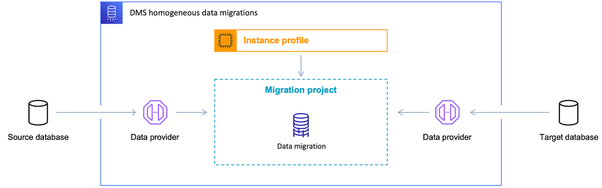

# Migrating databases to their Amazon RDS equivalents with AWS DMS

Homogeneous data migrations in AWS Database Migration Service (AWS DMS) simplify the migration of self-managed, on-premises
databases to their Amazon Relational Database Service (Amazon RDS) equivalents. For example, you can use homogeneous data migrations to migrate an
on-premises PostgreSQL database to Amazon RDS for PostgreSQL or Aurora PostgreSQL. For homogeneous data migrations, AWS DMS uses
native database tools to provide easy and performant like-to-like migrations.

Homogeneous data migrations are serverless, which means that AWS DMS automatically scales the
resources that are required for your migration. With homogeneous data migrations, you can migrate data, table partitions,
data types, and secondary objects such as functions, stored procedures, and so on.

At a high level, homogeneous data migrations operate with instance profiles, data providers, and migration projects.
When you create a migration project with the compatible source and target data providers of the same
type, AWS DMS deploys a serverless environment where your data migration runs. Next, AWS DMS connects to
the source data provider, reads the source data, dumps the files on the disk, and restores the data
using native database tools. For more information about instance profiles, data providers, and
migration projects, see [Working with data providers, instance profiles,
and migration projects in AWS DMS](migration-projects.md "migration-projects.md").

For the list of supported source databases, see [Sources for DMS homogeneous data migrations](CHAP_Introduction.md#CHAP_Introduction.Sources.HomogeneousDataMigrations "CHAP_Introduction.md#CHAP_Introduction.Sources.HomogeneousDataMigrations").

For the list of supported target databases, see [Targets for DMS homogeneous data migrations](CHAP_Introduction.md#CHAP_Introduction.Targets.HomogeneousDataMigrations "CHAP_Introduction.md#CHAP_Introduction.Targets.HomogeneousDataMigrations").

The following diagram illustrates how homogeneous data migrations work.

The following sections provide information about using homogeneous data migrations.

###### Topics

- [Supported AWS Regions](#data-migrations-supported-regions "#data-migrations-supported-regions")
- [Features](#data-migrations-features "#data-migrations-features")
- [Limitations for homogeneous data migrations](#data-migrations-limitations "#data-migrations-limitations")
- [Overview of the homogeneous data migration process in AWS DMS](dm-getting-started.md "dm-getting-started.md")
- [Setting up homogeneous data migrations in AWS DMS](dm-prerequisites.md "dm-prerequisites.md")
- [Creating source data providers for homogeneous data migrations in AWS DMS](dm-data-providers-source.md "dm-data-providers-source.md")
- [Creating and setting a target database to work with AWS DMS schema conversion](dm-data-providers-target.md "dm-data-providers-target.md")
- [Running homogeneous data migrations in AWS DMS](dm-migrating-data.md "dm-migrating-data.md")
- [Troubleshooting for homogeneous data migrations in AWS DMS](dm-troubleshooting.md "dm-troubleshooting.md")

## Supported AWS Regions

You can run homogeneous data migrations in the following AWS Regions.

| Region Name               | Region         |
| ------------------------- | -------------- |
| US East (N. Virginia)     | us-east-1      |
| US East (Ohio)            | us-east-2      |
| US West (N. California)   | us-west-1      |
| US West (Oregon)          | us-west-2      |
| Canada (Central)          | ca-central-1   |
| Canada West (Calgary)     | ca-west-1      |
| South America (São Paulo) | sa-east-1      |
| Asia Pacific (Tokyo)      | ap-northeast-1 |
| Asia Pacific (Seoul)      | ap-northeast-2 |
| Asia Pacific (Osaka)      | ap-northeast-3 |
| Asia Pacific (Singapore)  | ap-southeast-1 |
| Asia Pacific (Sydney)     | ap-southeast-2 |
| Asia Pacific (Jakarta)    | ap-southeast-3 |
| Asia Pacific (Melbourne)  | ap-southeast-4 |
| Asia Pacific (Hong Kong)  | ap-east-1      |
| Asia Pacific (Mumbai)     | ap-south-1     |
| Asia Pacific (Hyderabad)  | ap-south-2     |
| Europe (Frankfurt)        | eu-central-1   |
| Europe (Zurich)           | eu-central-2   |
| Europe (Stockholm)        | eu-north-1     |
| Europe (Ireland)          | eu-west-1      |
| Europe (London)           | eu-west-2      |
| Europe (Paris)            | eu-west-3      |
| Europe (Milan)            | eu-south-1     |
| Europe (Spain)            | eu-south-2     |
| Middle East (UAE)         | me-central-1   |
| Middle East (Bahrain)     | me-south-1     |
| Israel (Tel Aviv)         | il-central-1   |
| Africa (Cape Town)        | af-south-1     |

## Features

Homogeneous data migrations provide the following features:

- AWS DMS automatically manages the compute and storage resources in the AWS Cloud
  that are required for homogeneous data migrations. AWS DMS deploys these resources in a serverless
  environment when you start a data migration.
- AWS DMS uses native database tools to initiate a fully-automated migration between
  the databases of the same type.
- You can use homogeneous data migrations to migrate your data as well as the secondary objects such as partitions,
  functions, stored procedures, and so on.
- You can run homogeneous data migrations in the following three migration modes: full load, ongoing replication,
  and full load with ongoing replication.
- For homogeneous data migrations, you can use on-premises, Amazon EC2, Amazon RDS databases as a source. You can choose
  Amazon RDS or Amazon Aurora as a migration target for homogeneous data migrations.
- Homogeneous data migrations only support target table preparation mode for
  PostgreSQL, MongoDB, and Amazon DocumentDB migrations. For more information, see
  [Target table preparation mode](dm-migrating-data-table-prep.md "dm-migrating-data-table-prep.md").
- You can use homogeneous data migrations to migrate your data from a
  MySQL-based read-replica to Amazon RDS or Aurora instance

## Limitations for homogeneous data migrations

The following limitations apply when you use homogeneous data migrations:

- The Support for selection rules in AWS DMS homogeneous data migrations depends
  on the source database engine and migration type. PostgreSQL and
  MongoDB-compatible sources support selection rules for all migration types,
  while MySQL sources only support selection rules for the Full Load migration
  type.
- Homogeneous data migrations don't provide a built-in tool for data validation.
- When using homogeneous data migrations with PostgreSQL, AWS DMS migrates views as tables to your target database.
- Homogeneous data migrations capture schema-level changes during an ongoing
  data replication only for MySQL engine. For other engines, if you create a new
  table in your source database, then AWS DMS can't migrate this table. To migrate
  this new table, restart your data migration.
- You can't use homogeneous data migrations in AWS DMS to migrate data from a higher database version to a lower database
  version.
- Homogeneous data migrations don't support establishing a connection with database instances in VPC secondary CIDR ranges.
- You can't use the 8081 port for homogeneous migrations from your data providers.
- Homogeneous data migrations migrate encrypted MySQL databases and tables as
  unencrypted on the target database. This is because RDS for MySQL does not support
  encryption using Keyring plugin. For more information, see [MySQL Keyring Plugin not supported documentation](../../../AmazonRDS/latest/UserGuide/MySQL.md#MySQL.Concepts.Limits.KeyRing "../../../AmazonRDS/latest/UserGuide/MySQL.md#MySQL.Concepts.Limits.KeyRing") in the Amazon RDS User Guide.
