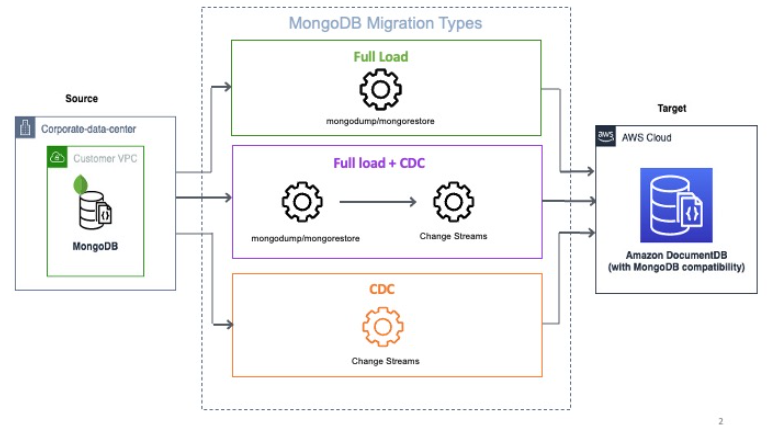

# Migrating data from MongoDB databases

with homogeneous data migrations in AWS DMS

You can use [Homogeneous data migrations](data-migrations.md "data-migrations.md") to migrate a self-managed MongoDB
database to Amazon DocumentDB.
AWS DMS creates a serverless environment for your data migration. For different types of data migrations,
AWS DMS uses different native MongoDB database tools.

For homogeneous data migrations of the **Full load** type, AWS DMS uses `mongodump` to read data from
your source database and store it on the disk attached to the serverless environment. After AWS DMS reads
all your source data, it uses `mongorestore` in the target database to restore your data.

For homogeneous data migrations of the **Full load and change data capture (CDC)** type, AWS DMS uses
`mongodump` to read data from your source database and store it on the disk attached to the serverless
environment. After AWS DMS reads all your source data, it uses `mongorestore` in the target database to restore
your data. After AWS DMS completes the full load, it automatically switches to a publisher and subscriber
model for logical replication. In this model, we recommend sizing the oplog to retain changes for at least 24 hours.

For homogeneous data migrations of the **Change data capture (CDC)** type, choose `immediately` in the data migration
settings to automatically capture the start point for the replication when the actual data migration starts.

###### Note

For any new or renamed collection, you need to create a new data migration task for those collections as
homogeneous data migrations. For a MongoDB-compatible source, AWS DMS doesn't support `create`, `rename`
and `drop collection` operations.

The following diagram shows the process of using homogeneous data migrations in AWS DMS to migrate a MongoDB database to Amazon DocumentDB.

