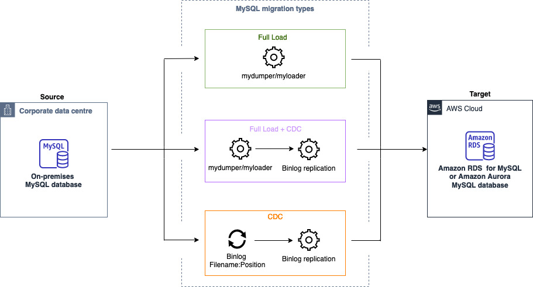

# Migrating data from MySQL databases

with homogeneous data migrations in AWS DMS

You can use [Homogeneous data migrations](data-migrations.md "data-migrations.md") to migrate a self-managed MySQL database to RDS for MySQL or Aurora MySQL.
AWS DMS creates a serverless environment for your data migration. For different types of data
migrations, AWS DMS uses different native MySQL database tools.

For homogeneous data migrations of the **Full load** type, AWS DMS uses mydumper
to read data from your source database and store it on the disk attached to the serverless
environment. After AWS DMS reads all your source data, it uses myloader in the target
database to restore your data.

For homogeneous data migrations of the **Full load and change data capture (CDC)**
type, AWS DMS uses mydumper to read data from your source database and store it on the
disk attached to the serverless environment. After AWS DMS reads all your source data,
it uses myloader in the target database to restore your data. After AWS DMS completes
the full load, it sets up the binlog replication with the binlog position set to the
start of the full load.

For homogeneous data migrations of the **Change data capture (CDC)** type, AWS DMS
requires the **Native CDC start point** to start the replication. If you
provide the native CDC start point, then AWS DMS captures changes from that point.
Alternatively, choose **Immediately** in the data migration settings
to automatically capture the start point for the replication when the actual data
migration starts.

###### Note

For a CDC-only migration to work properly, all source database schemas and objects must already be present
on the target database. The target may have objects that are not present on the source, however.

You can use the following code example to get the current log sequence number (LSN) in
your MySQL database.

```
show master status
```

This query returns a binlog file name and the position. For the native start point, use
a combination of the binlog file name and the position. For example, `mysql-bin-changelog.000024:373`.
In this example, `mysql-bin-changelog.000024` is the binlog file name and
`373` is the position where AWS DMS starts capturing changes.

The following diagram shows the process of using homogeneous data migrations in AWS DMS to migrate a MySQL database
to RDS for MySQL or Aurora MySQL.


