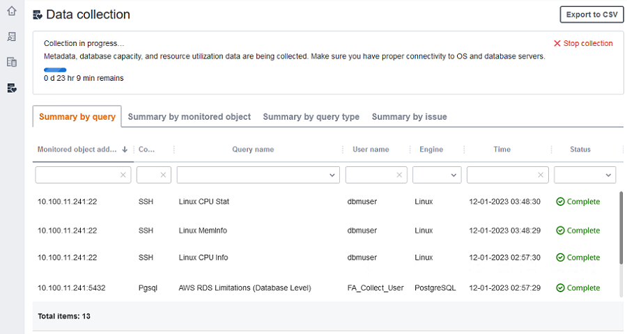

# Collecting data for AWS DMS Fleet Advisor

###### Important

End of support notice: On May 20, 2026, AWS will end support for AWS Database Migration Service Fleet
Advisor. After May 20, 2026, you will no longer be able to access the AWS DMS Fleet
Advisor console or AWS DMS Fleet Advisor resources. For more information, see [AWS DMS Fleet
Advisor end of support](dms_fleet.md "dms_fleet.md").

To start collecting data, select the objects on the **Monitored objects**
page, and choose **Run data collection**. DMS data collector can collect from up to 100
databases at one time. Also, DMS data collector can use up to eight parallel threads to connect to
databases in your environment. From these eight threads, DMS data collector can use up to five parallel
threads to connect to a single database instance.

###### Important

Before starting to collect data, view the **Software check**
section on the DMS data collector home page. Verify that all database engines that you want
to monitor have the **Passed** status. If some database engines
have the **Failed** status, and you have database servers with
corresponding engines in your monitored objects list, fix the issue before proceeding.
You can find tips next to the **Failed** status listed in the
**Software check** section.

DMS data collector can work in two modes: single run or ongoing monitoring. After you start data
collection, the **Run data collection** dialog box opens. Next, choose
one of the two following options.

**Metadata and database capacity**

DMS data collector collects information from the database or OS servers. It includes
schemas, versions, editions, CPU, memory, and disk capacity. DMS data collector also collects
and provides metrics such as IOPS, I/O throughput and active datbase server connections.
You can compute target recommendations in DMS Fleet Advisor based on this information. If the source
database is over- or underprovisioned, then the target recommendations also
will be over- or underprovisioned.

This is the default option.

**Metadata, database capacity, and resource utilization**

In addition to metadata and database capacity information, DMS data collector collects actual
utilization metrics of CPU, memory, and disk capacity for the databases or OS servers.
DMS data collector also collects and provides metrics such as IOPS, I/O throughput and active datbase server connections.
Target recommendations provided will be more accurate because they are based on the
actual database workloads.

If you choose this option, then you set the period of data collection. You can collect
data during the **Next 7 days** or set the **Custom range**
of 1–60 days.

After data collection begins, you're redirected to the **Data
collection** page, where you can see how the collection queries run
and monitor the live progress. Here, you can view overall collection health or on the DMS data collector home page.
If overall data collection health is less than 100 percent, you might need to fix issues
related to the collection.

If you run the DMS data collector in the **Metadata and database capacity** mode,
then you can see the number of completed queries on the **Data collection** page.

If you run the DMS data collector in the **Metadata, database capacity, and resource utilization** mode,
then you can see the remaining time before your DMS data collector completes the monitoring.

On the **Data collection** page, you can see the collection status
for each object. If something isn't working properly, a message appears showing how
many issues occurred. To help determine a fix to an issue, you can check details. The
following tabs list potential issues:

- **Summary by query** – Shows status of
  tests like the Ping test. You can filter results in the
  **Status** column. The **Status**
  column provides a message indicating how many failures occurred during data
  collection.
- **Summary by a monitored object** – Shows
  overall status per object.
- **Summary by query type** – Shows status
  for type of collector query, such as SQL, Secure Shell (SSH), or Windows Management
  Instrumentation (WMI) calls.
- **Summary by issue** – Shows all unique
  issues that occurred, with issue names and the number of times that each
  issue occurs.

To export the collection results, choose **Export to CSV**.

After identifying issues and resolving them, choose **Start
collection** and rerun the data collection process. After performing
data collection, the data collector uses secure connections to upload collected data
to a DMS Fleet Advisor inventory. DMS Fleet Advisor stores information in your
Amazon S3 bucket. For information about configuring credentials for data forwarding,
see [Configuring credentials for
data forwarding](fa-data-collectors-install.md#fa-data-collectors-configure "fa-data-collectors-install.md#fa-data-collectors-configure").

## Collecting capacity and resource utilization metrics

with AWS DMS Fleet Advisor

You can collect metadata and performance metrics in two modes: single run or ongoing
monitoring. Depending on the option that you select, your DMS data collector tracks different
metrics in your data environment. During a single run, your DMS data collector tracks only metadata
metrics from your database and OS servers. During ongoing monitoring, your DMS data collector
tracks the actual utilization of your resources.

AWS DMS gathers the following metadata and metrics during a single run of your
DMS data collector.

- Available memory on your OS servers
- Available storage on your OS servers
- Database version and edition
- Number of CPUs on your OS servers
- Number of schemas
- Number of stored procedures
- Number of tables
- Number of triggers
- Number of views
- Schema structure

DMS Fleet Advisor uses these metrics to build an inventory of your database and OS servers.
Also, DMS Fleet Advisor uses these metadata and metrics to analyze your source database
schemas.

DMS Fleet Advisor can generate target recommendations using the metrics collected during a
single run of the data collector. However, in this case for your overprovisioned
source databases, the target recommendation is also overprovisioned. Thus, you incur
additional costs on the maintenance of your resources in the AWS Cloud. For
underprovisioned source databases, the target recommendation is also
underprovisioned, which might lead to performance issues. We recommend to collect
the data using ongoing monitoring by choosing the metadata, database capacity, and
resource utilization mode for the DMS data collector.

AWS DMS gathers the following metrics during ongoing monitoring. You can run your
DMS data collector for a period of 1 to 60 days.

- I/O throughput on your database servers
- Input/output operations per second (IOPS) on your database servers
- Number of CPUs that your OS servers use
- Memory usage on your OS servers
- Number of active database and OS server connections

DMS Fleet Advisor uses these metrics to generate accurate target recommendations, so your
target databases meet your performance needs. This can prevent additional cost incurred on
the maintenance of your resources in the AWS Cloud.

## How does the AWS DMS Fleet Advisor collect capacity

and resource utilization metrics?

DMS Fleet Advisor collects performance metrics every minute.

For Oracle and SQL Server, DMS Fleet Advisor runs SQL queries to capture values for each database metric.

For MySQL and PostgreSQL, DMS Fleet Advisor collects performance metrics from the OS server where your database
runs. In Windows, DMS Fleet Advisor runs WMI Query Language (WQL) scripts and receives WMI data. In Linux,
DMS Fleet Advisor runs commands that capture the OS server metrics.

###### Important

Running remote SQL scripts can impact the performance of your production databases. However,
the data collection queries don't contain any calculation logic. Thus, the data
collection process isn't likely to use more than 1 percent of your database
resources.

You can view all queries that the data collector runs to collect metrics. To do
so, open the `DMSCollector.Collections.json` file. You can find
this file in the `etc` folder located in the same folder where
you installed the data collector. The default path is
`C:\ProgramData\Amazon\AWS DMS
 Collector\etc\DMSCollector.Collections.json`.

The DMS data collector uses the local file system as the temporary storage for all collected
data. The DMS data collector stores the collected data in JSON format. You can use the local
collector in an offline mode and manually check or verify the collected files before
you configure data forwarding. You can see all collected files in the
`out` folder located in the same folder where you installed
the DMS data collector. The default path is `C:\ProgramData\Amazon\AWS DMS
 Collector\out`.

###### Important

If you run your DMS data collector in an offline mode and store the collected data on your server for
more that 14 days, then you can't use Amazon CloudWatch to display these metrics. However, DMS Fleet Advisor still uses this
data to generate recommendations. For more information about CloudWatch charts, see [Recommendation details](fa-recommendations-view.md "fa-recommendations-view.md").

You can also check or verify the collected data files in an online mode. The DMS data collector forwards all data
to the Amazon S3 bucket that you specified in the DMS data collector settings.

You can use your DMS data collector to collect data from on-premises databases. Also, you can collect data from
Amazon RDS and Aurora databases. However, you can't successfully run all DMS data collector queries in the cloud because
of the differences between Amazon RDS or Aurora and on-premises DB instances. Because the DMS data collector gathers
utilization metrics for MySQL and PostgreSQL databases from the host OS, this approach won't work with
Amazon RDS and Aurora.
