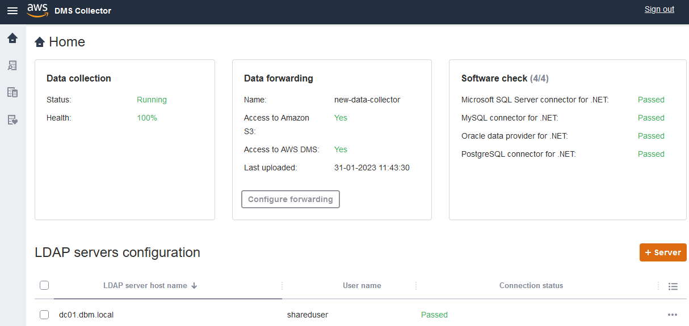

# Installing and configuring a data

collector in AWS DMS

###### Important

End of support notice: On May 20, 2026, AWS will end support for AWS Database Migration Service Fleet
Advisor. After May 20, 2026, you will no longer be able to access the AWS DMS Fleet
Advisor console or AWS DMS Fleet Advisor resources. For more information, see [AWS DMS Fleet
Advisor end of support](dms_fleet.md "dms_fleet.md").

Learn how to install your DMS data collector, how to specify data forwarding credentials, and how
to add an LDAP server to your project.

The following table describes hardware and software requirements for installing
an DMS data collector.

| Minimum                                                               | Recommended                                                            |
| --------------------------------------------------------------------- | ---------------------------------------------------------------------- |
| **Processor**: 2 cores with CPU benchmark score greater than 8,000 | **Processor**: 4 cores with CPU benchmark score greater than 11,000 |
| **RAM**: 8 GB                                                         | **RAM**: 16 GB                                                         |
| **Hard drive size**: 256 GB                                           | **Hard drive size**: 512 GB                                            |
| **Operating system**: Microsoft Windows Server 2012 or higher      | **Operating system**: Windows Server 2016 or higher                 |

###### To install a data collector on a client on your network

1. Run the **.MSI** installer. The **AWS DMS Fleet Advisor
   Collector Setup Wizard** page appears.
2. Choose **Next**. The **End-user license agreement**
   appears.
3. Read and accept the **End-user license agreement**.
4. Choose **Next**. The **Destination folder** page
   appears.
5. Choose **Next** to install the data collector in the default
   directory.

Or choose **Change** to enter another install directory. Then
choose **Next**. 6. On the **Desktop shortcut** page, select the box to install an
icon on your desktop. 7. Choose **Install**. The data collector is installed in the directory
that you chose. 8. On the **Completed DMS Collector Setup Wizard** page, choose
**Launch AWS DMS Collector**, and then choose **Finish**.
Your DMS data collector uses .NET libraries, connectors, and data providers to connect to your
source databases. The DMS data collector installer automatically installs this required software
for all supported databases on your server.

After you install the data collector, you can run it from a browser by entering
`http://localhost:11000/` as the address. Optionally, from the
Microsoft Windows **Start** menu, choose **AWS DMS
Collector** in the list of programs. When you first run DMS data collector, you are
asked to configure credentials. Create the user name and password for signing in to the
data collector.

On the DMS data collector home page, you can find information for preparing and running metadata
collection, including the following status conditions:

- Status and health of your data collection.
- Accessibility to your Amazon S3 bucket and to AWS DMS so the data collector can
  forward data to AWS DMS.
- Connectivity to your installed database drivers.
- Credentials of an LDAP server to perform initial discovery.

DMS data collector uses an LDAP directory to gather information about the machines and
database servers in your network. _Lightweight Directory Access
Protocol (LDAP)_ is an open standard application protocol. It's used for
accessing and maintaining distributed directory information services over an IP network.
You can add an existing LDAP server to your project for data collector that you can use
for discovering information about the infrastructure of your systems. To do so, choose
the **+Server** option, then specify a fully qualified domain name
(FQDN) and the credentials for your domain controller. After adding the server, validate
the connection check. To get started with the discovery process, see [Discovering OS and database servers to
monitor in AWS DMS](fa-discovery.md "fa-discovery.md").

## Configuring credentials for

data forwarding

After you install the data collector, make sure that this application can send the
collected data to AWS DMS Fleet Advisor.

###### To configure credentials for data forwarding in AWS DMS Fleet Advisor

1. On the DMS data collector home page, in the **Data forwarding** section,
   choose **Configure forwarding**. The **Configure credentials
   for data forwarding** dialog box opens.
2. Choose the AWS Region where you intend to use DMS Fleet Advisor.
3. Enter your **AWS Access Key ID** and your
   **AWS Secret Access Key** obtained earlier when you created
   IAM resources. For more information, see [Create IAM resources](fa-resources.md#fa-resources-iam "fa-resources.md#fa-resources-iam").
4. Choose **Browse data collectors**.

If you haven't created a data collector in the specified Region yet,
create a data collector before proceeding. For more information, see [Creating a data collector](fa-data-collectors-create.md "fa-data-collectors-create.md"). 5. In the **Choose data collector** window, select a data
collector in the list and select **Choose**. 6. In the **Configure credentials for data forwarding**
dialog box, choose **Save**.

On the **DMS Collector** home page, in the **Data forwarding**
card, verify that the statuses of **Access to Amazon S3** and **Access to AWS DMS**
are set to **Yes**.

If you see that the status of **Access to Amazon S3** or **Access to AWS DMS**
is set to **No**, make sure that you created IAM resources for accessing Amazon S3 and DMS Fleet Advisor.
After you create these IAM resources with all required permissions, configure data forwarding again.
For more information, see [Create IAM resources](fa-resources.md#fa-resources-iam "fa-resources.md#fa-resources-iam").
