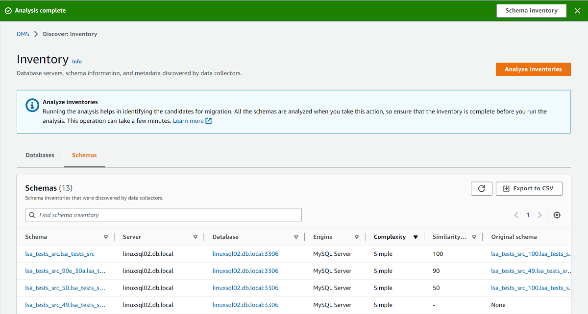

# Using a schema inventory for analysis in AWS DMS

###### Important

End of support notice: On May 20, 2026, AWS will end support for AWS Database Migration Service Fleet
Advisor. After May 20, 2026, you will no longer be able to access the AWS DMS Fleet
Advisor console or AWS DMS Fleet Advisor resources. For more information, see [AWS DMS Fleet
Advisor end of support](dms_fleet.md "dms_fleet.md").

You can view a list of database schemas discovered on servers within your network
from which the data was collected. Perform the following procedure.

###### To view a list of schemas on your network servers that data was

collected from

1. Choose **Inventory** on the console. The
   **Inventory** page opens.
2. Choose the **Schemas** tab. A list of schemas
   appears.
3. Select a schema in the list to view information about it, including server,
   database, size, and complexity.

For each schema, you can view an object summary that provides information
about object types, number of objects, object size, and lines of
code. 4. (Optional) Choose **Analyze inventories** to identify
duplicate schemas. DMS Fleet Advisor analyzes database schemas to define the intersection
of their objects. 5. You can export inventory information to a `.csv` file for further review.

To identify schemas to migrate and determine the migration target, you can use
AWS Schema Conversion Tool (AWS SCT) or DMS Schema Conversion. For more information, see [Using a new project wizard in AWS SCT](../../../SchemaConversionTool/latest/userguide/CHAP_UserInterface.md#CHAP_UserInterface.Wizard "../../../SchemaConversionTool/latest/userguide/CHAP_UserInterface.md#CHAP_UserInterface.Wizard").

After you have identified schemas to migrate, you can convert schemas using AWS SCT or DMS Schema Conversion.
For more information about DMS Schema Conversion, see [Converting database schemas using DMS Schema Conversion](CHAP_SchemaConversion.md "CHAP_SchemaConversion.md").
