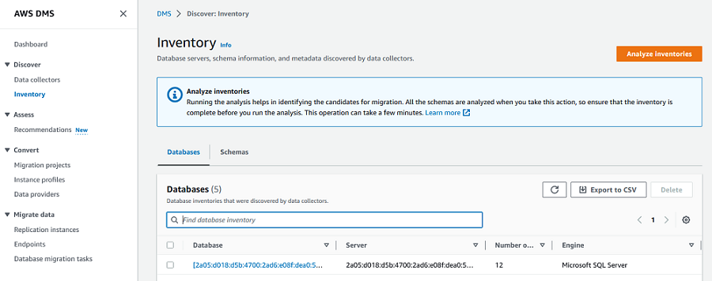

# Using inventories for analysis in AWS DMS Fleet Advisor

###### Important

End of support notice: On May 20, 2026, AWS will end support for AWS Database Migration Service Fleet
Advisor. After May 20, 2026, you will no longer be able to access the AWS DMS Fleet
Advisor console or AWS DMS Fleet Advisor resources. For more information, see [AWS DMS Fleet Advisor
end of support](dms_fleet.md "dms_fleet.md").

To check the feasibility of potential database migrations, you can work with
inventories of discovered databases and schemas. You can use the information in these
inventories to understand which databases and schemas are good candidates for
migration.

You can access database and schema inventories on the console. To do so, choose
**Inventory** on the console.

DMS Fleet Advisor analyzes your database schemas to determine the similarity of different schemas.
This analysis doesn't compare the actual code for objects. DMS Fleet Advisor compares only the names
of schema objects, such as functions and procedures, to identify similar objects in
different database schemas.

###### Topics

- [Using a database inventory for analysis in AWS DMS](fa-inventory-database.md "fa-inventory-database.md")
- [Using a schema inventory for analysis in AWS DMS](fa-inventory-schema.md "fa-inventory-schema.md")
