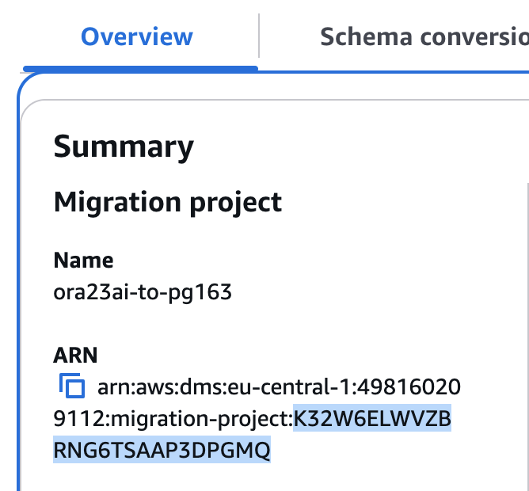

# Managing migration projects in DMS Schema Conversion

After you create an instance profile and compatible data providers for schema conversion,
create a migration project. For more information, see [Creating migration projects](migration-projects-create.md "migration-projects-create.md").

To use this new project in DMS Schema Conversion, on the **Migration projects** page,
choose your project from the list. Next, on the **Schema conversion** tab,
choose **Launch schema conversion**.

The first launch of DMS Schema Conversion requires some setup. AWS Database Migration Service (AWS DMS) starts a schema
conversion instance, which takes up to five minutes. This process also reads the metadata
from the source and target databases. After a successful first launch, you can access
DMS Schema Conversion faster.

Amazon terminates the schema conversion instance that your migration project uses in three
days after you complete the project. You can retrieve your converted schema and assessment
report from the Amazon S3 bucket that you use for DMS Schema Conversion.

## Specifying migration project settings for

DMS Schema Conversion

After you create your migration project and launch schema conversion, you can specify
migration project settings. You can change conversion settings to improve the
performance of converted code. Also, you can customize your schema conversion
view.

Conversion settings depend on your source and target database platforms. For more
information, see [Creating source data providers](data-providers-source.md "data-providers-source.md") and [Creating and setting target data providers](data-providers-target.md "data-providers-target.md").

To specify what schemas and databases you want to see in the source and target
database panes, use the tree view settings. You can hide empty schemas, empty databases,
system databases, and user-defined databases or schemas.

###### To hide databases and schemas in tree view

1.  Sign in to the AWS Management Console and open the AWS DMS console at [https://console.aws.amazon.com/dms/v2/](https://console.aws.amazon.com/dms/v2/ "https://console.aws.amazon.com/dms/v2/").
2.  Choose **Migration projects**. The **Migration
    projects** page opens.
3.  Choose your migration project, and on the **Schema
    conversion** tab choose **Launch schema
    conversion**.
4.  Choose **Settings**. The **Settings** page
    opens.
5.  In the **Tree view** section, do the following:

        * Choose **Hide empty schemas** to hide empty
         schemas.
        * Choose **Hide empty databases** to hide empty
         databases.
        * For **System databases or schemas**, choose system
         databases and schemas by name to hide them.
        * For **User-defined databases or schemas**, enter the
         names of user-defined databases and schemas that you want to hide.
         Choose **Add**. The names are case-insensitive.

        To add multiple databases or schemas, use a comma to separate their
         names. To add multiple objects with a similar name, use the percent (%)
         as a wildcard. This wildcard replaces any number of any symbols in the
         database or schema name.

    Repeat these steps for the **Source** and
    **Target** sections.

6.  Choose **Apply**, and then choose **Schema
    conversion**.

## Access logs for AWS DMS Schema

Conversion

1. Sign in to the AWS Management Console and open the AWS DMS console at [https://console.aws.amazon.com/dms/](https://console.aws.amazon.com/dms/ "https://console.aws.amazon.com/dms/").
2. Choose **Migration projects**. The **Migration projects** page opens.
3. Choose your migration project, and on the **Overview** tab copy migration project id from the **ARN** field.

 4. Open **CloudWatch** service. 5. Choose **Log groups** and enter
`dms-tasks-sct-{migration_project_id}` where
`{migration_project_id}` is the `id` from Step 3. 6. Inside the **Log group** you can find **Log stream** with logs.
