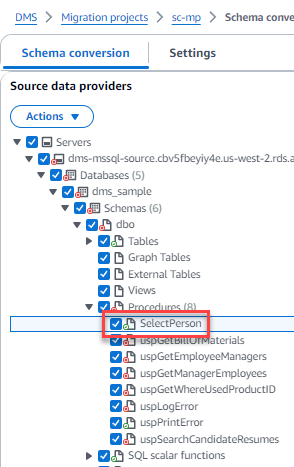
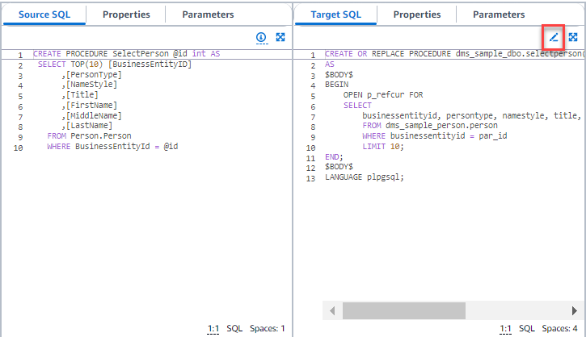

# Converting database schemas in

DMS Schema Conversion

After you create the migration project and connect to your source and target
databases, you can convert your source database objects to a format compatible with your
target database. DMS Schema Conversion displays your source database schema in the left panel in a
tree-view format.

Each node of the database tree is _lazy loaded_. When you choose a
node in the tree view, DMS Schema Conversion requests the schema information from your source
database at that time. To load the schema information faster, choose your schema, and
then choose **Load metadata** from the **Actions**
menu. DMS Schema Conversion then reads the database metadata and stores the information on an Amazon S3
bucket. You can now browse the database objects faster.

You can convert the whole database schema, or you can choose any schema item from your
source database to convert. If the schema item that you choose depends on a parent item,
then DMS Schema Conversion also generates the schema for the parent item. For example, when you
choose a table to convert, DMS Schema Conversion creates the converted table and the database schema
that the table is in.

## Converting database

objects

You can use DMS Schema Conversion to convert an entire database schema or separate database
schema objects.

###### To convert an entire database schema

1. Sign in to the AWS Management Console and open the AWS DMS console at [https://console.aws.amazon.com/dms/v2/](https://console.aws.amazon.com/dms/v2/ "https://console.aws.amazon.com/dms/v2/").
2. Choose **Migration projects**. The **Migration
   projects** page opens.
3. Choose your migration project, and then choose **Schema
   conversion**.
4. Choose **Launch schema conversion**. The **Schema
   conversion** page opens.
5. In the source database pane, select the check box for the schema
   name.
6. Choose this schema in the left pane of the migration project. DMS Schema Conversion
   highlights the schema name in blue and activates the
   **Actions** menu.
7. For **Actions**, choose **Convert**. The
   conversion dialog box appears.
8. Choose **Convert** in the dialog box to confirm your
   choice.

###### To convert your source database objects

1. Sign in to the AWS Management Console, and open the AWS DMS console at [https://console.aws.amazon.com/dms/v2/](https://console.aws.amazon.com/dms/v2/ "https://console.aws.amazon.com/dms/v2/").
2. Choose **Migration projects**. The **Migration
   projects** page opens.
3. Choose your migration project, and then choose **Schema
   conversion**.
4. Choose **Launch schema conversion**. The **Schema
   conversion** page opens.
5. In the source database pane, select your source database objects.
6. After you select all check boxes for the objects that you want to convert,
   choose the parent node for all selected objects in your left panel.

DMS Schema Conversion highlights the parent node in blue and activates the
**Actions** menu. 7. For **Actions**, choose **Convert**. The
conversion dialog box appears. 8. Choose **Convert** in the dialog box to confirm your
choice.

For example, to convert two out of 10 tables, select the check boxes for the two
tables that you want to convert. Notice that the **Actions** menu
is inactive. After you choose the **Tables** node, DMS Schema Conversion
highlights its name in blue and activates the **Actions** menu.
Then you can choose **Convert** from this menu.

Likewise, to convert two tables and three procedures, select the check boxes for
the object names. Then, choose the schema node to activate the
**Actions** menu, and choose **Convert
schema**.

## Editing and saving your

converted SQL code

The **Schema conversion** page allows you to edit converted SQL
code in your database objects. Use the following procedure to edit your converted
SQL code, apply the changes, and then save them.

###### To edit, apply changes to, and save your converted SQL code

1. In the **Schema conversion** page, open the tree view in
   the **Source data providers** pane to display a code
   object.

 2. From the **Source data providers** pane, choose
**Actions**, **Convert**. Confirm the
action. 3. When the conversion completes, to view the converted SQL, expand the
center pane if needed. To edit the converted SQL, choose the edit icon in
the **Target SQL** pane.

 4. After you edit the target SQL, confirm your changes by choosing the check
icon at the top of the page. Confirm the action. 5. In the **Target data providers** pane, choose
**Actions**, **Apply changes**.
Confirm the action. 6. DMS writes the edited procedure to the target data store.

## Reviewing converted database

objects

After you have converted your source database objects, you can choose an object in
the left pane of your project. You can then view the source and converted code for
that object. DMS Schema Conversion automatically loads the converted code for the object that you
selected in the left pane. You can also see the properties or parameters of the
object that you selected.

DMS Schema Conversion automatically stores the converted code as part of your migration
project. It doesn't apply these code changes to your target database. For more
information about applying converted code to your target database, see [Applying your converted
code](schema-conversion-save-apply.md#schema-conversion-apply "schema-conversion-save-apply.md#schema-conversion-apply"). To remove the converted code from your migration project, select your target
schema in the right pane, and then choose **Refresh from database**
from **Actions**.

After you have converted your source database objects, you can see the conversion
summary and action items in the lower-center pane. You can see the same information
when you create an assessment report. The assessment report is useful for
identifying and resolving schema items that DMS Schema Conversion can't convert. You can save the
assessment report summary and the list of conversion action items in CSV files. For
more information, see [Database migration assessment
reports](assessment-reports.md "assessment-reports.md").
