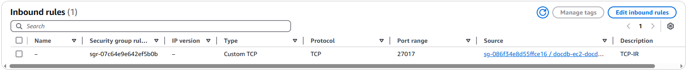

# Accessing an Amazon DocumentDB cluster in a VPC

Amazon DocumentDB supports the following scenarios for accessing a cluster in a VPC:

###### Topics

- [An Amazon EC2 instance in the same VPC](#access-inside-vpc "#access-inside-vpc")
- [An Amazon EC2 instance in a different VPC](#access-different-vpc "#access-different-vpc")

## A cluster in a VPC accessed by an Amazon EC2 instance in the same VPC

A common use of a cluster in a VPC is to share data with an application server that is running in an Amazon EC2 instance in the same VPC.

The simplest way to manage access between EC2 instances and clusters in the same VPC is to do the following:

- Create a VPC security group for your clusters to be in.
  This security group can be used to restrict access to the clusters.
  For example, you can create a custom rule for this security group.
  This might allow TCP access using the port that you assigned to the cluster when you created it and an IP address you use to access the cluster for development or other purposes.
- Create a VPC security group for your EC2 instances (web servers and clients) to be in.
  This security group can, if needed, allow access to the EC2 instance from the internet by using the VPC's routing table.
  For example, you can set rules on this security group to allow TCP access to the EC2 instance over port 22.
- Create custom rules in the security group for your clusters that allow connections from the security group you created for your EC2 instances.
  These rules might allow any member of the security group to access the clusters.

There is an additional public and private subnet in a separate Availability Zone.
An DocumentDB subnet group requires a subnet in at least two Availability Zones.
The additional subnet makes it easy to switch to a multi-AZ cluster deployment in the future.

For instructions on how to create a VPC with both public and private subnets for this scenario, see [Create an IPv4-only VPC for use with a DocumentDB cluster](docdb-vpc-create-ipv4.md "docdb-vpc-create-ipv4.md").

###### Tip

You can set up network connectivity between an Amazon EC2 instance and a DocumentDB cluster automatically when you create the cluster.
For more information, see [Connect Amazon EC2 automatically](connect-ec2-auto.md "connect-ec2-auto.md").

**To create a rule in a VPC security group that allows connections from another security group, do the following:**

1. Sign in to the AWS Management Console and open the Amazon VPC console at [https://console.aws.amazon.com/vpc](https://console.aws.amazon.com/vpc "https://console.aws.amazon.com/vpc").
2. In the navigation pane, locate and choose **Security groups**.
3. Choose or create a security group for which you want to allow access to members of another security group.
   This is the security group that you use for your clusters.
   Choose the **Inbound rules** tab, and then choose **Edit inbound rules**.
4. On the **Edit inbound rules** page, choose **Add rule**.
5. For **Type**, choose the entry that corresponds to the port you used when you created your cluster, such as **Custom TCP**.
6. In the **Source** field, start typing the ID of the security group, which lists the matching security groups.
   Choose the security group with members that you want to have access to the resources protected by this security group.
   In the scenario preceding, this is the security group that you use for your EC2 instance.
7. If required, repeat the steps for the TCP protocol by creating a rule with **All TCP** as the **Type** and your security group in the **Source** field.
   If you intend to use the UDP protocol, create a rule with **All UDP** as the **Type** and your security group in **Source**.
8. Choose **Save rules**.

The following screen shows an inbound rule with a security group for its source.

For more information about connecting to a cluster from your EC2 instance, see [Connect Amazon EC2 automatically](connect-ec2-auto.md "connect-ec2-auto.md").

## A cluster in a VPC accessed by an Amazon EC2 instance in a different VPC

When your clusters is in a different VPC from the EC2 instance you are using to access it, you can use VPC peering to access the cluster.

A VPC peering connection is a networking connection between two VPCs that enables you to route traffic between them using private IP addresses.
Resources in either VPC can communicate with each other as if they are within the same network.
You can create a VPC peering connection between your own VPCs, with a VPC in another AWS account, or with a VPC in a different AWS Region.
To learn more about VPC peering, see [VPC peering](../../../vpc/latest/userguide/vpc-peering.md "../../../vpc/latest/userguide/vpc-peering.md") in the _Amazon Virtual Private Cloud User Guide_.
