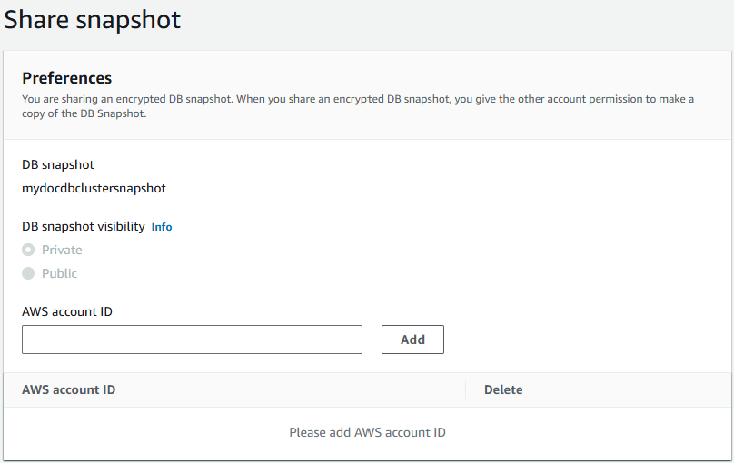

# Sharing Amazon DocumentDB cluster snapshots

Using Amazon DocumentDB, you can share a manual cluster snapshot in the following ways:

- Sharing a manual cluster snapshot, whether encrypted or unencrypted, enables authorized AWS accounts to copy the snapshot.
- Sharing a manual cluster snapshot, whether encrypted or unencrypted, enables authorized AWS accounts to directly restore a cluster from the snapshot instead of taking a copy of it and restoring from that.

###### Note

To share an automated cluster snapshot, create a manual cluster snapshot by copying the automated snapshot, and then share that copy.
This process also applies to AWS Backup–generated resources.

You can share a manual snapshot with up to 20 other AWS accounts.
You can also share an unencrypted manual snapshot as public, which
makes the snapshot available to all accounts. When sharing a snapshot
as public, ensure that none of your private information is included in
any of your public snapshots.

When sharing manual snapshots with other AWS accounts, and you
restore a cluster from a shared snapshot using the AWS CLI or the Amazon DocumentDB
API, you must specify the Amazon Resource Name (ARN) of the shared
snapshot as the snapshot identifier.

## Sharing an encrypted snapshot

The following restrictions apply to sharing encrypted snapshots:

- You can't share encrypted snapshots as public.
- You can't share a snapshot that has been encrypted using
  the default AWS KMS encryption key of the account that shared
  the snapshot.

Follow these steps to share encrypted snapshots.

1. Share the AWS Key Management Service (AWS KMS) encryption key that was used to
   encrypt the snapshot with any accounts that you want to be
   able to access the snapshot.

You can share AWS KMS encryption keys with another AWS
accounts by adding the other accounts to the AWS KMS key policy.
For details on updating a key policy, see [Using Key Policies in AWS KMS](../../../kms/latest/developerguide/key-policies.md "../../../kms/latest/developerguide/key-policies.md")
in the _AWS Key Management Service Developer Guide_. For an example of
creating a key policy, see [Creating an IAM policy to enable copying of the encrypted snapshot](#backup_restore-share_encrypted_snapshots-create_key_policy "#backup_restore-share_encrypted_snapshots-create_key_policy")
later in this topic. 2. Use the AWS CLI, [as shown below](#backup_restore-share_snapshots "#backup_restore-share_snapshots"),
to share the encrypted snapshot with the other accounts.

### Allowing access to an AWS KMS encryption key

For another AWS account to copy an encrypted snapshot shared
from your account, the account that you share your snapshot with
must have access to the AWS KMS key that encrypted the snapshot. To
allow another account access to an AWS KMS key, update the key
policy for the AWS KMS key with the ARN of the account that you are
sharing to as a principal in the AWS KMS key policy. Then allow the
`kms:CreateGrant` action.

After you give an account access to your AWS KMS encryption key,
to copy your encrypted snapshot, that account must create an
AWS Identity and Access Management (IAM) user if it doesn’t already have one. In
addition, that account must also attach an IAM policy to that
IAM user that allows the user to copy an encrypted snapshot
using your AWS KMS key. The account must be an IAM user and
cannot be a root AWS account identity due to AWS KMS security
restrictions.

In the following key policy example, user 123451234512 is the
owner of the AWS KMS encryption key. User 123456789012 is the
account that the key is being shared with. This updated key
policy gives the account access to the AWS KMS key. It does this by
including the ARN for the root AWS account identity for user
123456789012 as a principal for the policy, and by allowing the
`kms:CreateGrant` action.

JSON

```
`{
 "Id": "key-policy-1",
 "Version":"2012-10-17",
 "Statement": [
 {
 "Sid": "Allow use of the key",
 "Effect": "Allow",
 "Principal": {"AWS": [
 "arn:aws:iam::123451234512:user/KeyUser",
 "arn:aws:iam::123456789012:root"
 ]},
 "Action": [
 "kms:CreateGrant",
 "kms:Encrypt",
 "kms:Decrypt",
 "kms:ReEncrypt*",
 "kms:GenerateDataKey*",
 "kms:DescribeKey"
 ],
 "Resource": "*"},
 {
 "Sid": "Allow attachment of persistent resources",
 "Effect": "Allow",
 "Principal": {"AWS": [
 "arn:aws:iam::123451234512:user/KeyUser",
 "arn:aws:iam::123456789012:root"
 ]},
 "Action": [
 "kms:CreateGrant",
 "kms:ListGrants",
 "kms:RevokeGrant"
 ],
 "Resource": "*",
 "Condition": {"Bool": {"kms:GrantIsForAWSResource": true}}
 }
 ]
}`

```

### Creating an IAM policy to enable copying of the encrypted snapshot

When the external AWS account has access to your AWS KMS key,
the owner of that account can create a policy to allow an IAM
user that is created for the account to copy an encrypted
snapshot that is encrypted with that AWS KMS key.

The following example shows a policy that can be attached to
an IAM user for AWS account 123456789012. The policy enables
the IAM user to copy a shared snapshot from account
123451234512 that has been encrypted with the AWS KMS key
`c989c1dd-a3f2-4a5d-8d96-e793d082ab26` in the
us-west-2 Region.

JSON

```
`{
 "Version":"2012-10-17",
 "Statement": [
 {
 "Sid": "AllowUseOfTheKey",
 "Effect": "Allow",
 "Action": [
 "kms:Encrypt",
 "kms:Decrypt",
 "kms:ReEncrypt*",
 "kms:GenerateDataKey*",
 "kms:DescribeKey",
 "kms:CreateGrant",
 "kms:RetireGrant"
 ],
 "Resource": ["arn:aws:kms:us-west-2:123451234512:key/c989c1dd-a3f2-4a5d-8d96-e793d082ab26"]
 },
 {
 "Sid": "AllowAttachmentOfPersistentResources",
 "Effect": "Allow",
 "Action": [
 "kms:CreateGrant",
 "kms:ListGrants",
 "kms:RevokeGrant"
 ],
 "Resource": ["arn:aws:kms:us-west-2:123451234512:key/c989c1dd-a3f2-4a5d-8d96-e793d082ab26"],
 "Condition": {
 "Bool": {
 "kms:GrantIsForAWSResource": true
 }
 }
 }
 ]
}`

```

For details on updating a key policy, see [Using Key Policies in AWS KMS](../../../kms/latest/developerguide/key-policies.md "../../../kms/latest/developerguide/key-policies.md")
in the _AWS Key Management Service Developer Guide_.

## Sharing a snapshot

You can share an Amazon DocumentDB manual cluster snapshot (or a copy of an automated snapshot) using the AWS Management Console or the AWS CLI:

Using the AWS Management Console
To share a snapshot using the AWS Management Console, complete the following steps:

1. Sign in to the AWS Management Console, and open the Amazon DocumentDB console at [https://console.aws.amazon.com/docdb](https://console.aws.amazon.com/docdb "https://console.aws.amazon.com/docdb").
2. In the navigation pane, choose **Snapshots**.
3. Select the manual snapshot that you want to share.
4. In the **Actions** drop-down menu, choose Share.
5. Choose one of the following options for **DB snapshot visibility**:
   - If the source is unencrypted, choose **Public** to permit all AWS accounts to restore a cluster from your manual snapshot.
     Or choose **Private** to permit only AWS accounts that you specify to restore a cluster from your manual snapshot.

   ###### Warning

   If you set **DB snapshot visibility** to **Public**, all AWS accounts can restore a cluster from your manual snapshot and have access to your data.
   Do not share any manual cluster snapshots that contain private information as **Public**.
   - If the source is encrypted, **DB snapshot visibility** is set as **Private** because encrypted snapshots can't be shared as public.

   ###### Note

   Snapshots that have been encrypted with the default AWS KMS key can't be shared.

6. For **AWS Account ID**, enter the AWS account identifier for an account that you want to permit to restore a cluster from your manual snapshot, and then choose **Add**.
   Repeat to include additional AWS account identifiers, up to 20 AWS accounts.

If you make an error when adding an AWS account identifier to the list of permitted accounts, you can delete it from the list by choosing **Delete** at the right of the incorrect AWS account identifier.

 7. After you have added identifiers for all of the AWS accounts that you want to permit to restore the manual snapshot, choose **Save** to save your changes.

Using the AWS CLI
To share a snapshot using the AWS CLI, use the Amazon DocumentDB
`modify-db-snapshot-attribute` operation. Use the
`--values-to-add` parameter to add a list of the IDs for
the AWS accounts that are authorized to restore the manual snapshot.

The following example permits two AWS account identifiers,
123451234512 and 123456789012, to restore the snapshot named
`manual-snapshot1`. It also removes the `all`
attribute value to mark the snapshot as private.

For Linux, macOS, or Unix:

```
aws docdb modify-db-cluster-snapshot-attribute \
    --db-cluster-snapshot-identifier sample-cluster-snapshot \
    --attribute-name restore \
    --values-to-add '["123451234512","123456789012"]'
```

For Windows:

```
aws docdb modify-db-cluster-snapshot-attribute ^
    --db-cluster-snapshot-identifier sample-cluster-snapshot ^
    --attribute-name restore ^
    --values-to-add '["123451234512","123456789012"]'
```

Output from this operation looks something like the following.

```
{
    "DBClusterSnapshotAttributesResult": {
        "DBClusterSnapshotIdentifier": "sample-cluster-snapshot",
        "DBClusterSnapshotAttributes": [
            {
                "AttributeName": "restore",
                "AttributeValues": [
                    "123451234512",
                    "123456789012"
                ]
            }
        ]
    }
}
```

To remove an AWS account identifier from the list, use the
`--values-to-remove` parameter. The following example
prevents AWS account ID 123456789012 from restoring the snapshot.

For Linux, macOS, or Unix:

```
aws docdb modify-db-cluster-snapshot-attribute \
    --db-cluster-snapshot-identifier sample-cluster-snapshot \
    --attribute-name restore \
    --values-to-remove '["123456789012"]'
```

For Windows:

```
aws docdb modify-db-cluster-snapshot-attribute ^
    --db-cluster-snapshot-identifier sample-cluster-snapshot ^
    --attribute-name restore ^
    --values-to-remove '["123456789012"]'
```

Output from this operation looks something like the following.

```
{
    "DBClusterSnapshotAttributesResult": {
        "DBClusterSnapshotIdentifier": "sample-cluster-snapshot",
        "DBClusterSnapshotAttributes": [
            {
                "AttributeName": "restore",
                "AttributeValues": [
                    "123451234512"
                ]
            }
        ]
    }
}

```
