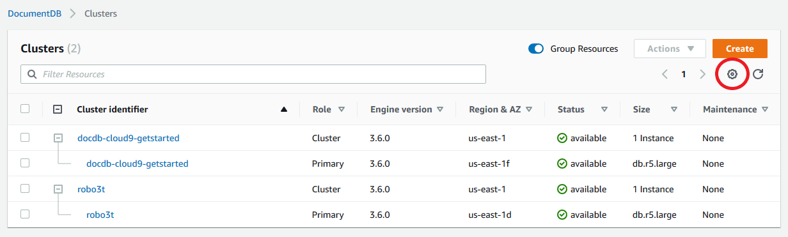

# Updating your Amazon DocumentDB TLS

certificates — GovCloud

###### Topics

- [Updating your application and Amazon DocumentDB cluster](#ca_cert_rotation-updating_application "#ca_cert_rotation-updating_application")
- [Troubleshooting](#ca_cert_rotation-troubleshooting "#ca_cert_rotation-troubleshooting")
- [Frequently Asked Questions](#ca_cert_rotation-faq "#ca_cert_rotation-faq")

###### Note

This information applies to users in the GovCloud (US-West) and GovCloud (US-East) regions.

The certificate authority (CA) certificate for Amazon DocumentDB (with MongoDB compatibility)
clusters will update on **May 18, 2022**. If you are using
Amazon DocumentDB clusters with Transport Layer Security (TLS) enabled (the default setting) and you
have not rotated your client application and server certificates, the following steps are
required to mitigate connectivity issues between your application and your Amazon DocumentDB
clusters.

- [Step 1: Download the new CA certificate and update your application](#ca_cert_rotation-pdt-updating_application_step1 "#ca_cert_rotation-pdt-updating_application_step1")
- [Step 2: Update the server certificate](#ca_cert_rotation-pdt-updating_application_step2 "#ca_cert_rotation-pdt-updating_application_step2")
  The CA and server certificates were updated as part of standard
  maintenance and security best practices for Amazon DocumentDB. The previous CA certificate will expire
  on May 18, 2022. Client applications must add the new CA certificates to their trust stores,
  and existing Amazon DocumentDB instances must be updated to use the new CA certificates before this
  expiration date.

## Updating your application and Amazon DocumentDB cluster

Follow the steps in this section to update your application's CA certificate bundle
([Step 1](ca_cert_rotation.md#ca_cert_rotation-pdt-updating_application_step1 "ca_cert_rotation.md#ca_cert_rotation-pdt-updating_application_step1")) and your cluster's server certificates ([Step 2](ca_cert_rotation.md#ca_cert_rotation-pdt-updating_application_step2 "ca_cert_rotation.md#ca_cert_rotation-pdt-updating_application_step2")). Before you apply the changes to your production environments, we
strongly recommend testing these steps in a development or staging environment.

###### Note

You must complete Steps 1 and 2 in each AWS Region in which you have Amazon DocumentDB
clusters.

### Step 1: Download the new CA certificate and update your application

Download the new CA certificate and update your application to use the new CA certificate to create TLS connections to Amazon DocumentDB in your specific region:

- For GovCloud (US-West), download the new CA certificate bundle from [https://truststore.pki.us-gov-west-1.rds.amazonaws.com/us-gov-west-1/us-gov-west-1-bundle.pem](https://truststore.pki.us-gov-west-1.rds.amazonaws.com/us-gov-west-1/us-gov-west-1-bundle.pem "https://truststore.pki.us-gov-west-1.rds.amazonaws.com/us-gov-west-1/us-gov-west-1-bundle.pem").
  This operation downloads a file named `us-gov-west-1-bundle.pem`.
- For GovCloud (US-East), download the new CA certificate bundle from [https://truststore.pki.us-gov-west-1.rds.amazonaws.com/us-gov-east-1/us-gov-east-1-bundle.pem](https://truststore.pki.us-gov-west-1.rds.amazonaws.com/us-gov-east-1/us-gov-east-1-bundle.pem "https://truststore.pki.us-gov-west-1.rds.amazonaws.com/us-gov-east-1/us-gov-east-1-bundle.pem").
  This operation downloads a file named `us-gov-east-1-bundle.pem`.

###### Note

If you are accessing the keystore that contains both the old CA certificate
(`rds-ca-2017-root.pem`) and the new CA certificates
(`rds-ca-rsa2048-g1.pem`, `rds-ca-rsa4096-g1.pem`, or `rds-ca-ecc384-g1.pem`), verify that the keystore selects your certificate of choice.
For details on each certificate, see Step 2 below.

```
wget https://truststore.pki.us-gov-west-1.rds.amazonaws.com/us-gov-west-1/us-gov-west-1-bundle.pem
```

```
wget https://truststore.pki.us-gov-west-1.rds.amazonaws.com/us-gov-east-1/us-gov-east-1-bundle.pem
```

Next, update your applications to use the new certificate
bundle. The new CA bundle contains both the old CA certificate and the new CA
certificate (`rds-ca-rsa2048-g1.pem`, `rds-ca-rsa4096-g1.pem`, or `rds-ca-ecc384-g1.pem`).
By having both CA certificates in the new CA bundle, you can update your application and cluster in two steps.

Any downloads of the CA certificate bundle after December
21, 2021 should use the new CA certificate bundle. To verify that your application is
using the latest CA certificate bundle, see [How can I be sure that I'm using
the newest CA bundle?](#ca_cert_rotation_pdt-faq_question13 "#ca_cert_rotation_pdt-faq_question13") If you're already using the
latest CA certificate bundle in your application, you can skip to Step 2.

For examples of using a CA bundle with your application, see [Encrypting data in transit](security.encryption.md "security.encryption.md") and [Connecting with TLS enabled](connect_programmatically.md#connect_programmatically-tls_enabled "connect_programmatically.md#connect_programmatically-tls_enabled").

###### Note

Currently, the MongoDB Go Driver 1.2.1 only accepts one CA server certificate in
`sslcertificateauthorityfile`. Please see [Connecting with TLS enabled](connect_programmatically.md#connect_programmatically-tls_enabled "connect_programmatically.md#connect_programmatically-tls_enabled") for connecting to Amazon DocumentDB using Go when TLS is enabled.

### Step 2: Update the server certificate

After the application has been updated to use the new CA bundle, the next step is to
update the server certificate by modifying each instance in an Amazon DocumentDB cluster. To
modify instances to use the new server certificate, see the following instructions.

Amazon DocumentDB provides the following CAs to sign the DB server certificate for a DB instance:

- **rds-ca-ecc384-g1**—Uses a certificate authority with ECC 384 private key algorithm and SHA384 signing algorithm.
  This CA supports automatic server certificate rotation.
  This is only supported on Amazon DocumentDB 4.0 and 5.0.
- **rds-ca-rsa2048-g1**—Uses a certificate authority with RSA 2048 private key algorithm and SHA256 signing algorithm in most AWS regions.
  This CA supports automatic server certificate rotation.
- **rds-ca-rsa4096-g1**—Uses a certificate authority with RSA 4096 private key algorithm and SHA384 signing algorithm. This CA supports automatic server certificate rotation.

###### Note

If you are using the AWS CLI, you can see the validities of the certificate authorities listed above by using [describe-certificates](../../../cli/latest/reference/docdb/describe-certificates.md "../../../cli/latest/reference/docdb/describe-certificates.md").

###### Note

Amazon DocumentDB 4.0 and 5.0 instances do **not** require a reboot.

Updating your Amazon DocumentDB 3.6 instances requires a reboot, which might cause service disruption.
Before updating the server certificate, ensure that you have completed [Step 1](ca_cert_rotation.md#ca_cert_rotation-pdt-updating_application_step1 "ca_cert_rotation.md#ca_cert_rotation-pdt-updating_application_step1").

Using the AWS Management Console
Complete the following steps to identify and rotate the old server certificate
for your existing Amazon DocumentDB instances using the AWS Management Console.

1. Sign in to the AWS Management Console, and open the Amazon DocumentDB console at
   [https://console.aws.amazon.com/docdb](https://console.aws.amazon.com/docdb "https://console.aws.amazon.com/docdb").
2. In the list of Regions in the upper-right corner of the screen, choose
   the AWS Region in which your clusters reside.
3. In the navigation pane on the left side of the console, choose
   **Clusters**.
4. You may need to identify which instances are still on the old server
   certificate (`rds-ca-2017`). You can do this in the
   **Certificate authority** column which is hidden by
   default. To show the **Certificate authority column**, do
   the following:
   1. Choose the **Settings** icon.

    2. Under the list of visible columns, choose the **Certificate
   authority** column. 3. Choose **Confirm** to save your changes.

5. Now back in the Clusters navigation box, you’ll see the column
   **Cluster Identifier**. Your instances are listed under
   clusters, similar to the screenshot below.

 6. Check the box to the left of the instance you are interested in. 7. Choose **Actions** and then choose
**Modify**. 8. Under **Certificate authority**, select the new server
certificate (`rds-ca-rsa2048-g1`, `rds-ca-rsa4096-g1`, or `rds-ca-ecc384-g1`) for this instance. 9. You can see a summary of the changes on the next page. Note that there is
an extra alert to remind you to ensure that your application is using the
latest certificate CA bundle before modifying the instance to avoid causing
an interruption in connectivity. 10. You can choose to apply the modification during your next maintenance
window or apply immediately. If your intention is to modify the server
certificate immediately, use the **Apply Immediately**
option. 11. Choose **Modify instance** to complete the
update.

Using the AWS CLI
Complete the following steps to identify and rotate the old server
certificate for your existing Amazon DocumentDB instances using the AWS CLI.

1. To modify the instances immediately, execute the following command for
   each instance in the cluster. Use one of the following certificates: `rds-ca-rsa2048-g1`,`rds-ca-rsa4096-g1`, or `rds-ca-ecc384-g1`.

```
aws docdb modify-db-instance --db-instance-identifier `<yourInstanceIdentifier>` --ca-certificate-identifier rds-ca-rsa4096-g1 --apply-immediately
```

2. To modify the instances in your clusters to use the new CA certificate during your cluster’s next maintenance window, execute the following command for each instance in the cluster.
   Use one of the following certificates: `rds-ca-rsa2048-g1`, `rds-ca-rsa4096-g1`, or `rds-ca-ecc384-g1`.

```
aws docdb modify-db-instance --db-instance-identifier `<yourInstanceIdentifier>` --ca-certificate-identifier rds-ca-rsa4096-g1 --no-apply-immediately
```

## Troubleshooting

If you are having issues connecting to your cluster as part of the certificate rotation,
we suggest the following:

- **Reboot your instances.** Rotating the new
  certificate requires that you reboot each of your instances. If you applied the new
  certificate to one or more instances but did not reboot them, reboot your instances
  to apply the new certificate. For more information, see [Rebooting an Amazon DocumentDB instance](db-instance-reboot.md "db-instance-reboot.md").
- **Verify that your clients are using the latest certificate
  bundle.** See [How can I be sure that I'm using
  the newest CA bundle?](#ca_cert_rotation_pdt-faq_question13 "#ca_cert_rotation_pdt-faq_question13").
- **Verify that your instances are using the latest
  certificate.** See [How do I know which of my Amazon DocumentDB
  instances are using the old/new server certificate?](#ca_cert_rotation_pdt-faq_question5 "#ca_cert_rotation_pdt-faq_question5").
- **Verify that the latest certificate CA is being utilized by
  your application.** Some drivers, like Java and Go, require extra code to
  import multiple certificates from a certificate bundle to the trust store. For more
  information on connecting to Amazon DocumentDB with TLS, see [Connecting programmatically to Amazon DocumentDB](connect_programmatically.md "connect_programmatically.md").
- **Contact support.** If you have questions or issues,
  contact [Support](https://aws.amazon.com/premiumsupport "https://aws.amazon.com/premiumsupport").

## Frequently Asked Questions

The following are answers to some common questions about TLS certificates.

### What if I have questions or

issues?

If you have questions or issues, contact [Support](https://aws.amazon.com/premiumsupport "https://aws.amazon.com/premiumsupport").

### How do I know whether I'm using TLS to

connect to my Amazon DocumentDB cluster?

You can determine whether your cluster is using TLS by examining the `tls`
parameter for your cluster’s cluster parameter group. If the `tls` parameter
is set to `enabled`, you are using the TLS certificate to connect to your
cluster. For more information, see [Managing Amazon DocumentDB cluster parameter groups](cluster_parameter_groups.md "cluster_parameter_groups.md").

### Why are you updating the CA and server

certificates?

The Amazon DocumentDB CA and server certificates were updated as part
of standard maintenance and security best practices for Amazon DocumentDB. The current CA and
server certificates will expire on Wednesday, May 18, 2022.

### What happens if I don't take any action

by the expiration date?

If you are using TLS to connect to your Amazon DocumentDB cluster and you do not make the
change by May 18, 2022, your applications that connect via TLS will no longer be able to
communicate with the Amazon DocumentDB cluster.

Amazon DocumentDB will not rotate your database certificates automatically before expiration.
You must update your applications and clusters to use the new CA certificates before or
after the expiration date.

### How do I know which of my Amazon DocumentDB

instances are using the old/new server certificate?

To identify the Amazon DocumentDB instances that still use the old server certificate, you can
use either the Amazon DocumentDB AWS Management Console or the AWS CLI.

###### To identify the instances in your clusters that are using the older

certificate

1.  Sign in to the AWS Management Console, and open the Amazon DocumentDB console at [https://console.aws.amazon.com/docdb](https://console.aws.amazon.com/docdb "https://console.aws.amazon.com/docdb").
2.  In the list of Regions in the upper-right corner of the screen, choose
    the AWS Region in which your instances reside.
3.  In the navigation pane on the left side of the console, choose
    **Instances**.
4.  The **Certificate authority**
    column (hidden by default) shows which instances are still on the old server
    certificate (`rds-ca-2017`) and the new server certificate
    (`rds-ca-rsa2048-g1`, `rds-ca-rsa4096-g1`, or `rds-ca-ecc384-g1`). To show the **Certificate
    authority column**, do the following:

        1. Choose the **Settings** icon.
        2. Under the list of visible columns, choose the **Certificate
         authority** column.
        3. Choose **Confirm** to save your changes.

    To identify the instances in your clusters that are using the older server
    certificate, use the `describe-db-clusters` command with the following
    .

```
aws docdb describe-db-instances \
    --filters Name=engine,Values=docdb \
    --query 'DBInstances[*].{CertificateVersion:CACertificateIdentifier,InstanceID:DBInstanceIdentifier}'

```

### How do I modify individual instances in

my Amazon DocumentDB cluster to update the server certificate?

We recommend that you update server certificates for all instances in a given cluster
at the same time. To modify the instances in your cluster, you can use either the
console or the AWS CLI.

###### Note

Updating your instances requires a reboot, which might cause service disruption.
Before updating the server certificate, ensure that you have completed [Step 1](ca_cert_rotation.md#ca_cert_rotation-pdt-updating_application_step1 "ca_cert_rotation.md#ca_cert_rotation-pdt-updating_application_step1").

1. Sign in to the AWS Management Console, and open the Amazon DocumentDB console at [https://console.aws.amazon.com/docdb](https://console.aws.amazon.com/docdb "https://console.aws.amazon.com/docdb").
2. In the list of Regions in the upper-right corner of the screen, choose
   the AWS Region in which your clusters reside.
3. In the navigation pane on the left side of the console, choose
   **Instances**.
4. The **Certificate authority** column (hidden by default)
   shows which instances are still on the old server certificate
   (`rds-ca-2017`). To show the **Certificate authority
   column**, do the following:
   1. Choose the **Settings** icon.
   2. Under the list of visible columns, choose the **Certificate
      authority** column.
   3. Choose **Confirm** to save your changes.

5. Select an instance to modify.
6. Choose **Actions** and then choose
   **Modify**.
7. Under **Certificate
   authority**, select one of the new server certificate (`rds-ca-rsa2048-g1`,`rds-ca-rsa4096-g1`, or `rds-ca-ecc384-g1`) for this instance.
8. You can see a summary of the changes on the next page. Note that there is
   an extra alert to remind you to ensure that your application is using the
   latest certificate CA bundle before modifying the instance to avoid causing
   an interruption in connectivity.
9. You can choose to apply the modification during your next maintenance
   window or apply immediately.
10. Choose **Modify instance** to complete the
    update.
    Complete the following steps to identify and rotate the old server
    certificate for your existing Amazon DocumentDB instances using the AWS CLI.

11. To modify the instances immediately, execute the following command for
    each instance in the cluster.

```
aws docdb modify-db-instance --db-instance-identifier `<yourInstanceIdentifier>` --ca-certificate-identifier rds-ca-rsa4096-g1 --apply-immediately
```

2. To modify the instances in your clusters to use the new CA certificate
   during your cluster’s next maintenance window, execute the following command
   for each instance in the cluster.

```
aws docdb modify-db-instance --db-instance-identifier `<yourInstanceIdentifier>` --ca-certificate-identifier rds-ca-rsa4096-g1 --no-apply-immediately
```

### What happens if I add a new instance to

an existing cluster?

All new instances that are created use the old server
certificate and require TLS connections using the old CA certificate. Any new Amazon DocumentDB
instances created after March 21, 2022 will default to using the new
certificates.

### What happens if there is an instance

replacement or failover on my cluster?

If there is an instance replacement in your cluster, the new instance that is created
continues to use the same server certificate that the instance was previously using. We
recommend that you update server certificates for all instances at the same time. If a
failover occurs in the cluster, the server certificate on the new primary is
used.

### If I'm not using TLS to connect to

my cluster, do I still need to update each of my instances?

If you are not using TLS to connect to your Amazon DocumentDB clusters, no action is
needed.

### If I'm not using TLS to connect to my

cluster but I plan to in the future, what should I do?

If you created a cluster before March 21, 2022, follow
[Step 1](ca_cert_rotation.md#ca_cert_rotation-pdt-updating_application_step1 "ca_cert_rotation.md#ca_cert_rotation-pdt-updating_application_step1") and [Step 2](ca_cert_rotation.md#ca_cert_rotation-pdt-updating_application_step2 "ca_cert_rotation.md#ca_cert_rotation-pdt-updating_application_step2") in the previous section to ensure that your application is using the
updated CA bundle, and that each Amazon DocumentDB instance is using the latest server
certificate. If you create a cluster after March 21, 2022, your cluster will already
have the latest server certificate. To verify that your application is using the latest
CA bundle, see [If I'm not using TLS to connect to
my cluster, do I still need to update each of my instances?](#ca_cert_rotation_pdt-faq_question10 "#ca_cert_rotation_pdt-faq_question10")

### Can the

deadline be extended beyond May 18, 2022?

If your applications are connecting via TLS, the deadline
cannot be extended beyond May 18, 2022.

### How can I be sure that I'm using

the newest CA bundle?

For compatibility reasons, both old and new CA bundle files are named
`us-gov-west-1-bundle.pem`. You can also use tools like
`openssl` or `keytool` to inspect the CA bundle.

### Why do I see "RDS" in the name of the

CA bundle?

For certain management features, such as certificate management, Amazon DocumentDB uses
operational technology that is shared with Amazon Relational Database Service (Amazon RDS).

### When will the new certificate

expire?

The new server certificate will expire (generally) as follows:

- **rds-ca-rsa2048-g1**—Expires 2061
- **rds-ca-rsa4096-g1**—Expires 2121
- **rds-ca-ecc384-g1**—Expires 2121

### What kind of errors will I see if I don't take action before the certificate expires?

Error messages will vary depending on your driver. In general, you'll see certificate validation errors that contain the string "certificate has expired".

### If I applied the new server

certificate, can I revert it back to the old server certificate?

If you need to revert an instance to the old server certificate, we recommend that
you do so for all instances in the cluster. You can revert the server certificate for
each instance in a cluster by using the AWS Management Console or the AWS CLI.

1. Sign in to the AWS Management Console, and open the Amazon DocumentDB console at [https://console.aws.amazon.com/docdb](https://console.aws.amazon.com/docdb "https://console.aws.amazon.com/docdb").
2. In the list of Regions in the upper-right corner of the screen, choose
   the AWS Region in which your clusters reside.
3. In the navigation pane on the left side of the console, choose
   **Instances**.
4. Select an instance to modify. Choose **Actions**, and
   then choose **Modify**.
5. Under **Certificate
   authority**, you can select the old server certificate (
   `rds-ca-2017`).
6. Choose **Continue** to view a summary of your
   modifications.
7. In this resulting page, you can choose to schedule your modifications to
   be applied in the next maintenance window or apply your modifications
   immediately. Make your selection, and choose **Modify
   instance**.

###### Note

If you choose to apply your modifications immediately, any changes in
the pending modifications queue are also applied. If any of the pending
modifications require downtime, choosing this option can cause unexpected
downtime.

```
aws docdb modify-db-instance --db-instance-identifier `<db_instance_name>` ca-certificate-identifier rds-ca-2017 `<--apply-immediately | --no-apply-immediately>`
```

If you choose `--no-apply-immediately`, the changes will be applied
during the cluster’s next maintenance window.

### If I restore from a snapshot or a

point in time restore, will it have the new server certificate ?

If you restore a snapshot or perform a point-in-time restore
after March 21, 2022, the new cluster that is created will use the new CA
certificate.

### What if I’m having issues connecting

directly to my Amazon DocumentDB cluster from Mac OS X Catalina?

Mac OS X Catalina has updated the requirements for trusted certificates. Trusted
certificates must now be valid for 825 days or fewer (see [https://support.apple.com/en-us/HT210176](https://support.apple.com/en-us/HT210176 "https://support.apple.com/en-us/HT210176")). Amazon DocumentDB instance certificates are
valid for over four years, longer than the Mac OS X maximum. In order to connect
directly to an Amazon DocumentDB cluster from a computer running Mac OS X Catalina, you must allow
invalid certificates when creating the TLS connection. In this case, invalid
certificates mean that the validity period is longer than 825 days. You should
understand the risks before allowing invalid certificates when connecting to your
Amazon DocumentDB cluster.

To connect to an Amazon DocumentDB cluster from OS X Catalina using the AWS CLI, use the
`tlsAllowInvalidCertificates` parameter.

```
mongo --tls --host <hostname> --username <username> --password <password> --port 27017 --tlsAllowInvalidCertificates
```
