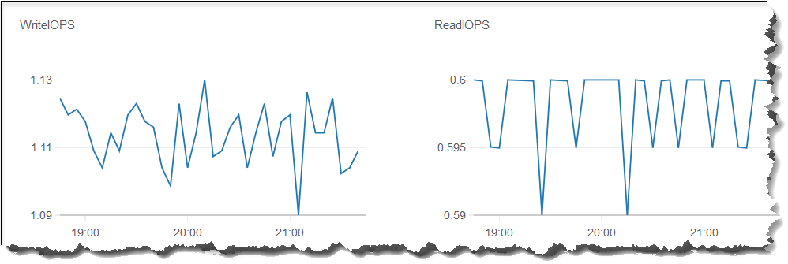
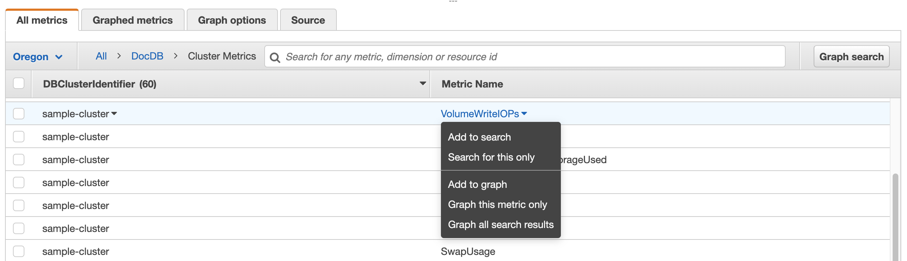

# Monitoring Amazon DocumentDB with CloudWatch

Amazon DocumentDB (with MongoDB compatibility) integrates with Amazon CloudWatch so that you can gather and analyze
operational metrics for your clusters. You can monitor these metrics using
the CloudWatch console, the Amazon DocumentDB console, the AWS Command Line Interface (AWS CLI), or the CloudWatch
API.

CloudWatch also lets you set alarms so that you can be notified if a metric
value breaches a threshold that you specify. You can even set up Amazon CloudWatch Events
to take corrective action if a breach occurs. For more information about
using CloudWatch and alarms, see the [Amazon CloudWatch documentation](../../../cloudwatch/index.md "../../../cloudwatch/index.md").

###### Topics

- [Amazon DocumentDB metrics](#cloud_watch-metrics_list "#cloud_watch-metrics_list")
- [Viewing CloudWatch data](#cloud_watch-view_data "#cloud_watch-view_data")
- [Amazon DocumentDB dimensions](#cloud_watch-metrics_dimensions "#cloud_watch-metrics_dimensions")
- [Monitoring Opcounter metrics](#cloud_watch-monitoring_opcounters "#cloud_watch-monitoring_opcounters")
- [Monitoring database connections](#cloud_watch-monitoring_connections "#cloud_watch-monitoring_connections")

## Amazon DocumentDB metrics

To monitor the health and performance of your Amazon DocumentDB cluster and
instances, you can view the following metrics in the Amazon DocumentDB console.

###### Note

Metrics in the following tables apply to both instance-based and elastic clusters.

###### Topics

- [Resource utilization metrics](#resource-utilization "#resource-utilization")
- [Latency metrics](#latency-metrics "#latency-metrics")
- [NVMe-backed instance metrics](#nvme-metrics "#nvme-metrics")
- [Operations metrics](#operations-metrics "#operations-metrics")
- [Throughput metrics](#throughput-metrics "#throughput-metrics")
- [System metrics](#system-metrics "#system-metrics")
- [T3 instance metrics](#t3-instance-metrics "#t3-instance-metrics")

### Resource utilization metrics

| Metric                             | Description                                                                                                                                                                                                                                                                                                                                                                                                                                                                                                                                                                                                                                                                        |
| ---------------------------------- | ---------------------------------------------------------------------------------------------------------------------------------------------------------------------------------------------------------------------------------------------------------------------------------------------------------------------------------------------------------------------------------------------------------------------------------------------------------------------------------------------------------------------------------------------------------------------------------------------------------------------------------------------------------------------------------- |
| `BackupRetentionPeriodStorageUsed` | The total amount of backup storage in bytes used to support<br>the point-in-time restore feature within the Amazon DocumentDB's<br>retention window. Included in the total reported by the<br>`TotalBackupStorageBilled` metric. Computed<br>separately for each Amazon DocumentDB cluster.                                                                                                                                                                                                                                                                                                                                                                                        |
| `ChangeStreamLogSize`              | The amount of storage used by your cluster<br>to store the change stream log in megabytes. This value is<br>a subset of the total storage for the cluster<br>(`VolumeBytesUsed`) and affects the cost of the<br>cluster. For storage pricing information, see the [Amazon DocumentDB product page](https://aws.amazon.com//documentdb/pricing "https://aws.amazon.com//documentdb/pricing").<br>The change stream log size is a function of how much change<br>is happening on your cluster and the change stream long<br>retention duration. For more information on change streams,<br>see [Using change streams with Amazon DocumentDB](change_streams.md "change_streams.md"). |
| `CPUUtilization`                   | The percentage of CPU used by an instance.                                                                                                                                                                                                                                                                                                                                                                                                                                                                                                                                                                                                                                         |
| `DatabaseConnections`              | The number of connections (active and idle) open on an<br>instance taken at a 1-minute frequency.                                                                                                                                                                                                                                                                                                                                                                                                                                                                                                                                                                                  |
| `DatabaseConnectionsMax`           | The maximum number of open database<br>connections (active and idle) on an instance in a 1-minute period.                                                                                                                                                                                                                                                                                                                                                                                                                                                                                                                                                                          |
| `DatabaseConnectionsLimit`         | The maximum number of concurrent database connections (active and idle) allowed on an instance at any given time.                                                                                                                                                                                                                                                                                                                                                                                                                                                                                                                                                                  |
| `DatabaseCursors`                  | The number of cursors open on an instance<br>taken at a 1-minute frequency.                                                                                                                                                                                                                                                                                                                                                                                                                                                                                                                                                                                                        |
| `DatabaseCursorsMax`               | The maximum number of open cursors on an<br>instance in a 1-minute period.                                                                                                                                                                                                                                                                                                                                                                                                                                                                                                                                                                                                         |
| `DatabaseCursorsLimit`             | The maximum number of cursors allowed on an instance at any given time.                                                                                                                                                                                                                                                                                                                                                                                                                                                                                                                                                                                                            |
| `DatabaseCursorsTimedOut`          | The number of cursors that timed out in a<br>1-minute period.                                                                                                                                                                                                                                                                                                                                                                                                                                                                                                                                                                                                                      |
| `FreeableMemory`                   | The amount of available random access<br>memory, in bytes.                                                                                                                                                                                                                                                                                                                                                                                                                                                                                                                                                                                                                         |
| `FreeLocalStorage`                 | This metric reports the amount of<br>storage available to each instance for temporary tables and<br>logs. This value depends on the instance class. You can<br>increase the amount of free storage space for an instance<br>by choosing a larger instance class for your instance.                                                                                                                                                                                                                                                                                                                                                                                                 |
| `LowMemThrottleQueueDepth`         | The queue depth for requests that are throttled due<br>to low available memory taken at a 1-minute frequency.                                                                                                                                                                                                                                                                                                                                                                                                                                                                                                                                                                      |
| `LowMemThrottleMaxQueueDepth`      | The maximum queue depth for requests that are<br>throttled due to low available memory in a 1-minute period.                                                                                                                                                                                                                                                                                                                                                                                                                                                                                                                                                                       |
| `LowMemNumOperationsThrottled`     | The number of requests that are throttled due to low<br>available memory in a 1-minute period.                                                                                                                                                                                                                                                                                                                                                                                                                                                                                                                                                                                     |
| `SnapshotStorageUsed`              | The total amount of backup storage in bytes<br>consumed by all snapshots for a given Amazon DocumentDB cluster<br>outside its backup retention window. Included in the total<br>reported by the `TotalBackupStorageBilled` metric.<br>Computed separately for each Amazon DocumentDB cluster.                                                                                                                                                                                                                                                                                                                                                                                      |
| `SwapUsage`                        | The amount of swap space used on the instance.                                                                                                                                                                                                                                                                                                                                                                                                                                                                                                                                                                                                                                     |
| `TotalBackupStorageBilled`         | The total amount of backup storage in bytes for which you are billed for a given Amazon DocumentDB cluster. Includes the backup storage measured by the `BackupRetentionPeriodStorageUsed` and `SnapshotStorageUsed` metrics. Computed separately<br>for each Amazon DocumentDB cluster.                                                                                                                                                                                                                                                                                                                                                                                           |
| `TransactionsOpen`                 | The number of transactions open on an instance taken at a 1-minute frequency.                                                                                                                                                                                                                                                                                                                                                                                                                                                                                                                                                                                                      |
| `TransactionsOpenMax`              | The maximum number of transactions open on an instance in a<br>1-minute period.                                                                                                                                                                                                                                                                                                                                                                                                                                                                                                                                                                                                    |
| `TransactionsOpenLimit`            | The maximum number of concurrent transactions allowed on an instance at any given time.                                                                                                                                                                                                                                                                                                                                                                                                                                                                                                                                                                                            |
| `VolumeBytesUsed`                  | The amount of storage used by your cluster<br>in bytes. This value affects the cost of the cluster. For<br>pricing information, see the [Amazon DocumentDB product page](https://aws.amazon.com//documentdb/pricing "https://aws.amazon.com//documentdb/pricing").                                                                                                                                                                                                                                                                                                                                                                                                                 |

### Latency metrics

| Metric                       | Description                                                                                                                        |
| ---------------------------- | ---------------------------------------------------------------------------------------------------------------------------------- |
| `DBClusterReplicaLagMaximum` | The maximum amount of lag, in milliseconds,<br>between the primary instance and each Amazon DocumentDB instance in<br>the cluster. |
| `DBClusterReplicaLagMinimum` | The minimum amount of lag, in milliseconds,<br>between the primary instance and each replica instance in<br>the cluster.           |
| `DBInstanceReplicaLag`       | The amount of lag, in milliseconds, when<br>replicating updates from the primary instance to a replica<br>instance.                |
| `ReadLatency`                | The average amount of time taken per disk<br>I/O operation.                                                                        |
| `WriteLatency`               | The average amount of time, in milliseconds,<br>taken per disk I/O operation.                                                      |

### NVMe-backed instance metrics

| Metric                       | Description                                                                               |
| ---------------------------- | ----------------------------------------------------------------------------------------- |
| `NVMeStorageCacheHitRatio`   | The percentage of requests that are served by the tiered cache.                           |
| `FreeNVMeStorage`            | The amount of available Ephemeral NVMe storage.                                           |
| `ReadIOPSNVMeStorage`        | The average number of disk read I/O operations to Ephemeral NVMe storage.                 |
| `ReadLatencyNVMeStorage`     | The average amount of time taken per disk read I/O operation for Ephemeral NVMe storage.  |
| `ReadThroughputNVMeStorage`  | The average number of bytes read from disk per second for Ephemeral NVMe storage.         |
| `WriteIOPSNVMeStorage`       | The average number of disk write I/O operations to Ephemeral NVMe storage.                |
| `WriteLatencyNVMeStorage`    | The average amount of time taken per disk write I/O operation for Ephemeral NVMe storage. |
| `WriteThroughputNVMeStorage` | The average number of bytes written to disk per second for Ephemeral NVMe storage.        |

### Operations metrics

| Metric                  | Description                                                               |
| ----------------------- | ------------------------------------------------------------------------- |
| `DocumentsDeleted`      | The number of deleted documents in a<br>1-minute period.                  |
| `DocumentsInserted`     | The number of inserted documents in a<br>1-minute period.                 |
| `DocumentsReturned`     | The number of returned documents in a<br>1-minute period.                 |
| `DocumentsUpdated`      | The number of updated documents in a<br>1-minute period.                  |
| `OpcountersCommand`     | The number of commands issued in a<br>1-minute period.                    |
| `OpcountersDelete`      | The number of delete operations issued in<br>a 1-minute period.           |
| `OpcountersGetmore`     | The number of getmores issued in a<br>1-minute period.                    |
| `OpcountersInsert`      | The number of insert operations issued in<br>a 1-minute period.           |
| `OpcountersQuery`       | The number of queries issued in a<br>1-minute period.                     |
| `OpcountersUpdate`      | The number of update operations issued in<br>a 1-minute period.           |
| `TransactionsStarted`   | The number of transactions started on an instance in a 1-minute period.   |
| `TransactionsCommitted` | The number of transactions committed on an instance in a 1-minute period. |
| `TransactionsAborted`   | The number of transactions aborted on an instance in a 1-minute period.   |
| `TTLDeletedDocuments`   | The number of documents deleted by a<br>TTLMonitor in a 1-minute period.  |

### Throughput metrics

| Metric                             | Description                                                                                                                                                                                                                                                                                                                                                                                                                                                                                                                                                                                                                                                                                                                                                                                                                                                                                                                                                                                                                                                                                                                                                                                                                                             |
| ---------------------------------- | ------------------------------------------------------------------------------------------------------------------------------------------------------------------------------------------------------------------------------------------------------------------------------------------------------------------------------------------------------------------------------------------------------------------------------------------------------------------------------------------------------------------------------------------------------------------------------------------------------------------------------------------------------------------------------------------------------------------------------------------------------------------------------------------------------------------------------------------------------------------------------------------------------------------------------------------------------------------------------------------------------------------------------------------------------------------------------------------------------------------------------------------------------------------------------------------------------------------------------------------------------- |
| `NetworkReceiveThroughput`         | The amount of network throughput, in bytes<br>per second, received from clients by each instance in the<br>cluster. This throughput doesn't include network traffic<br>between instances in the cluster and the cluster volume.                                                                                                                                                                                                                                                                                                                                                                                                                                                                                                                                                                                                                                                                                                                                                                                                                                                                                                                                                                                                                         |
| `NetworkThroughput`                | The amount of network throughput, in bytes<br>per second, both received from and transmitted to clients by<br>each instance in the Amazon DocumentDB cluster. This throughput doesn't<br>include network traffic between instances in the cluster and<br>the cluster volume.                                                                                                                                                                                                                                                                                                                                                                                                                                                                                                                                                                                                                                                                                                                                                                                                                                                                                                                                                                            |
| `NetworkTransmitThroughput`        | The amount of network throughput, in bytes<br>per second, sent to clients by each instance in the cluster.<br>This throughput doesn't include network traffic between<br>instances in the cluster and the cluster volume.                                                                                                                                                                                                                                                                                                                                                                                                                                                                                                                                                                                                                                                                                                                                                                                                                                                                                                                                                                                                                               |
| `ReadIOPS`                         | The average number of disk read I/O<br>operations per second. Amazon DocumentDB reports read and write IOPS<br>separately, and on 1-minute intervals.                                                                                                                                                                                                                                                                                                                                                                                                                                                                                                                                                                                                                                                                                                                                                                                                                                                                                                                                                                                                                                                                                                   |
| `ReadThroughput`                   | The average number of bytes read from disk<br>per second.                                                                                                                                                                                                                                                                                                                                                                                                                                                                                                                                                                                                                                                                                                                                                                                                                                                                                                                                                                                                                                                                                                                                                                                               |
| `StorageNetworkReceiveThroughput`  | The amount of network throughput, in bytes per second, received from the Amazon DocumentDB cluster storage volume by each instance in the cluster.                                                                                                                                                                                                                                                                                                                                                                                                                                                                                                                                                                                                                                                                                                                                                                                                                                                                                                                                                                                                                                                                                                      |
| `StorageNetworkTransmitThroughput` | The amount of network throughput, in bytes per second, sent to the Amazon DocumentDB cluster storage volume by each instance in the cluster.                                                                                                                                                                                                                                                                                                                                                                                                                                                                                                                                                                                                                                                                                                                                                                                                                                                                                                                                                                                                                                                                                                            |
| `StorageNetworkThroughput`         | The amount of network throughput, in bytes per second, received and sent to the Amazon DocumentDB cluster storage volume by each instance in the Amazon DocumentDB cluster.                                                                                                                                                                                                                                                                                                                                                                                                                                                                                                                                                                                                                                                                                                                                                                                                                                                                                                                                                                                                                                                                             |
| `VolumeReadIOPs`                   | The average number of billed read I/O operations from a cluster volume, reported at 5-minute intervals. Billed read operations are calculated at the cluster volume level, aggregated from all instances in the cluster, and then reported at 5-minute intervals. The value is calculated by taking the value of the read operations metric over a 5-minute period. You can determine the amount of billed read operations per second by taking the value of the billed read operations metric and dividing by 300 seconds.<br>For example, if the `VolumeReadIOPs` returns 13,686, then the billed read operations per second is 45 (13,686 / 300 = 45.62).<br>You accrue billed read operations for queries that request database pages that are not present in the buffer cache and therefore must be loaded from storage. You might see spikes in billed read operations as query results are read from storage and then loaded into the buffer cache.                                                                                                                                                                                                                                                                                              |
| `VolumeWriteIOPs`                  | The average number of billed write I/O operations from a cluster volume, reported at 5-minute intervals. Billed write operations are calculated at the cluster volume level, aggregated from all instances in the cluster, and then reported at 5-minute intervals. The value is calculated by taking the value of the write operations metric over a 5-minute period. You can determine the amount of billed write operations per second by taking the value of the billed write operations metric and dividing by 300 seconds.<br>For example, if the `VolumeWriteIOPs` returns 13,686, then the billed write operations per second is 45 (13,686 / 300 = 45.62).<br>Note that `VolumeReadIOPs` and `VolumeWriteIOPs` metrics are calculated by the DocumentDB storage layer and it includes IOs performed by the primary and replica instances. The data is aggregated every 20-30 minutes and then reported at 5-minute intervals, thus emitting the same data point for the metric in the time period. If you are looking for a metric to correlate to your insert operations over a 1-minute interval, you can use the instance level WriteIOPS metric. The metric is available in the monitoring tab of your Amazon DocumentDB primary instance. |
| `WriteIOPS`                        | The average number of disk write I/O operations per second. When used on a cluster level, `WriteIOPs` are evaluated across all instances in the cluster. Read and write IOPS are reported separately, on 1-minute intervals.                                                                                                                                                                                                                                                                                                                                                                                                                                                                                                                                                                                                                                                                                                                                                                                                                                                                                                                                                                                                                            |
| `WriteThroughput`                  | The average number of bytes written to disk<br>per second.                                                                                                                                                                                                                                                                                                                                                                                                                                                                                                                                                                                                                                                                                                                                                                                                                                                                                                                                                                                                                                                                                                                                                                                              |

### System metrics

| Metric                     | Description                                                                                                                                                                                                                                                                                                                 |
| -------------------------- | --------------------------------------------------------------------------------------------------------------------------------------------------------------------------------------------------------------------------------------------------------------------------------------------------------------------------- |
| `AvailableMVCCIds`         | A counter that shows the number of remaining write operations available before reaching zero.<br>When this counter reaches zero, your cluster will enter read-only mode until IDs are reclaimed and recycled.<br>The counter decreases with each write operation and increases as garbage collection recycles old MVCC IDs. |
| `BufferCacheHitRatio`      | The percentage of requests that are served<br>by the buffer cache.                                                                                                                                                                                                                                                          |
| `DiskQueueDepth`           | The number of I/O operations that are waiting to be written<br>to or read from disk.                                                                                                                                                                                                                                        |
| `EngineUptime`             | The amount of time, in seconds, that the<br>instance has been running.                                                                                                                                                                                                                                                      |
| `IndexBufferCacheHitRatio` | The percentage of index requests that are served by the<br>buffer cache. You might see a spike greater than 100 percent for the metric right after you drop an index, collection or database. This will automatically be corrected after 60 seconds. This limitation will be fixed in a future patch update.                |
| `LongestActiveGCRuntime`   | Duration in seconds of the longest active garbage collection process.<br>Updates every minute and tracks only active operations, excluding processes that complete within the one-minute window.                                                                                                                            |

### T3 instance metrics

| Metric                     | Description                                                                                                                                                                                                                                                                                                                                                                                                                |
| -------------------------- | -------------------------------------------------------------------------------------------------------------------------------------------------------------------------------------------------------------------------------------------------------------------------------------------------------------------------------------------------------------------------------------------------------------------------- |
| `CPUCreditUsage`           | The number of CPU credits spent during the<br>measurement period.                                                                                                                                                                                                                                                                                                                                                          |
| `CPUCreditBalance`         | The number of CPU credits that an instance<br>has accrued. This balance is depleted when the CPU bursts<br>and CPU credits are spent more quickly than they are earned.                                                                                                                                                                                                                                                    |
| `CPUSurplusCreditBalance`  | The number of surplus CPU credits spent to<br>sustain CPU performance when the CPUCreditBalance value is<br>zero.                                                                                                                                                                                                                                                                                                          |
| `CPUSurplusCreditsCharged` | The number of surplus CPU credits exceeding<br>the maximum number of CPU credits that can be earned in a<br>24-hour period, and thus attracting an additional charge.<br>For more information, see [Monitoring your CPU credits](../../../AWSEC2/latest/UserGuide/burstable-performance-instances-monitoring-cpu-credits.md "../../../AWSEC2/latest/UserGuide/burstable-performance-instances-monitoring-cpu-credits.md"). |

## Viewing CloudWatch data

You can view Amazon CloudWatch data using the CloudWatch console, the Amazon DocumentDB
console, AWS Command Line Interface (AWS CLI), or the CloudWatch API.

Using the AWS Management Console
To view CloudWatch metrics using the Amazon DocumentDB Management Console,
complete the following steps.

1. Sign in to the AWS Management Console, and open the Amazon DocumentDB console at [https://console.aws.amazon.com/docdb](https://console.aws.amazon.com/docdb "https://console.aws.amazon.com/docdb").
2. In the navigation pane, choose **Clusters**.

###### Tip

If you don't see the navigation pane on the left side of your screen, choose the menu icon
()
in the upper-left corner of the page. 3. In the Clusters navigation box, you’ll see the column **Cluster Identifier**. Your instances are listed under clusters, similar to the screenshot below.

 4. From the list of instances, choose the name of the instance that you want metrics for. 5. In the resulting instance summary page, choose the
**Monitoring** tab to view graphical
representations of your Amazon DocumentDB instance's metrics. Because
a graph must be generated for each metric, it might take a
few minutes for the **CloudWatch** graphs
to populate.

The following image shows the graphical representations
of two CloudWatch metrics in the Amazon DocumentDB console,
`WriteIOPS` and `ReadIOPS`.



Using the CloudWatch Management Console
To view CloudWatch metrics using the CloudWatch Management Console,
complete the following steps.

1. Sign in to the AWS Management Console, and open the
   Amazon DocumentDB console at [https://console.aws.amazon.com/cloudwatch](https://console.aws.amazon.com/cloudwatch "https://console.aws.amazon.com/cloudwatch").
2. In the navigation pane, choose **Metrics**.
   Then, from the list of service names, choose
   **DocDB**.
3. Choose a metric dimension (for example,
   **Cluster Metrics**).
4. The **All metrics** tab displays all
   metrics for that dimension in **DocDB**.
   1. To sort the table, use the column heading.
   2. To graph a metric, select the check box next to
      the metric. To select all metrics, select the check
      box in the heading row of the table.
   3. To filter by metric, hover over the metric name and
      select the dropdown arrow next to the metric name.
      Then, choose **Add to search**, as
      shown in the image below.

   

Using the AWS CLI
To view CloudWatch data for Amazon DocumentDB, use the CloudWatch
`get-metric-statistics` operation with the following
parameters.

###### Parameters

- `--namespace` —
  Required. The service namespace for which you want CloudWatch
  metrics. For Amazon DocumentDB, this must be `AWS/DocDB`.
- `--metric-name` —
  Required. The name of the metric for which you want data.
- `--start-time` —
  Required. The timestamp that determines the first data point
  to return.

The value specified is inclusive; results include data
points with the specified timestamp. The timestamp must be
in ISO 8601 UTC format (for example, 2016-10-03T23:00:00Z).

- `--end-time` —
  Required. The timestamp that determines the last data point
  to return.

The value specified is inclusive; results include data
points with the specified timestamp. The timestamp must be
in ISO 8601 UTC format (for example, 2016-10-03T23:00:00Z).

- `--period` —
  Required. The granularity, in seconds, of the returned data
  points. For metrics with regular resolution, a period can be
  as short as one minute (60 seconds) and must be a multiple
  of 60. For high-resolution metrics that are collected at
  intervals of less than one minute, the period can be 1, 5,
  10, 30, 60, or any multiple of 60.
- `--dimensions` —
  Optional. If the metric contains multiple dimensions, you
  must include a value for each dimension. CloudWatch treats each
  unique combination of dimensions as a separate metric. If a
  specific combination of dimensions was not published, you
  can't retrieve statistics for it. You must specify the same
  dimensions that were used when the metrics were created.
- `--statistics` —
  Optional. The metric statistics, other than percentile. For
  percentile statistics, use `ExtendedStatistics`.
  When calling `GetMetricStatistics`, you must
  specify either `Statistics` or
  `ExtendedStatistics`, but not both.

###### Permitted values:

    + `SampleCount`
    + `Average`
    + `Sum`
    + `Minimum`
    + `Maximum`

- `--extended-statistics`
  — Optional. The `percentile` statistics.
  Specify values between p0.0 and p100. When calling
  `GetMetricStatistics`, you must specify either
  `Statistics` or `ExtendedStatistics`,
  but not both.
- `--unit` —
  Optional. The unit for a given metric. Metrics may be
  reported in multiple units. Not supplying a unit results in
  all units being returned. If you specify only a unit that
  the metric does not report, the results of the call are
  null.

###### Possible values:

    + `Seconds`
    + `Microseconds`
    + `Milliseconds`
    + `Bytes`
    + `Kilobytes`
    + `Megabytes`
    + `Gigabytes`
    + `Terabytes`
    + `Bits`
    + `Kilobytes`
    + `Megabits`
    + `Gigabits`
    + `Terabits`
    + `Percent`
    + `Count`
    + `Bytes/Second`
    + `Kilobytes/Second`
    + `Megabytes/Second`
    + `Gigabytes/Second`
    + `Terabytes/Second`
    + `Bits/Second`
    + `Kilobits/Second`
    + `Megabits/Second`
    + `Gigabits/Second`
    + `Terabits/Second`
    + `Count/Second`
    + `None`

###### Example

The following example finds the maximum `CPUUtilization`
for a 2-hour period taking a sample every 60 seconds.

For Linux, macOS, or Unix:

```
aws cloudwatch get-metric-statistics \
       --namespace AWS/DocDB \
       --dimensions \
           Name=DBInstanceIdentifier,Value=docdb-2019-01-09-23-55-38 \
       --metric-name CPUUtilization \
       --start-time 2019-02-11T05:00:00Z \
       --end-time 2019-02-11T07:00:00Z \
       --period 60 \
       --statistics Maximum
```

For Windows:

```
aws cloudwatch get-metric-statistics ^
       --namespace AWS/DocDB ^
       --dimensions ^
           Name=DBInstanceIdentifier,Value=docdb-2019-01-09-23-55-38 ^
       --metric-name CPUUtilization ^
       --start-time 2019-02-11T05:00:00Z ^
       --end-time 2019-02-11T07:00:00Z ^
       --period 60 ^
       --statistics Maximum
```

Output from this operation look something like the following.

```
{
       "Label": "CPUUtilization",
       "Datapoints": [
           {
               "Unit": "Percent",
               "Maximum": 4.49152542374361,
               "Timestamp": "2019-02-11T05:51:00Z"
           },
           {
               "Unit": "Percent",
               "Maximum": 4.25000000000485,
               "Timestamp": "2019-02-11T06:44:00Z"
           },

           ********* some output omitted for brevity *********

           {
               "Unit": "Percent",
               "Maximum": 4.33333333331878,
               "Timestamp": "2019-02-11T06:07:00Z"
           }
       ]
   }
```

## Amazon DocumentDB dimensions

The metrics for Amazon DocumentDB are qualified by the values for the account
or operation. You can use the CloudWatch console to retrieve Amazon DocumentDB data
filtered by any of the dimensions in the following table.

| Dimension                   | Description                                                                                                                                                                                                                             |
| --------------------------- | --------------------------------------------------------------------------------------------------------------------------------------------------------------------------------------------------------------------------------------- |
| `DBClusterIdentifier`       | Filters the data that you request for a<br>specific Amazon DocumentDB cluster.                                                                                                                                                          |
| `DBClusterIdentifier, Role` | Filters the data that you request for a<br>specific Amazon DocumentDB cluster, aggregating the metric by instance<br>role (WRITER/READER). For example, you can aggregate metrics<br>for all READER instances that belong to a cluster. |
| `DBInstanceIdentifier`      | Filters the data that you request for a<br>specific database instance.                                                                                                                                                                  |

## Monitoring Opcounter metrics

Opcounter metrics have a non-zero value (usually ~50) for idle
clusters. This is because Amazon DocumentDB performs periodic health checks,
internal operations, and metrics collection tasks.

## Monitoring database connections

When you view the number of connections by using database engine
commands such as `db.runCommand( { serverStatus: 1 })`, you
might see up to 10 more connections than you see in
`DatabaseConnections` through CloudWatch.
This occurs because Amazon DocumentDB performs periodic health checks and metrics
collection tasks that don't get accounted for in `DatabaseConnections`.
`DatabaseConnections` represents customer-initiated
connections only.
