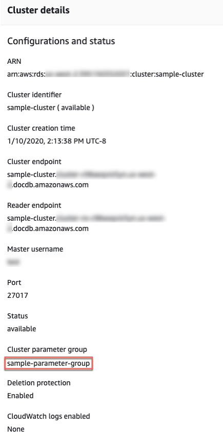

# Describing Amazon DocumentDB cluster parameter groups

A `default` cluster parameter group is created automatically when you create the first Amazon DocumentDB cluster in new region or are using a new engine.
Subsequent clusters, which are created in the same region and have the same engine version, are created with the `default` cluster parameter group.

###### Topics

- [Describing the details of a cluster parameter group](#cluster_parameter_groups-describe_details "#cluster_parameter_groups-describe_details")
- [Determining a cluster's parameter group](#cluster_parameter_groups-determine "#cluster_parameter_groups-determine")
- [Determining clusters and instances associated with a cluster parameter group](#cluster_parameter_groups-count "#cluster_parameter_groups-count")

## Describing the details of an Amazon DocumentDB cluster parameter group

To describe the details of a given cluster parameter group, complete the following steps
using the AWS Management Console or the AWS Command Line Interface (AWS CLI).

Using the AWS Management Console

######

1. Sign in to the AWS Management Console, and open the Amazon DocumentDB console at [https://console.aws.amazon.com/docdb](https://console.aws.amazon.com/docdb "https://console.aws.amazon.com/docdb").
2. In the navigation pane, choose **Parameter groups**.

###### Tip

If you don't see the navigation pane on the left side of your screen, choose the menu icon
()
in the upper-left corner of the page. 3. In the **Cluster parameter groups** pane, select the name of the parameter group that you want to see the details of. 4. The resulting page shows the parameter group's parameters, recent
activity, and tags.

    * Under **Cluster parameters**, you can see the
     parameter's name, current value, allowed values, whether the parameter
     is modifiable, its apply type, data type, and description. You can
     modify individual parameters by selecting the parameter and then
     choosing **Edit** in the **Cluster
     parameters** section. For more information, see [Modifying Amazon DocumentDB cluster parameters](cluster_parameter_groups-parameters.md "cluster_parameter_groups-parameters.md").
    * Under **Recent events**, you can see the most
     recent events for this parameter group. You can filter through these
     events using the search bar in this section. For more information, see
     [Managing Amazon DocumentDB events](managing-events.md "managing-events.md").
    * Under **Tags**, you can see the tags that are on
     this cluster parameter group. You can add or remove tags by choosing
     **Edit** in the **Tags** section.
     For more information, see [Tagging Amazon DocumentDB resources](tagging.md "tagging.md").

Using the AWS CLI
You can use the `describe-db-cluster-parameter-groups` AWS CLI command to view the Amazon Resource Name (ARN), family, description, and name of a single cluster parameter group or all cluster parameter groups that you have for Amazon DocumentDB. You can also use the `describe-db-cluster-parameters` AWS CLI command to view the parameters and their details inside a single cluster parameter group.

- `--describe-db-cluster-parameter-groups`
  — To see a listing of all your cluster parameter groups and their details.
  - `--db-cluster-parameter-group-name`
    — Optional. The name of the cluster parameter group that you want described. If this parameter is omitted, all cluster parameter groups are described.

- `--describe-db-cluster-parameters`
  — To list all the parameters inside a parameter group and their values.
  - `--db-cluster-parameter-group
name` — Required. The name of the cluster parameter group that you want described.

###### Example

The following code lists up to 100 cluster parameter groups and their ARN, family, description, and name.

```
aws docdb describe-db-cluster-parameter-groups
```

Output from this operation looks something like the following (JSON format).

```
{
          "DBClusterParameterGroups": [
              {
                  "DBClusterParameterGroupArn": "arn:aws:rds:us-east-1:012345678912:cluster-pg:default.docdb4.0",
                  "DBParameterGroupFamily": "docdb4.0",
                  "Description": "Default cluster parameter group for docdb4.0",
                  "DBClusterParameterGroupName": "default.docdb4.0"
              },
              {
                  "DBClusterParameterGroupArn": "arn:aws:rds:us-east-1:012345678912:cluster-pg:sample-parameter-group",
                  "DBParameterGroupFamily": "docdb4.0",
                  "Description": "Custom docdb4.0 parameter group",
                  "DBClusterParameterGroupName": "`sample-parameter-group`"
              }
          ]
}
```

###### Example

The following code lists the ARN, family, description, and name for `sample-parameter-group`.

For Linux, macOS, or Unix:

```
aws docdb describe-db-cluster-parameter-groups \
          --db-cluster-parameter-group-name `sample-parameter-group`
```

For Windows:

```
aws docdb describe-db-cluster-parameter-groups ^
          --db-cluster-parameter-group-name `sample-parameter-group`
```

Output from this operation looks something like the following (JSON format).

```
{
          "DBClusterParameterGroups": [
              {
                  "DBClusterParameterGroupArn": "arn:aws:rds:us-east-1:123456789012:cluster-pg:`sample-parameter-group`",
                  "Description": "Custom docdb4.0 parameter group",
                  "DBParameterGroupFamily": "docdb4.0",
                  "DBClusterParameterGroupName": "`sample-parameter-group`"
              }
          ]
}
```

###### Example

The following code lists the values of the parameters in
`sample-parameter-group`.

For Linux, macOS, or Unix:

```

aws docdb describe-db-cluster-parameters \
    --db-cluster-parameter-group-name `sample-parameter-group`

```

For Windows:

```

aws docdb describe-db-cluster-parameters ^
    --db-cluster-parameter-group-name `sample-parameter-group`

```

Output from this operation looks something like the following (JSON format).

```
{
   "Parameters": [
         {
            "ParameterName": "audit_logs",
            "ParameterValue": "disabled",
            "Description": "Enables auditing on cluster.",
            "Source": "system",
            "ApplyType": "dynamic",
            "DataType": "string",
            "AllowedValues": "enabled,disabled",
            "IsModifiable": true,
            "ApplyMethod": "pending-reboot"
         },
         {
            "ParameterName": "change_stream_log_retention_duration",
            "ParameterValue": "17777",
            "Description": "Duration of time in seconds that the change stream log is retained and can be consumed.",
            "Source": "user",
            "ApplyType": "dynamic",
            "DataType": "integer",
            "AllowedValues": "3600-86400",
            "IsModifiable": true,
            "ApplyMethod": "pending-reboot"
         }
   ]
}
```

## Determining an Amazon DocumentDB cluster's parameter group

To determine which parameter group is associated with a particular cluster, complete
the following steps using the AWS Management Console or the AWS CLI.

Using the AWS Management Console

1. Sign in to the AWS Management Console, and open the Amazon DocumentDB console at [https://console.aws.amazon.com/docdb](https://console.aws.amazon.com/docdb "https://console.aws.amazon.com/docdb").
2. In the left navigation pane, choose **Clusters**.
3. In the list of clusters, select the name of the cluster you are interested in.
4. The resulting page shows the details of the cluster that you selected. Scroll down to
   **Cluster details**. At the bottom of that section, locate the parameter group's name below **Cluster parameter group**.



Using the AWS CLI
The following AWS CLI code determines which parameter group is governing the cluster `sample-cluster`.

```
aws docdb describe-db-clusters \
      --db-cluster-identifier `sample-cluster` \
      --query 'DBClusters[*].[DBClusterIdentifier,DBClusterParameterGroup]'
```

Output from this operation looks something like the following (JSON format).

```
[
       [
           "sample-cluster",
           **"sample-parameter-group"**
       ]
]
```

## Determining clusters and instances associated with a Amazon DocumentDB cluster parameter group

To determine how many clusters and instances are associated with each parameter group, complete
the following steps using the AWS CLI.

Using the AWS CLI
The following AWS CLI code determines how many clusters and instances are associated with `sample-parameter-group`.

For Linux, macOS, or Unix:

```
aws docdb describe-db-clusters \
      --query 'DBClusters[*].[DBClusterParameterGroup,DBClusterIdentifier,DBClusterMembers[*].DBInstanceIdentifier]' \
      --output json | \
      jq -r 'group_by(.[0]) | map({
         parameter_group_name: .[0][0],
         total_clusters: length,
         total_instances: map(.[2] | length) | add // 0
      }) | .[]'
```

For Windows:

```
aws docdb describe-db-clusters ^
      --query 'DBClusters[*].[DBClusterParameterGroup,DBClusterIdentifier,DBClusterMembers[*].DBInstanceIdentifier]' ^
      --output json | ^
      jq -r 'group_by(.[0]) | map({
         parameter_group_name: .[0][0],
         total_clusters: length,
         total_instances: map(.[2] | length) | add // 0
      }) | .[]'
```

Output from this operation looks something like the following (JSON format).

```
{
   "parameter_group_name": "`sample-parameter-group`",
   "total_clusters": 50,
   "total_instances": 150
}
```
