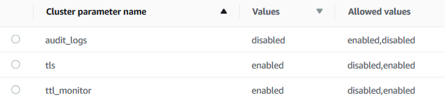

# Modifying Amazon DocumentDB cluster parameters

In Amazon DocumentDB, _cluster parameter groups_ consist of
_parameters_ that apply to all of the instances that you create in
the cluster. For custom cluster parameter groups, you can modify a parameter value at
any time or reset all the parameter values to their defaults for parameter groups that
you create. This section describes how to view the parameters that make up an Amazon DocumentDB
cluster parameter group and their values, and how you can change or update these
values.

Parameters can be _dynamic_ or _static_. When you change a dynamic parameter and save the cluster parameter group, the change is applied immediately regardless of the `Apply Immediately` setting. When you change a static parameter and save the cluster parameter group, the parameter change takes effect only after you manually reboot the instances.

## Viewing an Amazon DocumentDB cluster parameter group's parameters

You can see an Amazon DocumentDB cluster's parameters and their values using the AWS Management Console or AWS CLI.

Using the AWS Management Console

###### To view the details of a cluster parameter group

1. Sign in to the AWS Management Console, and open the Amazon DocumentDB console at [https://console.aws.amazon.com/docdb](https://console.aws.amazon.com/docdb "https://console.aws.amazon.com/docdb").
2. In the navigation pane, choose **Parameter groups**.

###### Tip

If you don't see the navigation pane on the left side of your screen, choose the menu icon
()
in the upper-left corner of the page. 3. In the **Parameter groups** pane, choose the name of the cluster parameter group that you want to see the details of. 4. The resulting page shows the following values for each parameter: the parameter's name,
current value, allowed values, whether the parameter is modifiable, apply
type, data type, and description.



Using the AWS CLI
To see a cluster's parameter group's parameters and their values, use the `describe-db-cluster-parameters` operation with the following parameters.

- `--db-cluster-parameter-group-name` — Required. The
  name of the cluster parameter group for which you want a detailed
  parameter list.
- `--source` — Optional. If supplied, returns only
  parameters for a specific source. Parameter sources can be
  `engine-default`, `system`, or
  `user`.

The following code lists the parameters and their values for the
`custom3-6-param-grp` parameter group. For more information
about the parameter group, omit the `--query` line. For
information about all parameter groups, omit the
`--db-cluster-parameter-group-name` line.

For Linux, macOS, or Unix:

```
aws docdb describe-db-cluster-parameters \
   --db-cluster-parameter-group-name `custom3-6-param-grp` \
   --query 'Parameters[*].[ParameterName,ParameterValue]'
```

For Windows:

```
aws docdb describe-db-cluster-parameters ^
   --db-cluster-parameter-group-name `custom3-6-param-grp` ^
   --query 'Parameters[*].[ParameterName,ParameterValue]'
```

Output from this operation looks something like the following (JSON format).

```
[
    [
        "audit_logs",
        "disabled"
    ],
    [
        "tls",
        "enabled"
    ],
    [
        "ttl_monitor",
        "enabled"
    ]
]
```

## Modifying an Amazon DocumentDB cluster parameter group's parameters

You can modify a parameter group's parameters using the AWS Management Console or AWS CLI.

Using the AWS Management Console

###### To update the parameters of a cluster parameter group

1. Sign in to the AWS Management Console, and open the Amazon DocumentDB console at [https://console.aws.amazon.com/docdb](https://console.aws.amazon.com/docdb "https://console.aws.amazon.com/docdb").
2. In the navigation pane, choose **Parameter groups**.

###### Tip

If you don't see the navigation pane on the left side of your screen, choose the menu icon
()
in the upper-left corner of the page. 3. In the **Parameter groups** pane, choose the cluster parameter group that you want to update the parameters of. 4. The resulting page shows the parameters and their corresponding details for this cluster parameter group. Select a parameter to update. 5. On the top right of the page, choose **Edit** to change the value of the
parameter. For more information about the types of cluster parameters,
see [Amazon DocumentDB cluster parameters reference](cluster_parameter_groups-list_of_parameters.md "cluster_parameter_groups-list_of_parameters.md"). 6. Make your change, and then choose **Modify cluster parameter** to save the
changes. To discard your changes, choose
**Cancel**.

Using the AWS CLI
To modify a cluster parameter group's parameters, use the `modify-db-cluster-parameter-group` operation with the following parameters:

- `--db-cluster-parameter-group-name` — Required. The
  name of the cluster parameter group that you are modifying.
- `--parameters` — Required. The parameter or
  parameters that you are modifying. Each parameter entry must include the
  following:
  - `ParameterName` — The name of the parameter that
    you are modifying.
  - `ParameterValue` — The new value for this
    parameter.
  - `ApplyMethod` — How you want changes to this
    parameter applied. Permitted values are `immediate` and
    `pending-reboot`.

  ###### Note

  Parameters with the `ApplyType` of `static` must have an `ApplyMethod` of `pending-reboot`.

###### To change the values of a cluster parameter group's parameters

(AWS CLI)

The following example changes the `tls` parameter.

1. **List the parameters and their values of `sample-parameter-group`**

For Linux, macOS, or Unix:

```
aws docdb describe-db-cluster-parameters \
    --db-cluster-parameter-group-name `sample-parameter-group`
```

For Windows:

```
aws docdb describe-db-cluster-parameters ^
    --db-cluster-parameter-group-name `sample-parameter-group`
```

Output from this operation looks something like the following (JSON format).

```
{
    "Parameters": [
        {
            "Source": "system",
            "ApplyType": "static",
            "AllowedValues": "disabled,enabled",
            "ParameterValue": "enabled",
            "ApplyMethod": "pending-reboot",
            "DataType": "string",
            "ParameterName": "tls",
            "IsModifiable": true,
            "Description": "Config to enable/disable TLS"
        },
        {
            "Source": "user",
            "ApplyType": "dynamic",
            "AllowedValues": "disabled,enabled",
            "ParameterValue": "enabled",
            "ApplyMethod": "pending-reboot",
            "DataType": "string",
            "ParameterName": "ttl_monitor",
            "IsModifiable": true,
            "Description": "Enables TTL Monitoring"
        }
    ]
}
```

2. **Modify the `tls` parameter so that its value is `disabled`**. You can't modify the `ApplyMethod` because the `ApplyType` is `static`.

For Linux, macOS, or Unix:

```
aws docdb modify-db-cluster-parameter-group \
    --db-cluster-parameter-group-name `sample-parameter-group` \
    --parameters "ParameterName"=tls,ParameterValue=disabled,ApplyMethod=pending-reboot"
```

For Windows:

```
aws docdb modify-db-cluster-parameter-group ^
    --db-cluster-parameter-group-name `sample-parameter-group` ^
    --parameters "ParameterName=tls,ParameterValue=disabled,ApplyMethod=pending-reboot"
```

Output from this operation looks something like the following (JSON format).

```
{
    "DBClusterParameterGroupName": "sample-parameter-group"
}
```

3. **Wait at least 5 minutes.**
4. **List the parameter values of `sample-parameter-group`.**

For Linux, macOS, or Unix:

```
aws docdb describe-db-cluster-parameters \
    --db-cluster-parameter-group-name `sample-parameter-group`
```

For Windows:

```
aws docdb describe-db-cluster-parameters ^
    --db-cluster-parameter-group-name `sample-parameter-group`
```

Output from this operation looks something like the following (JSON format).

```
{
    "Parameters": [
        {
            "ParameterName": "audit_logs",
            "ParameterValue": "disabled",
            "Description": "Enables auditing on cluster.",
            "Source": "system",
            "ApplyType": "dynamic",
            "DataType": "string",
            "AllowedValues": "enabled,disabled",
            "IsModifiable": true,
            "ApplyMethod": "pending-reboot"
        },
        {
            `"ParameterName": "tls"`,
            `"ParameterValue": "disabled"`,
            "Description": "Config to enable/disable TLS",
            "Source": "user",
            "ApplyType": "static",
            "DataType": "string",
            "AllowedValues": "disabled,enabled",
            "IsModifiable": true,
            "ApplyMethod": "pending-reboot"
        }
    ]
}
```
