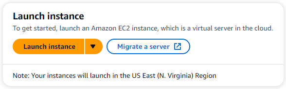
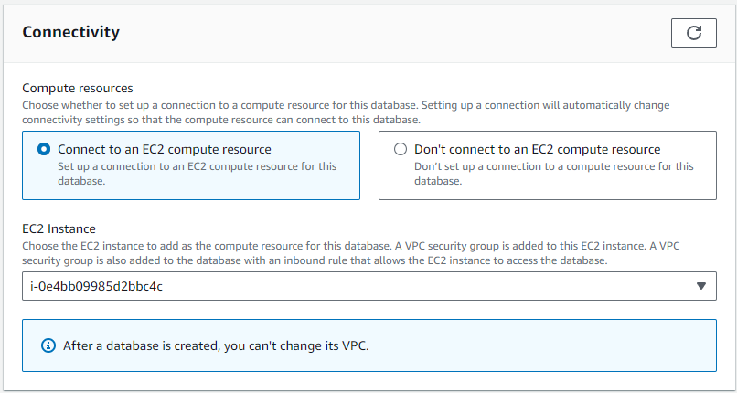
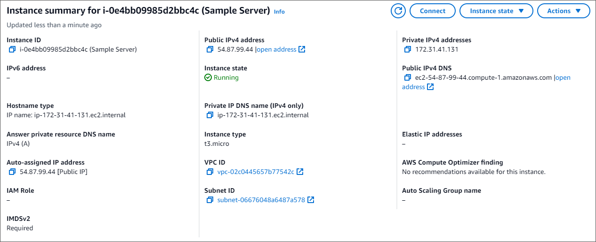
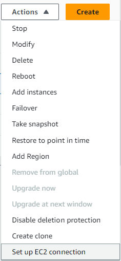
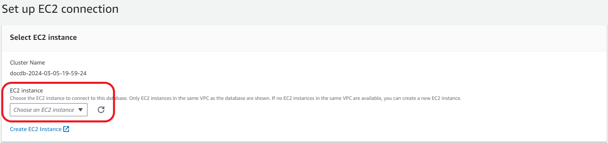
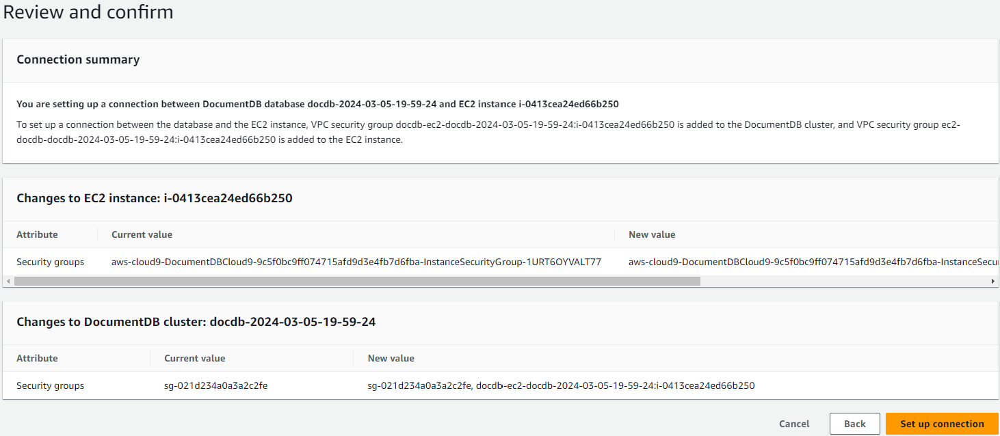
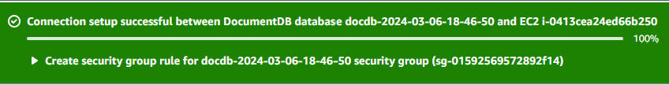

# Connect Amazon EC2 automatically

###### Topics

- [Automatically connect an EC2 instance to a new Amazon DocumentDB database](#auto-connect-ec2.process "#auto-connect-ec2.process")
- [Automatically connect an EC2 instance to an existing Amazon DocumentDB database](#auto-connect-ec2-existing-cluster "#auto-connect-ec2-existing-cluster")
- [Overview of automatic connectivity with an EC2 instance](#auto-connect-ec2.overview "#auto-connect-ec2.overview")
- [Viewing connected compute resources](#auto-connect-ec2.compute "#auto-connect-ec2.compute")
  Before setting up a connection between an EC2 instance and a new Amazon DocumentDB database, make sure you meet the requirements described in [Overview of automatic connectivity with an EC2 instance](#auto-connect-ec2.overview "#auto-connect-ec2.overview").
  If you make changes to security groups after you configure connectivity, the changes might affect the connection between the EC2 instance and the Amazon DocumentDB database.

###### Note

You can only set up a connection between an EC2 instance and an Amazon DocumentDB database automatically by using the AWS Management Console.
You can't set up a connection automatically with the AWS CLI or Amazon DocumentDB API.

## Automatically connect an EC2 instance to a new Amazon DocumentDB database

The following process assume you have completed the steps in the [Prerequisites](connect-ec2.md#connect-ec2-prerequisites "connect-ec2.md#connect-ec2-prerequisites") topic.

###### Steps

- [Step 1: Create an Amazon EC2 instance](#auto-connect-ec2.launch-ec2-instance "#auto-connect-ec2.launch-ec2-instance")
- [Step 2: Create an Amazon DocumentDB cluster](#auto-connect-ec2.launch-cluster "#auto-connect-ec2.launch-cluster")
- [Step 3: Connect to your Amazon EC2 instance](#manual-connect-ec2.connect "#manual-connect-ec2.connect")
- [Step 4: Install the MongoDB Shell](#auto-connect-ec2.install-mongo-shell "#auto-connect-ec2.install-mongo-shell")
- [Step 5: Manage Amazon DocumentDB TLS](#auto-connect-ec2.tls "#auto-connect-ec2.tls")
- [Step 6: Connect to your Amazon DocumentDB cluster](#auto-connect-ec2.connect-use "#auto-connect-ec2.connect-use")
- [Step 7: Insert and query data](#auto-cloud9-insert-query "#auto-cloud9-insert-query")
- [Step 8: Explore](#auto-connect-ec2.explore "#auto-connect-ec2.explore")

### Step 1: Create an Amazon EC2 instance

In this step, you will create an Amazon EC2 instance in the same Region and Amazon VPC that you will later use to provision your Amazon DocumentDB cluster.

1. On the Amazon EC2 console, choose **Launch instance**.

 2. Enter a name or identifier in the **Name** field located in the **Name and tags** section. 3. In the **Amazon Machine Image (AMI)** drop-down list, locate **Amazon Linux 2 AMI** and choose it.

 4. Locate and choose **t3.micro** in the **Instance type** drop-down list. 5. In the **Key pair (login)** section, enter the identifier of an existing key-pair, or choose **Create new key pair**.


You must provide an Amazon EC2 key pair.

    * If you do have an Amazon EC2 key pair:


    	1. Select a key pair, choose your key pair from the list.
    	2. You must already have the private key file (.pem or .ppk file) available to log in to your Amazon EC2 instance.
    * If you do not have an Amazon EC2 key pair:


    	1. Choose **Create new key pair**, the **Create key pair** dialog box appears.
    	2. Enter a name in the **Key pair name** field.
    	3. Choose the **Key pair type** and **Private key file format**.
    	4. Choose **Create key pair**.


###### Note

For security purposes, we highly recommend using a key-pair for both SSH and internet connectivity to your EC2 instance. 6. **Optional:** In the **Network settings section**, under **Firewall (security groups)**, choose **Create security group**.


Choose **Create security group** (check all the traffic allow rules that apply to your EC2 connectivity).

###### Note

If you want to use an existing security group, follow the instructions in [Connect Amazon EC2 manually](connect-ec2-manual.md "connect-ec2-manual.md"). 7. In the **Summary** section, review your EC2 configuration and choose **Launch instance** if correct.

### Step 2: Create an Amazon DocumentDB cluster

While the Amazon EC2 instance is being provisioned, create your Amazon DocumentDB cluster.

1. Navigate to the Amazon DocumentDB console and choose **Clusters** from the navigation pane.
2. Choose **Create**.
3. Leave the **Cluster type** setting at it's default of **Instance Based Cluster**.
4. In **Cluster configuration**, for **Cluster identifier**, enter a unique name.
   Note that the console will change all cluster names into lower-case regardless of how they are entered.

Leave the **Engine version** at it's default value of **5.0.0**. 5. For **Cluster storage configuration**, leave the default setting of **Amazon DocumentDB Standard**. 6. In **Instance configuration**:

    * For **DB instance class**, choose **Memory optimized classes (include r classes)** (this is default).


    The other instance option is **NVMe-backed classes**.
     To learn more, see [NVMe-backed instances](db-instance-nvme.md "db-instance-nvme.md").
    * For **Instance class**, choose the instance type that suits your needs.
     For a more detailed explanation of instance classes, see [Instance class specifications](db-instance-classes.md#db-instance-class-specs "db-instance-classes.md#db-instance-class-specs").
    * For **number of instances**, choose a number that best reflects your needs.
     Remember, the lower the number, the lower the cost, and the lower the read/write volume that can be managed by the cluster.

 7. For **Connectivity**, choose **Connect to an EC2 compute resource**. This is the EC2 instance you created in Step 1.



###### Note

Connecting to an EC2 compute resource automatically creates a security group for your EC2 compute resource connection to your Amazon DocumentDB cluster.
When you have completed creating your cluster and you want to see the newly created security group, navigate to the cluster list and choose your cluster's identifier.
In the **Connectivity & security** tab, go to **Security Groups** and find your group under **Security group name (ID)**.
It will contain the name of your cluster and look similar to this: `docdb-ec2-docdb-2023-12-11-21-33-41:i-0e4bb09985d2bbc4c (sg-0238e0b0bf0f73877)`. 8. In the **Authentication** section, enter a username for the primary user, and then choose **Self managed**.
Enter a password, then confirm it.

If you instead chose **Managed in AWS Secrets Manager**, see [Password management with Amazon DocumentDB and AWS Secrets Manager](docdb-secrets-manager.md "docdb-secrets-manager.md") for more information. 9. Choose **Create cluster**.

### Step 3: Connect to your Amazon EC2 instance

To install the mongo shell, you must first connect to your Amazon EC2 instance. Installing the mongo shell enables you to connect to and query your Amazon DocumentDB cluster. Complete the following steps:

1. On the Amazon EC2 console, navigate to your instances and see if the instance you just created is running.
   If it is, select the instance by clicking the instance ID.

 2. Choose **Connect**.

 3. There are four tabbed options for your connection method: Amazon EC2 Instance Connect, Session Manager, SSH client, or EC2 serial console.
You must choose one and follow its instructions. When complete, choose **Connect**.


###### Note

If your IP address changed after you started this walk-through, or you are coming back to your environment at a later time, you must update your `demoEC2` security group inbound rule to enable inbound traffic from your new API address.

### Step 4: Install the MongoDB Shell

You can now install the MongoDB shell, which is a command-line utility that you use to connect and query your Amazon DocumentDB cluster.
There are currently two versions of MongoDB shell: the newest version, mongosh, and the previous version, mongo shell.

###### Important

There is a known limitation with Node.js drivers older than version 6.13.1, which are currently not supported by IAM identity authentication for Amazon DocumentDB.
Node.js drivers and tools that use Node.js driver (for example, mongosh) must be upgraded to use Node.js driver version 6.13.1 or above.

Follow the instructions below to install the MongoDB shell for your operating system.

On Amazon Linux
**To install the MongoDB shell on Amazon Linux**

If you are not using IAM authentication and want to use the latest MongoDB shell (mongosh) to connect to your Amazon DocumentDB cluster, follow these steps:

1. Create the repository file. At the command line of your EC2 instance you created, execute the follow command:

```
echo -e "[mongodb-org-5.0] \nname=MongoDB Repository\nbaseurl=https://repo.mongodb.org/yum/amazon/2023/mongodb-org/5.0/x86_64/\ngpgcheck=1 \nenabled=1 \ngpgkey=https://pgp.mongodb.com/server-5.0.asc" | sudo tee /etc/yum.repos.d/mongodb-org-5.0.repo
```

2. When it is complete, install mongosh with one of the two following command options at the command prompt:

**Option 1** — If you chose the default Amazon Linux 2023 during the Amazon EC2 configuration, enter this command:

```
sudo yum install -y mongodb-mongosh-shared-openssl3
```

**Option 2** — If you chose Amazon Linux 2 during the Amazon EC2 configuration, enter this command:

```
sudo yum install -y mongodb-mongosh
```

If you are using IAM authentication, you must use the previous version of the MongoDB shell (5.0) to connect to your Amazon DocumentDB cluster, follow these steps:

1. Create the repository file. At the command line of your EC2 instance you created, execute the follow command:

```
echo -e "[mongodb-org-5.0] \nname=MongoDB Repository\nbaseurl=https://repo.mongodb.org/yum/amazon/2023/mongodb-org/5.0/x86_64/\ngpgcheck=1 \nenabled=1 \ngpgkey=https://pgp.mongodb.com/server-5.0.asc" | sudo tee /etc/yum.repos.d/mongodb-org-5.0.repo
```

2. When it is complete, install the mongodb 5.0 shell with the following command option at the command prompt:

```
sudo yum install -y mongodb-org-shell
```

On Ubuntu

###### To install mongosh on Ubuntu

1. Import the public key that will be used by the package management system.

```
curl -fsSL https://pgp.mongodb.com/server-5.0.asc | sudo gpg --dearmor -o /usr/share/keyrings/mongodb-server-5.0.gpg
```

2. Create the list file `mongodb-org-5.0.list` for MongoDB using the command appropriate for
   your version of Ubuntu.

```
echo "deb [ arch=amd64,arm64 signed-by=/usr/share/keyrings/mongodb-server-5.0.gpg ] https://repo.mongodb.org/apt/ubuntu focal/mongodb-org/5.0 multiverse" | sudo tee /etc/apt/sources.list.d/mongodb-org-5.0.list
```

3. Import and update the local package database using the following command:

```
sudo apt-get update
```

4. Install mongosh.

```
sudo apt-get install -y mongodb-mongosh
```

For information about installing earlier versions of MongoDB on your Ubuntu system, see [Install MongoDB Community Edition on Ubuntu](https://docs.mongodb.com/v3.6/tutorial/install-mongodb-on-ubuntu/ "https://docs.mongodb.com/v3.6/tutorial/install-mongodb-on-ubuntu/").

On other operating systems
To install the mongo shell on other operating systems, see [Install MongoDB Community Edition](https://www.mongodb.com/docs/manual/administration/install-community/ "https://www.mongodb.com/docs/manual/administration/install-community/") in the MongoDB documentation.

### Step 5: Manage Amazon DocumentDB TLS

Download the CA certificate for Amazon DocumentDB with the following code:
`wget https://truststore.pki.rds.amazonaws.com/global/global-bundle.pem`

###### Note

Transport Layer Security (TLS) is enabled by default for any new Amazon DocumentDB clusters. For more information, see [Managing Amazon DocumentDB cluster TLS settings](security.encryption.md "security.encryption.md").

### Step 6: Connect to your Amazon DocumentDB cluster

1. On the Amazon DocumentDB console, under **Clusters**, locate your cluster.
   Choose the cluster you created by clicking the **Cluster identifier** for that cluster.
2. In the **Connectivity and security** tab, locate **Connect to this cluster with the mongo shell** in the **Connect** box:


Copy the connection string provided and paste it into your terminal.

Make the following changes to it:

    1. Make sure you have the correct username in the string.
    2. Omit `<insertYourPassword>` so that you are prompted for the password by the mongo shell when you connect.
    3. Optional: If you are using IAM authentication, or are using the previous version of the MongoDB shell, modify your connection string as follows:


    `mongo --ssl --host mydocdbcluster.cluster-cozt4xr9xv9b.us-east-1.docdb.amazonaws.com:27017 --sslCAFile global-bundle.pem --username SampleUser1 --password`


    Replace `mydocdbcluster.cluster-cozt4xr9xv9b.us-east-1` with the same information from your cluster.

3. Press enter in your terminal. You are now be prompted for your password. Enter your password.
4. When you enter your password and can see the `rs0 [direct: primary] <env-name>>` prompt, you are successfully connected to your Amazon DocumentDB cluster.

Having problems connecting? See [Troubleshooting Amazon DocumentDB](troubleshooting.md "troubleshooting.md").

### Step 7: Insert and query data

Now that you are connected to your cluster, you can run a few queries to get familiar with using a document database.

1. To insert a single document, enter the following:

```
db.collection.insertOne({"hello":"DocumentDB"})
```

You get the following output:

```
{
  acknowledged: true,
  insertedId: ObjectId('673657216bdf6258466b128c')
}
```

2. You can read the document that you wrote with the `findOne()` command (because it only returns a single document). Input the following:

```
db.collection.findOne()
```

You get the following output:

```
{ "_id" : ObjectId("5e401fe56056fda7321fbd67"), "hello" : "DocumentDB" }
```

3. To perform a few more queries, consider a gaming profiles use case. First, insert a few entries into a collection titled `profiles`. Input the following:

```
db.profiles.insertMany([{ _id: 1, name: 'Matt', status: 'active', level: 12, score: 202 },
      { _id: 2, name: 'Frank', status: 'inactive', level: 2, score: 9 },
      { _id: 3, name: 'Karen', status: 'active', level: 7, score: 87 },
      { _id: 4, name: 'Katie', status: 'active', level: 3, score: 27 }
])
```

You get the following output:

```
{ acknowledged: true, insertedIds: { '0': 1, '1': 2, '2': 3, '3': 4 } }
```

4. Use the `find()` command to return all the documents in the profiles collection. Input the following:

```
db.profiles.find()
```

You will get an output that will match the data you typed in Step 3. 5. Use a query for a single document using a filter. Input the following:

```
db.profiles.find({name: "Katie"})
```

You get the following output:

```
{ "_id" : 4, "name" : "Katie", "status": "active", "level": 3, "score":27}
```

6. Now let’s try to find a profile and modify it using the `findAndModify` command. We’ll give the user Matt an extra 10 points with the following code:

```
db.profiles.findAndModify({
        query: { name: "Matt", status: "active"},
        update: { $inc: { score: 10 } }
    })
```

You get the following output (note that his score hasn’t increased yet):

```
{
    [{_id : 1, name : 'Matt', status: 'active', level: 12, score: 202}]
```

7. You can verify that his score has changed with the following query:

`db.profiles.find({name: "Matt"})`

You get the following output:

```
{ "_id" : 1, "name" : "Matt", "status" : "active", "level" : 12, "score" : 212 }
```

### Step 8: Explore

Congratulations! You have successfully completed the Quick Start Guide to Amazon DocumentDB.

What’s next? Learn how to fully leverage this powerful database with some of its popular features:

- [Managing Amazon DocumentDB](managing-documentdb.md "managing-documentdb.md")
- [Scaling](operational_tasks.md "operational_tasks.md")
- [Backing up and restoring](backup_restore.md "backup_restore.md")

###### Note

To save on cost, you can either stop your Amazon DocumentDB cluster to reduce costs or delete the cluster. By default, after 30 minutes of inactivity, your AWS Cloud9 environment will stop the underlying Amazon EC2 instance.

## Automatically connect an EC2 instance to an existing Amazon DocumentDB database

The following procedure assumes you have an existing Amazon DocumentDB cluster and an existing Amazon EC2 instance.

###### Access your Amazon DocumentDB cluster and set up the Amazon EC2 connection

1. Access your Amazon DocumentDB cluster.
   1. Sign in to the AWS Management Console, and open the Amazon DocumentDB console at [https://console.aws.amazon.com/docdb](https://console.aws.amazon.com/docdb "https://console.aws.amazon.com/docdb").
   2. In the navigation pane, choose **Clusters**.

   ###### Tip

   If you don't see the navigation pane on the left side of your screen, choose the menu icon
   ()
   in the upper-left corner of the page. 3. Specify the cluster that you want by choosing
   the button to the left of the cluster's name.

2. Set up the Amazon EC2 connection.
   1. Choose **Actions**, and then choose
      **Set up EC2 connection**.

   

   The **Set up EC2 connection** dialog appears. 2. In the **EC2 instance** field, choose the EC2 instance you want connected to your cluster.

    3. Choose **Continue**.

   The **Review and confirm** dialog appears. 4. Make sure the changes are correct. Then choose **Set up connection**.

   

If successful, the following verification appears:



## Overview of automatic connectivity with an EC2 instance

When you set up a connection between an EC2 instance and an Amazon DocumentDB database, Amazon DocumentDB automatically configures the VPC security group for your EC2 instance and for your Amazon DocumentDB database.

The following are requirements for connecting an EC2 instance with an Amazon DocumentDB database:

- The EC2 instance must exist in the same VPC as the Amazon DocumentDB database.

If no EC2 instances exist in the same VPC, then the console provides a link to create one.

- The user who sets up connectivity must have permissions to perform the following Amazon EC2 operations:
  - `ec2:AuthorizeSecurityGroupEgress`
  - `ec2:AuthorizeSecurityGroupIngress`
  - `ec2:CreateSecurityGroup`
  - `ec2:DescribeInstances`
  - `ec2:DescribeNetworkInterfaces`
  - `ec2:DescribeSecurityGroups`
  - `ec2:ModifyNetworkInterfaceAttribute`
  - `ec2:RevokeSecurityGroupEgress`

If the DB instance and EC2 instance are in different Availability Zones, your account may incur cross-Availability Zone costs.

When you set up a connection to an EC2 instance, Amazon DocumentDB acts according to the current configuration of the security groups associated with the Amazon DocumentDB database and EC2 instance, as described in the following table:

| Current Amazon DocumentDB security group configuration                                                                                                                                                                                                                                                                                                                                                                                                                                                                                                                                                                                                                                                                                                                 | Current EC2 security group configuration                                                                                                                                                                                                                                                                                                                                                                                                                                                                                                                                                                                                                                            | Amazon DocumentDB action                                                                                                                                                                                                                                                                      |
| ---------------------------------------------------------------------------------------------------------------------------------------------------------------------------------------------------------------------------------------------------------------------------------------------------------------------------------------------------------------------------------------------------------------------------------------------------------------------------------------------------------------------------------------------------------------------------------------------------------------------------------------------------------------------------------------------------------------------------------------------------------------------- | ----------------------------------------------------------------------------------------------------------------------------------------------------------------------------------------------------------------------------------------------------------------------------------------------------------------------------------------------------------------------------------------------------------------------------------------------------------------------------------------------------------------------------------------------------------------------------------------------------------------------------------------------------------------------------------- | --------------------------------------------------------------------------------------------------------------------------------------------------------------------------------------------------------------------------------------------------------------------------------------------- |
| There are one or more security groups associated with the Amazon DocumentDB database with a name that matches the pattern `DocumentDB-ec2-n`.<br>A security group that matches the pattern hasn't been modified.<br>This security group has only one inbound rule with the VPC security group of the EC2 instance as the source.                                                                                                                                                                                                                                                                                                                                                                                                                                       | There are one or more security groups associated with the EC2 instance with a name that matches the pattern `DocumentDB-ec2-n` (where n is a number).<br>A security group that matches the pattern hasn't been modified.<br>This security group has only one outbound rule with the VPC security group of the Amazon DocumentDB database as the source.                                                                                                                                                                                                                                                                                                                             | Amazon DocumentDB takes no action.<br>A connection was already configured automatically between the EC2 instance and the Amazon DocumentDB database.<br>Because a connection already exists between the EC2 instance and the Amazon DocumentDB database, the security groups aren't modified. |
| Either of the following conditions apply:<br>• There is no security group associated with the Amazon DocumentDB database with a name that matches the pattern `DocumentDB-ec2-n`.<br>• There are one or more security groups associated with the Amazon DocumentDB with a name that matches the pattern `DocumentDB-ec2-n`.<br>However, Amazon DocumentDB can't use any of these security groups for the connection with the EC2 instance.<br>Amazon DocumentDB can't use a security group that doesn't have one inbound rule with the VPC security group of the EC2 instance as the source.<br>Amazon DocumentDB also can't use a security group that has been modified.<br>Examples of modifications include adding a rule or changing the port of an existing rule. | Either of the following conditions apply:<br>• There is no security group associated with the EC2 instance with a name that matches the pattern `ec2-DocumentDB-n`.<br>• There are one or more security groups associated with the EC2 instance with a name that matches the pattern `ec2-DocumentDB-n`.<br>However, Amazon DocumentDB can't use any of these security groups for the connection with the Amazon DocumentDB database.<br>Amazon DocumentDB can't use a security group that doesn't have one outbound rule with the VPC security group of the Amazon DocumentDB database as the source.<br>Amazon DocumentDB also can't use a security group that has been modified. | Amazon DocumentDB action: create new security groups                                                                                                                                                                                                                                          |
| There are one or more security groups associated with the Amazon DocumentDB database with a name that matches the pattern `DocumentDB-ec2-n`.<br>A security group that matches the pattern hasn't been modified.<br>This security group has only one inbound rule with the VPC security group of the EC2 instance as the source.                                                                                                                                                                                                                                                                                                                                                                                                                                       | There are one or more security groups associated with the EC2 instance with a name that matches the pattern `ec2-DocumentDB-n`.<br>However, Amazon DocumentDB can't use any of these security groups for the connection with the Amazon DocumentDB database.<br>Amazon DocumentDB can't use a security group that doesn't have one outbound rule with the VPC security group of the Amazon DocumentDB database as the source.<br>Amazon DocumentDB also can't use a security group that has been modified.                                                                                                                                                                          | Amazon DocumentDB action: create new security groups                                                                                                                                                                                                                                          |
| There are one or more security groups associated with the Amazon DocumentDB database with a name that matches the pattern `DocumentDB-ec2-n`.<br>A security group that matches the pattern hasn't been modified.<br>This security group has only one inbound rule with the VPC security group of the EC2 instance as the source.                                                                                                                                                                                                                                                                                                                                                                                                                                       | A valid EC2 security group for the connection exists, but it is not associated with the EC2 instance.<br>This security group has a name that matches the pattern `DocumentDB-ec2-n`.<br>It hasn't been modified.<br>It has only one outbound rule with the VPC security group of the Amazon DocumentDB database as the source.                                                                                                                                                                                                                                                                                                                                                      | Amazon DocumentDB action: associate EC2 security group                                                                                                                                                                                                                                        |
| Either of the following conditions apply:<br>• There is no security group associated with the Amazon DocumentDB database with a name that matches the pattern `DocumentDB-ec2-n`.<br>• There are one or more security groups associated with the Amazon DocumentDB database with a name that matches the pattern `DocumentDB-ec2-n`.<br>However, Amazon DocumentDB can't use any of these security groups for the connection with the EC2 instance.<br>Amazon DocumentDB can't use a security group that doesn't have one inbound rule with the VPC security group of the EC2 instance as the source.<br>Amazon DocumentDB also can't use security group that has been modified.                                                                                       | There are one or more security groups associated with the EC2 instance with a name that matches the pattern `DocumentDB-ec2-n`.<br>A security group that matches the pattern hasn't been modified.<br>This security group has only one outbound rule with the VPC security group of the Amazon DocumentDB database as the source.                                                                                                                                                                                                                                                                                                                                                   | Amazon DocumentDB action: create new security groups                                                                                                                                                                                                                                          |

**Amazon DocumentDB action: create new security groups**

Amazon DocumentDB takes the following actions:

- Creates a new security group that matches the pattern `DocumentDB-ec2-n`.
  This security group has an inbound rule with the VPC security group of the EC2 instance as the source.
  This security group is associated with the Amazon DocumentDB database and allows the EC2 instance to access the Amazon DocumentDB database.
- Creates a new security group that matches the pattern `ec2-DocumentDB-n`.
  This security group has an outbound rule with the VPC security group of the Amazon DocumentDB database as the source.
  This security group is associated with the EC2 instance and allows the EC2 instance to send traffic to the Amazon DocumentDB database.

**Amazon DocumentDB action: associate EC2 security group**

Amazon DocumentDB associates the valid, existing EC2 security group with the EC2 instance.
This security group allows the EC2 instance to send traffic to the Amazon DocumentDB database.

## Viewing connected compute resources

You can use the AWS Management Console to view the compute resources that are connected to an Amazon DocumentDB database.
The resources shown include compute resource connections that were set up automatically.
You can set up connectivity with compute resources automatically in the following ways:

- You can select the compute resource when you create the database.
  For more information, see [Creating an Amazon DocumentDB cluster](db-cluster-create.md "db-cluster-create.md") and Creating a Multi-AZ DB cluster.
- You can set up connectivity between an existing database and a compute resource.
  For more information, see [Connect Amazon EC2 automatically](connect-ec2-auto.md "connect-ec2-auto.md").

The listed compute resources don't include ones that were connected to the database manually.
For example, you can allow a compute resource to access a database manually by adding a rule to the VPC security group associated with the database.

For a compute resource to be listed, the following conditions must apply:

- The name of the security group associated with the compute resource matches the pattern `ec2-DocumentDB-n` (where n is a number).
- The security group associated with the compute resource has an outbound rule with the port range set to the port that the Amazon DocumentDB database uses.
- The security group associated with the compute resource has an outbound rule with the source set to a security group associated with the Amazon DocumentDB database.
- The name of the security group associated with the Amazon DocumentDB database matches the pattern `DocumentDB-ec2-n` (where n is a number).
- The security group associated with the Amazon DocumentDB database has an inbound rule with the port range set to the port that the Amazon DocumentDB database uses.
- The security group associated with the Amazon DocumentDB database has an inbound rule with the source set to a security group associated with the compute resource.

**To view compute resources connected to an Amazon DocumentDB database**

1. Sign in to the AWS Management Console, and open the Amazon DocumentDB console at [https://console.aws.amazon.com/docdb](https://console.aws.amazon.com/docdb "https://console.aws.amazon.com/docdb").
2. In the navigation pane, choose **Databases**, and then choose the name of the Amazon DocumentDB database.
3. On the **Connectivity & security** tab, view the compute resources in the **Connected compute resources** section.
