# Connect Amazon EC2 manually

###### Topics

- [Step 1: Create an Amazon EC2 instance](#manual-connect-ec2.launch-ec2-instance "#manual-connect-ec2.launch-ec2-instance")
- [Step 2: Create a security group](#manual-connect-ec2.security-group "#manual-connect-ec2.security-group")
- [Step 3: Create an Amazon DocumentDB cluster](#manual-connect-ec2.launch-cluster "#manual-connect-ec2.launch-cluster")
- [Step 4: Connect to your Amazon EC2 instance](#manual-connect-ec2.connect "#manual-connect-ec2.connect")
- [Step 5: Install the MongoDB Shell](#manual-connect-ec2.install-mongo-shell "#manual-connect-ec2.install-mongo-shell")
- [Step 6: Manage Amazon DocumentDB TLS](#manual-connect-ec2.tls "#manual-connect-ec2.tls")
- [Step 7: Connect to your Amazon DocumentDB cluster](#manual-connect-ec2.connect-use "#manual-connect-ec2.connect-use")
- [Step 8: Insert and query data](#manual-cloud9-insert-query "#manual-cloud9-insert-query")
- [Step 9: Explore](#manual-connect-ec2.explore "#manual-connect-ec2.explore")
  The following steps assume you have completed the steps in the [Prerequisites](connect-ec2.md#connect-ec2-prerequisites "connect-ec2.md#connect-ec2-prerequisites") topic.

## Step 1: Create an Amazon EC2 instance

In this step, you will create an Amazon EC2 instance in the same Region and Amazon VPC that you will later use to provision your Amazon DocumentDB cluster.

1. On the Amazon EC2 console, choose **Launch instance**.

 2. Enter a name or identifier in the **Name** field located in the **Name and tags** section. 3. In the **Amazon Machine Image (AMI)** drop-down list, locate **Amazon Linux 2 AMI** and choose it.

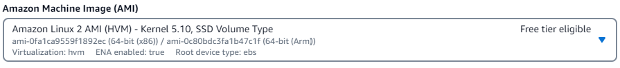 4. Locate and choose **t3.micro** in the **Instance type** drop-down list. 5. In the **Key pair (login)** section, enter the identifier of an existing key-pair, or choose **Create new key pair**.

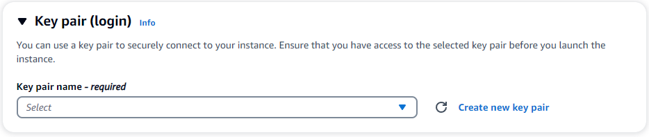

You must provide an Amazon EC2 key pair.

    * If you do have an Amazon EC2 key pair:


    	1. Select a key pair, choose your key pair from the list.
    	2. You must already have the private key file (.pem or .ppk file) available to log in to your Amazon EC2 instance.
    * If you do not have an Amazon EC2 key pair:


    	1. Choose **Create new key pair**, the **Create key pair** dialog box appears.
    	2. Enter a name in the **Key pair name** field.
    	3. Choose the **Key pair type** and **Private key file format**.
    	4. Choose **Create key pair**.

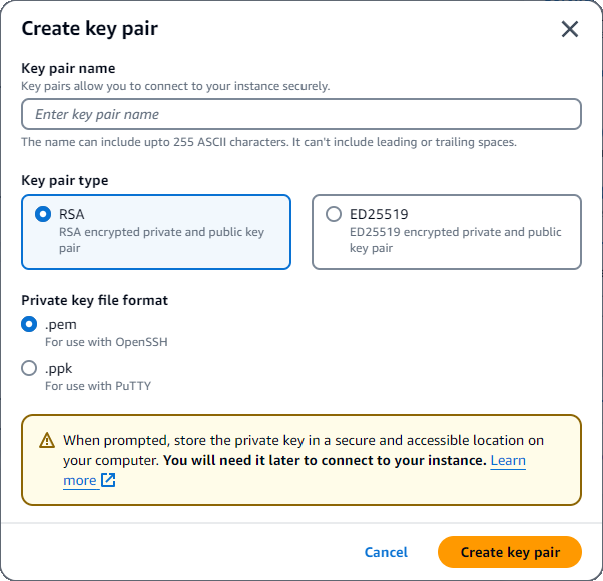

###### Note

For security purposes, we highly recommend using a key-pair for both SSH and internet connectivity to your EC2 instance. 6. In the **Network settings section**, under **Firewall (security groups)**, choose either **Create security group** or **Select existing security group**.

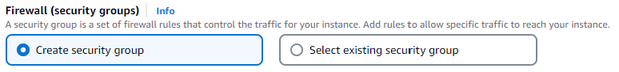

If you chose to select an existing security group, select one from the **Common security groups** drop-down list.

If you chose to create a new security group, perform the following:

    1. Check all the traffic allow rules that apply to your EC2 connectivity.
    2. In the IP field, choose **My IP** or select **Custom** to choose from a list of CIDR blocks, prefix lists, or security groups.
     We do not recommend **Anywhere** as a choice, unless your EC2 instance is on an isolated network, because it allows any IP address access to your EC2 instance.

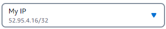 7. In the **Summary** section, review your EC2 configuration and choose **Launch instance** if correct.

## Step 2: Create a security group

You will now create a new security group in your default Amazon VPC. The security group `demoDocDB` enables you to connect to your Amazon DocumentDB cluster on port 27017 (the default port for Amazon DocumentDB) from your Amazon EC2 instance.

1. On the [Amazon EC2 Management Console](https://console.aws.amazon.com/ec2 "https://console.aws.amazon.com/ec2"), under **Network and Security**, choose **Security groups**.

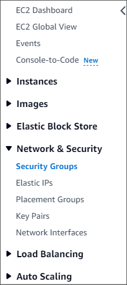 2. Choose **Create security group**.

 3. In the **Basic details** section:

    1. For **Security group name**, enter `demoDocDB`.
    2. For **Description**, enter a description.
    3. For **VPC**, accept the usage of your default VPC.

4.  In the **Inbound rules** section, choose **Add rule**.

        1. For **Type**, choose **Custom TCP Rule** (default).
        2. For **Port range**, enter `27017`.
        3. For **Source**, choose **Custom**.
         In the field next to it, search for the security group you just created in step 1.
         You may need to refresh your browser for the Amazon EC2 console to auto-populate the source name.

    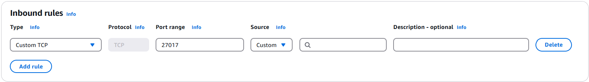

5.  Accept all other defaults and choose **Create security group**.


## Step 3: Create an Amazon DocumentDB cluster

While the Amazon EC2 instance is being provisioned, you will create your Amazon DocumentDB cluster.

1. Navigate to the Amazon DocumentDB console and choose **Clusters** from the navigation pane.
2. Choose **Create**.
3. Leave the **Cluster type** setting at it's default of **Instance Based Cluster**.
4. In **Cluster configuration**, for **Cluster identifier**, enter a unique name.
   Note that the console will change all cluster names into lower-case regardless of how they are entered.

Leave the **Engine version** at it's default value of **5.0.0**. 5. For **Cluster storage configuration**, leave the default setting of **Amazon DocumentDB Standard**. 6. In **Instance configuration**:

    * For **DB instance class**, choose **Memory optimized classes (include r classes)** (this is default).


    The other instance option is **NVMe-backed classes**.
     To learn more, see [NVMe-backed instances](db-instance-nvme.md "db-instance-nvme.md").
    * For **Instance class**, choose the instance type that suits your needs.
     For a more detailed explanation of instance classes, see [Instance class specifications](db-instance-classes.md#db-instance-class-specs "db-instance-classes.md#db-instance-class-specs").
    * For **number of instances**, choose a number that best reflects your needs.
     Remember, the lower the number, the lower the cost, and the lower the read/write volume that can be managed by the cluster.

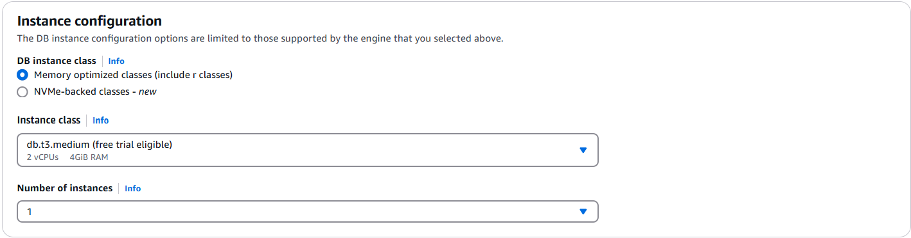 7. For **Connectivity**, leave the default setting of **Don't connect to an EC2 compute resource**.

###### Note

Connecting to an EC2 compute resource automatically creates security groups for your connection to your cluster.
Since you manually created these security groups in the previous step, you should select **Don't connect to an EC2 compute resource** so as not to create a second set of security groups. 8. In the **Authentication** section, enter a username for the primary user, and then choose **Self managed**.
Enter a password, then confirm it.

If you instead chose **Managed in AWS Secrets Manager**, see [Password management with Amazon DocumentDB and AWS Secrets Manager](docdb-secrets-manager.md "docdb-secrets-manager.md") for more information. 9. Choose **Create cluster**.

## Step 4: Connect to your Amazon EC2 instance

Connecting to your Amazon EC2 instance will allow you to install the MongoDB shell.
Installing the mongo shell enables you to connect to and query your Amazon DocumentDB cluster.
Complete the following steps:

1. On the Amazon EC2 console, navigate to your instances and see if the instance you just created is running.
   If it is, select the instance by clicking the instance ID.

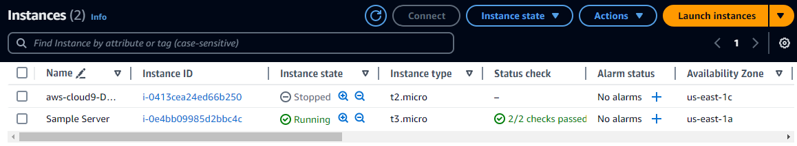 2. Choose **Connect**.

 3. There are four tabbed options for your connection method: Amazon EC2 Instance Connect, Session Manager, SSH client, or EC2 serial console.
You must choose one and follow its instructions. When complete, choose **Connect**.

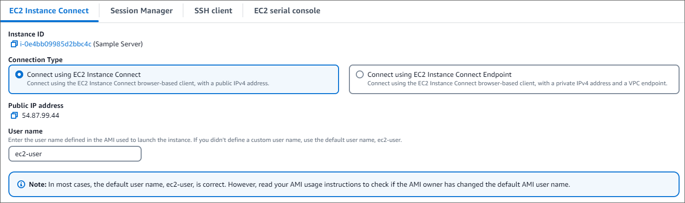

###### Note

If your IP address changed after you started this walk-through, or you are coming back to your environment at a later time, you must update your `demoEC2` security group inbound rule to enable inbound traffic from your new API address.

## Step 5: Install the MongoDB Shell

You can now install the MongoDB shell, which is a command-line utility that you use to connect and query your Amazon DocumentDB cluster.
There are currently two versions of MongoDB shell: the newest version, mongosh, and the previous version, mongo shell.

###### Important

There is a known limitation with Node.js drivers older than version 6.13.1, which are currently not supported by IAM identity authentication for Amazon DocumentDB.
Node.js drivers and tools that use Node.js driver (for example, mongosh) must be upgraded to use Node.js driver version 6.13.1 or above.

Follow the instructions below to install the MongoDB shell for your operating system.

On Amazon Linux
**To install the MongoDB shell on Amazon Linux**

If you are not using IAM and want to use the latest MongoDB shell (mongosh) to connect to your Amazon DocumentDB cluster, follow these steps:

1. Create the repository file. At the command line of your EC2 instance you created, execute the follow command:

```
echo -e "[mongodb-org-5.0] \nname=MongoDB Repository\nbaseurl=https://repo.mongodb.org/yum/amazon/2023/mongodb-org/5.0/x86_64/\ngpgcheck=1 \nenabled=1 \ngpgkey=https://pgp.mongodb.com/server-5.0.asc" | sudo tee /etc/yum.repos.d/mongodb-org-5.0.repo
```

2. When it is complete, install mongosh with one of the two following command options at the command prompt:

**Option 1** — If you chose the default Amazon Linux 2023 during the Amazon EC2 configuration, enter this command:

```
sudo yum install -y mongodb-mongosh-shared-openssl3
```

**Option 2** — If you chose Amazon Linux 2 during the Amazon EC2 configuration, enter this command:

```
sudo yum install -y mongodb-mongosh
```

If you are using IAM, you must use the previous version of the MongoDB shell (5.0) to connect to your Amazon DocumentDB cluster, follow these steps:

1. Create the repository file. At the command line of your EC2 instance you created, execute the follow command:

```
echo -e "[mongodb-org-5.0] \nname=MongoDB Repository\nbaseurl=https://repo.mongodb.org/yum/amazon/2023/mongodb-org/5.0/x86_64/\ngpgcheck=1 \nenabled=1 \ngpgkey=https://pgp.mongodb.com/server-5.0.asc" | sudo tee /etc/yum.repos.d/mongodb-org-5.0.repo
```

2. When it is complete, install the mongodb 5.0 shell with the following command option at the command prompt:

```
sudo yum install -y mongodb-org-shell
```

On Ubuntu

###### To install mongosh on Ubuntu

1. Import the public key that will be used by the package management system.

```
curl -fsSL https://pgp.mongodb.com/server-5.0.asc | sudo gpg --dearmor -o /usr/share/keyrings/mongodb-server-5.0.gpg
```

2. Create the list file `mongodb-org-5.0.list` for MongoDB using the command appropriate for
   your version of Ubuntu.

```
echo "deb [ arch=amd64,arm64 signed-by=/usr/share/keyrings/mongodb-server-5.0.gpg ] https://repo.mongodb.org/apt/ubuntu focal/mongodb-org/5.0 multiverse" | sudo tee /etc/apt/sources.list.d/mongodb-org-5.0.list
```

3. Import and update the local package database using the following command:

```
sudo apt-get update
```

4. Install mongosh.

```
sudo apt-get install -y mongodb-mongosh
```

For information about installing earlier versions of MongoDB on your Ubuntu system, see [Install MongoDB Community Edition on Ubuntu](https://docs.mongodb.com/v3.6/tutorial/install-mongodb-on-ubuntu/ "https://docs.mongodb.com/v3.6/tutorial/install-mongodb-on-ubuntu/").

On other operating systems
To install the mongo shell on other operating systems, see [Install MongoDB Community Edition](https://www.mongodb.com/docs/manual/administration/install-community/ "https://www.mongodb.com/docs/manual/administration/install-community/") in the MongoDB documentation.

## Step 6: Manage Amazon DocumentDB TLS

Download the CA certificate for Amazon DocumentDB with the following code:
`wget https://truststore.pki.rds.amazonaws.com/global/global-bundle.pem`

###### Note

Transport Layer Security (TLS) is enabled by default for any new Amazon DocumentDB clusters. For more information, see [Managing Amazon DocumentDB cluster TLS settings](security.encryption.md "security.encryption.md").

## Step 7: Connect to your Amazon DocumentDB cluster

1. On the Amazon DocumentDB console, under **Clusters**, locate your cluster.
   Choose the cluster you created by clicking the **Cluster identifier** for that cluster.

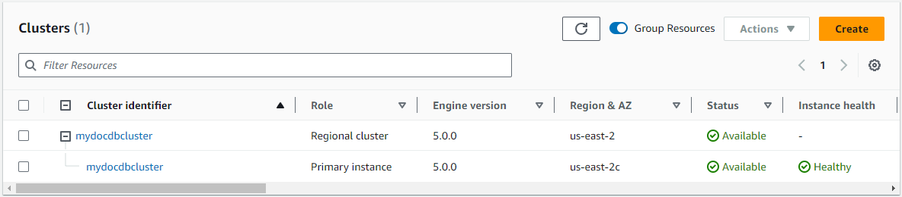 2. In the **Connectivity and security** tab, locate **Connect to this cluster with the mongo shell** in the **Connect** box:

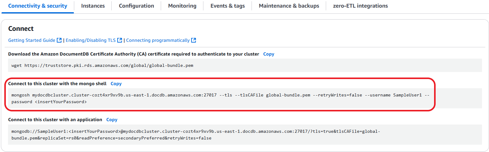

Copy the connection string provided and paste it into your terminal.

Make the following changes to it:

    1. Make sure you have the correct username in the string.
    2. Omit `<insertYourPassword>` so that you are prompted for the password by the mongo shell when you connect.
    3. Optional: If you are using IAM authentication, or are using the previous version of the MongoDB shell, modify your connection string as follows:


    `mongo --ssl --host mydocdbcluster.cluster-cozt4xr9xv9b.us-east-1.docdb.amazonaws.com:27017 --sslCAFile global-bundle.pem --username SampleUser1 --password`


    Replace `mydocdbcluster.cluster-cozt4xr9xv9b.us-east-1` with the same information from your cluster.

3. Press enter in your terminal. You are now be prompted for your password. Enter your password.
4. When you enter your password and can see the `rs0 [direct: primary] <env-name>>` prompt, you are successfully connected to your Amazon DocumentDB cluster.

Having problems connecting? See [Troubleshooting Amazon DocumentDB](troubleshooting.md "troubleshooting.md").

## Step 8: Insert and query data

Now that you are connected to your cluster, you can run a few queries to get familiar with using a document database.

1. To insert a single document, enter the following:

```
db.collection.insertOne({"hello":"DocumentDB"})
```

You get the following output:

```
{
  acknowledged: true,
  insertedId: ObjectId('673657216bdf6258466b128c')
}
```

2. You can read the document that you wrote with the `findOne()` command (because it only returns a single document). Input the following:

```
db.collection.findOne()
```

You get the following output:

```
{ "_id" : ObjectId("5e401fe56056fda7321fbd67"), "hello" : "DocumentDB" }
```

3. To perform a few more queries, consider a gaming profiles use case. First, insert a few entries into a collection titled `profiles`. Input the following:

```
db.profiles.insertMany([{ _id: 1, name: 'Matt', status: 'active', level: 12, score: 202 },
      { _id: 2, name: 'Frank', status: 'inactive', level: 2, score: 9 },
      { _id: 3, name: 'Karen', status: 'active', level: 7, score: 87 },
      { _id: 4, name: 'Katie', status: 'active', level: 3, score: 27 }
])
```

You get the following output:

```
{ acknowledged: true, insertedIds: { '0': 1, '1': 2, '2': 3, '3': 4 } }
```

4. Use the `find()` command to return all the documents in the profiles collection. Input the following:

```
db.profiles.find()
```

You will get an output that will match the data you typed in Step 3. 5. Use a query for a single document using a filter. Input the following:

```
db.profiles.find({name: "Katie"})
```

You get the following output:

```
{ "_id" : 4, "name" : "Katie", "status": "active", "level": 3, "score":27}
```

6. Now let’s try to find a profile and modify it using the `findAndModify` command. We’ll give the user Matt an extra 10 points with the following code:

```
db.profiles.findAndModify({
        query: { name: "Matt", status: "active"},
        update: { $inc: { score: 10 } }
    })
```

You get the following output (note that his score hasn’t increased yet):

```
{
    [{_id : 1, name : 'Matt', status: 'active', level: 12, score: 202}]
```

7. You can verify that his score has changed with the following query:

`db.profiles.find({name: "Matt"})`

You get the following output:

```
{ "_id" : 1, "name" : "Matt", "status" : "active", "level" : 12, "score" : 212 }
```

## Step 9: Explore

Congratulations! You have successfully completed the Quick Start Guide to Amazon DocumentDB.

What’s next? Learn how to fully leverage this powerful database with some of its popular features:

- [Managing Amazon DocumentDB](managing-documentdb.md "managing-documentdb.md")
- [Scaling](operational_tasks.md "operational_tasks.md")
- [Backing up and restoring](backup_restore.md "backup_restore.md")

###### Note

To save on cost, you can either stop your Amazon DocumentDB cluster to reduce costs or delete the cluster. By default, after 30 minutes of inactivity, your AWS Cloud9 environment will stop the underlying Amazon EC2 instance.
