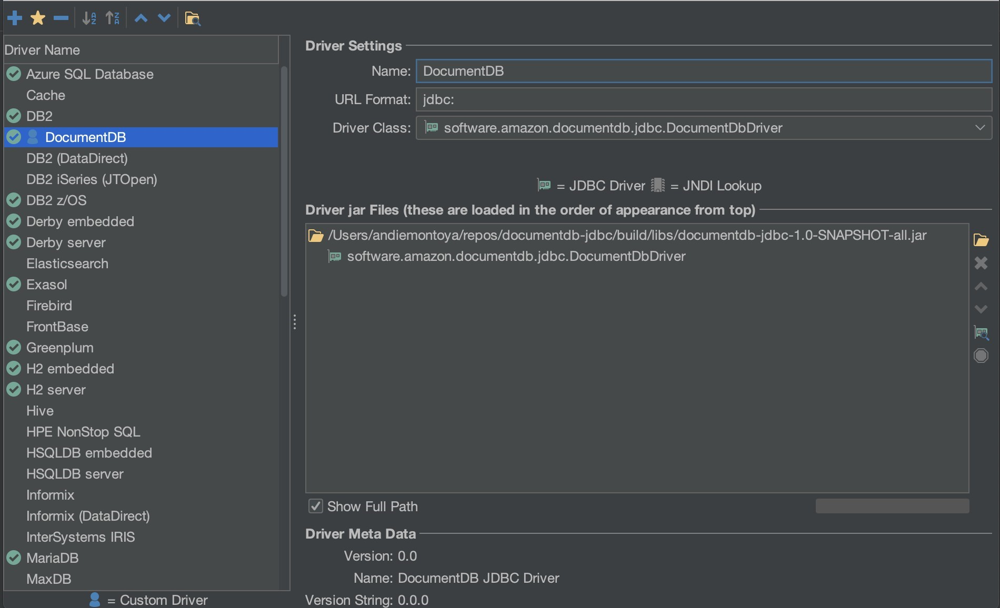
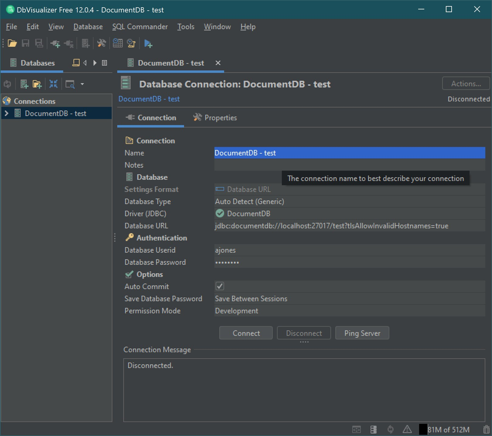

# Connect to Amazon DocumentDB from DbVisualizer

###### Topics

- [Adding the Amazon DocumentDB JDBC driver](#connect-jdbc-DbVisualizer-adddriver "#connect-jdbc-DbVisualizer-adddriver")
- [Connecting to Amazon DocumentDB using DbVisualizer](#connect-jdbc-DbVisualizer-connect "#connect-jdbc-DbVisualizer-connect")

## Adding the Amazon DocumentDB JDBC driver

To connect to Amazon DocumentDB from DbVisualizer you must first import the Amazon DocumentDB JDBC
Driver

1. Start the DbVisualizer application and navigate to the menu path:
   **Tools > Driver Manager...**
2. Choose **+** (or in the menu, select **Driver >
   Create Driver**).
3. Set **Name** to `DocumentDB`.
4. Set **URL Format** to
   `jdbc:documentdb://<host>[:port]/<database>[?option=value[&option=value[...]]]`
5. Choose the **folder** button and then select the Amazon DocumentDB
   JDBC driver JAR file and choose the **Open** button.
6. Verify that the **Driver Class** field is set to
   `software.amazon.documentdb.jdbc.DocumentDbDriver`. Your
   Driver Manager settings for **DocumentDB** should look like
   the following example.

 7. Close the dialog. The Amazon DocumentDB JDBC driver will be setup and ready to
use.

## Connecting to Amazon DocumentDB using DbVisualizer

Connect to Amazon DocumentDB Using DbVisualizer

1. If you are connecting from outside the Amazon DocumentDB cluster's VPC, ensure you
   have setup an SSH tunnel.
2. Choose **Database > Create Database Connection** from the
   top level menu.
3. Enter a descriptive name for the **Name** field.
4. Set **Driver (JDBC)** to the DocumentDB driver you
   created in the previous section.
5. Set **Database URL** to your JDBC connection string.

For example:
`jdbc:documentdb://localhost:27017/database?tlsAllowInvalidHostnames=true` 6. Set **Database Userid** to your Amazon DocumentDB user ID. 7. Set **Database Password** to the corresponding password
for the user ID.

Your Database Connection dialog should look like the following
dialog:

 8. Choose **Connect**.
