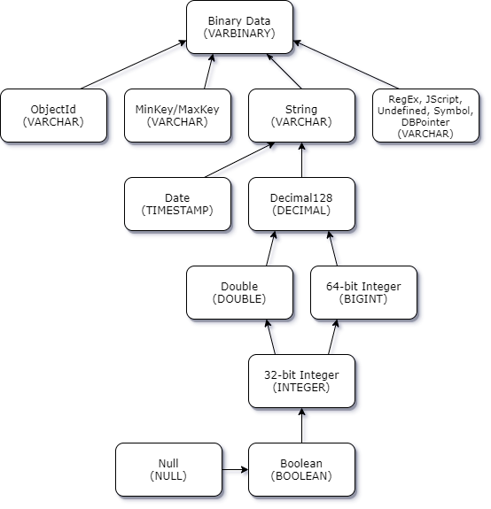

# JDBC automatic schema generation

Amazon DocumentDB is a document database and therefore does not have the concept of tables and
schema. However, BI tools such as Tableau will expect the database it connects to
present a schema. Specifically, when the JDBC driver connection needs to get the schema
for the collection in the database, it will poll for all the collections in the
database. The driver will determine if a cached version of the schema for that
collection already exists. If a cached version does not exist, it will sample the
collection for documents and create a schema based on the following behavior.

###### Topics

- [Schema generation
  limitations](#connect-jdbc-autoschemagen-limits "#connect-jdbc-autoschemagen-limits")
- [Scanning method
  options](#connect-jdbc-autoschemagen-scanningoptions "#connect-jdbc-autoschemagen-scanningoptions")
- [Amazon DocumentDB data types](#connect-jdbc-autoschemagen-datatypes "#connect-jdbc-autoschemagen-datatypes")
- [Mapping scalar document
  fields](#connect-jdbc-autoschemagen-scalarfields "#connect-jdbc-autoschemagen-scalarfields")
- [Object and array data
  type handling](#connect-jdbc-autoschemagen-objectandarray "#connect-jdbc-autoschemagen-objectandarray")

## Schema generation

limitations

The DocumentDB JDBC driver imposes a limit on the length of identifiers at 128
characters. The schema generator may truncate the length of generated identifiers
(table names and column names) to ensure they fit that limit.

## Scanning method

options

The sampling behavior can be modified using connection string or data source
options.

- _scanMethod=_<option>
  - _random - (default) - The sample documents are returned
    in random order._
  - _idForward_ - The sample documents are returned
    in order of id.
  - _idReverse_ - The sample documents are returned
    in reverse order of id.
  - _all_ - Sample all the documents in the
    collection.

- _scanLimit=_<n> - The number of documents to
  sample. The value must be a positive integer. The default value is
  _1000_. If _scanMethod_ is set to
  _all_, this option is ignored.

## Amazon DocumentDB data types

The Amazon DocumentDB server supports a number of MongoDB data types. Listed below are
the supported data types, and their associated JDBC data types.

| MongoDB Data Type       | Supported in DocumentDB | JDBC Data Type |
| ----------------------- | ----------------------- | -------------- |
| Binary Data             | Yes                     | VARBINARY      |
| Boolean                 | Yes                     | BOOLEAN        |
| Double                  | Yes                     | DOUBLE         |
| 32-bit Integer          | Yes                     | INTEGER        |
| 64-bit Integer          | Yes                     | BIGINT         |
| String                  | Yes                     | VARCHAR        |
| ObjectId                | Yes                     | VARCHAR        |
| Date                    | Yes                     | TIMESTAMP      |
| Null                    | Yes                     | VARCHAR        |
| Regular Expression      | Yes                     | VARCHAR        |
| Timestamp               | Yes                     | VARCHAR        |
| MinKey                  | Yes                     | VARCHAR        |
| MaxKey                  | Yes                     | VARCHAR        |
| Object                  | Yes                     | virtual table  |
| Array                   | Yes                     | virtual table  |
| Decimal128              | No                      | DECIMAL        |
| JavaScript              | No                      | VARCHAR        |
| JavaScript (with scope) | No                      | VARCHAR        |
| Undefined               | No                      | VARCHAR        |
| Symbol                  | No                      | VARCHAR        |
| DBPointer (4.0+)        | No                      | VARCHAR        |

## Mapping scalar document

fields

When scanning a sample of documents from a collection, the JDBC driver will create
one or more schema to represent the samples in the collection. In general, a scalar
field in the document maps to a column in the table schema. For example, in a
collection named team, and a single document `{ "_id" : "112233", "name" :
 "Alastair", "age": 25 }`, this would map to schema:

| Table Name | Column Name | Data Type | Key |
| ---------- | ----------- | --------- | --- |
| team       | _team id_   | VARCHAR   | PK  |
| team       | name        | VARCHAR   |     |
| team       | age         | INTEGER   |     |

### Data type conflict

promotion

When scanning the sampled documents, it is possible that the data types for a
field are not consistent from document to document. In this case, the JDBC
driver will promote the JDBC data type to a common data type that will suit all
data types from the sampled documents.

For Example:

```
{
"_id" : "112233",
"name" : "Alastair", "age" : 25
}

{
"_id" : "112244",
"name" : "Benjamin",
"age" : "32"
}
```

The _age_ field is of type 32-bit integer in the first
document but string in the second document. Here the JDBC driver will promote
the JDBC data type to VARCHAR to handle either data type when
encountered.

| Table Name | Column Name | Data Type | Key |
| ---------- | ----------- | --------- | --- |
| team       | _team id_   | VARCHAR   | PK  |
| team       | name        | VARCHAR   |     |
| team       | age         | VARCHAR   |     |

### Scalar-scalar

conflict promotion

The following diagram shows the way in which scalar-scalar data type conflicts
are resolved.



### Scalar-complex type

conflict promotion

Like the scalar-scalar type conflicts, the same field in different documents
can have conflicting data types between complex (array and object) and scalar
(integer, boolean, etc.). All of these conflicts are resolved (promoted) to
VARCHAR for those fields. In this case, array and object data is returned as the
JSON representation.

Embedded Array - String Field Conflict Example:

```
{
   "_id":"112233",
   "name":"George Jackson",
   "subscriptions":[
      "Vogue",
      "People",
      "USA Today"
   ]
}
{
   "_id":"112244",
   "name":"Joan Starr",
   "subscriptions":1
}
```

The above example maps to schema for the customer2 table:

| Table Name | Column Name    | Data Type | Key |
| ---------- | -------------- | --------- | --- |
| customer2  | _customer2 id_ | VARCHAR   | PK  |
| customer2  | name           | VARCHAR   |     |
| customer2  | subscription   | VARCHAR   |     |

and the customer1_subscriptions virtual table:

| Table Name              | Column Name              | Data Type | Key   |
| ----------------------- | ------------------------ | --------- | ----- |
| customer1_subscriptions | _customer1 id_           | VARCHAR   | PK/FK |
| customer1_subscriptions | subscriptions_index_lvl0 | BIGINT    | PK    |
| customer1_subscriptions | value                    | VARCHAR   |       |
| customer_address        | city                     | VARCHAR   |       |
| customer_address        | region                   | VARCHAR   |       |
| customer_address        | country                  | VARCHAR   |       |
| customer_address        | code                     | VARCHAR   |       |

## Object and array data

type handling

So far, we've only described how scalar data types are mapped. Object and Array
data types are (currently) mapped to virtual tables. The JDBC driver will create a
virtual table to represent either object or array fields in a document. The name of
the mapped virtual table will concatenate the original collection's name followed by
the field's name separated by an underscore character ("\_").

The base table's primary key ("\_id") takes on a new name in the new virtual table
and is provided as a foreign key to the associated base table.

For embedded array type fields, index columns are generated to represent the index
into the array at each level of the array.

### Embedded object field

example

For object fields in a document, a mapping to a virtual table is created by
the JDBC driver.

```
{
   "Collection: customer",
   "_id":"112233",
   "name":"George Jackson",
   "address":{
      "address1":"123 Avenue Way",
      "address2":"Apt. 5",
      "city":"Hollywood",
      "region":"California",
      "country":"USA",
      "code":"90210"
   }
}
```

The above example maps to schema for customer table:

| Table Name | Column Name   | Data Type | Key |
| ---------- | ------------- | --------- | --- |
| customer   | _customer id_ | VARCHAR   | PK  |
| customer   | name          | VARCHAR   |     |

and the customer_address virtual table:

| Table Name       | Column Name   | Data Type | Key   |
| ---------------- | ------------- | --------- | ----- |
| customer_address | _customer id_ | VARCHAR   | PK/FK |
| customer_address | address1      | VARCHAR   |       |
| customer_address | address2      | VARCHAR   |       |
| customer_address | city          | VARCHAR   |       |
| customer_address | region        | VARCHAR   |       |
| customer_address | country       | VARCHAR   |       |
| customer_address | code          | VARCHAR   |       |

### Embedded array field

example

For array fields in a document, a mapping to a virtual table is also created
by the JDBC driver.

```
{
   "Collection: customer1",
   "_id":"112233",
   "name":"George Jackson",
   "subscriptions":[
      "Vogue",
      "People",
      "USA Today"
   ]
}
```

The above example maps to schema for customer1 table:

| Table Name | Column Name    | Data Type | Key |
| ---------- | -------------- | --------- | --- |
| customer1  | _customer1 id_ | VARCHAR   | PK  |
| customer1  | name           | VARCHAR   |     |

and the customer1_subscriptions virtual table:

| Table Name              | Column Name              | Data Type | Key   |
| ----------------------- | ------------------------ | --------- | ----- |
| customer1_subscriptions | _customer1 id_           | VARCHAR   | PK/FK |
| customer1_subscriptions | subscriptions_index_lvl0 | BIGINT    | PK    |
| customer1_subscriptions | value                    | VARCHAR   |       |
| customer_address        | city                     | VARCHAR   |       |
| customer_address        | region                   | VARCHAR   |       |
| customer_address        | country                  | VARCHAR   |       |
| customer_address        | code                     | VARCHAR   |       |
