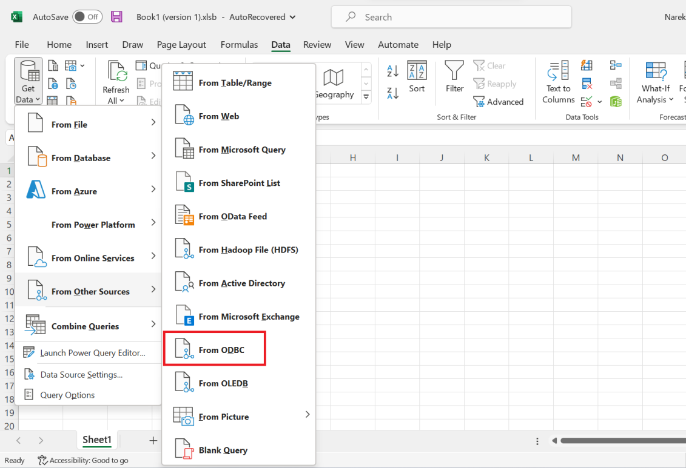
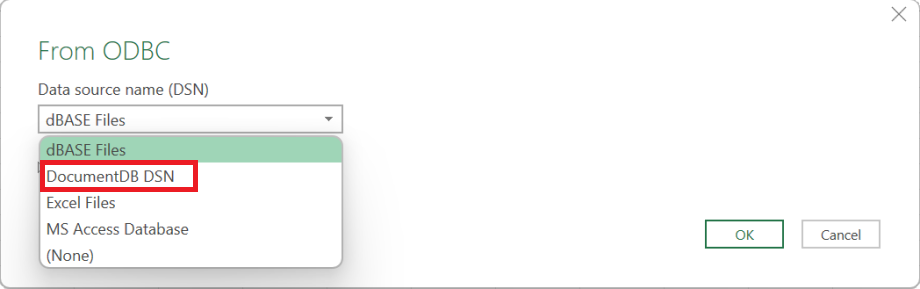
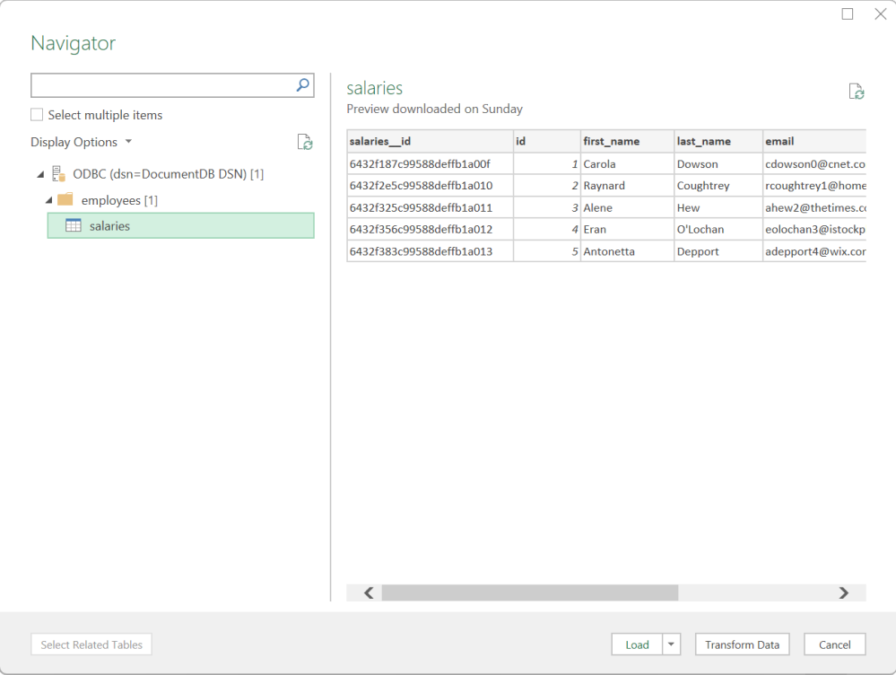
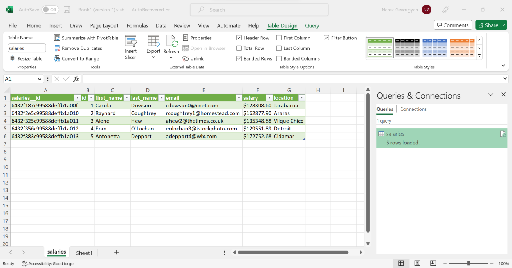

# Connect to Amazon DocumentDB from Microsoft Excel

1. Ensure that the Amazon DocumentDB driver has been correctly installed and configured.
   For additional information, refer to [Setting up the ODBC driver in Windows](connect-odbc-setup-windows.md "connect-odbc-setup-windows.md").
2. Launch Microsoft Excel.
3. Navigate to **Data** > **Get Data** > **From Other Sources**.
4. Choose **From ODBC**:

 5. Select the data source from the **Data source name (DSN)** drop down menu that is associated with Amazon DocumentDB:

 6. Choose the collection from which you want to load data into Excel:

 7. Load data into Excel:

