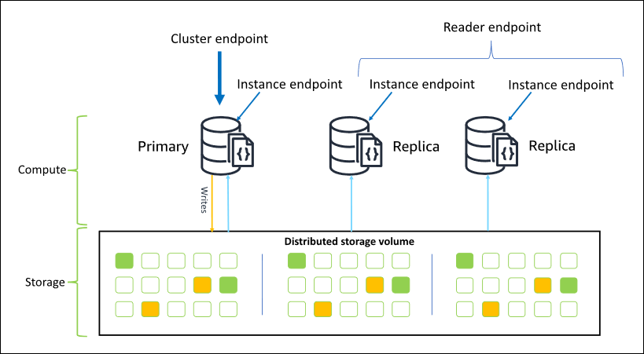
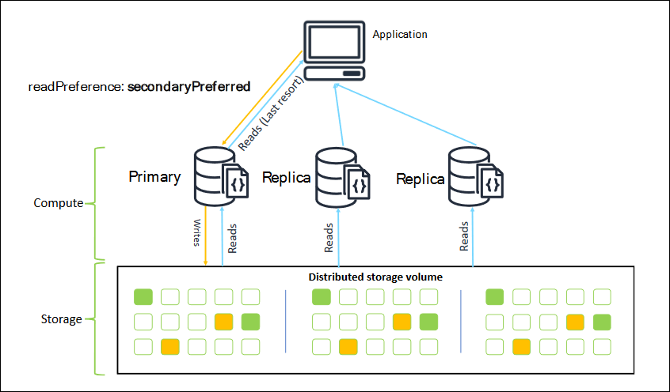

# Connecting to Amazon DocumentDB as a replica set

When you're developing against Amazon DocumentDB (with MongoDB compatibility), we recommend that you connect to your cluster
as a replica set and distribute reads to replica instances using the built-in read preference
capabilities of your driver. This section goes deeper into what that means and describes how
you can connect to your Amazon DocumentDB cluster as a replica set using the SDK for Python as an
example.

Amazon DocumentDB has three endpoints that you can use to connect to your cluster:

- Cluster endpoint
- Reader endpoint
- Instance endpoints
  In most cases when you connect to Amazon DocumentDB, we recommend that you use the cluster endpoint. This is a CNAME that points to the primary instance in your cluster, as shown in the following diagram.

When using an SSH tunnel, we recommend that you connect to your cluster using the cluster endpoint and do not attempt to connect in replica set mode (i.e., specifying `replicaSet=rs0` in your connection string) as it will result in an error.

###### Note

For more information about Amazon DocumentDB endpoints, see [Amazon DocumentDB endpoints](how-it-works.md#how-it-works.endpoints "how-it-works.md#how-it-works.endpoints").


Using the cluster endpoint, you can connect to your cluster in replica set mode. You can
then use the built-in read preference driver capabilities. In the following example,
specifying `/?replicaSet=rs0` signifies to the SDK that you want to connect as a
replica set. If you omit `/?replicaSet=rs0'`, the client routes all requests to the
cluster endpoint, that is, your primary instance.

```
## Create a MongoDB client, open a connection to Amazon DocumentDB as a
   ## replica set and specify the read preference as secondary preferred
   client = pymongo.MongoClient('mongodb://`<user-name>`:`<password>`@mycluster.node.us-east-1.docdb.amazonaws.com:27017/?replicaSet=rs0')
```

The advantage of connecting as a replica set is that it enables your SDK to discover the
cluster topography automatically, including when instances are added or removed from the
cluster. You can then use your cluster more efficiently by routing read requests to your
replica instances.

When you connect as a replica set, you can specify the `readPreference` for the
connection. If you specify a read preference of `secondaryPreferred`, the client
routes read queries to your replicas and write queries to your primary instance (as in the
following diagram). This is a better use of your cluster resources. For more information, see
[Read preference options](how-it-works.md#durability-consistency-isolation "how-it-works.md#durability-consistency-isolation").

```
## Create a MongoDB client, open a connection to Amazon DocumentDB as a
   ##   replica set and specify the read preference as secondary preferred
client = pymongo.MongoClient('mongodb://`<user-name>`:`<password>`@mycluster.node.us-east-1.docdb.amazonaws.com:27017/?replicaSet=rs0**&readPreference=secondaryPreferred'**)
```


Reads from Amazon DocumentDB replicas are eventually consistent. They return the data in the same
order as it was written on the primary, and there is often less than a 50 ms replication lag.
You can monitor the replica lag for your cluster using the Amazon CloudWatch metrics
`DBInstanceReplicaLag` and `DBClusterReplicaLagMaximum`. For more
information, see [Monitoring Amazon DocumentDB with CloudWatch](cloud_watch.md "cloud_watch.md").

Unlike traditional monolithic database architecture, Amazon DocumentDB separates storage and compute.
Given this modern architecture, we encourage you to read scale on replica instances. Reads on
replica instances don't block writes being replicated from the primary instance. You can add
up to 15 read replica instances in a cluster and scale out to millions of reads per
second.

The key benefit of connecting as a replica set and distributing reads to replicas is that
it increases the overall resources in your cluster that are available to do work for your
application. We recommend connecting as a replica set as a best practice. Further, we
recommend it most commonly in the following scenarios:

- You're using nearly 100 percent CPU on your primary.
- The buffer cache hit ratio is near zero.
- You reach the connection or cursor limits for an individual instance.
  Scaling up a cluster instance size is an option, and in some cases, that can be the best
  way to scale the cluster. But you should also consider how to better use the replicas that you
  already have in your cluster. This lets you increase scale without the increased cost of using
  a larger instance type. We also recommend that you monitor and alert on these limits (that is
  `CPUUtilization`, `DatabaseConnections`, and
  `BufferCacheHitRatio`) using CloudWatch alarms so that you know when a resource is
  being heavily used.

For more information, see the following topics:

- [Best practices for Amazon DocumentDB](best_practices.md "best_practices.md")
- [Amazon DocumentDB Quotas and limits](limits.md "limits.md")

## Using cluster connections

Consider the scenario of using all the connections in your cluster. For example, an
`r5.2xlarge` instance has a limit of 4,500 connections (and 450 open cursors). If you create
a three-instance Amazon DocumentDB cluster and connect only to the primary instance using the cluster
endpoint, your cluster limits for open connections and cursors are 4,500 and 450
respectively. You might reach these limits if you're building applications that use many
workers that get spun up in containers. The containers open up a number of connections all
at once and saturate the cluster.

Instead, you could connect to the Amazon DocumentDB cluster as a replica set and distribute your
reads to the replica instances. You could then effectively triple the number of available
connections and cursors available in the cluster to 13,500 and 1,350 respectively. Adding
more instances to the cluster only increases the number of connections and cursors for read
workloads. If you need to increase the number of connections for writes to your cluster, we
recommend increasing the instance size.

###### Note

The number of connections for `large`, `xlarge`, and `2xlarge` instances increases with the instance size up to 4,500. The maximum number of connections per instance for `4xlarge` instances or greater is 4,500. For more information on limits by instance types, see [Instance limits](limits.md#limits.instance "limits.md#limits.instance").

Typically we don't recommend that you connect to your cluster using the read preference
of `secondary`. This is because if there are no replica instances in your
cluster, the reads fail. For example, suppose that you have a two-instance Amazon DocumentDB cluster
with one primary and one replica. If the replica has an issue, read requests from a
connection pool that is set as `secondary` fail. The advantage of
`secondaryPreferred` is that if the client can't find a suitable replica
instance to connect to, it falls back to the primary for reads.

## Multiple connection pools

In some scenarios, reads in an application need to have read-after-write consistency,
which can be served only from the primary instance in Amazon DocumentDB. In these scenarios, you
might create two client connection pools: one for writes and one for reads that need
read-after-write consistency. To do that, your code would look something like the
following.

```
## Create a MongoDB client,
##    open a connection to Amazon DocumentDB as a replica set and specify the readPreference as primary
clientPrimary = pymongo.MongoClient('mongodb://`<user-name>`:`<password>`@mycluster.node.us-east-1.docdb.amazonaws.com:27017/?replicaSet=rs0&readPreference=primary')

## Create a MongoDB client,
##    open a connection to Amazon DocumentDB as a replica set and specify the readPreference as secondaryPreferred
secondaryPreferred = pymongo.MongoClient('mongodb://`<user-name>`:`<password>`@mycluster.node.us-east-1.docdb.amazonaws.com:27017/?replicaSet=rs0&readPreference=secondaryPreferred')
```

Another option is to create a single connection pool and overwrite the read preference
for a given collection.

```
##Specify the collection and set the read preference level for that collection
col = db.review.with_options(read_preference=ReadPreference.SECONDARY_PREFERRED)
```

## Summary

To better use the resources in your cluster, we recommend that you connect to your
cluster using the replica set mode. If it's suitable for your application, you can read
scale your application by distributing your reads to the replica instances.
