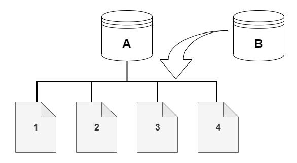
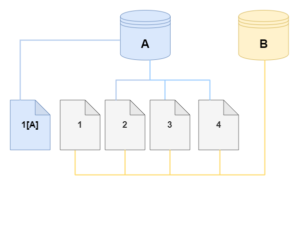
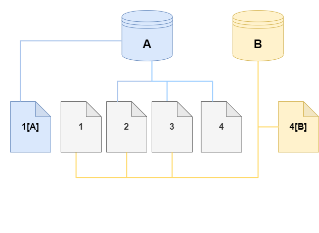
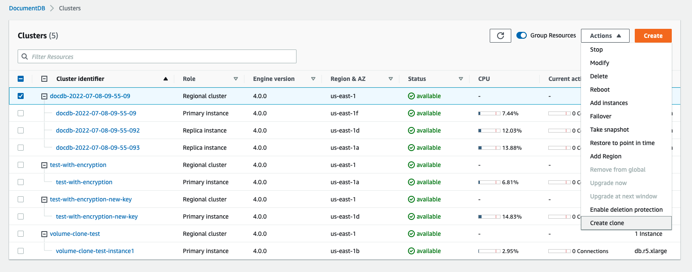
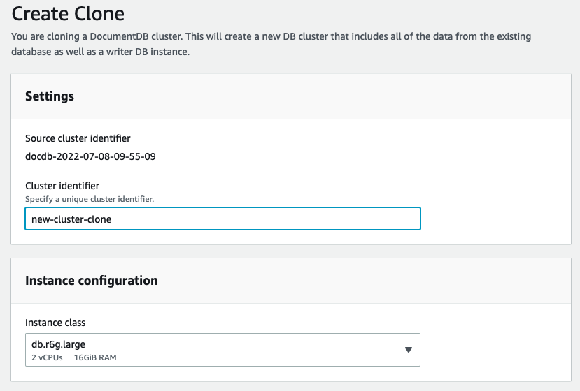
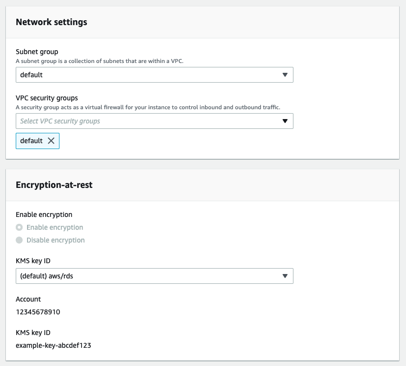
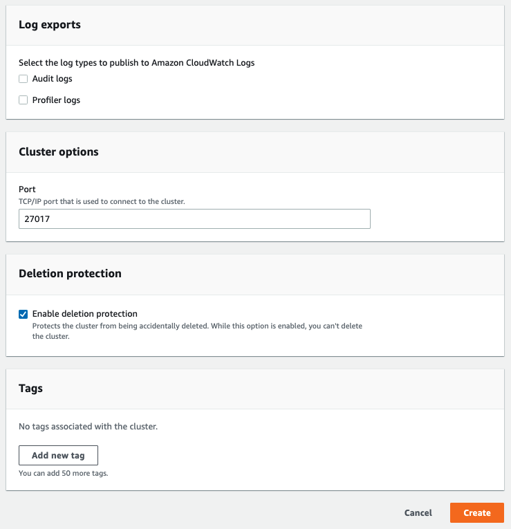

# Cloning a volume for an Amazon DocumentDB cluster

By using Amazon DocumentDB cloning, you can create a new cluster that uses the same Amazon DocumentDB cluster volume
and has the same data as the original. The process is designed to be fast and cost-effective.
The new cluster with its associated data volume is known as a _clone_.
Creating a clone is faster and more space-efficient than physically copying the data using other
techniques, such as restoring a snapshot.

Amazon DocumentDB supports creating an Amazon DocumentDB provisioned clone from a provisioned Amazon DocumentDB cluster. When you create a clone using a different deployment configuration than the source,
the clone is created using the latest version of the source's Amazon DocumentDB engine.

When you create clones from your Amazon DocumentDB clusters, the clones are created in your AWS account—the same account that
owns the source Amazon DocumentDB cluster.

###### Topics

- [Overview of Amazon DocumentDB cloning](#db-cloning-overview "#db-cloning-overview")
- [Limitations of Amazon DocumentDB cloning](#db-cloning-limitations "#db-cloning-limitations")
- [How Amazon DocumentDB cloning works](#db-how-db-cloning-works "#db-how-db-cloning-works")
- [Creating an Amazon DocumentDB clone](#db-creating-db-clone "#db-creating-db-clone")

## Overview of Amazon DocumentDB cloning

Amazon DocumentDB uses a _copy-on-write protocol_ to create a
clone. This mechanism uses minimal additional space to create an initial clone. When the clone
is first created, Amazon DocumentDB keeps a single copy of the data that is used by the source DB
cluster and the new (cloned) Amazon DocumentDB cluster. Additional storage is allocated only when
changes are made to data (on the Amazon DocumentDB storage volume) by the source Amazon DocumentDB cluster or the
Amazon DocumentDB cluster clone. To learn more about the copy-on-write protocol, see
[How Amazon DocumentDB cloning works](#db-how-db-cloning-works "#db-how-db-cloning-works").

Amazon DocumentDB cloning is especially useful for quickly setting up test environments using your
production data, without risking data corruption. You can use clones for many types of
applications, such as the following:

- Experiment with potential changes (schema changes and parameter group changes, for example) to assess all impacts.
- Run workload-intensive operations, such as exporting data or running
  analytical queries on the clone.
- Create a copy of your production DB cluster for development, testing, or other purposes.

You can create more than one clone from the same Amazon DocumentDB cluster. You can also create multiple clones from another clone.

After creating an Amazon DocumentDB clone, you can configure the Amazon DocumentDB instances differently from the source Amazon DocumentDB cluster.
For example, you might not need a clone for development purposes to meet the same high availability requirements as the
source production Amazon DocumentDB cluster. In this case, you can configure the clone with a single Amazon DocumentDB instance rather than
the multiple DB instances used by the Amazon DocumentDB cluster.

When you finish using the clone for your testing, development, or other purposes, you can
delete it.

## Limitations of Amazon DocumentDB cloning

Amazon DocumentDB; cloning currently has the following limitations:

- You can create as many clones as you want, up to the maximum number of DB clusters allowed in the AWS Region.
  However, after you create 15 clones, the next clone is a full copy. The cloning operation acts like a point-in-time
  recovery.
- You can't create a clone in a different AWS Region from the source Amazon DocumentDB cluster.
- You can't create a clone from an Amazon DocumentDB cluster that has no DB instances.
  You can only clone Amazon DocumentDB clusters that have at least one DB instance.
- You can create a clone in a different virtual private cloud (VPC) than that of
  the Amazon DocumentDB cluster. If you do, the subnets of the VPCs must map to the same Availability
  Zones.

## How Amazon DocumentDB cloning works

Amazon DocumentDB cloning works at the storage layer of an Amazon DocumentDB cluster. It uses a
_copy-on-write_ protocol that's both fast and space-efficient in
terms of the underlying durable media supporting the Amazon DocumentDB storage volume. You can learn more
about Amazon DocumentDB cluster volumes in [Managing Amazon DocumentDB clusters](db-clusters.md "db-clusters.md").

###### Topics

- [Understanding the copy-on-write protocol](#db-copy-on-write-protocol "#db-copy-on-write-protocol")
- [Deleting a source cluster volume](#db-deleting-source-cluster-volume "#db-deleting-source-cluster-volume")

### Understanding the copy-on-write protocol

An Amazon DocumentDB cluster stores data in pages in the underlying Amazon DocumentDB storage volume.

For example, in the following diagram you can find an Amazon DocumentDB cluster (A) that has four
data pages, 1, 2, 3, and 4. Imagine that a clone, B, is created from the Amazon DocumentDB cluster.
When the clone is created, no data is copied. Rather, the clone points to the same set of
pages as the source Amazon DocumentDB cluster.



When the clone is created, no additional storage is usually needed. The copy-on-write protocol uses the same segment on the physical
storage media as the source segment. Additional storage is required only if the capacity of the source segment isn't sufficient for
the entire clone segment. If that's the case, the source segment is copied to another physical device.

In the following diagrams, you can find an example of the copy-on-write protocol in
action using the same cluster A and its clone, B, as shown preceding. Let's say that
you make a change to your Amazon DocumentDB cluster (A) that results in a change to data held on page

1.  Instead of writing to the original page 1, Amazon DocumentDB creates a new page 1[A]. The Amazon DocumentDB
    cluster volume for cluster (A) now points to page 1[A], 2, 3, and 4, while the clone (B)
    still references the original pages.



On the clone, a change is made to page 4 on the storage volume. Instead of writing to the original page 4, Amazon DocumentDB creates a new page, 4[B].
The clone now points to pages 1, 2, 3, and to page 4[B], while the cluster (A) continues pointing to 1[A], 2, 3, and 4.



As more changes occur over time in both the source Amazon DocumentDB cluster volume and the clone, more storage is needed to
capture and store the changes.

### Deleting a source cluster volume

When you delete a source cluster volume that has one or more clones associated with
it, the clones aren't affected. The clones continue to point to the pages that were
previously owned by the source cluster volume.

## Creating an Amazon DocumentDB clone

You can create a clone in the same AWS account as the source Amazon DocumentDB cluster. To do so,
you can use the AWS Management Console or the AWS CLI and the procedures following.

By using Amazon DocumentDB cloning, you can create a provisioned Amazon DocumentDB cluster clone from a provisioned Amazon DocumentDB cluster.

Using the AWS Management Console
The following procedure describes how to clone an Amazon DocumentDB cluster using the
AWS Management Console.

Creating a clone using the AWS Management Console results in an Amazon DocumentDB cluster with one Amazon DocumentDB
instance.

These instructions apply for DB clusters owned by the same AWS account that is creating the clone.
The DB cluster must be owned by the same AWS account as cross-account cloning is not supported in Amazon DocumentDB.

###### To create a clone of a DB cluster owned by your AWS account using the AWS Management Console

1. Sign in to the AWS Management Console, and open the Amazon DocumentDB console at [https://console.aws.amazon.com/docdb](https://console.aws.amazon.com/docdb "https://console.aws.amazon.com/docdb").
2. In the navigation pane, choose **Clusters**.
3. Choose your Amazon DocumentDB cluster from the list, and for **Actions**, choose
   **Create clone**.



The Create clone page opens, where you can configure a **Cluster identifier** and an **Instance
class**, and other options for the Amazon DocumentDB cluster clone. 4. In the **Settings** section, do the following:

    1. For **Cluster identifier**, enter the name that you want to give to your
     cloned Amazon DocumentDB cluster.
    2. For **Instance configuration**, select an appropriate **Instance class** for your
     cloned Amazon DocumentDB cluster.


    
    3. For **Network settings**, choose a **Subnet group** for your use case
     and the associated VPC security groups.
    4. For **Encryption-at-rest**, if the source cluster (the cluster that is being cloned) has encryption
     enabled, the cloned cluster must also have encryption enabled. If this scenario is true, then the
     **Enable encryption** options are grayed out (disabled) but with the **Enable encryption**
     choice selected. Conversely, if the source cluster does not have encryption enabled, the **Enable encryption**
     options are available and you can choose to enable or disable encryption.


    
    5. Complete the new cluster clone configuration by selecting the type of logs to export (optional),
     entering a specific port used to connect to the cluster, and enabling protection from accidentally deleting the cluster (enabled by default).


    
    6. Finish entering all settings for your Amazon DocumentDB cluster clone. To learn more about
     Amazon DocumentDB cluster and instance settings, see [Managing Amazon DocumentDB clusters](db-clusters.md "db-clusters.md").

5. Choose **Create clone** to launch the Amazon DocumentDB clone of your chosen Amazon DocumentDB
   cluster.

When the clone is created, it's listed with your other Amazon DocumentDB clusters in the
console **Databases** section and displays its current state. Your clone
is ready to use when its state is **Available**.

Using the AWS CLI
Using the AWS CLI for cloning your Amazon DocumentDB cluster involves a couple of steps.

The `restore-db-cluster-to-point-in-time` AWS CLI command that you use
results in an empty Amazon DocumentDB cluster with 0 Amazon DocumentDB instances. That is, the command
restores only the Amazon DocumentDB cluster, not the DB instances for that cluster. You do that
separately after the clone is available. The two steps in the process are as follows:

1. Create the clone by using the [restore-db-cluster-to-point-in-time](../../../cli/latest/reference/rds/restore-db-cluster-to-point-in-time.md "../../../cli/latest/reference/rds/restore-db-cluster-to-point-in-time.md") CLI command. The parameters that you
   use with this command control the capacity type and other details of the empty Amazon DocumentDB cluster (clone) being created.
2. Create the Amazon DocumentDB instance for the clone by using the [create-db-instance](../../../cli/latest/reference/rds/create-db-instance.md "../../../cli/latest/reference/rds/create-db-instance.md") CLI command to recreate the Amazon DocumentDB instance
   in the restored Amazon DocumentDB cluster.

The commands following assume that the AWS CLI is set up with your AWS Region as the
default. This approach saves you from passing the `--region` name in each of
the commands. For more information, see [Configuring the AWS CLI](../../../cli/latest/userguide/cli-chap-configure.md "../../../cli/latest/userguide/cli-chap-configure.md"). You
can also specify the `--region` in each of the CLI commands that follow.

###### Topics

**Creating the clone**

The specific parameters that you pass to the `restore-db-cluster-to-point-in-time` CLI command vary. What you pass
depends on the type of clone that you want to create.

Use the following procedure to create a provisioned Amazon DocumentDB clone from a provisioned Amazon DocumentDB cluster.

###### To create a clone of the same engine mode as the source Amazon DocumentDB cluster

- Use the `restore-db-cluster-to-point-in-time` CLI command and specify
  values for the following parameters:
  - `--db-cluster-identifier` – Choose a meaningful name for your clone. You name the clone when you use
    the [restore-db-cluster-to-point-in-time](../../../cli/latest/reference/rds/restore-db-cluster-to-point-in-time.md "../../../cli/latest/reference/rds/restore-db-cluster-to-point-in-time.md") CLI command.
  - `--restore-type` – Use `copy-on-write` to create a clone of the source DB cluster. Without this
    parameter, the `restore-db-cluster-to-point-in-time` restores the Amazon DocumentDB
    cluster rather than creating a clone. Default for `restore-type` is `full-copy`.
  - `--source-db-cluster-identifier` – Use the name of the source Amazon DocumentDB cluster that you want to clone.
  - `--use-latest-restorable-time` – This value points to the latest restorable
    volume data for the clone. This parameter is required for `restore-type copy-on-write`,
    however, you can not use the `restore-to-time parameter` with it.

The following example creates a clone named `my-clone` from a
cluster named `my-source-cluster`.

For Linux, macOS, or Unix:

```
aws docdb restore-db-cluster-to-point-in-time \
    --source-db-cluster-identifier `my-source-cluster` \
    --db-cluster-identifier `my-clone` \
    --restore-type copy-on-write \
    --use-latest-restorable-time
```

For Windows:

```
aws docdb restore-db-cluster-to-point-in-time ^
    --source-db-cluster-identifier `my-source-cluster` ^
    --db-cluster-identifier `my-clone` ^
    --restore-type copy-on-write ^
    --use-latest-restorable-time
```

The command returns the JSON object containing details of the clone. Check to make sure that your cloned DB cluster is available before
trying to create the DB instance for your clone. For more information, see Checking the status and getting clone details below:

**Checking the status and getting clone details**

You can use the following command to check the status of your newly created empty DB cluster.

```
`$` `aws docdb describe-db-clusters --db-cluster-identifier `my-clone` --query '*[].[Status]' --output text`
```

Or you can obtain the status and the other values that you need to create the DB instance for your
clone by using the following AWS CLI query:

For Linux, macOS, or Unix:

```
aws docdb describe-db-clusters --db-cluster-identifier `my-clone` \
  --query '*[].{Status:Status,Engine:Engine,EngineVersion:EngineVersion}'
```

For Windows:

```
aws docdb describe-db-clusters --db-cluster-identifier `my-clone` ^
  --query "*[].{Status:Status,Engine:Engine,EngineVersion:EngineVersion}"
```

This query returns output similar to the following.

```
[
  {
        "Status": "available",
        "Engine": "docdb",
        "EngineVersion": "4.0.0",
    }
]
```

**Creating the Amazon DocumentDB instance for your clone**

Use the [create-db-instance](../../../cli/latest/reference/rds/create-db-instance.md "../../../cli/latest/reference/rds/create-db-instance.md") CLI command to create the DB instance for your clone.

The `--db-instance-class` parameter is used for provisioned Amazon DocumentDB clusters only.

For Linux, macOS, or Unix:

```
aws docdb create-db-instance \
    --db-instance-identifier `my-new-db` \
    --db-cluster-identifier `my-clone` \
    --db-instance-class  db.r5.4xlarge \
    --engine docdb
```

For Windows:

```
aws docdb create-db-instance ^
    --db-instance-identifier `my-new-db` ^
    --db-cluster-identifier `my-clone` ^
    --db-instance-class  db.r5.4xlarge ^
    --engine docdb
```

**Parameters to use for cloning**

The following table summarizes the various parameters used with `restore-db-cluster-to-point-in-time` to clone
Amazon DocumentDB clusters.

| Parameter                      | Description                                                                                                                                                                          |
| ------------------------------ | ------------------------------------------------------------------------------------------------------------------------------------------------------------------------------------ |
| --source-db-cluster-identifier | Use the name of the source Amazon DocumentDB cluster that you want to clone.                                                                                                         |
| --db-cluster-identifier        | Choose a meaningful name for your clone. You name your clone with the `restore-db-cluster-to-point-in-time` command. Then you pass this name<br>to the `create-db-instance` command. |
| --restore-type                 | Specify `copy-on-write` as the `--restore-type` to create a clone of the source DB cluster rather<br>than restoring the source Amazon DocumentDB cluster.                            |
| --use-latest-restorable-time   | This value points to the latest restorable volume data for the clone.                                                                                                                |
