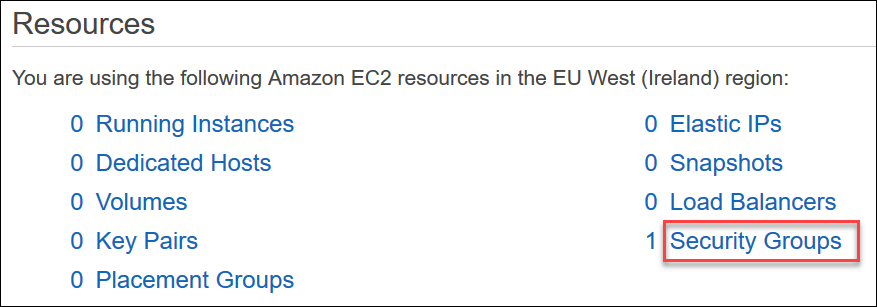
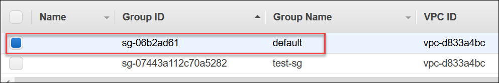
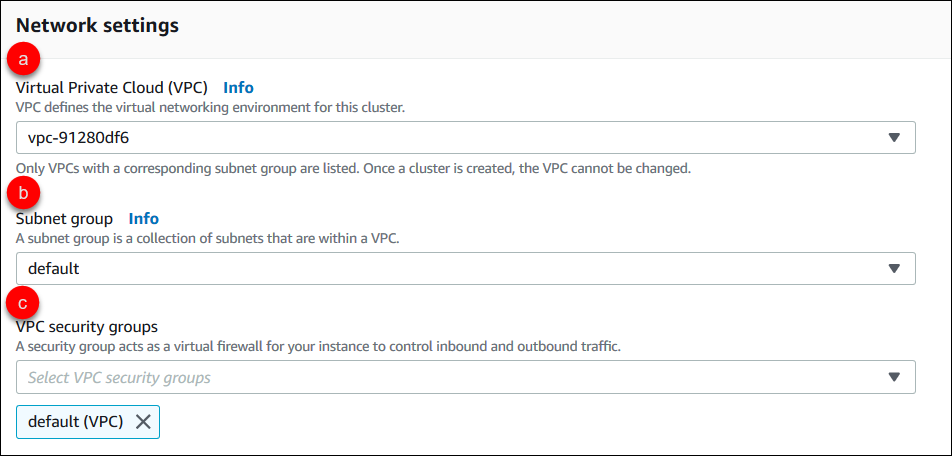
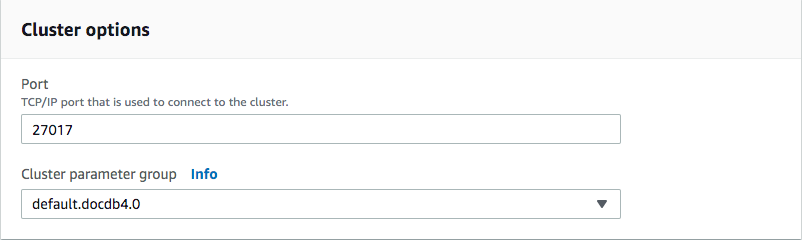
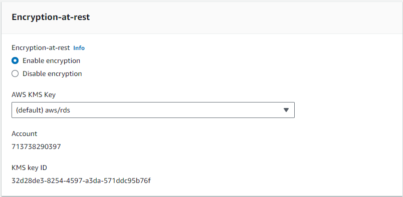
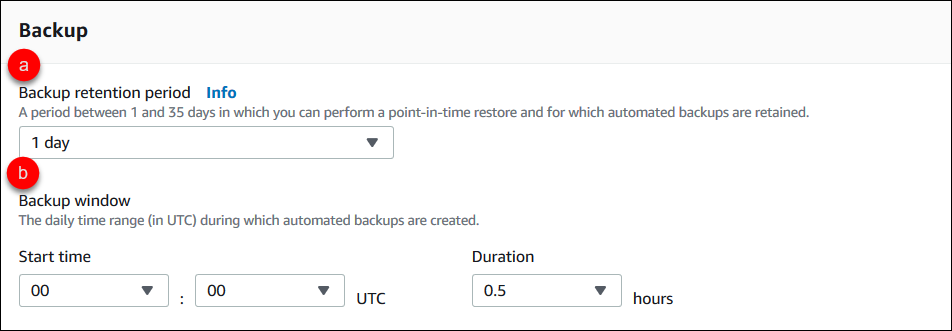
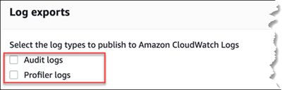
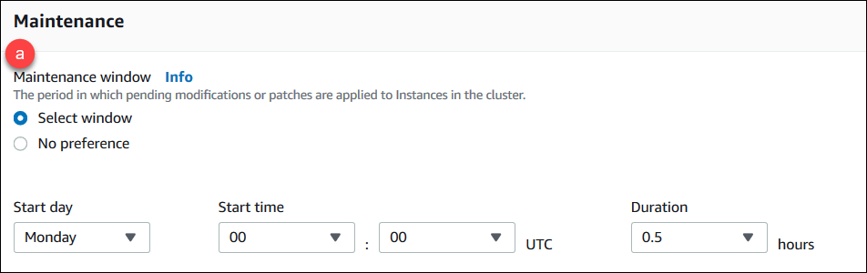
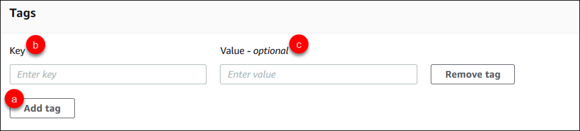
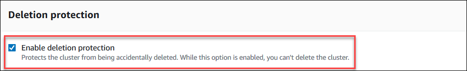

# Creating an Amazon DocumentDB cluster

An Amazon DocumentDB cluster consists of instances and a cluster volume that represents the data for the cluster. The cluster volume is replicated six ways across three Availability Zones as a single, virtual volume. The cluster contains a primary instance and, optionally, up to 15 replica instances.

The following sections show how to create an Amazon DocumentDB cluster using either the AWS Management Console or the AWS CLI. You can then add additional replica instances for that cluster. When you use the console to create your Amazon DocumentDB cluster, a primary instance is automatically created for you at the same time. If you use the AWS CLI to create your Amazon DocumentDB cluster, after the cluster's status is _available_, you must then create the primary instance for that cluster.

## Prerequisites

The following are prerequisites for creating an Amazon DocumentDB cluster.

If you do not have an AWS account, complete the following steps to create one.

###### To sign up for an AWS account

1. Open [https://portal.aws.amazon.com/billing/signup](https://portal.aws.amazon.com/billing/signup "https://portal.aws.amazon.com/billing/signup").
2. Follow the online instructions.

Part of the sign-up procedure involves receiving a phone call or text message and entering
a verification code on the phone keypad.

When you sign up for an AWS account, an _AWS account root user_ is created. The root user has access to all AWS services
and resources in the account. As a security best practice, assign administrative access to a user, and use only the root user to perform [tasks that require root user access](../../../IAM/latest/UserGuide/id_root-user.md#root-user-tasks "../../../IAM/latest/UserGuide/id_root-user.md#root-user-tasks").

### VPC prerequisites

You can only create an Amazon DocumentDB cluster in an Amazon Virtual Private Cloud (Amazon VPC). Your Amazon VPC must have at least one subnet in each of at least two Availability Zones in order for you to use it with an Amazon DocumentDB cluster.
By distributing your cluster instances across Availability Zones, you ensure that instances are available in your cluster in the unlikely case of an Availability Zone failure.

### Subnet prerequisites

When creating an Amazon DocumentDB cluster, you must choose a VPC and corresponding subnet group within that VPC to launch your cluster. Subnets
determine the Availability Zone and IP range within that Availability Zone that you
want to use to launch an instance. For the purposes of this discussion, the terms _subnet_ and _Availability
Zone_ are used interchangeably. A subnet group is a named set of subnets (or Availability Zones). What a subnet group allows you
to do is specify the Availability Zones that you want to use to for launching Amazon DocumentDB instances. For example, in a cluster with three
instances, it is recommended for high availability that each of those instances is provisioned in separate Availability Zones. Thus, if a
single Availability Zone goes down, it only affects a single instance.

Amazon DocumentDB instances can currently be provisioned in up to three Availability Zones. Even if a subnet group has more than three subnets, you
can only use three of those subnets to create an Amazon DocumentDB cluster. As a result, it is suggested that when you create a subnet group, only choose the three subnets that you want to deploy your instances to. In US East (N. Virginia), your subnet group can have six subnets (or Availability Zones). However, when an Amazon DocumentDB cluster is provisioned, Amazon DocumentDB chooses three of those Availability Zones that it uses to provision instances.

For example, suppose that when you are creating a cluster, Amazon DocumentDB chooses the Availability Zones {1A, 1B, and 1C}. If you try to create an instance in Availability Zone {1D}, the API call fails. However, if you choose to create an instance without specifying a particular Availability Zone, then Amazon DocumentDB chooses an Availability Zone on your behalf. Amazon DocumentDB uses an algorithm to load balance the instances across Availability Zones to help you achieve high availability. For example, if three instances are provisioned, by default, they are provisioned across three Availability Zones and are not provisioned all in a single Availability Zone.

###### Recommendations:

- Unless you have a specific reason, always create a subnet group with three subnets. Doing so helps ensure that clusters with three or
  more instances can achieve higher availability as instances are provisioned across three Availability Zones.
- Always spread instances across multiple Availability Zones to achieve high availability. Never place all instances for a cluster in a
  single Availability Zone.
- Because failover events can happen at any time, you should not assume that a primary instance or replica instances are always in a
  particular Availability Zone.

### Additional prerequisites

The following are some additional prerequisites for creating an Amazon DocumentDB cluster:

- If you are connecting to AWS using AWS Identity and Access Management (IAM) credentials, your IAM account must have IAM policies that grant the permissions that are required to perform Amazon DocumentDB operations.

If you are using an IAM account to access the Amazon DocumentDB console, you must first sign in to the AWS Management Console with your IAM account. Then go to the Amazon DocumentDB console at [https://console.aws.amazon.com/docdb](https://console.aws.amazon.com/docdb "https://console.aws.amazon.com/docdb").

- If you want to tailor the configuration parameters for your cluster, you must specify a cluster parameter group and parameter group with the required parameter settings. For information about creating or modifying a cluster parameter group or parameter group, see
  [Managing Amazon DocumentDB cluster parameter groups](cluster_parameter_groups.md "cluster_parameter_groups.md").
- You must determine the TCP/IP port number that you want to specify for your cluster. The firewalls at some companies block
  connections to the default ports for Amazon DocumentDB. If your company firewall blocks the default port, choose another port for your cluster.
  All instances in a cluster use the same port.

## Creating a cluster and primary instance using the AWS Management Console

The following procedures describe how to use the console to launch an Amazon DocumentDB cluster with one or more instances.

### Create a cluster: using default settings

###### To create a cluster with instances using the default settings using the AWS Management Console

1. Sign in to the AWS Management Console, and open the Amazon DocumentDB console at [https://console.aws.amazon.com/docdb](https://console.aws.amazon.com/docdb "https://console.aws.amazon.com/docdb").
2. If you want to create your cluster in an AWS Region other than the US East (N. Virginia) Region, choose the Region from
   the list in the upper-right section of the console.
3. In the navigation pane, choose **Clusters**, and then choose **Create**.

###### Tip

If you don't see the navigation pane on the left side of your screen, choose the menu icon
()
in the upper-left corner of the page. 4. On the **Create Amazon DocumentDB cluster** page, complete the **Configuration** pane.

    1. **Cluster identifier**—Accept the
     Amazon DocumentDB provided name, or enter a name for your cluster; for example,
     `sample-cluster`.


    Cluster naming constraints:


    	* Length is [1—63] letters, numbers, or hyphens.
    	* First character must be a letter.
    	* Cannot end with a hyphen or contain two consecutive
    	 hyphens.
    	* Must be unique for all clusters across Amazon RDS, Neptune,
    	 and Amazon DocumentDB per AWS account, per Region.
    2. **Engine version**—Accept the default engine version of 5.0.0, or optionally choose 4.0.0 or 3.6.0.
    3. **Instance class**—Accept the default
     `db.r5.large`, or choose the instance class that you
     want from the list.
    4. **Number of instances**—In the list,
     choose the number of instances that you want to be created with
     this cluster. The first instance is the primary instance, and all
     other instances are read-only replica instances. You can add and
     delete instances later if you need to. By default, an Amazon DocumentDB
     cluster launches with three instances (one primary and two replicas).

5. Complete the **Cluster storage configuration** section.

Choose either **Amazon DocumentDB Standard** (default) or **Amazon DocumentDB I/O-Optimized**.
For more information, see [Amazon DocumentDB cluster storage configurations](db-cluster-storage-configs.md "db-cluster-storage-configs.md"). 6. Complete the **Authentication** pane.

    1. **Username**—Enter a name for the
     primary user. To log in to your cluster, you must use the primary
     user name.


    Primary user naming constraints:


    	* Length is [1—63] alphanumeric characters.
    	* First character must be a letter.
    	* Cannot be a word reserved by the database engine.
    2. Choose one of the following password options:


    	* **Managed in AWS Secrets Manager**—Choose this option if you want AWS Secrets Manager to automatically manage your primary user password.


    	If you choose this option, configure the KMS key by either creating your own or using a key that Secrets Manager creates.
    	* **Self managed**—Choose this option if you want to self-manage your primary user password.
    	 If you choose this option, enter a password for
    	 the primary user, and then confirm it. To log in to your cluster,
    	 you must use the password for the primary user.


    	Password constraints:


    		+ Length is [8-100] printable ASCII characters.
    		+ Can use any printable ASCII characters except for the
    		 following:


    			- `/` (forward
    			 slash)
    			- `"` (double
    			 quotation mark)
    			- `@` (at symbol)

7.  At the bottom of the screen, choose one of the following:
    - To create the cluster now, choose **Create cluster**.
    - To not create the cluster, choose **Cancel**.
    - To further configure the cluster before creating, choose **Show additional configurations**, and then continue at [Create a cluster: additional configurations](#db-cluster-create-con-additional-configs "#db-cluster-create-con-additional-configs").

    The configurations covered in the **Additional Configurations** section are as follows:

        + **Network settings**—The default is to use the `default` VPC security group.
        + **Cluster options**—The default is to use port is 27017 and the default parameter group.
        + **Encryption**—The default is to enable encryption using the `(default) aws/rds` key.


        ###### Important

        After a cluster is encrypted, it cannot be unencrypted.
        + **Backup**—The default is to retain backups for 1 day and let Amazon DocumentDB choose the backup window.
        + **Log exports**—The default is to not export audit logs to CloudWatch Logs.
        + **Maintenance**—The default is to let Amazon DocumentDB choose the maintenance window.
        + **Deletion protection**—Protect your cluster from accidental deletion. Default for
         cluster created using the console is *enabled*.

    If you accept the default settings now, you can change most of them later by modifying the cluster.

8.  Enable inbound connection for your cluster's security group.

If you did not change the defaults settings for your cluster, you created a cluster using the default security group for the default VPC in the
given region. To connect to Amazon DocumentDB, you must enable inbound connections on port 27017 (or the port of your choice) for your cluster’s security
group.

**To add an inbound connection to your cluster's security group**

    1. Sign in to the AWS Management Console and open the Amazon EC2 console at
     [https://console.aws.amazon.com/ec2/](https://console.aws.amazon.com/ec2/ "https://console.aws.amazon.com/ec2/").
    2. In the **Resources** section of the main window, choose **Security groups**.


    
    3. From the list of security groups locate the security group you used when creating your cluster (it is most likely the
     *default* security group) and choose the box to the left of the security group's name.


    
    4. From the **Actions** menu, choose **Edit inbound rules** then choose or enter the rule constraints.


    	1. **Type**—From the list, choose the protocol to open to network traffic.
    	2. **Protocol**—From the list, choose the type of protocol.
    	3. **Port Range**—For a custom rule, enter a port number or port range. Be sure that the port number or
    	 range includes the port you specified when you created your cluster (default: 27017).
    	4. **Source**—Specifies the traffic that can reach your instance. From the list, choose the traffic
    	 source. If you choose **Custom**, specify a single IP address or an IP address range in CIDR notation (e.g.,
    	 203.0.113.5/32).
    	5. **Description**—Enter a description for this rule.
    	6. When finished creating the rule, choose **Save**.

### Create a cluster: additional configurations

If you want to accept the default settings for your cluster, you can skip the following steps and choose **Create
cluster**.

1. Complete the **Network settings** pane.



    1. **Virtual Private Cloud (VPC)**—In the list, choose the Amazon VPC that you want to launch this cluster
     in.
    2. **Subnet group**—In the list, choose the subnet group you want to use for this cluster.
    3. **VPC security groups**—In the list, choose the VPC security group for this cluster.

2. Complete the **Cluster options** pane.



    1. **Data base port**—Use the up and down arrows to set the TCP/IP port that applications will use to connect to your instance.
    2. **Cluster parameter group**—In the list of parameter groups, choose the cluster parameter group for
     this cluster.

3. Complete the **Encryption** pane.



    1. **Encryption-at-rest**—Choose one of the following:


    	* **Enable encryption**—Default. All
    	 data at rest is encrypted. If you choose to encrypt your data,
    	 you cannot undo this action.
    	* **Disable encryption**—Your data is
    	 not encrypted.
    2. **AWS KMS key**—This is only available if you are encrypting your data. In the list, choose the key that
     you want to use for encrypting the data in this cluster. The default is `(default) aws/rds`.


    If you chose **Enter a key ARN**, you must enter an Amazon Resource Name (ARN) for the key.

4. Complete the **Backup** pane.



    1. **Backup retention period**—In the list, choose the number of days to keep automatic backups of this
     cluster before deleting them.
    2. **Backup window**—Set the daily time and duration during which Amazon DocumentDB is to make backups of this
     cluster.


    	1. **Start time**—In the first list, choose the start time hour (UTC) for starting your automatic
    	 backups. In the second list, choose the minute of the hour that you want automatic backups to begin.
    	2. **Duration**—In the list, choose the number of hours to be allocated to creating automatic
    	 backups.

5. Complete the **Log exports** pane by selecting the types of logs you want to export
   to CloudWatch Logs.



    * **Audit logs**—Select this option to enable
     exporting audit logs to Amazon CloudWatch Logs. If you select **Audit
     logs**, you must enable `audit_logs` in the
     cluster's custom parameter group. For more information, see [Auditing Amazon DocumentDB events](event-auditing.md "event-auditing.md").
    * **Profiler logs**—Select this option to
     enable exporting operation profiler logs to Amazon CloudWatch Logs. If you select
     **Profiler logs**, you must also modify the
     following parameters in the cluster's custom parameter group:


    	+ `profiler`—Set to `enabled`.
    	+ `profiler_threshold_ms`—Set to a value `[0-INT_MAX]` to set the
    	 threshold for profiling operations.
    	+ `profiler_sampling_rate`—Set to a value `[0.0-1.0]` to set the
    	 percentage of slow operations to profile.
    For more information, see [Profiling Amazon DocumentDB operations](profiling.md "profiling.md").

6. Complete the **Maintenance** pane.



    1. Choose one of the following


    	* **Select window**—You can specify the
    	 day of the week, UTC start time, and duration for Amazon DocumentDB to
    	 perform maintenance on your cluster.


    		1. **Start day**—In the list,
    		 choose the day of the week to start cluster
    		 maintenance.
    		2. **Start time**—In the lists,
    		 choose the hour and minute (UTC) to start
    		 maintenance.
    		3. **Duration**—In the list,
    		 choose how much time to allocate for cluster maintenance.
    		 If maintenance cannot be finished in the specified time,
    		 the maintenance process will continue past the specified
    		 time until finished.
    	* **No preference**—Amazon DocumentDB chooses the
    	 day of the week, start time, and duration for performing
    	 maintenance.

7. If you want to add one or more tags to this cluster, complete the **Tags** pane.



For each tag you want to add to the cluster, repeat the following steps. You may have
up to 10 on a cluster.

    1. Choose **Add tags**.
    2. Type the tag's **Key**.
    3. Optionally type the tag's **Value**.To remove a tag, choose **Remove tag**.

8. **Deletion Protection** is enabled by default when you create a cluster using the console. To disable deletion protection, clear **Enable deletion protection**. When enabled, deletion protection prevents a cluster from being deleted. To delete a deletion protected cluster, you must first modify the cluster to disable deletion protection.



For more information about deletion protection, see [Deleting an Amazon DocumentDB cluster](db-cluster-delete.md "db-cluster-delete.md"). 9. To create the cluster, choose **Create cluster**. Otherwise, choose **Cancel**.

## Creating a cluster using the AWS CLI

The following procedures describe how to use the AWS CLI to launch an Amazon DocumentDB cluster and create an Amazon DocumentDB replica.

###### Parameters

- `--db-cluster-identifier`—Required. A lowercase string that identifies this cluster.

| Cluster Naming Constraints:                                                                                                                                                                                                                                                            |
| -------------------------------------------------------------------------------------------------------------------------------------------------------------------------------------------------------------------------------------------------------------------------------------- |
| + Length is [1–63] letters, numbers, or hyphens.<br>+ First character must be a letter.<br>+ Cannot end with a hyphen or contain two consecutive hyphens.<br>+ Must be unique for all clusters (across Amazon RDS, Amazon Neptune, and Amazon DocumentDB) per AWS account, per Region. |

- `--engine`—Required. Must be `docdb`.
- `--deletion-protection |
--no-deletion-protection`—Optional. When deletion protection
  is enabled, it prevents a cluster from being deleted. When you use the AWS CLI,
  the default setting is to have deletion protection disabled.

For more information about deletion protection, see [Deleting an Amazon DocumentDB cluster](db-cluster-delete.md "db-cluster-delete.md").

- `--storage-type standard | iopt1`—Optional. Default: `standard`.
  The cluster's storage configuration. Valid values are `standard` (Standard) or `iopt1` (I/O-optimized).
- `--master-username`—Required. The user name used to authenticate the user.

| Master User Naming Constraints:                                                                                                           |
| ----------------------------------------------------------------------------------------------------------------------------------------- |
| + Length is [1-63] alphanumeric characters.<br>+ First character must be a letter.<br>+ Cannot be a word reserved by the database engine. |

- `--master-user-password`—Optional. The user's password used to authenticate the user.

| Master Password Constraints:                                                                                                                                                                         |
| ---------------------------------------------------------------------------------------------------------------------------------------------------------------------------------------------------- |
| + Length is [8-100] printable ASCII characters.<br>+ Can use any printable ASCII characters except for the following:<br>• `/` (forward slash)<br>• `"` (double quotation mark)<br>• `@` (at symbol) |

- `--manage-master-user-password`—Optional.
  Amazon DocumentDB generates the master user password and manages it throughout its lifecycle in Secrets Manager.

For additional parameters, see [CreateDBCluster](API_CreateDBCluster.md "API_CreateDBCluster.md").

**To launch an Amazon DocumentDB cluster using the AWS CLI**

To create an Amazon DocumentDB cluster, call the `create-db-cluster` AWS CLI. The following AWS CLI command creates an Amazon DocumentDB cluster named `sample-cluster` with deletion protection enabled. For more information on deletion protection, see [Deleting an Amazon DocumentDB cluster](db-cluster-delete.md "db-cluster-delete.md").

Also, `--engine-version` is an optional parameter that defaults to the latest major engine version. The current major engine version is 5.0.0. When new major engine versions are released, the default engine version for `--engine-version` will be updated to reflect the last major engine version. As a result, for production workloads, and especially those that are dependent on scripting, automation, or AWS CloudFormation templates, we recommend that you explicitly specify the `--engine-version` to the intended major version.

###### Note

If a `db-subnet-group-name` or `vpc-security-group-id` is not specified, Amazon DocumentDB will use the default subnet group and Amazon VPC security group for the given region.

For Linux, macOS, or Unix:

```
aws docdb create-db-cluster \
      --db-cluster-identifier `sample-cluster` \
      --engine docdb \
      --engine-version 5.0.0 \
      --deletion-protection \
      --master-username `masteruser` \
      --master-user-password `password`
```

For Windows:

```
aws docdb create-db-cluster ^
      --db-cluster-identifier `sample-cluster` ^
      --engine docdb ^
      --engine-version 5.0.0 ^
      --deletion-protection ^
      --master-username `masteruser` ^
      --master-user-password `password`
```

Output from this operation looks something like the following (JSON format).

```
{
    "DBCluster": {
        "StorageEncrypted": false,
        "DBClusterMembers": [],
        "Engine": "docdb",
        "DeletionProtection" : "enabled",
        "ClusterCreateTime": "2018-11-26T17:15:19.885Z",
        "DBSubnetGroup": "default",
        "EngineVersion": "5.0.0",
        "MasterUsername": "`masteruser`",
        "BackupRetentionPeriod": 1,
        "DBClusterArn": "arn:aws:rds:us-east-1:123456789012:cluster:sample-cluster",
        "DBClusterIdentifier": "sample-cluster",
        "MultiAZ": false,
        "DBClusterParameterGroup": "default.docdb5.0",
        "PreferredBackupWindow": "09:12-09:42",
        "DbClusterResourceId": "cluster-KQSGI4MHU4NTDDRVNLNTU7XVAY",
        "PreferredMaintenanceWindow": "tue:04:17-tue:04:47",
        "Port": 27017,
        "Status": "creating",
        "ReaderEndpoint": "sample-cluster.cluster-ro-sfcrlcjcoroz.us-east-1.docdb.amazonaws.com",
        "AssociatedRoles": [],
        "HostedZoneId": "ZNKXTT8WH85VW",
        "VpcSecurityGroups": [
            {
                "VpcSecurityGroupId": "sg-77186e0d",
                "Status": "active"
            }
        ],
        "AvailabilityZones": [
            "us-east-1a",
            "us-east-1c",
            "us-east-1e"
        ],
        "Endpoint": "sample-cluster.cluster-sfcrlcjcoroz.us-east-1.docdb.amazonaws.com"
    }
}

```

It takes several minutes to create the cluster. You can use the AWS Management Console or AWS CLI to monitor the status of your cluster. For more information, see [Monitoring an Amazon DocumentDB cluster's status](monitoring_docdb-cluster_status.md "monitoring_docdb-cluster_status.md").

###### Important

When you use the AWS CLI to create an Amazon DocumentDB cluster, no instances are created. Consequently, you must explicitly create a primary instance and any replica instances that you need. You can use either the console or AWS CLI to create the instances. For more information, see [Adding an Amazon DocumentDB instance to a cluster](db-instance-add.md "db-instance-add.md").

For more information, see [`CreateDBCluster`](API_CreateDBCluster.md "API_CreateDBCluster.md")
in the _Amazon DocumentDB API Reference_.
