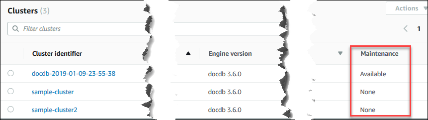

# Determining

pending maintenance

You can determine whether you have the latest Amazon DocumentDB engine version by determining whether you have pending cluster maintenance.

Using the AWS Management Console
You can use the AWS Management Console to determine whether a cluster has
pending maintenance.

1. Sign in to the AWS Management Console, and open the Amazon DocumentDB console at [https://console.aws.amazon.com/docdb](https://console.aws.amazon.com/docdb "https://console.aws.amazon.com/docdb").
2. In the navigation pane, choose **Clusters**.

###### Tip

If you don't see the navigation pane on the left side of your screen, choose the menu icon
()
in the upper-left corner of the page. 3. Locate the **Maintenance** column to
determine whether a cluster has pending maintenance.



**None** indicates that the cluster is
running the latest engine version. **Available**
indicates that the cluster has pending maintenance, which
might mean that an engine upgrade is needed. 4. If your cluster has pending maintenance, continue with
the steps at [Performing a patch update to a cluster's engine version](db-cluster-version-upgrade.md "db-cluster-version-upgrade.md").

Using the AWS CLI
You can use the AWS CLI to determine whether a cluster has the
latest engine version by using the `describe-pending-maintenance-actions`
operation with the following parameters.

###### Parameters

- `--resource-identifier`—Optional.
  The ARN for the resource (cluster). If this parameter is omitted,
  pending maintenance actions for all clusters are listed.
- `--region`—Optional. The AWS
  Region that you want to run this operation in, for example,
  `us-east-1`.

###### Example

For Linux, macOS, or Unix:

```
aws docdb describe-pending-maintenance-actions \
   --resource-identifier arn:aws:rds:us-east-1:123456789012:cluster:sample-cluster \
   --region us-east-1

```

For Windows:

```
aws docdb describe-pending-maintenance-actions ^
   --resource-identifier arn:aws:rds:us-east-1:123456789012:cluster:sample-cluster ^
   --region us-east-1

```

Output from this operation looks something like the following.

```
{
    "PendingMaintenanceActions": [
        {
            "ResourceIdentifier": "arn:aws:rds:us-east-1:123456789012:cluster:sample-cluster",
            "PendingMaintenanceActionDetails": [
                {
                    "Description": "New feature",
                    "Action": "db-upgrade",
                    "ForcedApplyDate": "2019-02-25T21:46:00Z",
                    "AutoAppliedAfterDate": "2019-02-25T07:41:00Z",
                    "CurrentApplyDate": "2019-02-25T07:41:00Z"
                }
            ]
        }
    ]
}

```

If your cluster has pending maintenance, continue with the
steps at [Performing a patch update to a cluster's engine version](db-cluster-version-upgrade.md "db-cluster-version-upgrade.md").
