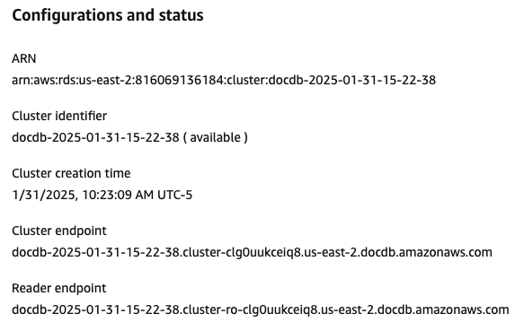
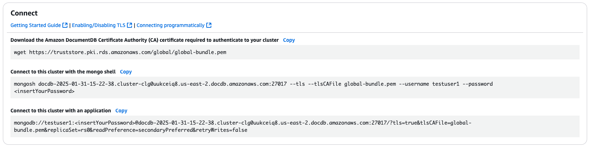

# Finding a cluster's endpoints

You can find a cluster's cluster endpoint and reader endpoint using the Amazon DocumentDB console or AWS CLI.

Using the AWS Management Console

###### To find a cluster's endpoints using the console:

1. Sign in to the AWS Management Console, and open the Amazon DocumentDB console at [https://console.aws.amazon.com/docdb](https://console.aws.amazon.com/docdb "https://console.aws.amazon.com/docdb").
2. In the navigation pane, choose **Clusters**.
3. From the list of clusters, choose the name of the cluster you are interested in.
4. On the cluster details page, select the
   **Configuration** tab. In the **Configurations
   and status** section, you will find the **Cluster
   endpoint** and **Reader endpoint**.

 5. To connect to this cluster, select the **Connectivity &
security** tab. Locate the connection string for the `mongo`
shell and the connection string that can be used in the application code to connect to your cluster.



Using the AWS CLI
To find the cluster and reader endpoints for your cluster using the AWS CLI, run the `describe-db-clusters` command with these
parameters.

###### Parameters

- `--db-cluster-identifier`—Optional. Specifies the cluster to return endpoints for. If omitted,
  returns endpoints for up to 100 of your clusters.
- `--query`—Optional. Specifies the fields to display. Helpful by reducing the amount of data that
  you need to view to find the endpoints. If omitted, all information about a cluster is returned.
- `--region`—Optional. Use the `--region` parameter to specify the Region that you want
  to apply the command to. If omitted, your default Region is used.

The following example returns the `DBClusterIdentifier`, endpoint (cluster endpoint), and `ReaderEndpoint` for
`sample-cluster`.

For Linux, macOS, or Unix:

```
aws docdb describe-db-clusters \
   --region `us-east-1` \
   --db-cluster-identifier `sample-cluster` \
   --query 'DBClusters[*].[DBClusterIdentifier,Port,Endpoint,ReaderEndpoint]'
```

For Windows:

```
aws docdb describe-db-clusters ^
   --region `us-east-1` ^
   --db-cluster-identifier `sample-cluster` ^
   --query 'DBClusters[*].[DBClusterIdentifier,Port,Endpoint,ReaderEndpoint]'
```

Output from this operation looks something like the following (JSON format).

```
[
  [
     "sample-cluster",
     27017,
     "sample-cluster.cluster-corlsfccjozr.us-east-1.docdb.amazonaws.com",
     "sample-cluster.cluster-ro-corlsfccjozr.us-east-1.docdb.amazonaws.com"
  ]
]
```

Now that you have the cluster endpoint, you can connect to the cluster using either `mongo` or `mongodb`. For more
information, see [Connecting to endpoints](endpoints-connecting.md "endpoints-connecting.md").
