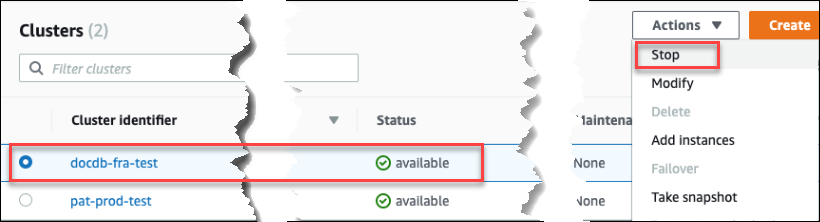
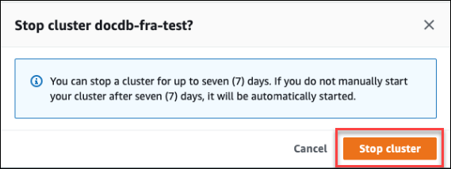
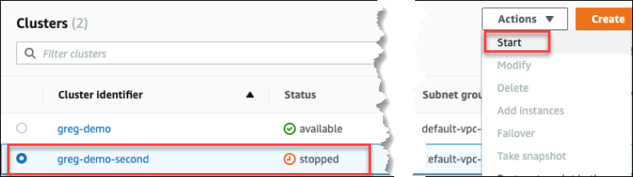
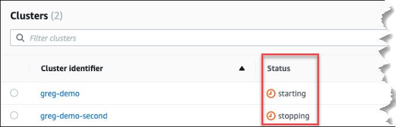

# Stopping and starting an

Amazon DocumentDB cluster

Stopping and starting Amazon DocumentDB clusters can help you manage costs
for development and test environments. Instead of creating and
deleting clusters and instances each time you use Amazon DocumentDB, you can
temporarily stop all the instances in your cluster when they aren't
needed. You can then start them again when you resume your testing.

###### Topics

- [Overview of
  stopping and starting a cluster](#db-cluster-stop-start-overview "#db-cluster-stop-start-overview")
- [Operations you can
  perform on a stopped cluster](#db-cluster-stopped-operations "#db-cluster-stopped-operations")

## Overview of

stopping and starting a cluster

During periods where you don't need an Amazon DocumentDB cluster, you can
stop all instances in that cluster at once. You can then start the
cluster again anytime you need to use it. Starting and stopping
simplifies the setup and teardown processes for clusters that are
used for development, testing, or similar activities that don't
require continuous availability. You can stop and start a cluster
using the AWS Management Console or the AWS CLI with a single action, regardless
of how many instances are in the cluster.

While your cluster is stopped, the cluster storage volume remains
unchanged. You are charged only for storage, manual snapshots, and
automated backup storage within your specified retention window.
You aren't charged for any instance hours. Amazon DocumentDB automatically
starts your cluster after seven days so that it doesn't fall behind
any required maintenance updates. When your cluster starts after
seven days, you will begin to be charged for the instances in the
cluster again. While your cluster is stopped, you can't query your
storage volume because querying requires that instances are in
the available state.

When an Amazon DocumentDB cluster is stopped, neither the cluster nor its
instances can be modified in any way. This includes adding or
removing instances, or deleting the cluster.

Using the AWS Management Console
The following procedure shows you how to stop a cluster with
one or more instances in the available state, or start a stopped
cluster.

###### To stop or start an Amazon DocumentDB cluster

1. Sign in to the AWS Management Console, and open the Amazon DocumentDB console at [https://console.aws.amazon.com/docdb](https://console.aws.amazon.com/docdb "https://console.aws.amazon.com/docdb").
2. In the navigation pane, choose **Clusters**.

###### Tip

If you don't see the navigation pane on the left side of your screen, choose the menu icon
()
in the upper-left corner of the page. 3. In the list of clusters, choose the button to the left
of the name of the cluster that you want to stop or start. 4. Choose **Actions**, and then choose the
action that you want to perform on the cluster.

    * If you want to stop the cluster and the cluster is
     available:


    	1. Choose **Stop**.


    	

    	To avoid activating the failover mechanism,
    	 the stop operation stops the replica instances
    	 first, and then the primary instance.
    	2. On the confirmation dialog, confirm that
    	 you want to stop the cluster by choosing
    	 **Stop cluster**, or to keep the
    	 cluster running, choose **Cancel**.


    	
    * If you want to start the cluster, and the cluster
     is stopped, choose **Start**.


    

5. Monitor the status of the cluster and its instances. If
   you started the cluster, you can resume using the cluster
   when the cluster and its instances are _available_.
   For more information, see [Determining a cluster's status](db-cluster-status.md "db-cluster-status.md").



Using the AWS CLI
The following code examples show you how to stop a cluster with
one or more instances in the available state, or start a stopped
cluster.

To stop a cluster with one or more available instances using
the AWS CLI, use the `stop-db-cluster` operation. To
start a stopped cluster, use the `start-db-cluster`
operation. Both operations use the `--db-cluster-identifier`
parameter.

###### Parameter:

- `--db-cluster-identifier`—Required.
  The name of the cluster to stop or start.

###### Example— To stop a cluster using the AWS CLI

The following code stops the cluster `sample-cluster`.
The cluster must have one or more instances in the available state.

For Linux, macOS, or Unix:

```
aws docdb stop-db-cluster \
   --db-cluster-identifier `sample-cluster`
```

For Windows:

```
aws docdb stop-db-cluster ^
   --db-cluster-identifier `sample-cluster`
```

###### Example— To start a cluster using the AWS CLI

The following code starts the cluster `sample-cluster`.
The cluster must currently be stopped.

For Linux, macOS, or Unix:

```
aws docdb start-db-cluster \
   --db-cluster-identifier `sample-cluster`
```

For Windows:

```
aws docdb start-db-cluster ^
   --db-cluster-identifier `sample-cluster`
```

## Operations you can

perform on a stopped cluster

While an Amazon DocumentDB cluster is stopped, you can do a point-in-time
restore to any point within your specified automated backup retention
window. For details about doing a point-in-time restore, see [Restoring to a point in time](backup_restore-point_in_time_recovery.md "backup_restore-point_in_time_recovery.md").

You can't modify the configuration of an Amazon DocumentDB cluster, or
any of its instances, while the cluster is stopped. You also can't
add or remove instances from the cluster, or delete the cluster if
it still has any associated instances. You must start the cluster
before performing any such administrative actions.

Amazon DocumentDB applies any scheduled maintenance to your stopped cluster
only after it's started again. After seven days, Amazon DocumentDB automatically
starts a stopped cluster so that it doesn't fall too far behind in
its maintenance status. When the cluster restarts, you will begin
to be charged for the instances in the cluster again.

While a cluster is stopped, Amazon DocumentDB does not perform any automated
backups nor does it extend the backup retention period.
