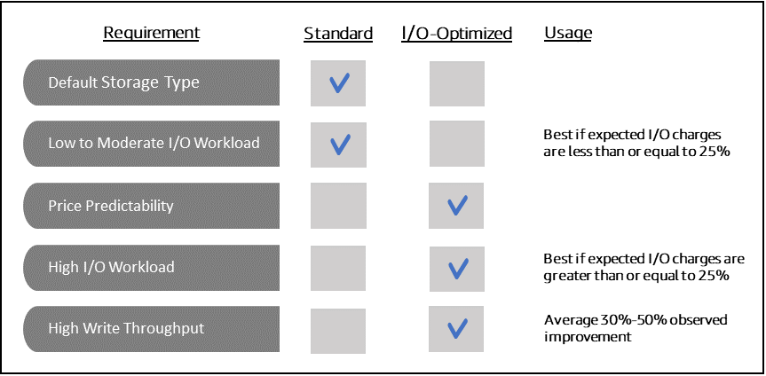
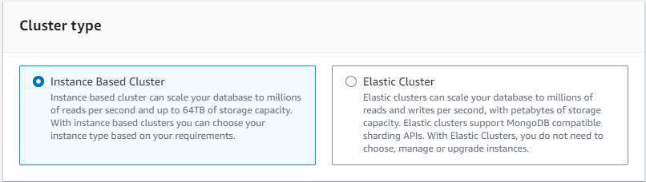
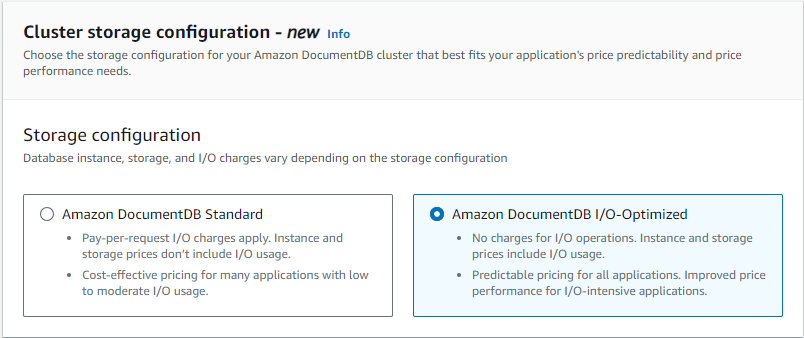

# Amazon DocumentDB cluster storage configurations

Starting from Amazon DocumentDB 5.0, instance-based clusters support two storage configuration types:

- **Amazon DocumentDB standard storage**: Designed for customers with low to moderate I/O consumption.
  If you expect your I/O costs to be less than 25% of your total Amazon DocumentDB cluster, this choice might be ideal for you.
  With the Amazon DocumentDB standard storage configuration, you’re billed on a pay-per-request I/O basis in addition to instance and storage charges.
  This means your billing might vary from one cycle to another based on usage.
  The configuration is tailored to accommodate fluctuating I/O demands of your application.
- **Amazon DocumentDB I/O-optimized storage**: Designed for customers who prioritize price predictability or have I/O intensive applications.
  The I/O-optimized configuration offers improved performance, increased throughput, and reduced latency for customers with I/O intensive workloads.
  If you expect your I/O costs to exceed 25% of your total Amazon DocumentDB cluster costs, this option offers enhanced price performance.
  With the Amazon DocumentDB I/O-optimized storage configuration, you won't be charged based on I/O operations, ensuring predictable costs each billing cycle.
  The configuration stabilizes costs while improving performance.
  You can switch your existing database clusters once every 30 days to Amazon DocumentDB I/O-optimized storage.
  You can switch back to Amazon DocumentDB standard storage at any time.
  The next date to modify the storage configuration to I/O-optimized can be tracked with the `describe-db-clusters` command using the AWS CLI or through the AWS Management Console in the cluster's configuration page.

You can create a new database cluster including the Amazon DocumentDB I/O-optimized configuration or convert your existing database clusters with a few clicks in the [AWS Management Console](https://console.aws.amazon.com/docdb/ "https://console.aws.amazon.com/docdb/"), a single parameter change in the [AWS Command Line Interface (AWS CLI)](https://aws.amazon.com/cli/ "https://aws.amazon.com/cli/"), or through [AWS SDKs](https://aws.amazon.com/developer/tools/ "https://aws.amazon.com/developer/tools/").
There is no downtime or reboot of instances required during or after modifying the storage configuration.



## Creating an I/O-optimized cluster

Using the AWS Management Console
To create or modify an I/O-optimized cluster using the AWS Management Console:

1. On the Amazon DocumentDB management console, under **Clusters**, choose either **Create** or select the cluster and choose **Actions**, and then choose **Modify**.
2. If you are creating a new cluster, make sure you choose **Instance Based Cluster** in the **Cluster type** section (this is the default option).

 3. In the **Configuration** section, under **Cluster storage configuration**, choose **Amazon DocumentDB I/O-Optimized**.

 4. Complete your cluster creation or modification and choose **Create cluster** or **Modify cluster**.

For the complete Create cluster process, see [Creating a cluster and primary instance using the AWS Management Console](db-cluster-create.md#db-cluster-create-con "db-cluster-create.md#db-cluster-create-con").

For the complete Modify cluster process, see [Modifying an Amazon DocumentDB cluster](db-cluster-modify.md "db-cluster-modify.md").

Using the AWS CLI
To create an I/O-optimized cluster using the AWS CLI:

In the following examples, replace each `user input placeholder` with your own information.

For Linux, macOS, or Unix:

```
aws docdb create-db-cluster \
      --db-cluster-identifier `sample-cluster` \
      --engine docdb \
      --engine-version 5.0.0 \
      --storage-type iopt1 \
      --deletion-protection \
      --master-username `username` \
      --master-user-password `password`
```

For Windows:

```
aws docdb create-db-cluster ^
      --db-cluster-identifier `sample-cluster` ^
      --engine docdb ^
      --engine-version 5.0.0 ^
      --storage-type iopt1 ^
      --deletion-protection ^
      --master-username `username` ^
      --master-user-password `password`
```

## Cost analysis for determining storage configuration

With Amazon DocumentDB, you have the flexibility to choose your storage configuration for every database cluster you have.
In order to properly allocate your clusters between standard and I/O-optimized, you can track your Amazon DocumentDB costs cluster-wise.
To do so, you can add tags to existing clusters, enable cost allocation tagging in your [AWS Billing and Cost Management dashboard](https://aws.amazon.com/pricing/ "https://aws.amazon.com/pricing/"), and analyze your costs for a given cluster in the [AWS Cost Explorer Service](https://aws.amazon.com/aws-cost-management/aws-cost-explorer/ "https://aws.amazon.com/aws-cost-management/aws-cost-explorer/").
For information on cost analysis, see our blog [Using cost allocation tags](https://aws.amazon.com/blogs/database/using-cost-allocation-tags-with-amazon-documentdb-with-mongodb-compatibility/ "https://aws.amazon.com/blogs/database/using-cost-allocation-tags-with-amazon-documentdb-with-mongodb-compatibility/").
