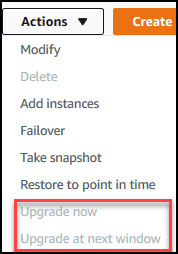

# Performing a patch update to a cluster's engine version

In this section, we will explain how to deploy a patch update using the AWS Management Console or the AWS CLI.
A patch update is an update within the same engine version (for example, updating a 3.6 engine version to a newer 3.6 engine version).
You can update it immediately or during your cluster's next maintenance window.
To determine whether your engine needs an update, see [Determining
pending maintenance](db-cluster-determine-pending-maintenance.md "db-cluster-determine-pending-maintenance.md"). Please note that when you apply the update, your cluster will experience some downtime.

###### Note

If you are trying to upgrade from a major engine version to another, such as 3.6 to 5.0, see either [Amazon DocumentDB in-place major version upgrade](docdb-mvu.md "docdb-mvu.md") or [Upgrading your Amazon DocumentDB cluster using AWS Database Migration Service](docdb-migration.md "docdb-migration.md").
An in-place major version upgrade only supports docdb 5.0 as the target engine version.

There are two configuration requirements to get the latest patch updates for a cluster's engine version:

- The cluster's status must be _available_.
- The cluster must be running an earlier engine version.

Using the AWS Management Console
The following procedure applies patch updates to your cluster's engine version using the console. You have the option to update immediately or during your cluster's next maintenance window.

1. Sign in to the AWS Management Console, and open the Amazon DocumentDB console at [https://console.aws.amazon.com/docdb](https://console.aws.amazon.com/docdb "https://console.aws.amazon.com/docdb").
2. In the navigation pane, choose **Clusters**.
   In the list of clusters, choose the button to the left of
   the cluster that you want to upgrade. The status of the
   cluster must be _available_.

###### Tip

If you don't see the navigation pane on the left side of your screen, choose the menu icon
()
in the upper-left corner of the page. 3. From the **Actions** menu, choose one
of the following options. These menu options are selectable
only if the cluster you chose is not running the latest
engine version.



    * **Upgrade now**—Immediately
     initiates the upgrade process. Your cluster will be
     offline for a time while the cluster is upgraded to
     the latest engine version.
    * **Upgrade at next window**—Initiates
     the upgrade process during the cluster's next maintenance
     window. Your cluster will be offline for a time while
     it is upgraded to the latest engine version.

4. When the confirmation window opens, choose one of the following:
   - **Upgrade**—To upgrade your
     cluster to the latest engine version according to the
     schedule chosen in the previous step.
   - **Cancel**—To cancel the
     cluster's engine upgrade and continue with the cluster's
     current engine version.

Using the AWS CLI
You can apply patch updates to your cluster using the AWS CLI and the `apply-pending-maintenance-action` operation with the following parameters.

###### Parameters

- `--resource-identifier`—Required.
  The ARN of the Amazon DocumentDB cluster that you are going to upgrade.
- `--apply-action`—Required.
  The following values are permitted. To upgrade your cluster
  engine version, use `db-upgrade`.
  - `db-upgrade`
  - `system-update`

- `--opt-in-type`—Required.
  The following values are permitted.
  - `immediate`—Apply the maintenance
    action immediately.
  - `next-maintenance`—Apply the
    maintenance action during the next maintenance window.
  - `undo-opt-in`—Cancel any existing
    `next-maintenance` opt-in requests.

###### Example

The following example patch updates the engine version of
`sample-cluster` to version 4.0.0.

For Linux, macOS, or Unix:

```
aws docdb apply-pending-maintenance-action \
   --resource-identifier arn:aws:rds:us-east-1:123456789012\:cluster:sample-cluster \
   --apply-action db-upgrade \
   --opt-in-type immediate
```

For Windows:

```
aws docdb apply-pending-maintenance-action ^
   --resource-identifier arn:aws:rds:us-east-1:123456789012:cluster:sample-cluster ^
   --apply-action db-upgrade ^
   --opt-in-type immediate
```

Output from this operation looks like the following.

```
{
    "ResourcePendingMaintenanceActions": {
        "ResourceIdentifier": "arn:aws:rds:us-east-1:444455556666:cluster:docdb-2019-01-09-23-55-38",
        "PendingMaintenanceActionDetails": [
            {
                "CurrentApplyDate": "2019-02-20T20:57:06.904Z",
                "Description": "Bug fixes",
                "ForcedApplyDate": "2019-02-25T21:46:00Z",
                "OptInStatus": "immediate",
                "Action": "db-upgrade",
                "AutoAppliedAfterDate": "2019-02-25T07:41:00Z"
            }
        ]
    }
}

```
