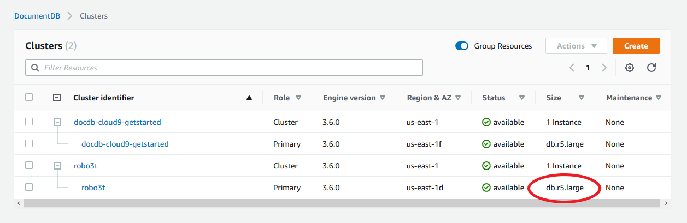

# Managing instance classes

The instance class determines the computation and memory capacity of an Amazon DocumentDB (with MongoDB compatibility)
instance. The instance class you need depends on your processing power and memory
requirements.

Amazon DocumentDB supports the R4, R5, R6G, R8G, T3, and T4G families of instance classes. These classes
are current-generation instance classes that are optimized for memory-intensive applications.
For the specifications on these classes, see [Instance class specifications](#db-instance-class-specs "#db-instance-class-specs").

###### Topics

- [Determining an instance class](#db-instance-class-determining "#db-instance-class-determining")
- [Changing an instance's class](#db-instance-class-changing "#db-instance-class-changing")
- [Supported instance classes by region](#db-instance-classes-by-region "#db-instance-classes-by-region")
- [Instance class specifications](#db-instance-class-specs "#db-instance-class-specs")

## Determining an instance class

To determine the class of an instance, you can use the AWS Management Console or the
`describe-db-instances` AWS CLI operation.

Using the AWS Management Console
To determine the instance class for your cluster's instances, complete the
following steps in the console.

1. Sign in to the AWS Management Console, and open the Amazon DocumentDB console at [https://console.aws.amazon.com/docdb](https://console.aws.amazon.com/docdb "https://console.aws.amazon.com/docdb").
2. In the navigation pane, choose **Clusters** to find the
   instance that you're interested in.

###### Tip

If you don't see the navigation pane on the left side of your screen, choose the menu icon
()
in the upper-left corner of the page. 3. In the Clusters navigation box, you’ll see the column **Cluster
Identifier**. Your instances are listed under clusters, similar to
the screenshot below.

 4. In the list of instances, expand the cluster to find the instances you are
interested in. Find the instance that you want. Then, look at the
**Size** column of the instance's row to see its instance
class.

In the following image, the instance class for instance `robo3t`
is `db.r5.4xlarge`.



Using the AWS CLI
To determine the class of an instance using the AWS CLI, use the
`describe-db-instances` operation with the following parameters.

- `--db-instance-identifier` —
  Optional. Specifies the instance that you want to find the instance class for.
  If this parameter is omitted, `describe-db-instances` returns a
  description for up to 100 of your instances.
- `--query` — Optional. Specifies
  the members of the instance to include in the results. If this parameter is
  omitted, all instance members are returned.

The following example finds the instance name and class for the instance
`sample-instance-1`.

For Linux, macOS, or Unix:

```
aws docdb describe-db-instances \
    --query 'DBInstances[*].[DBInstanceIdentifier,DBInstanceClass]' \
    --db-instance-identifier sample-instance-1
```

For Windows:

```
aws docdb describe-db-instances ^
    --query 'DBInstances[*].[DBInstanceIdentifier,DBInstanceClass]' ^
    --db-instance-identifier sample-instance-1
```

Output from this operation looks something like the following.

```
[
    [
        "sample-instance-1",
        "db.r5.large"
    ]
```

The following example finds the instance name and class for up to 100 Amazon DocumentDB
instances.

For Linux, macOS, or Unix:

```
aws docdb describe-db-instances \
    --query 'DBInstances[*].[DBInstanceIdentifier,DBInstanceClass]' \
    --filter Name=engine,Values=docdb
```

For Windows:

```
aws docdb describe-db-instances ^
    --query 'DBInstances[*].[DBInstanceIdentifier,DBInstanceClass]' ^
    --filter Name=engine,Values=docdb
```

Output from this operation looks something like the following.

```
[
    [
        "sample-instance-1",
        "db.r5.large"
    ],
    [
        "sample-instance-2",
        "db.r5.large"
    ],`[
 "sample-instance-3",
 "db.r5.4xlarge"
 ]`,
    [
        "sample-instance-4",
        "db.r5.4xlarge"
    ]
]
```

For more information, see [Describing Amazon DocumentDB
instances](db-instance-view-details.md "db-instance-view-details.md").

## Changing an instance's class

You can change the instance class of your instance using the AWS Management Console or the AWS CLI. For
more information, see [Modifying an Amazon DocumentDB instance](db-instance-modify.md "db-instance-modify.md").

## Supported instance classes by region

Amazon DocumentDB supports the following instance classes:

- `R8G`—Latest generation of memory-optimized instances powered by
  Arm-based AWS Graviton4 processors that provide up to 30% better performance over R6G
  instances.
- `R6G`—Mmemory-optimized instances powered by
  Arm-based AWS Graviton2 processors that provide up to 30% better performance over R5
  instances at 5% less cost.
- `R6GD`—Memory-optimized R6G instances with local non-volatile memory
  express (NVMe)-based Solid-State Drive (SSD) storage for ephemeral data.
- `R5`—Memory-optimized instances that provide up to 100% better
  performance over R4 instances for the same instance cost.
- `R4`—Previous generation of memory-optimized instances.
- `T4G`—Latest-generation low cost burstable general-purpose
  instance type powered by Arm-based AWS Graviton2 processors that provides a baseline
  level of CPU performance, delivering up to 35% better price performance over T3
  instances and ideal for running applications with moderate CPU usage that experience
  temporary spikes in usage.
- `T3`—Low cost burstable general-purpose instance type that
  provides a baseline level of CPU performance with the ability to burst CPU usage at
  any time for as long as required.

For detailed specifications on the instance classes, see [Instance class specifications](#db-instance-class-specs "#db-instance-class-specs").

A particular instance class may or may not be supported in a given Region. The following
table specifies which instance classes are supported by Amazon DocumentDB in each Region.

| Supported instance classes by Region |           | Instance Classes |
| ------------------------------------ | --------- | ---------------- | --------- | --------- | --------- | --------- | --------- |
| Region                               | R8G       | R6GD             | R6G       | R5        | R4        | T4G       | T3        |
| US East (Ohio)                       | Supported | Supported        | Supported | Supported | Supported | Supported | Supported |
| US East (N. Virginia)                | Supported | Supported        | Supported | Supported | Supported | Supported | Supported |
| US West (Oregon)                     | Supported | Supported        | Supported | Supported | Supported | Supported | Supported |
| Africa (Cape Town)                   |           |                  | Supported | Supported |           | Supported | Supported |
| South America (São Paulo)            |           | Supported        | Supported | Supported |           | Supported | Supported |
| Asia Pacific (Hong Kong)             |           |                  | Supported | Supported |           | Supported | Supported |
| Asia Pacific (Hyderabad)             |           |                  | Supported | Supported |           | Supported | Supported |
| Asia Pacific (Malaysia)              |           |                  | Supported |           |           | Supported | Supported |
| Asia Pacific (Mumbai)                | Supported | Supported        | Supported | Supported |           | Supported | Supported |
| Asia Pacific (Osaka)                 |           |                  | Supported | Supported |           | Supported | Supported |
| Asia Pacific (Seoul)                 |           | Supported        | Supported | Supported |           | Supported | Supported |
| Asia Pacific (Sydney)                | Supported | Supported        | Supported | Supported |           | Supported | Supported |
| Asia Pacific (Singapore)             |           | Supported        | Supported | Supported |           | Supported | Supported |
| Asia Pacific (Thailand)              |           |                  | Supported |           |           | Supported | Supported |
| Asia Pacific (Tokyo)                 | Supported | Supported        | Supported | Supported |           | Supported | Supported |
| Canada (Central)                     |           | Supported        | Supported | Supported |           | Supported | Supported |
| Europe (Frankfurt)                   | Supported | Supported        | Supported | Supported |           | Supported | Supported |
| Europe (Ireland)                     | Supported | Supported        | Supported | Supported | Supported | Supported | Supported |
| Europe (London)                      |           | Supported        | Supported | Supported |           | Supported | Supported |
| Europe (Milan)                       |           |                  | Supported | Supported |           | Supported | Supported |
| Europe (Paris)                       |           | Supported        | Supported | Supported |           | Supported | Supported |
| Europe (Spain)                       | Supported |                  | Supported | Supported |           | Supported | Supported |
| Europe (Stockholm)                   | Supported |                  | Supported | Supported |           | Supported | Supported |
| Mexico (Central)                     |           |                  | Supported |           |           | Supported | Supported |
| Middle East (UAE)                    |           |                  | Supported | Supported |           | Supported | Supported |
| China (Beijing)                      |           | Supported        | Supported | Supported |           | Supported | Supported |
| China (Ningxia)                      |           |                  | Supported | Supported |           | Supported | Supported |
| Israel (Tel Aviv)                    |           |                  | Supported | Supported |           | Supported | Supported |
| AWS GovCloud (US-West)               | Supported | Supported        | Supported | Supported |           | Supported | Supported |
| AWS GovCloud (US-East)               |           | Supported        | Supported | Supported |           | Supported | Supported |

## Instance class specifications

The following table provides details of the Amazon DocumentDB instance classes, including which instance types are supported in each class. You can find
explanations for each table column below the table.

| Instance class                                                                                                                                                                                                                                                                                                                                                                                                                                                                                                                                                                                                                                                                                                                                                                                                                                                                                                                                                                                                                                                                                                                                                                                                                                                                                                                                                                                                                                                                                                                                                                                                                                                                                                                            | vCPU1 | Memory (GiB)2 | NVMe SSD tiered cache (GiB)3 | Max. temp. storage (GiB)4 | Baseline / burst bandwidth (Gbps)5 | Supporting Engines6     |
| ----------------------------------------------------------------------------------------------------------------------------------------------------------------------------------------------------------------------------------------------------------------------------------------------------------------------------------------------------------------------------------------------------------------------------------------------------------------------------------------------------------------------------------------------------------------------------------------------------------------------------------------------------------------------------------------------------------------------------------------------------------------------------------------------------------------------------------------------------------------------------------------------------------------------------------------------------------------------------------------------------------------------------------------------------------------------------------------------------------------------------------------------------------------------------------------------------------------------------------------------------------------------------------------------------------------------------------------------------------------------------------------------------------------------------------------------------------------------------------------------------------------------------------------------------------------------------------------------------------------------------------------------------------------------------------------------------------------------------------------- | ----- | ------------- | ---------------------------- | ------------------------- | ---------------------------------- | ----------------------- |
| **R8G –<br>Current Generation Memory-Optimized Instance Class based on<br>Graviton4**                                                                                                                                                                                                                                                                                                                                                                                                                                                                                                                                                                                                                                                                                                                                                                                                                                                                                                                                                                                                                                                                                                                                                                                                                                                                                                                                                                                                                                                                                                                                                                                                                                                     |
| `db.r8g.large`                                                                                                                                                                                                                                                                                                                                                                                                                                                                                                                                                                                                                                                                                                                                                                                                                                                                                                                                                                                                                                                                                                                                                                                                                                                                                                                                                                                                                                                                                                                                                                                                                                                                                                                            | 2     | 16            | -                            | 30                        | 0.937 / 12.5                       | 5.0.0                   |
| `db.r8g.xlarge`                                                                                                                                                                                                                                                                                                                                                                                                                                                                                                                                                                                                                                                                                                                                                                                                                                                                                                                                                                                                                                                                                                                                                                                                                                                                                                                                                                                                                                                                                                                                                                                                                                                                                                                           | 4     | 32            | -                            | 60                        | 1.875 / 12.5                       | 5.0.0                   |
| `db.r8g.2xlarge`                                                                                                                                                                                                                                                                                                                                                                                                                                                                                                                                                                                                                                                                                                                                                                                                                                                                                                                                                                                                                                                                                                                                                                                                                                                                                                                                                                                                                                                                                                                                                                                                                                                                                                                          | 8     | 64            | -                            | 121                       | 3.75 / 15.0                        | 5.0.0                   |
| `db.r8g.4xlarge`                                                                                                                                                                                                                                                                                                                                                                                                                                                                                                                                                                                                                                                                                                                                                                                                                                                                                                                                                                                                                                                                                                                                                                                                                                                                                                                                                                                                                                                                                                                                                                                                                                                                                                                          | 16    | 128           | -                            | 243                       | 7.5 / 15.0                         | 5.0.0                   |
| `db.r8g.8xlarge`                                                                                                                                                                                                                                                                                                                                                                                                                                                                                                                                                                                                                                                                                                                                                                                                                                                                                                                                                                                                                                                                                                                                                                                                                                                                                                                                                                                                                                                                                                                                                                                                                                                                                                                          | 32    | 256           | -                            | 488                       | 15                                 | 5.0.0                   |
| `db.r8g.12xlarge`                                                                                                                                                                                                                                                                                                                                                                                                                                                                                                                                                                                                                                                                                                                                                                                                                                                                                                                                                                                                                                                                                                                                                                                                                                                                                                                                                                                                                                                                                                                                                                                                                                                                                                                         | 48    | 384           | -                            | 732                       | 22                                 | 5.0.0                   |
| `db.r8g.16xlarge`                                                                                                                                                                                                                                                                                                                                                                                                                                                                                                                                                                                                                                                                                                                                                                                                                                                                                                                                                                                                                                                                                                                                                                                                                                                                                                                                                                                                                                                                                                                                                                                                                                                                                                                         | 64    | 512           | -                            | 987                       | 30                                 | 5.0.0                   |
| **R6G –<br>Current Generation Memory-Optimized Instance Class based on<br>Graviton2**                                                                                                                                                                                                                                                                                                                                                                                                                                                                                                                                                                                                                                                                                                                                                                                                                                                                                                                                                                                                                                                                                                                                                                                                                                                                                                                                                                                                                                                                                                                                                                                                                                                     |
| `db.r6g.large`                                                                                                                                                                                                                                                                                                                                                                                                                                                                                                                                                                                                                                                                                                                                                                                                                                                                                                                                                                                                                                                                                                                                                                                                                                                                                                                                                                                                                                                                                                                                                                                                                                                                                                                            | 2     | 16            | -                            | 32                        | 0.75 / 10                          | 4.0.0 and 5.0.0         |
| `db.r6g.xlarge`                                                                                                                                                                                                                                                                                                                                                                                                                                                                                                                                                                                                                                                                                                                                                                                                                                                                                                                                                                                                                                                                                                                                                                                                                                                                                                                                                                                                                                                                                                                                                                                                                                                                                                                           | 4     | 32            | -                            | 63                        | 1.25 / 10                          | 4.0.0 and 5.0.0         |
| `db.r6g.2xlarge`                                                                                                                                                                                                                                                                                                                                                                                                                                                                                                                                                                                                                                                                                                                                                                                                                                                                                                                                                                                                                                                                                                                                                                                                                                                                                                                                                                                                                                                                                                                                                                                                                                                                                                                          | 8     | 64            | -                            | 126                       | 2.5 / 10                           | 4.0.0 and 5.0.0         |
| `db.r6g.4xlarge`                                                                                                                                                                                                                                                                                                                                                                                                                                                                                                                                                                                                                                                                                                                                                                                                                                                                                                                                                                                                                                                                                                                                                                                                                                                                                                                                                                                                                                                                                                                                                                                                                                                                                                                          | 16    | 128           | -                            | 252                       | 5.0 / 10                           | 4.0.0 and 5.0.0         |
| `db.r6g.8xlarge`                                                                                                                                                                                                                                                                                                                                                                                                                                                                                                                                                                                                                                                                                                                                                                                                                                                                                                                                                                                                                                                                                                                                                                                                                                                                                                                                                                                                                                                                                                                                                                                                                                                                                                                          | 32    | 256           | -                            | 504                       | 12                                 | 4.0.0 and 5.0.0         |
| `db.r6g.12xlarge`                                                                                                                                                                                                                                                                                                                                                                                                                                                                                                                                                                                                                                                                                                                                                                                                                                                                                                                                                                                                                                                                                                                                                                                                                                                                                                                                                                                                                                                                                                                                                                                                                                                                                                                         | 48    | 384           | -                            | 756                       | 20                                 | 4.0.0 and 5.0.0         |
| `db.r6g.16xlarge`                                                                                                                                                                                                                                                                                                                                                                                                                                                                                                                                                                                                                                                                                                                                                                                                                                                                                                                                                                                                                                                                                                                                                                                                                                                                                                                                                                                                                                                                                                                                                                                                                                                                                                                         | 64    | 512           | -                            | 1008                      | 25                                 | 4.0.0 and 5.0.0         |
| **R6GD –<br>Current Generation NVMe-backed Instance Class based on<br>Graviton2**                                                                                                                                                                                                                                                                                                                                                                                                                                                                                                                                                                                                                                                                                                                                                                                                                                                                                                                                                                                                                                                                                                                                                                                                                                                                                                                                                                                                                                                                                                                                                                                                                                                         |
| `db.r6gd.xlarge`                                                                                                                                                                                                                                                                                                                                                                                                                                                                                                                                                                                                                                                                                                                                                                                                                                                                                                                                                                                                                                                                                                                                                                                                                                                                                                                                                                                                                                                                                                                                                                                                                                                                                                                          | 4     | 32            | 173                          | 64                        | 1.25 / 10                          | 5.0.0 only              |
| `db.r6gd.2xlarge`                                                                                                                                                                                                                                                                                                                                                                                                                                                                                                                                                                                                                                                                                                                                                                                                                                                                                                                                                                                                                                                                                                                                                                                                                                                                                                                                                                                                                                                                                                                                                                                                                                                                                                                         | 8     | 64            | 346                          | 128                       | 2.5 / 10                           | 5.0.0 only              |
| `db.r6gd.4xlarge`                                                                                                                                                                                                                                                                                                                                                                                                                                                                                                                                                                                                                                                                                                                                                                                                                                                                                                                                                                                                                                                                                                                                                                                                                                                                                                                                                                                                                                                                                                                                                                                                                                                                                                                         | 16    | 128           | 694                          | 256                       | 5.0 / 10                           | 5.0.0 only              |
| `db.r6gd.8xlarge`                                                                                                                                                                                                                                                                                                                                                                                                                                                                                                                                                                                                                                                                                                                                                                                                                                                                                                                                                                                                                                                                                                                                                                                                                                                                                                                                                                                                                                                                                                                                                                                                                                                                                                                         | 32    | 256           | 1388                         | 512                       | 12                                 | 5.0.0 only              |
| `db.r6gd.12xlarge`                                                                                                                                                                                                                                                                                                                                                                                                                                                                                                                                                                                                                                                                                                                                                                                                                                                                                                                                                                                                                                                                                                                                                                                                                                                                                                                                                                                                                                                                                                                                                                                                                                                                                                                        | 48    | 384           | 2082                         | 768                       | 20                                 | 5.0.0 only              |
| `db.r6gd.16xlarge`                                                                                                                                                                                                                                                                                                                                                                                                                                                                                                                                                                                                                                                                                                                                                                                                                                                                                                                                                                                                                                                                                                                                                                                                                                                                                                                                                                                                                                                                                                                                                                                                                                                                                                                        | 64    | 512           | 2776                         | 1024                      | 25                                 | 5.0.0 only              |
| **R5 –<br>Previous Generation Memory-Optimized Instance Class**                                                                                                                                                                                                                                                                                                                                                                                                                                                                                                                                                                                                                                                                                                                                                                                                                                                                                                                                                                                                                                                                                                                                                                                                                                                                                                                                                                                                                                                                                                                                                                                                                                                                           |
| `db.r5.large`                                                                                                                                                                                                                                                                                                                                                                                                                                                                                                                                                                                                                                                                                                                                                                                                                                                                                                                                                                                                                                                                                                                                                                                                                                                                                                                                                                                                                                                                                                                                                                                                                                                                                                                             | 2     | 16            | -                            | 31                        | 0.75 / 10                          | 3.6.0, 4.0.0, and 5.0.0 |
| `db.r5.xlarge`                                                                                                                                                                                                                                                                                                                                                                                                                                                                                                                                                                                                                                                                                                                                                                                                                                                                                                                                                                                                                                                                                                                                                                                                                                                                                                                                                                                                                                                                                                                                                                                                                                                                                                                            | 4     | 32            | -                            | 62                        | 1.25 / 10                          | 3.6.0, 4.0.0, and 5.0.0 |
| `db.r5.2xlarge`                                                                                                                                                                                                                                                                                                                                                                                                                                                                                                                                                                                                                                                                                                                                                                                                                                                                                                                                                                                                                                                                                                                                                                                                                                                                                                                                                                                                                                                                                                                                                                                                                                                                                                                           | 8     | 64            | -                            | 124                       | 2.5 / 10                           | 3.6.0, 4.0.0, and 5.0.0 |
| `db.r5.4xlarge`                                                                                                                                                                                                                                                                                                                                                                                                                                                                                                                                                                                                                                                                                                                                                                                                                                                                                                                                                                                                                                                                                                                                                                                                                                                                                                                                                                                                                                                                                                                                                                                                                                                                                                                           | 16    | 128           | -                            | 249                       | 5.0 / 10                           | 3.6.0, 4.0.0, and 5.0.0 |
| `db.r5.8xlarge`                                                                                                                                                                                                                                                                                                                                                                                                                                                                                                                                                                                                                                                                                                                                                                                                                                                                                                                                                                                                                                                                                                                                                                                                                                                                                                                                                                                                                                                                                                                                                                                                                                                                                                                           | 32    | 256           | -                            | 504                       | 10                                 | 3.6.0, 4.0.0, and 5.0.0 |
| `db.r5.12xlarge`                                                                                                                                                                                                                                                                                                                                                                                                                                                                                                                                                                                                                                                                                                                                                                                                                                                                                                                                                                                                                                                                                                                                                                                                                                                                                                                                                                                                                                                                                                                                                                                                                                                                                                                          | 48    | 384           | -                            | 748                       | 12                                 | 3.6.0, 4.0.0, and 5.0.0 |
| `db.r5.16xlarge`                                                                                                                                                                                                                                                                                                                                                                                                                                                                                                                                                                                                                                                                                                                                                                                                                                                                                                                                                                                                                                                                                                                                                                                                                                                                                                                                                                                                                                                                                                                                                                                                                                                                                                                          | 64    | 512           | -                            | 1008                      | 20                                 | 3.6.0, 4.0.0, and 5.0.0 |
| `db.r5.24xlarge`                                                                                                                                                                                                                                                                                                                                                                                                                                                                                                                                                                                                                                                                                                                                                                                                                                                                                                                                                                                                                                                                                                                                                                                                                                                                                                                                                                                                                                                                                                                                                                                                                                                                                                                          | 96    | 768           | -                            | 1500                      | 25                                 | 3.6.0, 4.0.0, and 5.0.0 |
| **R4 –<br>Previous Generation Memory-Optimized Instance Class**                                                                                                                                                                                                                                                                                                                                                                                                                                                                                                                                                                                                                                                                                                                                                                                                                                                                                                                                                                                                                                                                                                                                                                                                                                                                                                                                                                                                                                                                                                                                                                                                                                                                           |
| `db.r4.large`                                                                                                                                                                                                                                                                                                                                                                                                                                                                                                                                                                                                                                                                                                                                                                                                                                                                                                                                                                                                                                                                                                                                                                                                                                                                                                                                                                                                                                                                                                                                                                                                                                                                                                                             | 2     | 15.25         | -                            | 30                        | 0.75 / 10                          | 3.6.0 only              |
| `db.r4.xlarge`                                                                                                                                                                                                                                                                                                                                                                                                                                                                                                                                                                                                                                                                                                                                                                                                                                                                                                                                                                                                                                                                                                                                                                                                                                                                                                                                                                                                                                                                                                                                                                                                                                                                                                                            | 4     | 30.5          | -                            | 60                        | 1.25 / 10                          | 3.6.0 only              |
| `db.r4.2xlarge`                                                                                                                                                                                                                                                                                                                                                                                                                                                                                                                                                                                                                                                                                                                                                                                                                                                                                                                                                                                                                                                                                                                                                                                                                                                                                                                                                                                                                                                                                                                                                                                                                                                                                                                           | 8     | 61            | -                            | 120                       | 2.5 / 10                           | 3.6.0 only              |
| `db.r4.4xlarge`                                                                                                                                                                                                                                                                                                                                                                                                                                                                                                                                                                                                                                                                                                                                                                                                                                                                                                                                                                                                                                                                                                                                                                                                                                                                                                                                                                                                                                                                                                                                                                                                                                                                                                                           | 16    | 122           | -                            | 240                       | 5.0 /10                            | 3.6.0 only              |
| `db.r4.8xlarge`                                                                                                                                                                                                                                                                                                                                                                                                                                                                                                                                                                                                                                                                                                                                                                                                                                                                                                                                                                                                                                                                                                                                                                                                                                                                                                                                                                                                                                                                                                                                                                                                                                                                                                                           | 32    | 244           | -                            | 480                       | 10                                 | 3.6.0 only              |
| `db.r4.16xlarge`                                                                                                                                                                                                                                                                                                                                                                                                                                                                                                                                                                                                                                                                                                                                                                                                                                                                                                                                                                                                                                                                                                                                                                                                                                                                                                                                                                                                                                                                                                                                                                                                                                                                                                                          | 64    | 488           | -                            | 960                       | 25                                 | 3.6.0 only              |
| **T4G –<br>Latest Generation Burstable Performance Instance Classes based on Graviton2**                                                                                                                                                                                                                                                                                                                                                                                                                                                                                                                                                                                                                                                                                                                                                                                                                                                                                                                                                                                                                                                                                                                                                                                                                                                                                                                                                                                                                                                                                                                                                                                                                                                  |
| `db.t4g.medium`                                                                                                                                                                                                                                                                                                                                                                                                                                                                                                                                                                                                                                                                                                                                                                                                                                                                                                                                                                                                                                                                                                                                                                                                                                                                                                                                                                                                                                                                                                                                                                                                                                                                                                                           | 2     | 4             | -                            | 8.13                      | 0.256 / 5                          | 4.0.0 and 5.0.0         |
| **T3 –<br>Previous Generation Burstable Performance Instance Classes**                                                                                                                                                                                                                                                                                                                                                                                                                                                                                                                                                                                                                                                                                                                                                                                                                                                                                                                                                                                                                                                                                                                                                                                                                                                                                                                                                                                                                                                                                                                                                                                                                                                                    |
| `db.t3.medium`                                                                                                                                                                                                                                                                                                                                                                                                                                                                                                                                                                                                                                                                                                                                                                                                                                                                                                                                                                                                                                                                                                                                                                                                                                                                                                                                                                                                                                                                                                                                                                                                                                                                                                                            | 2     | 4             | -                            | 7.5                       | 0.256 / 5                          | 3.6.0, 4.0.0, and 5.0.0 |
| 1. **vCPU\*<br>• — The number of<br>virtual central processing units (CPUs). A virtual CPU is a unit of<br>capacity that you can use to compare instance classes. Instead of<br>purchasing or leasing a particular processor to use for several months<br>or years, you are renting capacity by the hour. Our goal is to provide<br>a consistent amount of CPU capacity no matter what the actual<br>underlying hardware.<br>2. **Memory (GiB)_<br>• — The RAM, in<br>gigabytes, that is allocated to the instance. There is often a<br>consistent ratio between memory and vCPU.<br>3. \*\*NVMe SSD tiered cache_<br>• — The space on the SSD volume, measured in gigabytes, allocated as extended cache for storing ephemeral data.<br>This cache is only available in NVMe-backed instances.<br>4. **Max. temp. storage (GiB)\*<br>• — The space, measured in gigabytes, allocated to the instance for non-persistent temporary file storage.<br>For NVMe-backed instances, this storage is hosted on an NVMe-based SSD volume.<br>In all other instances, it is hosted on Amazon Elastic Block Store (EBS).<br>5. **Baseline / burst bandwidth (Gbps)_<br>• — Burst bandwidth represents the maximum bandwidth in gigabits per second.<br>Divide by 8 to get the expected throughput in gigabytes per second.<br>Instances of size 4xlarge and smaller have a baseline bandwidth.<br>To meet additional demand, they can use a network I/O credit mechanism to burst beyond their baseline bandwidth.<br>Instances can use burst bandwidth for a limited time, typically from 5 to 60 minutes, depending on the instance size.<br>6. \*\*Supporting Engines_<br>• — The<br>Amazon DocumentDB engines that support the instance class. |
