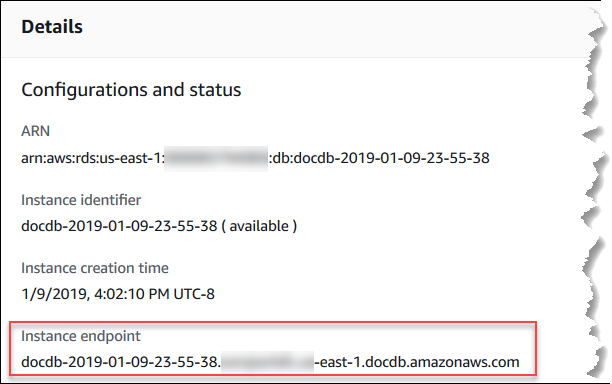
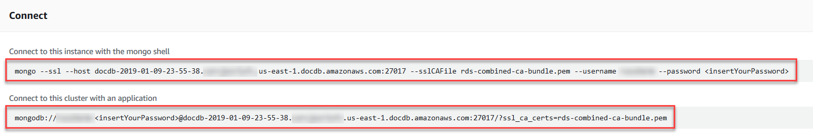

# Finding an instance's endpoint

You can find the endpoint for an instance using the Amazon DocumentDB console or the AWS CLI.

Using the AWS Management Console

###### To find an instance's endpoint using the console

1. Sign in to the AWS Management Console, and open the Amazon DocumentDB console at [https://console.aws.amazon.com/docdb](https://console.aws.amazon.com/docdb "https://console.aws.amazon.com/docdb").
2. In the navigation pane, choose **Clusters**.

###### Tip

If you don't see the navigation pane on the left side of your screen, choose the menu icon
()
in the upper-left corner of the page. 3. In the Clusters navigation box, you’ll see the column **Cluster Identifier**. Your instances are listed under clusters, similar to the screenshot below.

 4. Check the box to the left of the instance you are interested in. 5. Scroll down to the **Details** section then locate the instance endpoint.

 6. To connect to this instance, scroll up to the **Connect** section. Locate the connection string for the `mongo` shell and a connection string that can be used in your application code to connect to your instance.



Using the AWS CLI
To find the instance endpoint using the AWS CLI, run the following command with these arguments.

###### Arguments

- `--db-instance-identifier`—Optional. Specifies the instance to return the endpoint for. If
  omitted, returns the endpoint for up to 100 of your instances.
- `--query`—Optional. Specifies the fields to display. Helpful by reducing the amount of data that
  you need to view to find the endpoints. If omitted, all information on an instance is returned. The `Endpoint` field has three
  members, so listing it in the query as in the following example returns all three members. If you're only interested in some of the
  `Endpoint` members, replace `Endpoint` in the query with the members you're interested in, as in the second
  example.
- `--region`—Optional. Use the `--region` parameter to specify the Region that you want
  to apply the command to. If omitted, your default Region is used.

###### Example

For Linux, macOS, or Unix:

```
aws docdb describe-db-instances \
    --region `us-east-1` \
    --db-instance-identifier `sample-cluster-instance` \
    --query 'DBInstances[*].[DBInstanceIdentifier,Endpoint]'
```

For Windows:

```
aws docdb describe-db-instances ^
    --region `us-east-1` ^
    --db-instance-identifier `sample-cluster-instance` ^
    --query 'DBInstances[*].[DBInstanceIdentifier,Endpoint]'
```

Output from this operation looks something like the following (JSON format).

```
[
    [
        "sample-cluster-instance",
        {
            "Port": 27017,
            "Address": "sample-cluster-instance.corcjozrlsfc.us-east-1.docdb.amazonaws.com",
            "HostedZoneId": "Z2R2ITUGPM61AM"
        }
    ]
]
```

Reducing the output to eliminate the endpoint's `HostedZoneId`, you can modify your query by specifying `Endpoint.Port`
and `Endpoint.Address`.

For Linux, macOS, or Unix:

```
aws docdb describe-db-instances \
    --region `us-east-1` \
    --db-instance-identifier `sample-cluster-instance` \
    --query 'DBInstances[*].[DBInstanceIdentifier,Endpoint.Port,Endpoint.Address]'
```

For Windows:

```
aws docdb describe-db-instances ^
    --region `us-east-1` ^
    --db-instance-identifier `sample-cluster-instance` ^
    --query 'DBInstances[*].[DBInstanceIdentifier,Endpoint.Port,Endpoint.Address]'
```

Output from this operation looks something like the following (JSON format).

```
[
    [
        "sample-cluster-instance",
        27017,
        "sample-cluster-instance.corcjozrlsfc.us-east-1.docdb.amazonaws.com"
    ]
]
```

Now that you have the instance endpoint, you can connect to the instance using either `mongo` or `mongodb`. For more
information, see [Connecting to endpoints](endpoints-connecting.md "endpoints-connecting.md").
