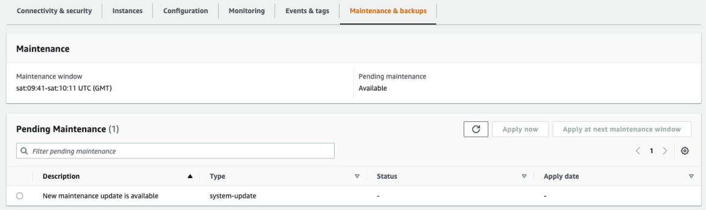

# Maintaining Amazon DocumentDB

Periodically, Amazon DocumentDB performs maintenance on Amazon DocumentDB resources.
Maintenance most often involves updates to the database engine (cluster maintenance) or the instance's underlying operating system (OS) (instance maintenance).
Database engine updates are required patches and include security fixes, bug fixes, and enhancements to the database engine.
While most operating system patches are optional, if you don't apply them for a while, the patch may be required and auto applied to maintain your security posture.
So, we recommend that you apply operating system updates to your Amazon DocumentDB instances as soon as they are available.

Database engine patches require that you take your Amazon DocumentDB clusters offline for a short time.
Once available, these patches are automatically scheduled to apply during an upcoming scheduled maintenance window of your Amazon DocumentDB cluster.

Both cluster and instances maintenance have their own respective maintenance windows.
Cluster and instance modifications that you have chosen not to apply immediately, are also applied during the maintenance window.
By default, when you create a cluster, Amazon DocumentDB assigns a maintenance window for both a cluster and each individual instance.
You can choose the maintenance window when creating a cluster or an instance.
You can also modify the maintenance windows at any time to fit your business schedules or practices.
It is generally advised to choose maintenance windows that minimize the impact of the maintenance on your application (for example, on evenings or weekends).

###### Topics

- [Notifications for Amazon DocumentDB engine patches](#patch-notifications "#patch-notifications")
- [Viewing pending Amazon DocumentDB maintenance actions](#view-pending-maintenance "#view-pending-maintenance")
- [Amazon DocumentDB engine updates](#db-instance-updates-apply "#db-instance-updates-apply")
- [User-initiated updates](#user-initiated-updates "#user-initiated-updates")
- [Managing your Amazon DocumentDB maintenance windows](#maintenance-window "#maintenance-window")
- [Amazon DocumentDB operating system updates](#os-system-updates "#os-system-updates")

## Notifications for Amazon DocumentDB engine patches

You will receive maintenance notifications for required database engine patches through health events in the AWS Health Dashboard (AHD) in the AWS console and through e-mails.
When an Amazon DocumentDB engine maintenance patch becomes available in a particular AWS region, all impacted Amazon DocumentDB user accounts in the region will receive an AHD and email notification for each Amazon DocumentDB version affected by the patch.
You can view these notifications under the **Scheduled changes** section of the AHD in the AWS console.
The notification will have details about timing of patch availability, auto apply schedule, list of impacted clusters, and release notes.
This notification will also be delivered via e-mail to the AWS account’s root user email address.


Once you receive this notification, you can choose to self-apply these engine patches to your Amazon DocumentDB clusters before the scheduled auto-apply date.
Or you can wait for the engine patches to get auto-applied during an upcoming maintenance window (default option).

###### Note

The **Status** for the notification in the AHD will be set to 'Ongoing' until a new Amazon DocumentDB engine patch with a new engine patch version is released.

Once the engine patch is applied to your Amazon DocumentDB cluster, the cluster's engine patch version will be updated to reflect the version in the notification.
You can run the `db.runCommand({getEngineVersion: 1})` command to verify this update.

AWS Health also integrates with Amazon EventBridge which uses events to build scalable event-driven applications and integrates with over 20 targets, including AWS Lambda, Amazon Simple Queue Service (SQS), and others.
You can use `AWS_DOCDB_DB_PATCH_UPGRADE_MAINTENANCE_SCHEDULED` event code to setup Amazon EventBridge before engine patches become available.
You can setup EventBridge to respond to the event and auto-perform actions such as capturing event information, initiating additional events, sending notifications via additional channels such as push notifications to the AWS Console Mobile Application, and taking corrective or other actions, when an Amazon DocumentDB engine patch becomes available in your region.

In the rare scenario of Amazon DocumentDB cancelling an engine patch, you will receive an AHD notification as well as an e-mail informing you about the cancellation.
Accordingly, you can use the `AWS_DOCDB_DB_PATCH_UPGRADE_MAINTENANCE_CANCELLED` event code to setup Amazon EventBridge to respond to this event.
View the _Amazon EventBridge User Guide_ to learn more about using [Amazon EventBridge rules](../../../eventbridge/latest/userguide/eb-rules.md "../../../eventbridge/latest/userguide/eb-rules.md").

## Viewing pending Amazon DocumentDB maintenance actions

You can view whether a maintenance update is available for your cluster by using the AWS Management Console or the AWS CLI.

If an update is available, you can do one of the following:

- Defer a maintenance action that is currently scheduled for next maintenance window (for OS patches only).
- Apply the maintenance actions immediately.
- Schedule the maintenance actions to start during your next maintenance window.

###### Note

If you take no action, required maintenance actions such as engine patches will be auto applied in an upcoming scheduled maintenance window.

The maintenance window determines when pending operations start, but it does not limit the total execution time of these operations.

Using the AWS Management Console

1. Sign in to the AWS Management Console, and open the Amazon DocumentDB console at [https://console.aws.amazon.com/docdb](https://console.aws.amazon.com/docdb "https://console.aws.amazon.com/docdb").
2. In the navigation pane, choose **Clusters**.
3. If an update is available, it is indicated by the word **Available**, **Required**, or **Next Window** in the
   **Maintenance** column for the cluster on the Amazon DocumentDB console, as shown here:

 4. To take an action, choose the cluster to show its details, then choose **Maintenance & backups**.
The **Pending Maintenance** items appear.



Using the AWS CLI
Use the following AWS CLI operation to determine what maintenance actions are pending.
The output here shows no pending maintenance actions.

```
aws docdb describe-pending-maintenance-actions
```

Output from this operation looks something like the following (JSON format).

```
{
    "PendingMaintenanceActions": []
}
```

## Amazon DocumentDB engine updates

With Amazon DocumentDB, you can choose when to apply maintenance operations.
You can decide when Amazon DocumentDB applies updates using the AWS Management Console or AWS CLI.

Use the procedures in this topic to immediately upgrade or schedule an upgrade for your cluster.

Using the AWS Management Console
You can use the console to manage updates for your Amazon DocumentDB clusters.

###### To manage an update for a cluster

1.  Sign in to the AWS Management Console, and open the Amazon DocumentDB console at [https://console.aws.amazon.com/docdb](https://console.aws.amazon.com/docdb "https://console.aws.amazon.com/docdb").
2.  In the navigation pane, choose **Clusters**.
3.  In the list of clusters, choose the button next to the name of the cluster that you want to apply the maintenance operation to.
4.  On the **Actions** menu, choose one of the following:

        * **Upgrade now** to immediately perform the pending maintenance tasks.
        * **Upgrade at next window** to perform the pending maintenance tasks during the cluster's next maintenance
         window.

    Alternatively, you can click **Apply now** or **Apply at next maintenance window** in the Pending Maintenance section of the cluster **Maintenance & backups** tab (see **Using the AWS Management Console** in the previous section).

###### Note

If there are no pending maintenance tasks, all of the preceding options are inactive.

Using the AWS CLI
To apply a pending update to a cluster, use the `apply-pending-maintenance-action` AWS CLI operation.

###### Parameters

- `--resource-identifier`—The Amazon DocumentDB Amazon Resource Name (ARN) of the resource that the pending
  maintenance action applies to.
- `--apply-action`—The pending maintenance action to apply to this resource.

Valid values: `system-update` and `db-upgrade`.

- `--opt-in-type`—A value that specifies the type of opt-in request, or undoes an opt-in request. An opt-in request of type `immediate` can't be undone.

Valid values:

    + `immediate`—Apply the maintenance action immediately.
    + `next-maintenance`—Apply the maintenance action during the next maintenance window for the resource.
    + `undo-opt-in`—Cancel any existing `next-maintenance` opt-in requests.

For Linux, macOS, or Unix:

```
aws docdb apply-pending-maintenance-action \
    --resource-identifier arn:aws:rds:us-east-1:`123456789012`:db:docdb \
    --apply-action system-update \
    --opt-in-type immediate
```

For Windows:

```
aws docdb apply-pending-maintenance-action ^
    --resource-identifier arn:aws:rds:us-east-1:`123456789012`:db:docdb ^
    --apply-action system-update ^
    --opt-in-type immediate
```

To return a list of resources that have at least one pending update, use the `describe-pending-maintenance-actions` AWS CLI command.

For Linux, macOS, or Unix:

```
aws docdb describe-pending-maintenance-actions \
    --resource-identifier arn:aws:rds:us-east-1:001234567890:db:docdb
```

For Windows:

```
aws docdb describe-pending-maintenance-actions ^
    --resource-identifier arn:aws:rds:us-east-1:001234567890:db:docdb
```

Output from this operation looks something like the following (JSON format).

```
{
    "PendingMaintenanceActions": [
        {
            "ResourceIdentifier": "arn:aws:rds:us-east-1:001234567890:cluster:sample-cluster",
            "PendingMaintenanceActionDetails": [
                {
                    "Action": "system-update",
                    "CurrentApplyDate": "2019-01-11T03:01:00Z",
                    "Description": "db-version-upgrade",
                    "ForcedApplyDate": "2019-01-18T03:01:00Z",
                    "AutoAppliedAfterDate": "2019-01-11T03:01:00Z"
                }
            ]
        }
    ]
}
```

You can also return a list of resources for a cluster by specifying the `--filters` parameter of the`describe-pending-maintenance-actions` AWS CLI operation.
The format for the `--filters` operation is `Name=`filter-name`,Values=`resource-id`,...`.

`db-cluster-id` is the acceptable values for the `Name` parameter of the filter.
This value accepts a list of cluster identifiers or ARNs.
The returned list only includes pending maintenance actions for the clusters identified by these identifiers or ARNs.

The following example returns the pending maintenance actions for the `sample-cluster1` and `sample-cluster2` clusters.

For Linux, macOS, or Unix:

```
aws docdb describe-pending-maintenance-actions \
   --filters Name=db-cluster-id,Values=`sample-cluster1`,`sample-cluster2`
```

For Windows:

```
aws docdb describe-pending-maintenance-actions ^
   --filters Name=db-cluster-id,Values=`sample-cluster1`,`sample-cluster2`
```

### Apply dates

Each maintenance action has a respective apply date that you can find when describing the pending maintenance actions.
When you read the output of pending maintenance actions from the AWS CLI, three dates are listed.
These date values are `null` when the maintenance is optional.
The values populate once the corresponding maintenance action is scheduled or applied.

- `CurrentApplyDate`—The date the maintenance action will get applied either immediately or during the next maintenance window.
- `ForcedApplyDate`—The date when the maintenance will be automatically applied, independent of your maintenance window.
- `AutoAppliedAfterDate`—The date after which the maintenance will be applied during the cluster's maintenance window.

## User-initiated updates

As an Amazon DocumentDB user, you can initiate updates to your clusters or instances.
For example, you can modify an instance's class to one with more or less memory, or you can change a cluster's parameter group. Amazon DocumentDB views these changes differently from Amazon DocumentDB initiated updates.
For more information about modifying a cluster or instance, see the following:

- [Modifying an Amazon DocumentDB cluster](db-cluster-modify.md "db-cluster-modify.md")
- [Modifying an Amazon DocumentDB instance](db-instance-modify.md "db-instance-modify.md")

To see a list of pending user initiated modifications, run the following command.

**To see pending user initiated changes for your instances**

For Linux, macOS, or Unix:

```
aws docdb describe-db-instances \
    --query 'DBInstances[*].[DBClusterIdentifier,DBInstanceIdentifier,PendingModifiedValues]'
```

For Windows:

```
aws docdb describe-db-instances ^
    --query 'DBInstances[*].[DBClusterIdentifier,DBInstanceIdentifier,PendingModifiedValues]'
```

Output from this operation looks something like the following (JSON format).

In this case, `sample-cluster-instance` has a pending change to a `db.r5.xlarge` instance class, while
`sample-cluster-instance-2` has no pending changes.

```
[
    [
        "sample-cluster",
        "sample-cluster-instance",
        {
            "DBInstanceClass": "db.r5.xlarge"
        }
    ],
    [
        "sample-cluster",
        "sample-cluster-instance-2",
        {}
    ]
]
```

## Managing your Amazon DocumentDB maintenance windows

Each instance and cluster has a weekly maintenance window during which any pending changes are applied.
The maintenance window is an opportunity to control when modifications and software patching occur, in the event either are requested or required.
If a maintenance event is scheduled for a given week, it is initiated during the 30-minute maintenance window that you identify.
Most maintenance events also complete during the 30-minute maintenance window, although larger maintenance events might take more than 30 minutes to complete.

The 30-minute maintenance window is selected at random from an 8-hour block of time per Region.
If you don't specify a preferred maintenance window when you create the instance or cluster, Amazon DocumentDB assigns a 30-minute maintenance window on a randomly selected day of the week.

The following table lists the time blocks for each Region from which default maintenance windows are assigned.

| Region Name               | Region         | UTC Time Block |
| ------------------------- | -------------- | -------------- |
| US East (Ohio)            | us-east-2      | 03:00-11:00    |
| US East (N. Virginia)     | us-east-1      | 03:00-11:00    |
| US West (Oregon)          | us-west-2      | 06:00-14:00    |
| Africa (Cape Town)        | af-south-1     | 03:00–11:00    |
| Asia Pacific (Hong Kong)  | ap-east-1      | 06:00-14:00    |
| Asia Pacific (Hyderabad)  | ap-south-2     | 06:30–14:30    |
| Asia Pacific (Malaysia)   | ap-southeast-5 | 13:00-21:00    |
| Asia Pacific (Mumbai)     | ap-south-1     | 06:00-14:00    |
| Asia Pacific (Osaka)      | ap-northeast-3 | 12:00-20:00    |
| Asia Pacific (Seoul)      | ap-northeast-2 | 13:00-21:00    |
| Asia Pacific (Singapore)  | ap-southeast-1 | 14:00-22:00    |
| Asia Pacific (Sydney)     | ap-southeast-2 | 12:00-20:00    |
| Asia Pacific (Jakarta)    | ap-southeast-3 | 08:00-16:00    |
| Asia Pacific (Thailand)   | ap-southeast-7 | 15:00-23:00    |
| Asia Pacific (Tokyo)      | ap-northeast-1 | 13:00-21:00    |
| Canada (Central)          | ca-central-1   | 03:00-11:00    |
| China (Beijing)           | cn-north-1     | 06:00-14:00    |
| China (Ningxia)           | cn-northwest-1 | 06:00-14:00    |
| Europe (Frankfurt)        | eu-central-1   | 21:00-05:00    |
| Europe (Ireland)          | eu-west-1      | 22:00-06:00    |
| Europe (London)           | eu-west-2      | 22:00-06:00    |
| Europe (Milan)            | eu-south-1     | 02:00-10:00    |
| Europe (Paris)            | eu-west-3      | 23:59-07:29    |
| Europe (Spain)            | eu-south-2     | 02:00–10:00    |
| Europe (Stockholm)        | eu-north-1     | 04:00–12:00    |
| Mexico (Central)          | mx-central-1   | 03:00-11:00    |
| Middle East (UAE)         | me-central-1   | 05:00–13:00    |
| South America (São Paulo) | sa-east-1      | 00:00-08:00    |
| Israel (Tel Aviv)         | il-central-1   | 04:00-12:00    |
| AWS GovCloud (US-East)    | us-gov-east-1  | 17:00-01:00    |
| AWS GovCloud (US-West)    | us-gov-west-1  | 06:00-14:00    |

### Changing your Amazon DocumentDB maintenance windows

The maintenance window should fall at the time of lowest usage and thus might need changing from time to time.
Your cluster or instance is unavailable during this time only if system changes (such as a scale storage operation or an instance class change) are being applied and require an outage.
And then it is unavailable only for the minimum amount of time required to make the necessary changes.

For upgrades to the database engine, Amazon DocumentDB uses the cluster's preferred maintenance window and not the maintenance window for individual instances.

###### To change the maintenance window

- For a cluster, see [Modifying an Amazon DocumentDB cluster](db-cluster-modify.md "db-cluster-modify.md").
- For an instance, see [Modifying an Amazon DocumentDB instance](db-instance-modify.md "db-instance-modify.md").

## Amazon DocumentDB operating system updates

Instances in Amazon DocumentDB clusters occasionally require operating system updates.
Amazon DocumentDB upgrades the operating system to a newer version to improve database performance and customers’ overall security posture.
Operating system updates don't change the cluster engine version or instance class of an Amazon DocumentDB instance.

We recommend that you update the reader instances in a cluster first, then the writer instance to maximize the availability of your cluster.
We don't recommend updating reader and writer instances at the same time, because you might incur longer downtime in the event of a failover.

Most operating system updates for Amazon DocumentDB are optional and don't have a set date to apply them.
However, if you don't apply these updates for a while, they may eventually become required and automatically applied during your instance's maintenance window.
This is to help maintain the security posture of your database.
To avoid any unexpected downtime, we recommend that you apply operating system updates to your Amazon DocumentDB instances as soon as they become available and set your instance maintenance window at a time of your convenience as per your business needs.

To be notified when a new optional update becomes available, you can subscribe to RDS-EVENT-0230 in the security patching event category.
For information about subscribing to Amazon DocumentDB events, see [Subscribing to Amazon DocumentDB Event Subscriptions](event-subscriptions.md "event-subscriptions.md").

You should expect that when maintenance is performed on your cluster or instance, if the instance is a primary instance, it will fail over.
To improve your availability, we recommend that you use more than one instance for your Amazon DocumentDB clusters.
For more information, see [Amazon DocumentDB Failover](failover.md "failover.md").

###### Note

For certain management features, Amazon DocumentDB uses operational technology that is shared with Amazon Relational Database Service (Amazon RDS).

###### Important

Your Amazon DocumentDB instance will be taken offline during the operating system upgrade.
You can minimize cluster downtime by having a multi-instance cluster.
If you do not have a multi-instance cluster then you can choose to temporarily create one by adding secondary instance(s) to perform this maintenance, then deleting the additional reader instance(s) once the maintenance is completed (regular charges for the secondary instance will apply).

###### Note

Staying current on all optional and mandatory updates might be required to meet various compliance obligations.
We recommend that you apply all updates made available by Amazon DocumentDB routinely during your maintenance windows.

You can use the AWS Management Console or the AWS CLI to determine whether an update is available.

Using the AWS Management Console
To determine whether an update is available using the AWS Management Console:

1. Sign in to the AWS Management Console, and open the Amazon DocumentDB console at [https://console.aws.amazon.com/docdb](https://console.aws.amazon.com/docdb "https://console.aws.amazon.com/docdb").
2. In the navigation pane, choose **Clusters**, and then select the instance.
3. Choose **Maintenance**.
4. In the **Pending Maintenance** section, find the operating system update.


You can select the operating system update and click **Apply now** or **Apply at next maintenance window** in the **Pending Maintenance** section.
If the maintenance value is **next window**, defer the maintenance items by choosing **Defer upgrade**.
You can't defer a maintenance action if it has already started.

Alternatively, you can choose the instance from a list of clusters by clicking on **Clusters** in the navigation pane and select **Apply now** or **Apply at next maintenance window** from the **Actions** menu.

Using the AWS CLI
To determine whether an update is available using the AWS CLI, call the `describe-pending-maintenance-actions` command:

```
aws docdb describe-pending-maintenance-actions
```

```
{
  "ResourceIdentifier": "arn:aws:docdb:us-east-1:123456789012:db:mydb2",
  "PendingMaintenanceActionDetails": [
    {
      "Action": "system-update",
      "Description": "New Operating System update is available"
    }
  ]
}
```

Operating system updates are specific to Amazon DocumentDB engine versions and instance classes.
Therefore, Amazon DocumentDB instances receive or require updates at different times.
When an operating system update is available for your instance based on its engine version and instance class, the update appears in the console.
It can also be viewed by running the AWS CLI `describe-pending-maintenance-actions` command or by calling the `DescribePendingMaintenanceActions` API operation.

If you are not running the latest cluster patch release of your Amazon DocumentDB engine, you may not see operating system update listed as available maintenance.
In order to view and manage the operating system update, you should first upgrade to the latest engine patch version.
